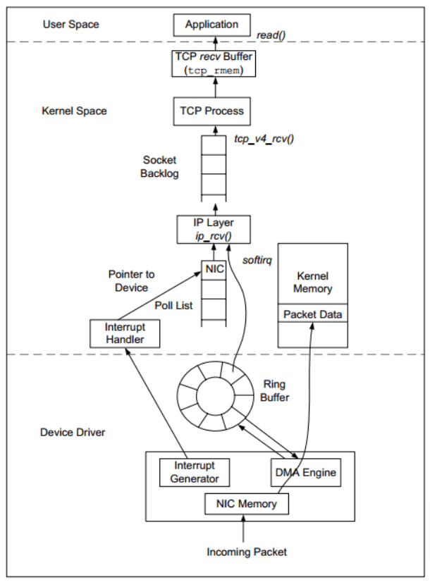
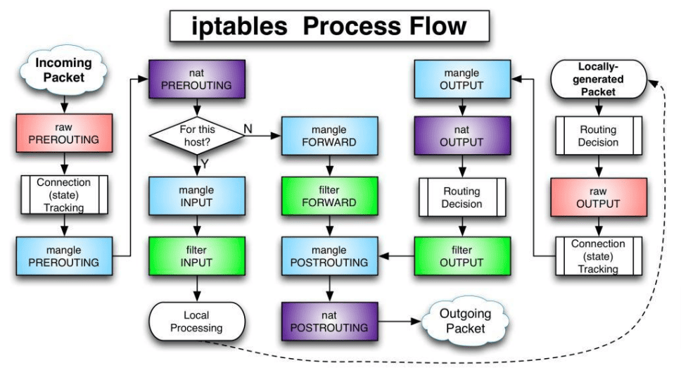

## Сетевые возможности Linux

### Термины
- **IP-адрес** — уникальный числовой идентификатор устройства в компьютерной сети, работающей по протоколу IP (Internet Protocol).
- **Порт** (port) — натуральное число, записываемое в заголовках протоколов транспортного уровня модели OSI (TCP, UDP, SCTP, DCCP).
- **Сетевой интерфейс** — физическое или виртуальное устройство, предназначенное для передачи данных между программами через компьютерную сеть.
- **MAC-адрес** — уникальный идентификатор, присваиваемый каждой единице активного оборудования или некоторым их интерфейсам в компьютерных сетях Ethernet.

Работа большинства современных приложений завязана на сетевое взаимодействие. Любые мобильные или веб-приложения активно обмениваются данными по сети как внутри серверной части, так и в клиент-серверном взаимодействии.

Самым распространённым набором (стеком) протоколов является TCP/IP (реже – UDP/IP). Мы будем придерживаться модели TCP/IP в нашем занятии, чтобы максимально приблизиться к практике применения сетей в разработке приложений.

В модели TCP/IP нас больше всего интересуют протокол IP, который доставляет пакеты в сети Интернет и локальных сетях и протокол TCP, который работает поверх IP и обеспечивает надежность доставки и правильный порядок поступления данных.

Вместо протокола TCP может использоваться UDP, который не гарантирует порядок и надёжность доставки данных (в этом случае за надёжностью должно следить само приложение).

### Архитектура сетевой подсистемы

Сетевая подсистема – один из важнейших элементов ОС Linux. Большинство применений включает активное использование сетей. Именно качественная реализация сетевых возможностей является важным преимуществом Linux как серверной операционной системы.

Большинство сетевых функций реализовано в ядре Linux. То есть, пакеты из сети обрабатываются драйвером сетевой карты (в ядре) и далее попадают в сетевую подсистему ядра (где реализованы маршрутизация, фильтрация и другие процессы).

Далее пакет отправляется на обработку в приложение (если есть подходящее), как правило генерируется ответный пакет и он попадает обратно в ядро для отправки в сеть.

Понимание пути прохождения пакетов в системе важно для решения проблем в реальной работе. Подробно путь прохождения показан на схеме ниже.

[](./schema_1.png)

### Сетевые интерфейсы

Базовым элементом сетевого взаимодействия является сетевой интерфейс. По сути это устройство (реальное или виртуальное), способное работать в сети – обмениваться пакетами с другими устройствами. Например, каждая сетевая карта будет соответствовать сетевому интерфейсу в ОС. Есть специальный интерфейс loopback, который создан для внутреннего сетевого взаимодействия (между процессами в системе).

На базе сетевых интерфейсов удобно строить правила фильтрации пакетов. Каждый интерфейс обычно имеет несколько атрибутов:
- MAC-адрес;
- IP-адрес и маска подсети (если используется IPv6, то две конфигурации);
- статус (работает, соединение и т.д.);
- статистика работы (количество пакетов, ошибок, объём трафика на приём, отправку).

### Команда ip для просмотра данных об интерфейсах

Для начала нужно посмотреть, какие сетевые интерфейсы работают в системе. Это можно сделать через команду `ip a` (полная форма `ip addr show`).

Первый интерфейс – `lo` (loopback) служит для связи внутри системы. Например, если мы подключаемся к базе данных, которая работает на этой же системе. Это особенный интерфейс, который позволяет убрать для приложений разницу работы в рамках одного хоста и по сети. Однако, это всё же сетевой интерфейс и он подчиняется управлению утилитами так же, как и все другие (например, с точки зрения фильтрации пакетов). Обычно для работы с loopback мы указываем IP-адрес 127.0.0.1 (ему обычно соответствует имя хоста localhost).

Второй интерфейс – `enp0s3` это проводной сетевой интерфейс. В виртуальной машине это виртуальная сетевая карта, которая эмулирует заданную в настройках модель адаптера. Это уже стандартный сетевой интерфейс, который мы используем для работы с другими хостами по сети. По умолчанию этот интерфейс будет получать автоматическую конфигурацию от DHCP-сервера в сети (если таковой имеется).

При работе с VirtualBox его работа определяется сетевым режимом в настройках ВМ. Если установить режим сети NAT, то адаптер получит конфигурацию своей внутренней сети (обычно это 10.0.2.0/24)

Вывод команды ip разделён по строчкам. Каждая строчка это раздел, посвященный определённой части конфигурации или статуса интерфейса.

Первая строчка: `enp0s3: <BROADCAST,MULTICAST,UP,LOWER_UP> …` Показывает название интерфейса и его статус (флаги). UP означает работу интерфейса (включён в ОС, готов к обработке пакетов), LOWER_UP означает наличие сигнала (кабель подключен к устройству).

Вторая строчка:` link/ether 08:00:27:d2:48:d9 brd ff:ff:ff:ff:ff:ff` Показывает MAC-адрес устройства на втором уровне (ethernet).

Третья строчка: `inet 192.168.0.38/24 brd 192.168.0.255 scope global dynamic …` Показывает конфигурацию протокола IPv4. Мы видим IP-адрес 192.168.0.38 с маской подсети /24.

Пятая строчка: `inet6 fe80::ff63:56f4:a5cd:388d/64 scope link …` Показывает конфигурацию протокола IPv6. IPv6-адрес fe80::ff63:56f4:a5cd:388d и маску подсети /64.

Для просмотра статистики по интерфейсу можно использовать команду: `ip -s addr show` (или `ip -s a`)

В статистике по интерфейсам можно узнать, сколько пакетов было принято (RX) и отправлено (TX), какой объём трафика прошёл через интерфейс.

Для выделения цветом разделов вывода можно добавить опцию -c: `ip -c a`, `ip -c -s a`

### Сокеты и порты

Сокет это сочетание IP-адреса и порта. С помощью сокетов приложения обмениваются данными по сети. Разделяют TCP- и UDP-сокеты (по протоколу), также существуют UNIX-сокеты (файлы специального типа).

Информацию по сокетам можно посмотреть через команду ss (socket stat). Сокеты разделяются по протоколу, самые типичные из них это TCP и UDP.

Чтобы узнать список TCP-сокетов с состоянием listen, достаточно отправить команду: `sudo ss -ntlp`

Для учета TCP и UDP сразу: `sudo ss -ntulp`

Если опустить sudo, мы не увидим приложения, которые слушают тот или иной сокет.

Эти варианты показывают только прослушиваемые сокеты (listen), если нужно посмотреть все сокеты (в том числе установленные соединения), используем такую команду (такой набор параметров легко запомнить): `ss -tulpan`

В таблице указан протокол (TCP, UDP), статус (LISTEN, ESTABLISHED) и пары IP:порт для обеих сторон подключения (Local и Peer).

В более старых версиях Linux вы можете встретить утилиту `netstat`, которая имеет аналогичное назначение и такие же параметры (например, `netstat -tulpan`).

### Конфигурация сети в Ubuntu

В нашей системе Ubuntu есть несколько способов настройки сетевых интерфейсов.

Если нужно поменять параметры в реальном времени, без сохранения после перезагрузки, нам поможем команда `ip`.

Например, для добавления дополнительного IP-адреса к интерфейсу enp0s3, используем следующую команду: `sudo ip addr add 192.168.0.9/255.255.255.0 \ broadcast 192.168.0.255 dev enp0s3`

После этой команды мы увидим дополнительный IP-адрес в выводе команды `ip a`.

Если мы хотим добавить маршрут по умолчанию (default gateway), это можно сделать командой: `sudo ip route add default via 192.168.0.254`

Далее проверить работу этой команды можно выводом списка маршрутов: `ip r`

Однако, все изменения настроек через команду ip потеряются при перезагрузке. Обычно, нам нужно, чтобы конфигурация сети была прописана в конфигурационных файлах и автоматически применялась при загрузке.

Для постоянной конфигурации сети в Ubuntu используется специальная утилита `netplan`.

Смысл применения `netplan` состоит в том, что эта утилита имеет общий конфигурационный файл для нескольких механизмов настройки сети (systemd-networkd и Network manager) и автоматически преобразовывает параметры из этого файла в понятный вид для всех сетевых подсистем ОС (например, DNS, маршрутизация и конфигурация интерфейсов). То есть, мы описываем нужную конфигурацию один раз и не заботимся о более низких уровнях подсистем.

Файлы настроек `netplan` находятся в директории `/etc/netplan`.

При редактировании этих важно сохранять точное количество отступов. Каждый уровень вложенности это 2 пробела.

Конфигурация по умолчанию для Ubuntu Desktop будет выглядеть следующим образом (открываем единственный файл в `/etc/netplan` с расширением .yaml):
```yaml
network:
    version: 2
    renderer: NetworkManager
```
В таком варианте всей конфигурацией будет заведовать компонент Network Manager, который может управляться из графического интерфейса.

Для настройки статического IP (что обычно требуется для серверов) можно использовать следующую конфигурацию:
```yaml
network:
    version: 2
    renderer: networkd
    ethernets:
        enp0s3:
            dhcp4: no
            addresses: [192.168.0.8/24,192.168.0.9/24]
            gateway4: 192.168.0.254
            nameservers:
                addresses:
                    - 8.8.8.8
                    - 8.8.4.4
```
В этой конфигурации мы задаём статические IP (можно указать несколько, через запятую) в директиве addresses: [192.168.0.8/24,192.168.0.9/24] и маршрут по умолчанию (192.168.0.254), также выставляем DNS-сервера (8.8.8.8 и 8.8.4.4). В примере выше мы видим два варианта указания нескольких адресов – через запятую в квадратных скобках и с использованием списка (как в DNS-серверах).

### Диагностика работоспособности сети

Самое простое действие по диагностике сети: запустить команду ping до нужного хоста: `ping 8.8.8.8`

В данном случае мы указали глобальный IP, поэтому проверяем связность с Интернетом. Можно указать IP из локальной сети. Если мы будем отправлять ping на доменное имя, то одновременно проверим работоспособность DNS-подсистемы `ping ya.ru`

Однако, нужно помнить, что утилита ping использует протокол ICMP и не все хосты будут отвечать на такие запросы, даже если есть связность по IP.

Для более подробной проверки DNS-подсистемы полезно использовать утилиту `host`.

Например, можно получить конкретные типы DNS-записей о хосте:
- host -t a yandex.ru
- host -t mx yandex.ru
- host -t txt yandex.ru

Также можно сравнить полученные результаты с запросом на другой DNS-сервер: `host -t a yandex.ru 8.8.8.8`

Более подробную информацию по DNS можно получить через команду dig:
- dig google.com MX
- dig yandex.ru
- dig @8.8.8.8 google.com +noall +answer

Первый пример запрашивает запись типа MX, второй показывает общую информацию по хосту, третий использует заданный DNS-сервер (8.8.8.8) для получения ответа.

Для просмотра маршрута прохождения пакетов можно использовать tracepath: `tracepath ya.ru`

Вывод команды покажет все промежуточные хосты, которые пройдёт пакет по пути к хосту назначения. Альтернативная команда для той же цели – `traceroute` (обычно требуется установка пакета).

### Фильтрация пакетов

Информационная безопасность и построение защищённых серверов — отдельное направление в мире информационных технологий. Мы рассмотрим базовые аспекты работы `netfilter` и `iptables` — инструмента управления netfilter. Они понадобятся нам для понимания, например, построения сетевого взаимодействия между операционной системой и системой контейнерной виртуализации Docker.

`Netfilter` — встроенный в ядро Linux сетевой фильтр. Для управления netfilter служит утилита `iptables`. Основа iptables — таблицы, в которых содержатся цепочки с правилами.

Стоит заметить, что в версии Ubuntu 22.04 возможна работа как с классической утилитой `iptables`, так и более новой `nft` (`nf_tables`). Благодаря режиму совместимости возможно использовать обычные команды для работы с iptables, при этом внутри системы будет использоваться новая подсистема nf_tables. В курсе мы будем использовать именно такой режим.

### Путь пакета в ядре

Как мы уже знаем, правила обработки пакетов в iptables находятся в таблицах, которые в свою очередь делятся на цепочки.

Полная схема таблиц и цепочек в iptables по умолчанию выглядит следующим образом.

[](./schema_2.png)

При всей сложности схемы, для наших базовых задач мы будем использовать лишь некоторые таблицы и цепочки.

Основная работа происходит с двумя таблицами:
1. Таблица filter. В этой таблице происходит фильтрация входящего и исходящего трафика, а также транзитный трафик.
2. Таблица nat. Необходима для трансляции адресов и портов.

В каждой таблице есть цепочки — наборы правил, согласно которым обрабатывается тот или иной трафик. У каждой цепочки есть политики по умолчанию, согласно этим политикам трафик обрабатывается, если не попадает ни под одно из правил.

Существует 5 типов стандартных цепочек, встроенных в систему:
1. PREROUTING — для изначальной обработки входящих пакетов.
2. INPUT — для входящих пакетов, адресованных непосредственно локальному процессу (клиенту или серверу).
3. FORWARD — для входящих пакетов, перенаправленных на выход. Заметьте, что перенаправляемые пакеты проходят сначала цепь PREROUTING, затем FORWARD и POSTROUTING.
4. OUTPUT — для пакетов, генерируемых локальными процессами.
5. POSTROUTING — для окончательной обработки исходящих пакетов.

Политики для цепочки устанавливаются следующим образом: `iptables -P имя_цепочки Действие`

Например, `iptables -P INPUT ACCEPT` разрешит весь входящий трафик, действует для таблицы filter. Если нам необходимо установить политику в конкретной таблице, то через параметр -t нужно передать имя таблицы, например: `iptables -t nat -P INPUT ACCEPT`. В Ubuntu ACCEPT — политика по умолчанию для всех таблиц и цепочек. Действует правило: разрешено всё, за исключением того, что запрещено.

### Правила фильтрации

Правила в цепочках создаются следующим образом: `iptables -A имя_цепочки -p протокол --dport порт -j действие`

Например: `iptables -A INPUT -p tcp --dport 80 -j ACCEPT`. В данной команде мы добавляем в iptables, в таблицу filter правило, разрешающее подключения по протоколу TCP на порт 80 нашего сервера.

Действие -A означает append, то есть добавление правила в конец списка. Для добавления правила в начало списка нужно использовать параметр -I. Например: `iptables -I INPUT -p tcp --dport 80 -j ACCEPT`

Также можно разрешить или ограничить подключения для определённых источников, используя параметр -s — source, например: `iptables -A INPUT -p tcp -s 192.168.0.100 --dport 80 -j DROP`.

Здесь мы запретим все подключения по протоколу TCP, исходящие соединения от хоста с IP-адресом 192.168.0.100 на порт 80 нашего сервера.

Посмотреть текущие правила iptables можно следующим образом. 

`iptables -t имя_таблицы -L` покажет правила, установленные в таблице. Если не указать имя таблицы, будут показаны правила из цепочки filter. Например, `iptables -L` покажет правила в цепочках таблицы filter, а `iptables -t nat -L` покажет правила в цепочках таблицы nat.

Удалить правило можно командой `iptables -D` с повторением всех параметров на добавление правила. Либо можно указать номер правила в цепочке: `iptables -D INPUT 3`

Также в каждой цепочке есть политика по умолчанию. Она будет применяться, если на нашлось ни одного совпадения с правилами. Устанавливается она командой `iptables -P INPUT DROP`.

### Перенаправление портов

С помощью `iptables` можно не только фильтровать пакеты, но и менять их свойства.

Например, мы можем перенаправить трафик с одного порта на другой в рамках нашей системы. При этом нам не потребуется настраивать цепочку FORWARD, потому что пакеты останутся в пределах нашей системы.

Для перенаправления пакетов с 80 порта на 8080 можно использовать следующую команду: `iptables -t nat -I PREROUTING -p tcp --dport 80 \ -j REDIRECT --to-port 8080`

В этой команде мы видим новое действие REDIRECT, которое как раз отвечает за перенаправление портов. В правиле мы работаем с таблицей nat, цепочкой PREROUTING.

Итак, мы научились создавать правила для фильтрации трафика и перенаправления портов. Однако, все изменения через команду iptables носят временный характер и не сохранятся после перезагрузки. Для сохранения и восстановления состояния правил есть несколько вариантов.

### Сохранение и восстановление конфигурации

Для нормального использования правил, которые мы разбирали выше, необходимо сохранить состояние iptables и автоматически восстанавливать его при загрузке системы.

Чтобы решить сохранить правила мы можем использовать команду `iptables-save` сделает дамп правил и выведет его на экран. Также команду iptables-save можно использовать для сохранения правил в файл: `iptables-save > iptables.rules`. Восстановить правила можно, используя команду iptables-restore: `iptables-restore < iptables.rules`. Такой способ не решает задачу автоматической загрузки правил.

Поэтому мы поставим дополнительные пакеты: `sudo apt install iptables-persistent netfilter-persistent`

В процессе установки будет предложено сохранить существующие правила для IPv4 и IPv6 в директорию `/etc/iptables`. Также будет добавлена служба для загрузки этих правил во время старта системы.

При внесении изменений в список правил через команду `iptables`, можно сохранить новое состояние с помощью команды: `sudo netfilter-persistent save`

Теперь мы полностью завершили цикл настройки межсетевого экрана (firewall). Научились настраивать правила прохождения трафика, сохранять их статус и применять при загрузке системы.
