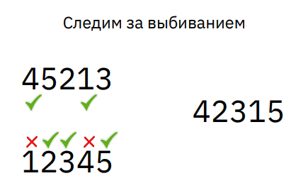

## Задачи
### Задача 1
4 арифметических примера, одинаковые действия
обозначаются одинаковыми буквами.
Задача: восстановить арифметические действия.
4A2B2 = 4-2=2  
8B4C2 = 8=4*2  
2D3B5 = 2+3=5  
4B5E1 = 4=5-1  
### Задача 2
Андрей, Борис и Денис ели конфеты, каждый ел со своей постоянной скоростью.
Пока Андрей ел 4 конфеты, Борис успевал съесть только 3. Денис же ел конфеты быстрее всех: он съедал 7 конфет, пока Андрей ел 6. Всего ребята съели 70 конфет. Кто сколько съел конфет?

$v = \dfrac{S}{t}$ &emsp; $t = \dfrac{S}{v}$ &emsp; $S = v*t$

$v_A*t$, &emsp; $v_B*t$, &emsp; $v_D*t$

$\dfrac{4}{v_A}=\dfrac{3}{v_B}$, &emsp; $\dfrac{6}{v_A}=\dfrac{7}{v_D}$, &emsp; $t=\dfrac{70}{v_A+v_B+v_D}$

$4v_B=3v_A$ &emsp; $6v_D=7v_A$

$v_B=\dfrac{3}{4}v_A$ &emsp; $v_D=\dfrac{7}{6}v_A$ &emsp; $t=\dfrac{70}{v_A+\dfrac{3}{4}v_A+\dfrac{7}{6}v_A}$

$t=\dfrac{70}{\dfrac{12}{12}v_A+\dfrac{9}{12}v_A+\dfrac{14}{12}v_A}$ &emsp; $t=\dfrac{70}{\dfrac{35}{12}v_A}$

$t=\dfrac{70}{\dfrac{70}{24}v_A}$ &ensp; => &ensp; $t=\dfrac{1}{\dfrac{1}{24}v_A}$ &ensp; => &ensp; $t=\dfrac{24}{v_a}$

$v_B=\dfrac{3}{4}v_A$ => $\dfrac{3}{4}v_A*\dfrac{24}{v_A}$ => $\dfrac{3}{4}*24=18$

$v_D=\dfrac{7}{6}v_A$ => $\dfrac{7}{6}v_A*\dfrac{24}{v_A}$ => $\dfrac{7}{6}*24=28$

$v_A=v_A$ => $v_A*\dfrac{24}{v_A}$ => $1*24=24$
### Задача 3
Аркадий, Борис, Вера, Галя, Даня и Егор встали в хоровод.  
● Даня встал рядом с Верой, справа от неё  
● Галя встала напротив Егора  
● Егор встал рядом с Даней  
● Аркадий и Галя не захотели стоять рядом  
Кто стоит рядом с Борисом?  
ГБАЕДВ  
Рядом с Борисом стоят: Аркадий и Галя
### Задача 4
Прямоугольник разрезан на 7 квадратов, как изображено на рисунке.  
Известно, что длина стороны квадрата D равна 24.  
Найдите длины сторон квадратов E и G.

---

---

---

---

Ответ: Длина сторон квадратов E и G = 108
### Задача 5
В прибрежной деревне 7 человек рыбачат каждый день, 8 человек рыбачат через день, 3 человека рыбачат раз в три дня, а остальные не рыбачат вовсе. Вчера рыбачили 12 человек, сегодня рыбачат 10 человек.  
Сколько людей будет рыбачить завтра?  
Метод перебора:

---

### Задача 6
Алина загадала пятизначное число, состоящее из цифр 1, 2, 3, 4, 5 (каждая цифра встречается
в числе ровно один раз), а Полина пытается это число угадать.  
Между девочками состоялся следующий диалог:  
Полина: “Ты загадала число 12345?”  
Алина: “Нет, но моё число совпадает с 12345 ровно в трёх разрядах”.  
Полина: “Может быть, ты загадала число 45213”?  
Алина: “А вот с 45213 моё число совпадает ровно в двух разрядах”.  
Какое число загадала Алина?

### Задача 7
Вместо букв A, B, C, D, E, F расставьте числа 1, 2, 3, 4, 5, 6 так, чтобы получилось верное равенство (каждое число должно использоваться ровно один раз).

### Задача 8
В роще растут деревья четырёх видов: берёзы, ели, сосны и осины.  
Всего 100 деревьев. Известно, что среди любых 85 деревьев найдутся деревья
всех четырех видов. Среди какого наименьшего количества любых деревьев в этой роще обязательно найдутся деревья хотя бы трёх видов?

