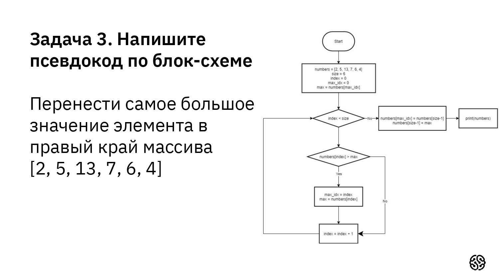
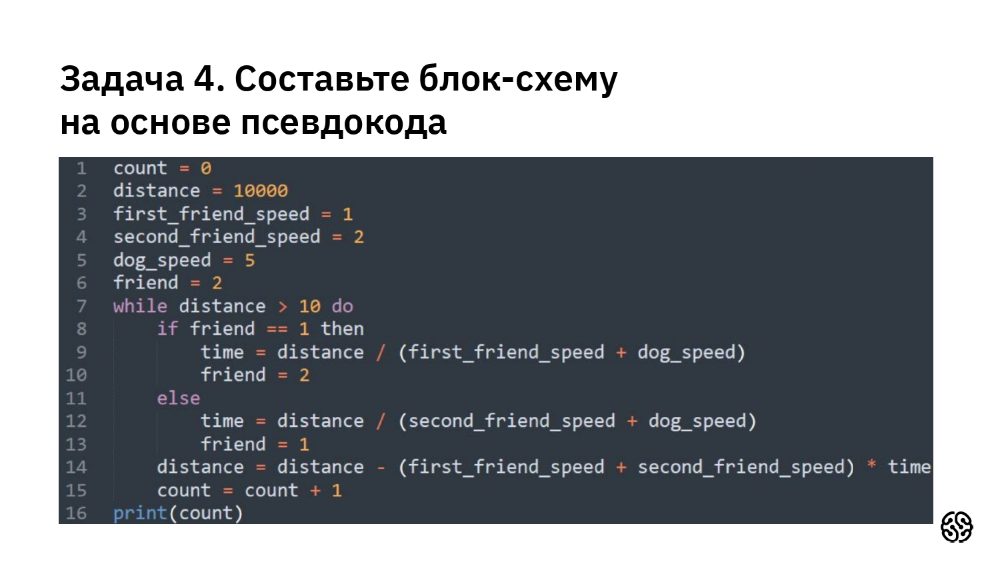
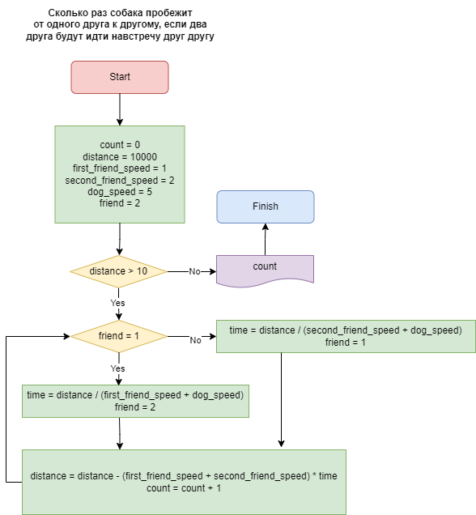
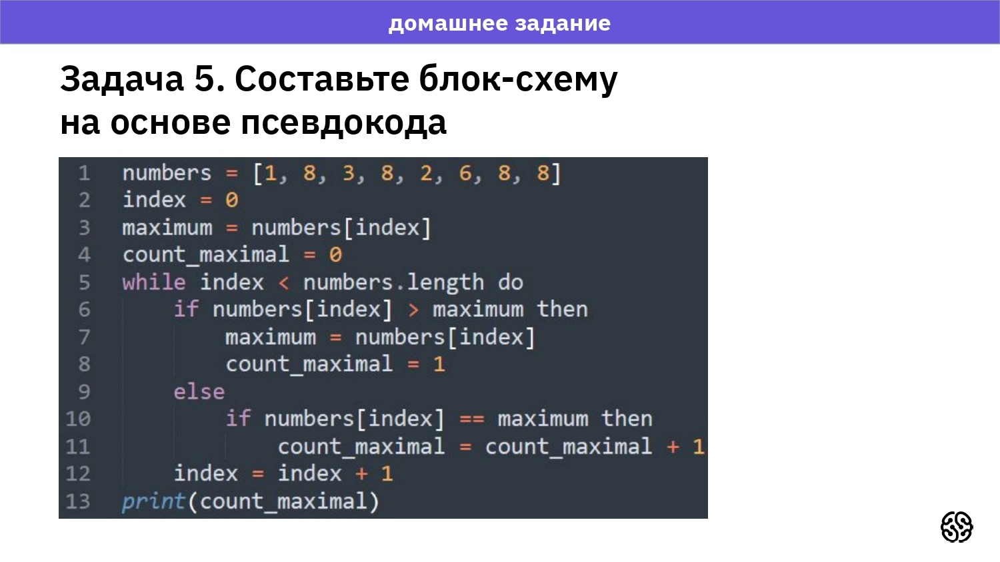
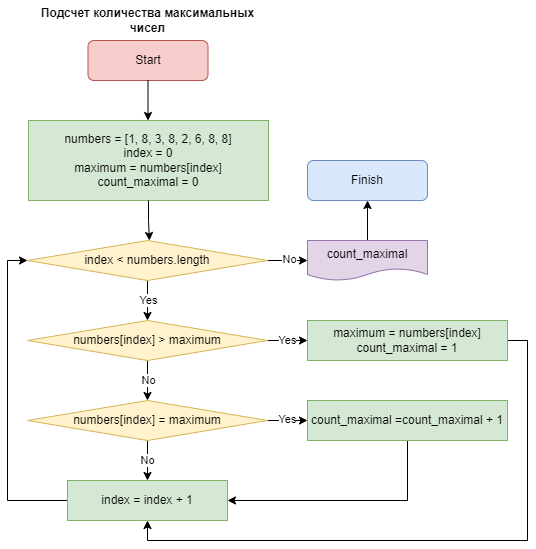
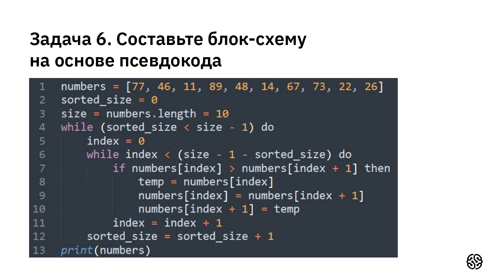
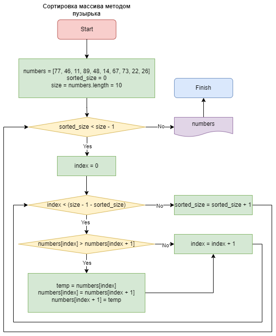

Задача 1
----------

```
numbers = [2, -5, 13, -7, 6, -4]
size = 6
count = 0
index = 0
while (index < size)
    if (numbers[index] > 0) then
        count = count + 1
    index = index + 1
print(count)
```
Задача 2
----------

```
numbers = [2, 5, 13, 7, 6, 4]
size = 6
sum = 0
avg = 0
index = 0
while (index < size)
    sum = sum + numbers[index]
    index = index + 1
avg = sum / size
print(avg)
```
Задача 3
----------

```
numbers = [2, 5, 13, 7, 6, 4]
size = 6
index = 0
max_idx = 0
max = numbers[max_idx]
while (index < size)
    if (numbers[index] > max) then
        max_idx = index
        max = numbers[index]
    index = index + 1
numbers[max_idx] = numbers[size - 1]
numbers[size - 1] = max
print(numbers)
```
Задача 4
----------


Задача 5
----------


Задача 6
----------

