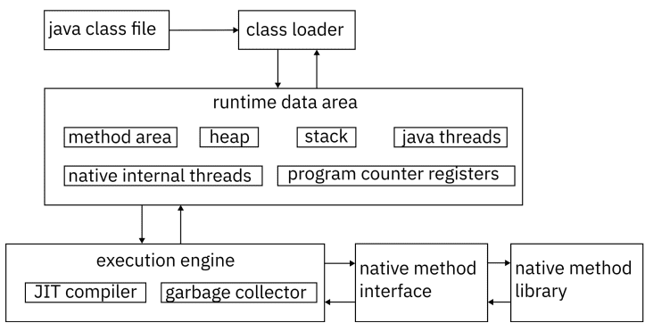
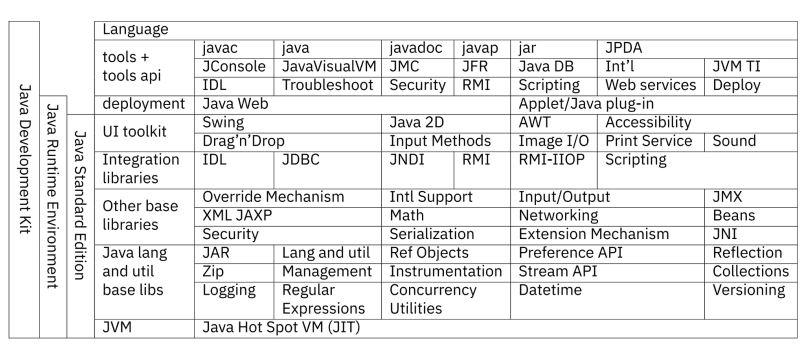
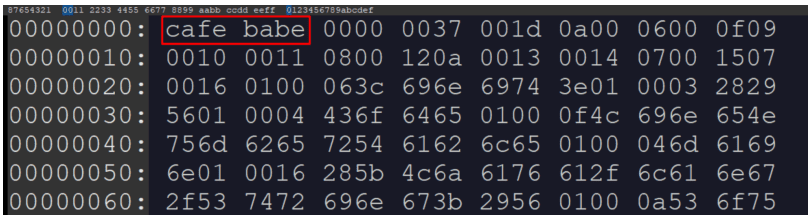

## Урок 1. Платформа: история и окружение

### Что нужно скачать, откуда (как выбрать вендора, версии)
Для разработки понадобится среда разработки (IDE) и инструментарий разработчика (JDK). JDK выпускается несколькими поставщиками, большинство из них бесплатны и полнофункциональны, то есть поддерживают весь функционал языка и платформы.

В последнее время, с развитием контейнеризации приложений, часто устанавливают инструментарий в Docker-контейнер и ведут разработку прямо в контейнере, это позволяет не захламлять компьютер разработчика разными версиями инструментария и быстро разворачивать свои приложения в CI или на целевом сервере.

💡 В общем случае, для разработки на любом языке программирования нужны так называемые SDK (Software Development Kit, англ. - инструментарий разработчика приложений или инструментарий для разработки приложений). Частный случай такого SDK - инструментарий разработчика на языке Java - Java Development Kit.

На курсе будет использоваться BellSoft Liberica JDK 11, но возможно использовать и других производителей, например, самую распространённую Oracle JDK. Производителя следует выбирать из требований по лицензированию, так, например, Oracle JDK можно использовать бесплатно только в личных целях, за коммерческую разработку с использованием этого инструментария придётся заплатить.

🔥 Для корректной работы самого инструментария и сторонних приложений, использующих инструментарий, проследите, пожалуйста, что установлены следующие переменные среды ОС:
- в системную PATH добавить путь до исполняемых файлов JDK, например, для UNIX-подобных систем: PATH=$PATH:/usr/lib/jvm/jdk1.8.0_221/bin
- JAVA_HOME путь до корня JDK, например, для UNIX-подобных систем: JAVA_HOME=/usr/lib/jvm/jdk1.8.0_221/
- JRE_HOME путь до файлов JRE из состава установленной JDK, например, для UNIX-подобных систем: JRE_HOME=/usr/lib/jvm/jdk1.8.0_221/jre/
- J2SDKDIR устаревшая переменная для JDK, используется некоторыми старыми приложениями, например, для UNIX-подобных систем: J2SDKDIR=/usr/lib/jvm/jdk1.8.0_221/
- J2REDIR устаревшая переменная для JRE, используется некоторыми старыми приложениями, например, для UNIX-подобных систем:J2REDIR=/usr/lib/jvm/jdk1.8.0_221/jre/

Также возможно использовать и другие версии, но не старше 1.8. Это обосновано тем, что основные разработки на данный момент только начинают обновлять инструментарий до более новых версий (часто 11 или 13) или вовсе переходят на другие JVM-языки, такие как Scala, Groovy или Kotlin.

Иногда для решения вопроса менеджмента версий прибегают к стороннему инструментарию, такому как SDKMan.

Для решения некоторых несложных задач курса мы будем писать простые приложения, не содержащие ООП, сложных взаимосвязей и проверок, в этом случае нам понадобится Jupyter notebook с установленным ядром (kernel) IJava.

### Из чего всё состоит (JDK, JRE, JVM и их друзья)
- JDK = JRE + инструменты разработчика;
- JRE = JVM + библиотеки классов;
- JVM = Native API + механизм исполнения + управление памятью.

Как именно всё работает? Если коротко, то слой за слоем накладывая абстракции. Программы на любом языке программирования исполняются на компьютере, то есть, так или иначе, задействуют процессор, оперативную память и прочие аппаратурные компоненты. Эти аппаратурные компоненты предоставляют для доступа к себе низкоуровневые интерфейсы, которые задействует операционная система, предоставляя в свою очередь интерфейс чуть проще программам, взаимодействующим с ней. Этот интерфейс взаимодействия с ОС мы для простоты будем называть Native API. С ОС взаимодействует JVM (Wikipedia: Список виртуальных машин Java), то есть, используя Native API, нам становится всё равно, какая именно ОС установлена на компьютере, главное уметь выполняться на JVM. Это открывает простор для создания целой группы языков, они носят общее бытовое название JVM-языки, к ним относят Scala, Groovy, Kotlin и другие. Внутри JVM осуществляется управление памятью, существует механизм исполнения программ, специальный JIT1 (just-in-time — англ. во́ время, прямо сейчас) - компилятор, генерирующий платформенно-зависимый код. JVM для своей работы запрашивает у ОС некоторый сегмент оперативной памяти, в котором хранит данные программы. Это хранение происходит «слоями»:
1. Eden Space (heap) – в этой области выделяется память под все создаваемые из программы объекты. Большая часть объектов живёт недолго (итераторы, временные объекты, используемые внутри методов и т.п.), и удаляются при выполнении сборок мусора это области памяти, не перемещаются в другие области памяти. Когда данная область заполняется (т.е. количество выделенной памяти в этой области превышает некоторый заданный процент), сборщик мусора выполняет быструю (minor collection) сборку. По сравнению с полной сборкой, она занимает мало времени, и затрагивает только эту область памяти, а именно, очищает от устаревших объектов Eden Space и перемещает выжившие объекты в следующую область.
2. Survivor Space (heap) – сюда перемещаются объекты из предыдущей области после того, как они пережили хотя бы одну сборку мусора. Время от времени долгоживущие объекты из этой области перемещаются в Tenured Space.
3. Tenured (Old) Generation (heap) — Здесь скапливаются долгоживущие объекты (крупные высокоуровневые объекты, синглтоны, менеджеры ресурсов и прочие). Когда заполняется эта область, выполняется полная сборка мусора (full, major collection), которая обрабатывает все созданные JVM объекты.
4. Permanent Generation (non-heap) – Здесь хранится метаинформация, используемая JVM (используемые классы, методы и т.п.).
5. Code Cache (non-heap) — эта область используется JVM, когда включена JITкомпиляция, в ней кешируется скомпилированный платформенно-зависимый код.

JVM самостоятельно осуществляет сборку так называемого мусора, что значительно облегчает работу программиста по отслеживанию утечек памяти, но важно помнить, что в Java утечки памяти всё равно существуют, особенно при программировании многопоточных приложений.

[](./jvm.png)

На пользовательском уровне важно не только исполнять базовые инструкции программы, но чтобы эти базовые инструкции умели как-то взаимодействовать со внешним миром, в том числе другими программами, поэтому JVM интегрирована в JRE - Java Runtime Environment. JRE - это набор из классов и интерфейсов, реализующих
- возможности сетевого взаимодействия;
- рисование графики и графический пользовательский интерфейс;
- мультимедиа;
- математический аппарат; — наследование и полиморфизм;
- рефлексию;
- ... многое другое

Java Development Kit является изрядно дополненным специальными Java приложениями SDK. JDK дополняет JRE не только утилитами для компиляции, но и утилитами для создания документации, отладки, развёртывания приложений и многими другими. В таблице, приведена примерная структура и состав JDK и JRE, а также указаны их основные и наиболее часто используемые компоненты из состава Java Standard Edition. Помимо стандартной редакции существует и Enterprise Edition, содержащий компоненты для создания веб-приложений, но JEE активно вытесняется фреймворками Spring и Spring Boot.

[](./jdk.png)

### Структура проекта (пакеты, классы, метод main, комментарии)
Проекты могут быть любой сложности. Часто структуру проекта задаёт сборщик проекта, предписывая в каких папках будут храниться исходные коды, исполняемые файлы, ресурсы и документация. Без их использования необходимо задать структуру самостоятельно.

**Простейший проект** чаще всего состоит из одного файла исходного кода, который возможно скомпилировать и запустить как самостоятельный объект. Отличительная особенность в том, что чаще всего это один или несколько статических методов в одном классе.

**Скриптовый проект** это достаточно новый тип проектов, он получил развитие благодаря растущей популярности Jupyter Notebook. Скриптовые проекты удобны, когда нужно отработать какую-то небольшую функциональность или пошагово пояснить работу какогото алгоритма.

**Обычный проект** состоит из пакетов, которые содержат классы, которые в свою очередь как-то связаны между собой и содержат код, который исполняется.
- Пакеты. Пакеты объединяют классы по смыслу. Классы, находящиеся в одном пакете доступны друг другу даже если находятся в разных проектах. У пакетов есть правила именования: обычно это обратное доменное имя (например, для gb.ru это будет ru.gb), название проекта, и далее уже внутренняя структура. Пакеты именуют строчными латинскими буквами. Чтобы явно отнести класс к пакету, нужно прописать в классе название пакета после оператора package.
- Классы. Основная единица исходного кода программы. Одному файлу следует сопоставлять один класс. Название класса - это имя существительное в именительном падеже, написанное с заглавной буквы. Если требуется назвать класс в несколько слов, применяют UpperCamelCase.
- public static void main(String[] args). Метод, который является точкой входа в программу. Должен находиться в публичном классе. При создании этого метода важно полностью повторить его сигнатуру и обязательно написать его с название со строчной буквы.
- Комментарии. Это часть кода, которую игнорирует компилятор при преобразовании исходного кода. Комментарии бывают:
  - // comment - до конца строки. Самый простой и самый часто используемый комментарий.
  - /* comment */ - внутристрочный или многострочный. Никогда не используйте его внутри строк, несмотря на то, что это возможно.
  - /** comment */ - комментарий-документация. Многострочный. Из него утилитой Javadoc создаётся веб-страница с комментарием.

### CLI: сборка, пакеты, запуск
Простейший проект возможно скомпилировать и запустить без использования тяжеловесных сред разработки, введя в командной строке ОС две команды:
- javac <Name.java> скомпилирует файл исходников и создаст в этой же папке файл с байт-кодом;
- java Name запустит скомпилированный класс (из файла с расширением .class).

💡 Скомпилированные классы всегда содержат одинаковые первые четыре байта, которые в шестнадцатиричном представлении формируют надпись «кофе, крошка».

[](./cafe_babe.png)

Для компиляции более сложных проектов, необходимо указать компилятору, откуда забирать файлы исходников и куда складывать готовые файлы классов, а интерпретатору, откуда забирать файлы скомпилированных классов. Для этого существуют следующие ключи:
- javac:
  - d выходная папка (директория) назначения;
  - sourcepath папка с исходниками проекта;
- java:
  - classpath папка с классами проекта;

Классы проекта компилируются в выходную папку с сохранением иерархии пакетов

### Документирование (Javadoc)
Документирование конкретных методов и классов всегда ложится на плечи программиста, потому что никто не знает программу и алгоритмы в ней лучше, чем программист. Утилита Javadoc избавляет программиста от необходимости осваивать инструменты создания веб-страниц и записывать туда свою документацию. Достаточно писать хорошо отформатированные комментарии, а остальное Javadoc возьмёт на себя.

Чтобы просто создать документацию надо вызвать утилиту javadoc с набором
ключей.
- d папка (или директория) назначения;
- sourcepath папка с исходниками проекта; 
- cp путь до скомпилированных классов;
- subpackages нужно ли заглядывать в пакеты-с-пакетами; 

Часто необходимо указать, в какой кодировке записан файл исходных кодов, и в какой кодировке должна быть выполнена документация (например, файлы исходников на языке Java всегда сохраняются в кодировке UTF-8, а основная кодировка для ОС Windows - cp1251)
- locale ru_RU язык документации (для правильной расстановки переносов и разделяющих знаков);
- encoding кодировка исходных текстов программы;
- docencoding кодировка конечной сгенерированной документации. 

Чаще всего в комментариях используются следующие ключевые слова:
- @param описание входящих параметров
- @throws выбрасываемые исключения
- @return описание возвращаемого значения
- @see где ещё можно почитать по теме
- @since с какой версии продукта доступен метод 
- {@code "public"} вставка кода в описание

### Makefile, Docker
💡 Makefile — это набор инструкций для программы make (классическая, это GNU Automake), которая помогает собирать программный проект в одну команду. Если запустить make то программа попытается найти файл с именем поумолчанию Makefile в текущем каталоге и выполнить инструкции из него.

Make, не привносит ничего принципиально нового в процесс компиляции, а только лишь автоматизируют его. В простейшем случае, в Makefile достаточно описать так называемую цель, target, и что нужно сделать для достижения этой цели. Цель, собираемая по-умолчанию называется all, так, для простейшей компиляции нам нужно написать:
```Makefile
all:
    javac -sourcepath .src/ -d out src/ru/gb/jcore/sample/Main.java
```
🔥 Внимание поклонникам войны за пробелы против табов в тексте программы: в Makefile для отступов при описании таргетов нельзя использовать пробелы. Только табы. Иначе make обнаруживает ошибку синтаксиса.

По сути, это всё. Но возможно сделать более гибко настраиваемый файл, чтобы не нужно было запоминать, как называются те или иные папки и файлы. В Makefile можно записывать переменные, например:
- SRCDIR := src
- OUTDIR := out

И далее вызывать их (то есть подставлять их значения в нужное место текста) следующим образом:  
`javac -sourcepath .${SRCDIR}/ -d ${OUTDIR}`  

Чтобы вызвать утилиту для сборки цели по-умолчанию, достаточно в папке, содержащей Makefile в терминале написать make. Чтобы воспользоваться другими написанными таргетами нужно после имени утилиты написать через пробел название таргета.

💡 Docker — программное обеспечение для автоматизации развёртывания и управления приложениями, контейнеризатор приложений. Позволяет «упаковать» приложение со всем его окружением и зависимостями в контейнер, который может быть развёрнут на любой системе, поддерживающей соответствующую технологию.

Docker также не привносит ничего технологически нового, но даёт возможность не устанавливать JDK и не думать о переключении между версиями, достаточно взять контейнер с нужной версией инструментария и запустить приложение в нём.

Образы и контейнеры создаются с помощью специального файла, имеющего название Dockerfile. Первой строкой Dockerfile мы обязательно должны указать, какой виртуальный образ будет для нас основой. Здесь можно использовать как образы ОС, так и образы SDK  
`FROM bellsoft/liberica-openjdk-alpine:11.0.16.1-1`

При создании образа необходимо скопировать все файлы из папки src проекта внутрь образа, в папку src.  
`COPY ./src ./src`

Потом, также при создании образа, надо будет создать внутри папку out простой терминальной командой, чтобы компилятору было куда складывать готовые классы.  
`RUN mkdir ./out`

Последнее, что будет сделано при создании образа - запущена компиляция.  
`RUN javac -sourcepath ./src -d out ./src/ru/gb/dj/Main.java`

Последняя команда в Dockerfile говорит, что нужно сделать, когда контейнер создаётся из образа и заускается.  
`CMD java -classpath ./out ru.gb.dj.Main`

Docker-образ и, как следствие, Docker-контейнеры возможно настроить таким образом, чтобы скомпилированные файлы находились не в контейнере, а складывались обратно на компьютер пользователя через общие папки.

Часто команды разработчиков эмулируют таким образом реальный продакшн сервер, используя в качестве исходного образа не JDK, а образ целевой ОС, вручную устанавливают на ней JDK, запуская далее своё приложение.

### Автоматизация сборки в CLI, контейнеризация
```Dockerfile
# syntax=docker/dockerfile:1
FROM bellsoft/liberica-openjdk-alpine:11.0.16.1-1
COPY ./src ./src
RUN mkdir ./out
RUN javac -sourcepath ./src -d out ./src/ru/gb/dj/Main.java
CMD java -classpath ./out ru.gb.dj.Main
```
docker build . -t hellojava:latest

### Термины, определения и сокращения
**CI** (англ. Continious Integration) практика разработки программного обеспечения, которая заключается в постоянном слиянии рабочих копий в общую основную ветвь разработки и выполнении частых автоматизированных сборок проекта для скорейшего выявления потенциальных дефектов и решения интеграционных проблем.

**CLI** (англ. Command line interface, Интерфейс командной строки) — разновидность текстового интерфейса между человеком и компьютером, в котором инструкции компьютеру даются в основном путём ввода с клавиатуры текстовых строк (команд). Также известен под названиями «консоль» и «терминал». 

**cp1251** набор символов и кодировка, являющаяся стандартной 8-битной кодировкой для русских версий Microsoft Windows до 10-й версии. Была создана на базе кодировок, использовавшихся в ранних русификаторах Windows. 

**Docker** программное обеспечение для автоматизации развёртывания и управления приложениями, контейнеризатор приложений. Позволяет «упаковать» приложение со всем его окружением и зависимостями в контейнер, который может быть развёрнут почти на любой системе.

**GPL GNU General Public License** (чаще всего переводят как Открытое лицензионное соглашение GNU) — лицензия на свободное программное обеспечение, созданная в рамках проекта GNU, по которой автор передаёт программное обеспечение в общественную собственность. Её также сокращённо называют GNU GPL или даже просто GPL, если из контекста понятно, что речь идёт именно о данной лицензии. GNU Lesser General Public License (LGPL) — это ослабленная версия GPL, предназначенная для некоторых библиотек ПО.

**IDE** (от англ. Integrated Development Environment) – это интегрированная, единая среда разработки, которая используется разработчиками для создания различного программного обеспечения. IDE представляет собой комплекс из нескольких инструментов, а именно: текстового редактора, компилятора или интерпретатора, средств автоматизации сборки и отладчика.

**JDK** (от англ. Java Development Kit) — комплект разработчика приложений на языке Java, включающий в себя компилятор, стандартные библиотеки классов, примеры, документацию, различные утилиты и исполнительную систему. В состав JDK не входит интегрированная среда разработки на Java, поэтому разработчик, использующий только JDK, вынужден использовать внешний текстовый редактор и компилировать свои программы, используя утилиты командной строки.

**JIT** (англ. Just-in-Time, компиляция «точно в нужное время»), динамическая компиляция — технология увеличения производительности программных систем, использующих байт-код, путём компиляции байткода в машинный код или в другой формат непосредственно во время работы программы. Таким образом достигается высокая скорость выполнения по сравнению с интерпретируемым байт-кодом за счёт увеличения потребления памяти (для хранения результатов компиляции) и затрат времени на компиляцию. Технология JIT базируется на двух более ранних идеях, касающихся среды выполнения: компиляции байт-кода и динамической компиляции.

**JRE** (от англ. Java Runtime Environment) — минимальная (без компилятора и других средств разработки) реализация виртуальной машины, необходимая для исполнения Java-приложений. Состоит из виртуальной машины Java Virtual Machine и библиотеки Java-классов.

**JVM** (от англ. Java Virtual Machine) — виртуальная машина Java, основная часть исполняющей системы Java. Виртуальная машина Java исполняет байт-код, предварительно созданный из исходного текста Javaпрограммы компилятором. JVM может также использоваться для выполнения программ, написанных на других языках программирования.

**SDK** (от англ. software development kit, комплект для разработки программного обеспечения) — это набор инструментов для разработки программного обеспечения в одном устанавливаемом пакете. Они облегчают создание приложений, имея компилятор, отладчик и иногда программную среду. В основном они зависят от комбинации аппаратной платформы компьютера и операционной системы.

**UTF-8** (от англ. Unicode Transformation Format, 8-bit — «формат преобразования Юникода, 8-бит») — распространённый стандарт кодирования символов, позволяющий более компактно хранить и передавать символы Юникода, используя переменное количество байт (от 1 до 4), и обеспечивающий полную обратную совместимость с 7-битной кодировкой ASCII. Кодировка UTF-8 сейчас является доминирующей в веб-пространстве. Она также нашла широкое применение в UNIXподобных операционных системах.

**ОС** (операционная система) — комплекс управляющих и обрабатывающих программ, которые, с одной стороны, выступают как интерфейс между устройствами вычислительной системы и прикладными программами, а с другой стороны — предназначены для управления устройствами, управления вычислительными процессами, эффективного распределения вычислительных ресурсов между вычислительными процессами и организации надёжных вычислений.

**ПО** — программное обеспечение.