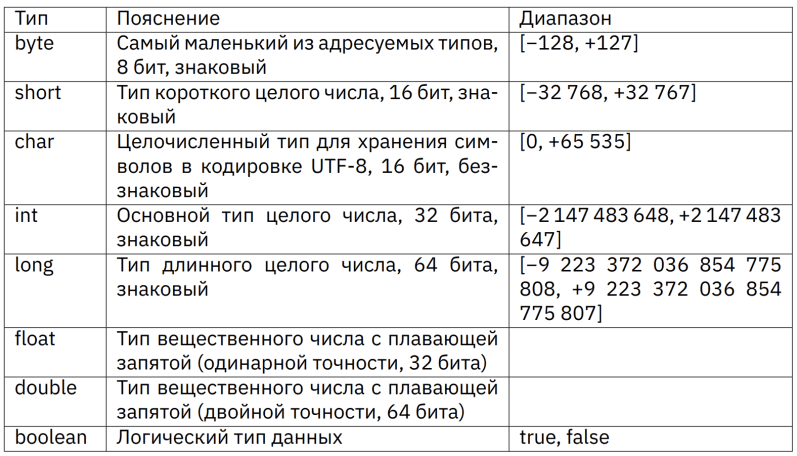
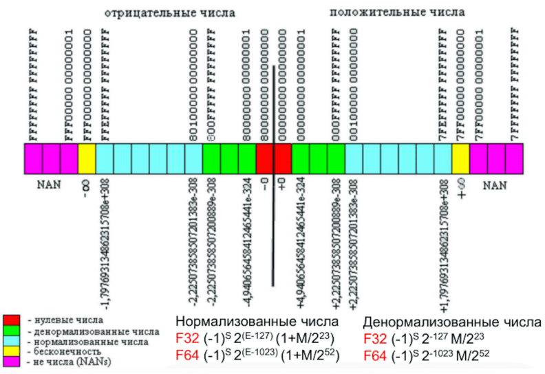
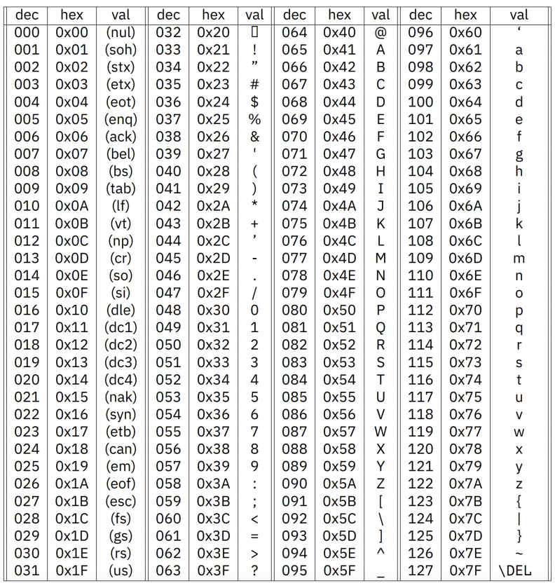

## Урок 2. Специализация: данные и функции

### Понятие типов
Хранение данных в Java осуществляется привычным для программиста образом: в переменных и константах.

Относительно типизации языки программирования бывают типизированными и нетипизированными (бестиповыми). Нетипизированные языки не представляют большого интереса в современном программировании.

Отсутствие типизации в основном присуще чрезвычайно старым и низкоуровневым языкам программирования, например, Forth и некоторым ассемблерам. Все данные в таких языках считаются цепочками бит произвольной длины и не делятся на типы. Работа с ними часто труднее, при этом часто безтиповые языки работают быстрее типизированных, но описывать с их помощью большие проекты со сложными взаимосвязями довольно утомительно.

💡 Java является языком со строгой (также можно встретить термин «сильной») явной статической типизацией.

Статическая — у каждой переменной должен быть тип, и этот тип изменить нельзя. Этому свойству противопоставляется динамическая типизация;

Явная — при создании переменной ей обязательно необходимо присвоить какой-то тип, явно написав это в коде. В более поздних версиях языка (с 9й) стало возможным инициализировать переменные типа var, обозначающий нужный тип тогда, когда его возможно однозначно вывести из значения справа. Бывают языки с неявной типизацией, например, Python;

Строгая(сильная) — невозможно смешивать разнотипные данные. С другой стороны, существует JavaScript, в котором запись 2 + true выдаст результат 3

### Примитивные типы данных
Все данные в Java делятся на две основные категории: примитивные и ссылочные. Таблица демонстрирует все восемь примитивных типов языка и их размерности. Чтобы отправить на хранение какие-то данные используется оператор присваивания. Присваивание в программировании - это не тоже самое, что математическое равенство, демонстрирующее тождественность, а полноценная операция.

[](./types.png)

Все присваивания всегда происходят справа налево, то есть сначала вычисляется правая часть, а потом результат вычислений присваивается левой. Исключений нет, именно поэтому в левой части не может быть никаких вычислений.

Шесть из восьми типов имеет диапазон значений, а значит основное их отличие в объёме занимаемой памяти. У double и float тоже есть диапазоны, но они заключаются в точности представления дробной части. Диапазоны означают, что если попытаться положить в переменную меньшего типа большее значение, произойдёт «переполнение переменной».

### Переполнение целочисленных переменных
Чем именно чревато переполнение переменной легче показать на примере (по ссылке - расследование крушения ракеты из-за переполнения переменной)

🔥 Переполнение переменных не распознаётся компилятором

💡 Переполнение переменной - это ситуация, в которой происходит попытка положить большее значение в переменную меньшего типа.

Важным вопросом при переполнении остаётся следующий: какое в переполненной переменной останется значение? Максимальное, 127? 200 − 127 = 73? Какой-то мусор? Каждый язык, а зачастую и разные компиляторы одного языка ведут себя в этом вопросе по разному.

🔥 В современном мире гигагерцев и терабайтов почти никто не пользуется маленькими типами, но именно из-за этого ошибки переполнения переменных становятся опаснее испанской инквизиции.

🔥 В современном мире гигагерцев и терабайтов почти никто не пользуется
маленькими типами, но именно из-за этого ошибки переполнения
переменных становятся опаснее испанской инквизиции.

### Целочисленные типы
Целочисленных типов четыре, и они занимают 1, 2, 4 и 8 байт.

💡 Технически, целочисленных типов пять, но char устроен чуть сложнее других.

Значения в целочисленных типах могут быть только целые, никак и никогда невозможно присвоить им дробных значений. Про эти типы следует помнить следующее:
- int - это самый часто используемый тип. Если сомневаетесь, какой целочисленный тип использовать, используйте int;
- все целые числа, которые пишутся в коде - это int, даже если вы пытаетесь их присвоить переменной другого типа.

Все дробные числа, написанные в коде - это double, поэтому положить их во float без дополнительных усилий невозможно. В этих случаях к написанному справа числу нужно добавить явное указание на его тип. Для long пишем L, а для float - f. Чаще всего L пишут заглавную, чтобы подчеркнуть, что тип больше, а f пишут маленькую, чтобы подчеркнуть, что мы уменьшаем тип. Но регистр в этом конкретном случае значения не имеет, можно писать и так и так.
```java
byte b0 = 100;
byte b1 = 200;
long l0 = 5_000_000_000;
long l1 = 5_000_000_000L;
float f0 = 0.123;
float f1 = 0.123f;
```

💡 Числа с плавающей запятой в англоязычной литературе называются числа с плавающей точкой (от англ. floating point). Такое различие связано с тем, что в русскоязычной литературе принято отделять дробную часть числа запятой, а в европейской и американской - точкой.

Хранение чисел с плавающей запятой работает по стандарту IEEE 754 (1985 г). Для работы с числами с плавающей запятой на аппаратурном уровне к обычному процессору добавляют математический сопроцессор (FPU, floating point unit).

При работе с такими числами появляется понятие не-числа, при этом важно помнить, что NaN != NaN.

[](./double.png)

### Символы и булевы
Шесть из восьми примитивных типов могут иметь как положительные, так и отрицательные значения, они называются «знаковые» типы. В таблице есть два типа, у которых есть диапазон но нет отрицательных значений, это boolean и char

Булев тип хранит значение true или false. На собеседованиях иногда спрашивают, сколько места занимает boolean. В Java объём хранения не определён и зависит от конкретной JVM, обычно считают, что это один байт. Тип char единственный беззнаковый целочисленный тип в языке, то есть его старший разряд хранит полезное значение, а не признак положительности.

Тип целочисленный но по умолчанию среда исполнения интерпретирует его как символ по таблице utf-8. В языке Java есть разница между одинарными и двойными кавычками. В одинарных кавычках всегда записывается символ, который на самом деле является цело численным значением, а в двойных кавычках всегда записывается строка, которая фактически является экземпляром класса String. Поскольку типизация строгая, то невозможно записать в char строки, а в строки числа.

[](./utf-8.png)

💡 В Java есть три основных понятия, связанных с данными переменными и использованием значений: объявление, присваивание, инициализация. Для того чтобы объявить переменную, нужно написать её тип и название, также часто вместо названия можно встретить термин идентификатор. Далее в любой момент можно присвоить этой переменной значение, то есть необходимо написать идентификатор использовать оператор присваивания и справа написать значение, которое вы хотите присвоить данной переменной, поставить в конце строки точку с запятой. Также существует понятие инициализации - это когда объединяются на одной строке объявление и присваивание.

### Преобразование типов
Java - это язык со строгой статической типизацией, но преобразование типов в ней всё равно есть. Простыми словами, преобразование типов - это когда компилятор видит, что типы переменных по разные стороны присваивания разные, начинает разрешать это противоречие. Преобразование типов бывает явное и неявное.

💡 В разговоре или в сообществах можно услышать или прочитать термины тайпкастинг, кастинг, каст, кастануть, и другие производные от английского typecasting.

Неявное преобразование типов происходит, когда присваиваются числа переменным меньшей размерности, чем int. Число справа это int, а значит 32 разряда, а слева, например, byte, и в нём всего 8 разрядов, но ни среда ни компилятор не поругались, потому что значение в большом int не превысило 8 разрядов маленького byte. Итак неявное преобразование типов происходит в случаях, когда, «всё и так понятно». В случае, если неявное преобразование невозможно, статический анализатор кода выдаёт ошибку, что ожидался один тип, а был дан другой.

Явное преобразование типов происходит, когда мы явно пишем в коде, что некоторое значение должно иметь определённый тип. Этот вариант приведения типов тоже был рассмотрен, когда к числам дописывались типовые квалификаторы L и f. Но чаще всего случается, что происходит присваивание переменным не тех значений, которые были написаны в тексте программы, а те, которые получились в результате каких-то вычислений.
```java
int i0 = 100;
byte b0 = (byte) i0;
```

### Константность
Constare - (лат. стоять твёрдо). Константность это свойство неизменяемости. В Javav ключевое слово const не реализовано, хоть и входит в список ключевых, зарезервированных. Константы создаются при помощи ключевого слова final. Ключевое слово файнал возможно применять не только с примитивами, но и со ссылочными типами, методами, классами.

💡 Константа - это переменная или идентификатор с конечным значением.

### Ссылочные типы данных, массивы
Ссылочные типы данных - это все типы данных, кроме восьми перечисленных примитивных. Самым простым из ссылочных типов является массив. Фактически массив выведен на уровень языка и не имеет специального ключевого слова. Ссылочные типы отличаются от примитивных местом хранения информации. В примитивах данные хранятся там, где существует переменная и где написан её идентификатор, а по идентификатору ссылочного типа хранится не значение, а ссылка. Ссылку можно представить как ярлык на рабочем столе, то есть очевидно, что непосредственная информация хранится не там, где написан идентификатор. Такое явное разделение идентификатора переменной и данных важно помнить и понимать при работе с ООП.

💡 Массив - это единая, сплошная область данных, в связи с чем в массивах возможно осуществление доступа по индексу.

Самый младший индекс любого массива - ноль, поскольку индекс - это значение смещения по элементам относительно начального адреса массива. То есть, для получения самого первого элемента нужно сместиться на ноль шагов. Очевидно, что самый последний элемент в массиве из десяти значений, будет храниться по девятому индексу. Массивы возможно создавать несколькими способами. В общем виде объявление - это тип, квадратные скобки как обозначение того, что это будет массив из переменных этого типа, идентификатор (строка 1). Инициализировать массив можно либо ссылкой на другой массив (строка 2), пустым массивом (строка 3) или заранее заданными значениями, записанными через запятую в фигурных скобках (строка 4). Присвоить в процессе работы идентификатору возможно только значение ссылки из другого идентификатора или новый пустой массив.
```java
int[] array0;
int[] array1 = array0;
int[] array2 = new int[5];
int[] array3 = {5, 4, 3, 2, 1};
array2 = {1, 2, 3, 4, 5}; // недопустимо
```

🔥 Никак и никогда нельзя присвоить идентификатору целый готовый массив в процессе работы, нельзя стандартными средствами переприсвоить ряд значений части массива (так называемые слайсы или срезы).

Массивы бывают как одномерные, так и многомерные. Многомерный массив - это всегда массив из массивов меньшего размера: двумерный массив - это массив одномерных, трёхмерный - массив двумерных и так далее. Правила инициализации у них не отличаются. Преобразовать тип массива нельзя никогда, но можно преобразовать тип каждого отдельного элемента при чтении. Это связано с тем, что под массивы сразу выделяется непрерывная область памяти, а со сменой типа всех значений массива эту область нужно будет или значительно расширять или значительно сужать.

Ключевое слово final работает только с идентификатором массива, то есть не запрещает изменять значения его элементов.

Если логика программы предполагает создание нижних измерений массива в процессе работы программы, то при инициализации массива верхнего уровня не следует указывать размерности нижних уровней. Это связано с тем, что при инициализации, Java сразу выделяет память под все измерения, а присваивание нижним измерениям новых ссылок на создаваемые в процессе работы массивы, будет пересоздавать области памяти, получается небольшая утечка памяти.

Прочитать из массива значение возможно обратившись к ячейке массива по индексу. Записать в массив значение возможно обратившись к ячейке массива по индексу, и применив оператор присваивания.

В каждом объекте массива есть специальное поле, которое обозначает длину данного массива. Поле находится в классе __Array__ и является публичной константой.
```java
int[] arr = new int[5];
int i = arr.length;
```

### Функции
Функция - это исполняемый блок кода. Функция, принадлежащая классу называется методом.

При объявлении функции в круглых скобках указываются параметры, а при вызове - аргументы. У функций есть правила именования: функция - это переходный глагол совершенного вида в настоящем времени (вернуть, посчитать, установить, создать), часто снабжаемый дополнением, субъектом действия. Методы в Java пишутся lowerCamelCase. Важно, в каком порядке записаны параметры метода, от этого будет зависеть порядок передачи в неё аргументов. Методы обособлены и их параметры локальны, то есть не видны другим функциям.

🔥 Нельзя писать функции внутри других функций.

Все аргументы передаются копированием, не важно, копирование это числовой константы, числового значения переменной или хранимой в переменной ссылке на массив. Сам объект в метод не копируется, а копируется только его ссылка.

Возвращаемые из методов значения появляются в том месте, где метод был вызван. Если будет вызвано несколько методов, то весь контекст исполнения первого метода сохраняется, кладётся (на стек) в стопку уже вызванных методов и процессор идёт выполнять только что вызванный второй метод. По завершении вызванного второго метода, мы снимаем со стека лежащий там контекст первого метода, кладём в него вернувшееся из второго метода значение, если оно есть, и продолжаем исполнять первый метод.

**Вызов метода** - это, по смыслу, тоже самое, что подставить в код сразу его возвращаемое значение.

**Сигнатура метода** - это имя метода и его параметры. В сигнатуру метода не входит возвращаемое значение. Нельзя написать два метода с одинаковой сигнатурой.

**Перегрузка методов** - это механизм языка, позволяющий написать методы с одинаковыми названиями и разными оставшимися частями сигнатуры, чтобы получить единообразие при вызове семантически схожих методов с разнотипными данными.
