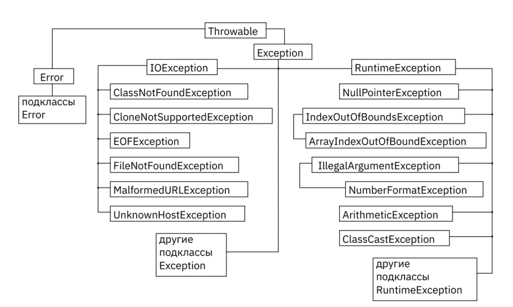

## Урок 4. Специализация: ООП и исключения

### Перечисления
💡 Перечисление – это упоминание объектов, объединённых по какому-либо признаку

Перечисления – это специальные классы, содержащие внутри себя собственные статические экземпляры.

Каждое перечисление имеет статический метод values(), возвращающий массив всех констант перечисления.
```java
Season[] seasons = Season.values();
for (Season s : seasons) {
    System.out.printf("%s ", s);
}
```

Также, в перечисления встроен метод ordinal(), возвращающий порядковый номер определенной константы (нумерация начинается с 0). Обратите внимание на синтаксис, метод можно вызвать только у конкретного экземпляра перечисления, а при попытке вызова у самого класса перечисления, ожидаемо компилятор выдаёт ошибку невозможности вызова нестатического метода из статического контекста.

💡 В перечислениях можно наблюдать очень примечательный пример инкапсуляции – неизвестно, хранятся ли на самом деле объекты перечисления в виде массива, но можем вызвать метод values() и получить массив всех элементов перечисления. Неизвестно, хранится ли в каждом объекте перечисления его номер, но можем вызвать его метод ordinal().

Раз перечисление – это класс, возможно определять в нём поля, методы, конструкторы и прочее. Перечисление Color определяет приватное поле code для хранения кода цвета, а с помощью метода getCode он возвращается.
```java
enum Color {
    RED("#FF0000"), BLUE("#0000FF"), GREEN("#00FF00");

    private String code;

    Color(String code) {
        this.code = code;
    }

    public String getCode() { return code; }
}
```

Через конструктор передается значение пользовательского поля

🔥 Конструктор по умолчанию имеет модификатор private. Любой другой модификатор будет считаться ошибкой.

Cоздать константы перечисления с помощью конструктора возможно только внутри самого перечисления. И что косвенно намекает на то, что объекты перечисления это статические объекты внутри самого класса перечисления. Также важно, что механизм описания конструкторов класса работает по той же логике, что и обычные конструкторы, то есть, при описании собственного конструктора, конструктор по-умолчанию перестаёт создаваться автоматически. Таким образом, с объектами перечисления можно работать точно также, как с обычными объектами.

### Локальные классы
💡 Локальный класс объявляется только в блоке кода. Чаще всего — внутри какого-то метода внешнего класса.

```java
public class Animal {
    void performBehavior(boolean state) {
        class Brain {
            void sleep() {
                if (state)
                    System.out.println("Sleeping");
                else
                    System.out.println("Not sleeping");
            }
        }
        Brain brain = new Brain();
        brain.sleep();
    }
}
```

Особенности локальных классов:
- Локальный класс сохраняет доступ ко всем полям и методам внешнего класса, а также ко всем константам, объявленным в текущем блоке кода, то есть полям и аргументам метода объявленным как final. Начиная с JDK 1.8 локальный класс может обращаться к любым полям и аргументам метода объявленным в текущем блоке кода, даже если они не объявлены как final, но только в том случае если их значение не изменяется после инициализации.
- Локальный класс должен иметь свои внутренние копии всех локальных переменных, которые он использует (эти копии автоматически создаются компилятором). Единственный способ обеспечить идентичность значений локальной переменной и ее копии – объявить локальную переменную как final.
- Экземпляры локальных классов, как и экземпляры внутренних классов, имеют окружающий экземпляр, ссылка на который неявно передается всем конструкторам локальных классов. То есть, сперва должен быть создан экземпляр внешнего класса, а только затем экземпляр внутреннего класса.

💡 Основное отличие статических и нестатических вложенных классов в том, что объект статического класса не хранит ссылку на конкретный экземпляр внешнего класса.

Без объекта внешнего класса объект внутреннего просто не мог существовать. Для статических вложенных классов это не так. Объект статического вложенного класса может существовать сам по себе. В этом плане статические классы более независимы, чем нестатические. Довольно важный момент заключается в том, что при создании такого объекта нужно указывать название внешнего класса,

```java
Cat.Voice voice = new Cat.Voice(100);
voice.sayMur();
```

Статический вложенный класс может обращаться только к статическим полям внешнего класса. При этом неважно, какой модификатор доступа имеет статическая переменная во внешнем классе. Не следует путать объекты с переменными. Если речь идёт о статических переменных — да, статическая переменная класса существует в единственном экземпляре. Но применительно ко вложенному классу static означает лишь то, что его объекты не содержат ссылок на объекты внешнего класса.

### Исключения

💡 Исключение – это отступление от общего правила, несоответствие обычному порядку вещей

В общем случае, возникновение исключительной ситуации, это ошибка в программе, но основным вопросом является следующий. Возникшая ошибка – это:
- Ошибка в коде программы;
- Ошибка в действиях пользователя;
- Ошибка в аппаратной части компьютера?

[](./Exceptions.png)

Все исключения наследуются от класса Throwable и могут быть как обязательные к обработке, так и необязательные. Есть ещё подкласс Error, но он больше относится к аппаратным сбоям или серьёзным алгоритмическим или архитектурным ошибкам, и на данном этапе интереса не представляет, потому что поймав, например, OutOfMemoryError средствами Java прямо в программе с ним ничего сделать невозможно, такие ошибки необходимо обрабатывать и не допускать в процессе разработки ПО.

🔥 Все исключения (checked), кроме наследников RuntimeException (unchecked), необходимо обрабатывать.

Ключевое слово throw заставляет созданный объект исключения начать свой путь по родительским методам, пока этот объект не встретится с каким-то обработчиком. В данном конкретном случае – это обработчик виртуальной машины (по-умолчанию), который в специальный поток error выводит так называемый stacktrace, и завершает дальнейшее выполнение метода (технически, всего потока целиком).

[](./threads.png)

Все программы в Java всегда многопоточны. На старте программы запускаются так называемые потоки, которые работают псевдопараллельно и предназначены каждый для решения своих собственных задач, например, это основной поток, поток сборки мусора, поток обработчика ошибок, потоки графического интерфейса. Основная задача этих потоков – делать своё дело и иногда обмениваться информацией.

В stacktrace, содержащийся в объекте исключения, кладётся максимальное количество информации о типе исключения, его сообщении, иерархии методов, вызовы которых привели к исключительной ситуации.

Если не написать явного выбрасывания никакого исключения, оно всё равно будет выброшено. Это общее поведение исключения. Оно где-то случается, прекращает выполнение текущего метода, и начинает лететь по стеку вызовов вверх. Возможно даже долетит до обработчика по-умолчанию. Некоторые исключения создаются в коде явно, некоторые самой Java, они вполне стандартные, например выход за пределы массива, деление на ноль, и классический NullPointer.

💡 Исключения, наследники RuntimeException, являются Unchecked, то есть не обязательные для обработки на этапе написания кода. Все остальные Throwable – обязательные для обработки, статический анализатор кода не просто их выделяет, а обязывает их обрабатывать на этапе написания кода. И просто не скомпилирует проект если в коде есть необработанные исключения, также известные как Checked.

🔥 Первое, и самое важное, что нужно понять – почему что-то пошло (или пойдёт) «не так», поэтому не пытайтесь что-то ловить, пока не поймёте что именно произошло, от этого понимания будет зависеть способ ловли.

💡 Рекомендуется писать максимально узко направленные секции catch, потому что надо стараться досконально знать как работает программа, и какие исключения она может выбрасывать. Также, потому что разные исключения могут по-разному обрабатываться.

Секций catch может быть любое количество. Как только объект исключения обработан, он уничтожается и в следующие catch не попадает. Однако, объект возможно явно отправить на обработчик «выше», ключевым словом throw (чаще всего, используется RuntimeException с конструктором копирования).

Когда какой-то метод выбрасывает исключение у разработчика есть два основных пути:
- Обязанность вынести объявление этого исключения в сигнатуру метода, что будет говорить тем, кто его вызывает о том, что в методе может возникнуть исключение;
- Исключение необходимо непосредственно в методе обработать, иначе ничего не скомпилируется.

💡 Общее правило работы с исключениями одно – если исключение штатное – его надо сразу обработать, если нет – надо дождаться, пока программа упадёт.

🔥 Важный момент. Задачи бывают разные. Исключения – это инструмент, который нетривиально работает. Важно при написании кода понять, возникающая исключительная ситуация – штатная, или нештатная. В большинстве случаев – ситуации нештатные, поэтому надо «уронить» приложение и разбираться с тем, что именно произошло. Допустим, для вашего приложения обязательно какойто файл должен быть, без него дальше нет смысла продолжать. Что делать, если его нет? Ситуация явно нештатная. Самое плохое, что можно сделать – ничего не делать. Это самое страшное, когда программа повела себя как-то не так, а ни мы, разработчики, ни пользователь об этом даже не узнали. Допустим, мы хотим прочитать файл, вывести в консоль, но мы в обработчике исключения просто выводим стектрейс куда-то, какому-то разработчику в среду разработки, и наши действительно важные действия не выполнились. Надо завершать работу приложения. Как завершать? throw new RuntimeException(e). Крайне редко случаются ситуации, когда у исключения достаточно распечатать стектрейс.

Потоки ввода-вывода всегда нужно закрывать. Предположим, что в тестовом потоке открылся файл, из него что-то прочитано, потом метод завершился с исключением, а файл остался незакрытым, ресурсы заняты.

Начиная с версии Java 1.8 разработчику предоставляется механизм try-с-ресурсами. Поток – это ресурс, абстрактное понятие. Выражаясь строго формально, разработчик должен реализовать интерфейс Closeable. В этом интерфейсе содержится всего один метод close(), который умеет бросать IOException. В классе тестового потока нужно всего лишь переопределить этот метод данного интерфейса.

Все потоки начиная с Java 1.8 реализуют интерфейс Closeable. Работа с такими классами имеет лаконичный вид

```java
try (TestStream stream = new TestStream()) {
    int a = stream.read();
} catch (IOException e) {
    throw new RuntimeException(e);
}
```

В данном коде не нужно закрывать поток явно, это будет сделано автоматически следствие реализации интерфейса. Если ломается метод read(), то try-с-ресурсами всё равно корректно закроет поток. При сломанном методе закрытия и сломанном методе чтения одновременно, JVM запишет наверх основное исключение, но и выведет «подавленное» исключение, вторичное в стектрейс. Рекомендуется по возможности всегда использовать try-с-ресурсами.

Механика checked и unchecked исключений сохраняется при наследовании, поэтому создав наследник RuntimeException вы получаете не проверяемые на этапе написания кода исключения.

### Практическое задание
1. Напишите два наследника класса Exception: ошибка преобразования строки и ошибка преобразования столбца
2. Разработайте исключения-наследники так, чтобы они информировали пользователя в формате ожидание/реальность
3. Для проверки напишите программу, преобразующую квадратный массив целых чисел 5х5 в сумму чисел в этом массиве, при этом, программа должна выбросить исключение, если строк или столбцов в исходном массиве окажется не 5.

### Термины, определения и сокращения
**finally** — часть оператора try...catch, выполняющаяся вне зависимости от того,  возникло ли исключение в секции try и было ли оно обработано в секции catch.
**throws** — ключевое слово, определяющее обработку исключения в методе. Фактически, это предупреждение для вызывающего о возможном исключении в методе.
**throw** — оператор, активирующий (выбрасывающий) объект исключения.
**try...catch** — двухсекционный оператор языка Java, позволяющий «безопасно» выполнить код, содержащий исключение, поймать и обработать возникшее исключение.
**Stacktrace** — часть объекта исключения, содержащая максимальное количество информации об иерархии методов, вызовы которых привели к исключительной ситуации.
**Вложенный класс** — статический класс, объявленный внутри другого класса.
**Внутренний класс** — нестатический класс, объявленный внутри другого класса.
**Искл. (объект)** — созданный программным кодом или JRE объект, передаваемый от потока, в котором произошло исключительное событие, обработчику исключений.
**Искл. (событие)** — поведение потока исполнения (например, программы), пользователя или аппаратурного окружения, приведшее к исключению. При возникновении исключения создаётся объект исключения и работа потока останавливается.
**Исключение** — это отступление от общего правила, несоответствие обычному порядку вещей.
**Локальный класс** — класс, объявленный внутри минимального блока кода другого класса, чаще всего, метода.
**Многопоточность** — одновременное выполнение двух или более потоков для максимального использования центрального процессора (CPU – central processing unit). Каждый поток работает параллельно и имеет свою собственную выделенную стековую память.
**Обработчик искл.** — объект, работающий в потоке error или его наследники, способный ловить объекты исключений и совершать с ними манипуляции, например, выводить информацию об объекте исключения в консоль.
**Перечисление** — это упоминание объектов, объединённых по какому-либо признаку. Фактически, представляет новый тип данных, поэтому возможно определить переменную данного типа и использовать её.
**Подавленное искл.** — исключение, возникшее первым в ситуации, когда в одном операторе try...catch...finally выброшены исключения как в try, так и в finally.
