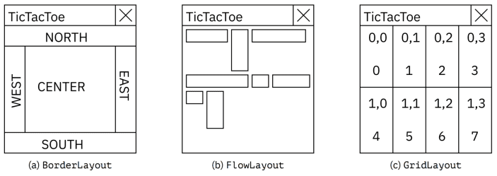
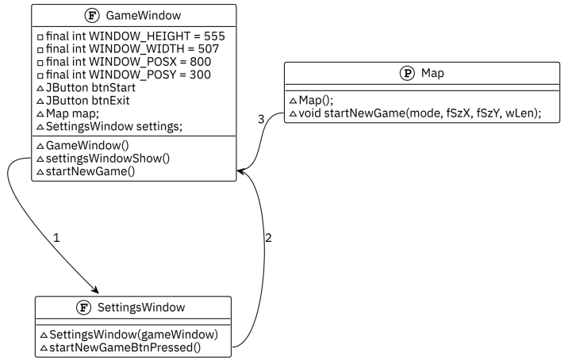

## Урок 1. Графические интерфейсы
- Swing;
- Асинхронность;
- Параллельность;
- Окно;
- Компонент;
- Компоновщик;
- Панель;
- События;
- Обработчик

Интерфейс — это чрезвычайно важно для простых пользователей
- создание окна;
- менеджеры размещений;
- элементы графического интерфейса;
- обработчики событий.

### Почему именно Swing?
✘ это популярный и современный фреймворк;  
✘ пригодится любому программисту на Java; поможет лучше понять ООП;  
✔ работа композиции из объектов;  
✔ обмен информацией между объектами;  
✔ явно использует ссылочную природу данных;  
✔ улучшает запоминание базовых взаимосвязей объектов; без искусственных примеров (в результате будет разработана простая игра, крестики-нолики с графическим интерфейсом).  

**Почему не JavaFX?** Фреймворк был выведен из стандартной библиотеки языка, начиная с Java 9, и достаточно сложен для базового знакомства с графическими библиотеками.

**Почему не LibGDX?** Фреймворк является надстройкой над Swing, объясняя его всё равно необходимо будет объяснять Swing/AWT.

**Intellij IDEA** — написана на Swing.

### JFrame: Главный класс окна
Окно графического интерфейса, как и любая другая программа – это класс и объекты. В листинге создаётся новый класс с названием GameWindow. Для начала, необходимо получить доступ к методам, содержащимся в библиотеке, для этого применяется наследование от класса JFrame, и создаётся конструктор.
```java
public class GameWindow extends JFrame {
    GameWindow() {
        //...
    }
}
```

### Закрытие окна, завершение приложения
Большая часть свойств окна не меняется за всё время существования окна и задаётся в конструкторе, то есть окно при создании будет наделено какими-то свойствами, которые в некоторых случаях можно будет поменять во время работы приложения. Самое не очевидное на первый взгляд то, что в Swing при нажатии на крестик в углу окна программа не завершается. По умолчанию, все создаваемые окна – невидимые. Это сделано потому что есть возможность создавать сколько угодно окон для приложения и такое поведение значительно снижает риск неожиданного поведения.

🔥 Все окна по умолчанию невидимые. Нажатие на крестик по умолчанию делает окно невидимым, а не завершает программу.

Для того, чтобы программа закрылась, необходимо принять решение, какое окно в ней будет главным. Чтобы программа завершалась при закрытии главного окна (обычно, это первое, что делается при создании одно оконных приложений) экземпляру JFrame устанавливается свойство DefaultCloseOperation. То есть устанавливается, что нужно сделать, когда это (главное) окно закроется. В это свойство записывается константа `EXIT_ON_CLOSE`. Если этого не сделать, то будет использовано поведение по умолчанию, окно сделается невидимым, и приложение не завершится.  
`setDefaultCloseOperation(EXIT_ON_CLOSE);`

### Свойства окна
Размеры и положение окна в конструкторе.
```java
private static final int WINDOW_HEIGHT = 555;
private static final int WINDOW_WIDTH = 507;
private static final int WINDOW_POSX = 860;
private static final int WINDOW_POSY = 360;

Gamewindow() {
    setDefaultCloseOperation(EXIT_ON_CLOSE);
    setLocation(WINDOW_POSX, WINDOW_POSY);
    SetSize(WINDOW_WIDTH, WINDOW_HEIGHT);
    setvisible(true);
}
```
Установка всех начальных свойств окна осуществляется вызовом соответствующих сеттеров в конструкторе. По умолчанию окно – невидимое, поэтому для его демонстрации в конструкторе вызывается метод setVisible с передаваемым аргументом true.

Окно – это всегда отдельный поток программы, внутри которого работает бесконечный цикл. В объекте окна существует очередь сообщений, которую цикл опрашивает и выполняет.
```java
public static void main (String[] args) {
    new GameWindow() ;
    System.out .println("Method main() is over");
}
```
Запустив программу и внимательно изучив результат, очевидно, что окно создалось, в консоли видно, что работа метода main закончилась, а окно всё равно выполняется, его, при желании, можно подвигать, изменить размер и так далее. Это и есть наглядная демонстрация многопоточности. Таким образом, получается, что когда создаётся новое окно – нет необходимости его ни в какой контейнер помещать, ни думать, как оно будет взаимодействовать с пользователем, оно создастся и будет жить своей жизнью. **Инкапсуляция**. Если появится необходимость что-то ещё выполнить в методе main, запрета на написание действий не существует и действия будут выполняться параллельно, асинхронно.

### Компоненты окна
#### **<u>Кнопка</u>**
Для того, чтобы точно ничего не перепутать в процессе разработки, возможно придать окну больше индивидуальности, задав заголовок и запретив пользователю изменять его размеры, для игры в крестики-нолики это будет важно, чтобы красиво отображалось поле. Для этого вызовем методы setTitle() и setResizeable(), соответственно.

💡 Элементы графического интерфейса – это хорошо знакомые кнопки, текстовые поля, надписи (лейблы), и тому подобные.

За кнопки отвечает класс JButton, при создании экземпляра есть возможность сразу в конструкторе задать надпись, которая будет отображаться на кнопке. Сразу создадим несколько кнопок, например, «выход». Кнопки недостаточно просто создать, поскольку неизвестно, где они должны находиться. Одну из созданных кнопок добавим на окно – для этого внутри конструктора необходимо воспользоваться методом add(), который требует в качестве аргумента передать ему какой-то Component. Все кнопки, лейблы и прочие элементы интерфейса – это наследники класса Component.
```java
JButton btnStart = new JButton("New Game");
Button btnExit = new JButton("Exit");

GameWindow() {
    setDefaultCloseOperation(EXIT_ON_CLOSE);
    setLocation(WINDOW_POSX, WINDOW_POSY);
    setSize(WINDOW_WIDTH, WINDOW_HEIGHT);
    setTitle("TicTacToe");
    setResizable(false);
    add(btnStart);
    setVisible(true);
}
```
После добавления в конструкторе кнопки, при запуске приложения видно, что она заняла всё окно приложения. Если убрать вызов метода setResizeable(), то также возможно удостовериться, что при изменении размеров окна, размер кнопки также будет меняться.

При попытке добавить вторую кнопку на это же окно, вторая кнопка полностью перекроет первую.

#### **<u>Компоновщики (менеджеры размещений)</u>**
Перекрытие происходит из-за использования компоновщика, или, как их ещё называют, менеджера размещений.

💡 Менеджеры размещений нужны для того, чтобы не думать каждый раз о том, как изменится размер и координаты конкретного элемента, допустим, при изменении окна и не писать сложное поведение вложенных компонентов чтобы просто отобразить то, что привычно пользователю.

Компоновщики активно используются в любом программировании графических интерфейсов в любых языках программирования, от C++ до JavaScript, потому что это достаточно удобный механизм, берущий на себя значительный пласт работы.

Использование компоновщиков позволяет эффективно управлять и размещать компоненты в окне или панели пользовательского интерфейса, обеспечивая гибкость и адаптивность приложения к изменениям размеров и расположения компонентов на экране. Компоновщик – это специальный объект, который
помещается на некоторые (RootPaneContainer) компоненты и осуществляет автоматическую расстановку добавляемых в него компонентов, согласно правилам. Компоновщиков существует несколько типов, каждый из которых предоставляет свои специфические возможности и алгоритмы расположения. Компоновщик выбирается в зависимости от требуемых задач и желаемого внешнего вида интерфейса.
- BorderLayout (по умолчанию);
- BoxLayout;
- CardLayout;
- FlowLayout;
- GridBagLayout;
- GridLayout;
- GroupLayout;
- SpringLayout.

По умолчанию в Swing используется компоновщик BorderLayout. Он располагает всё, что ему передаётся в центре, но также у него есть ещё четыре положения, маленькие области по краям.

[](./layout1.png)
[docs.oracle.com: Компоновщики](https://docs.oracle.com/javase/tutorial/uiswing/layout/index.html)

Если какая-то область не занята компонентом, она автоматически уменьшается до нулевых размеров, оставляя место другим компонентам. Поэтому, если необходимо какой-то компонент расположить не в центре, это нужно явно указать при добавлении. На первый взгляд, это немного не очевидно, поэтому лучше запомнить, что при добавлении надо указать ещё один параметр, константу, например, BorderLayout.SOUTH. FlowLayout будет располагать элементы друг за другом слева направо, сверху вниз. Компоновщик-сетка GridLayout при создании принимает на вход число строк и столбцов и располагает компоненты в получившейся сетке.

💡 Основная идея, которую надо понять, это не названия компоновщиков, а то, что в Swing вся работа происходит через компоновщики – Layout, которые каждый по-своему располагают элементы в окне.

#### **<u>Панель для размещения JPanel</u>**
Разнообразие требований к разработке графических интерфейсов может привести к необходимости создания бесконечного числа компоновщиков. Поэтому разработчики библиотеки Swing придумали использовать не только компоненты сами по себе, но и группы элементов, которые располагаются на так называемых панелях (JPanel). Главная особенность панелей в том, что внутри каждой панели возможно использовать свой собственный компоновщик. JPanel – это по умолчанию невидимый прямоугольник, на котором может находиться собственный компоновщик. Например, становится доступным создание для окна панели с кнопками, а остальное пространство оставить под другие важные вещи. В листинге описан код создания панели, добавление её в нижнюю часть основного экрана, расположение внутри панели компоновщика и двух кнопок. Важно, что на экран добавляются не кнопки по отдельности, а компонент, на который предварительно добавили кнопки.
```java
GameWindow() {
    setDefaultCloseOperation(EXIT_ON_CLOSE);
    setLocation(WINDOW_POSX, WINDOW_POSY);
    setSize(WINDOW_WIDTH, WINDOW_HEIGHT);
    setTitle("TicTacToe");
    setResizable(false);
    JPanel panBottom = new JPanel(new GridLayout(1, 2));
    panBottom.add(btnStart);
    panBottom.add(btnExit);
    add(panBottom, BorderLayout.SOUTH);
    setVisible(true);
}
```
JPanel позволяет также осуществлять рисование и взаимодействие с пользователем. Основные графические интерактивности в демонстрационном приложении будут сделаны именно на панели. Такую панель с достаточно большой функциональностью логично выделить в отдельный класс. В случае игры в крестики-нолики это будет карта поля сражения. В описании конструктора для простоты панель перекрашивается в чёрный цвет, чтобы увидеть, что панель создаётся без ошибок.
```java
import javax.swing.*;
import java.awt.*;

public class Map extends JPanel {
    Map() {
        setBackground(Color.BLACK);
    }
}
```
Естественно, панель также недостаточно просто создать, но нужно её кудато разместить. Например, на основной экран. Поскольку не была указана сторона экрана, панель заняла всё свободное место на окне, кроме юга, где расположилась панель с кнопками.
```java
GameWindow() {
    setDefaultCloseOperation(EXIT_ON_CLOSE);
    setLocation(WINDOW_POSX, WINDOW_POSY);
    setSize(WINDOW_WIDTH, WINDOW_HEIGHT);
    setTitle("TicTacToe");
    setResizable(false);
    Map map = new Map();
    JPanel panBottom = new JPanel(new GridLayout(1, 2));
    panBottom.add(btnStart);
    panBottom.add(btnExit);
    add(panBottom, BorderLayout.SOUTH);
    add(map);
    setVisible(true);
}
```

### Многооконное приложение, взаимосвязи
#### **<u>Структура</u>**
Полученных знаний достаточно, чтобы начать описывать так называемую бизнес-логику. Созданная панель Map будет выполнять функции поля боя, поэтому логично расположить в ней метод startNewGame(), начинающий новую игру. В качестве параметров метод должен принимать какие-то начальные настройки самой игры. Например, будут два режима игры, компьютер против игрока и игрок против игрока, размер поля, и сразу не будем привязываться к квадратному полю 3х3, для полей больше, чем 3х3 понадобится выигрышная длина, то есть число крестиков или ноликов, расположенных подряд на одной прямой для победы той или иной стороны. В теле метода сразу будет установлена так называемая заглушка, чтобы знать, что метод вызывается и все параметры передаются верно.
```java
void startNewGame(int mode, int fSzX, int fSzY, int wLen) {
    System.out.printf("Mode: %d; \nSize: x=%d, y=%d; \nWin Length: %d", mode, fSzX, fSzY, wLen);
}
```
Если сразу описать архитектуру проекта, его будет проще наполнять логикой и расширять, чем если писать последовательно, удерживая общую картину в голове. Итоговое приложение приложение будет работать в двух окнах: первое – стартовое, где будут задаваться настройки поля и производиться выбор режима игры; второе – основное, где будет происходить собственно игра. Основное окно уже написано, и при его закрытии происходит выход из программы. Для создания второго окна необходимо написать ещё один класс, названный, например, SettingsWindow, наследник JFrame. Конструктор второго окна будет принимать экземпляр игрового окна. В первую очередь это сделано для передачи параметров игры, а во-вторых, чтобы красиво отцентрировать его относительно основного.
```java
public class SettingsWindow extends JFrame {
    SettingsWindow(GameWindow gameWindow) {

    }
}
```
В основном окне GameWindow понадобится два поля, одно класса SettingsWindow чтобы иметь возможность экземпляр этого окна показывать когда появится необходимость и второе – это панель Map. В основном окне при создании экземпляра окна настроек в него передаётся this.

💡 Обратите внимание, на этот способ применять this, когда неоюходимо передать в метод ссылку на объект, который вызывает этот метод, фактически, основное окно передаёт себя.
```java
Map map;
SettingsWindow settings;

GameWindow() {
    setDefaultCloseOperation(EXIT_ON_CLOSE);
    setLocation(WINDOW_POSX, WINDOW_POSY);
    setSize(WINDOW_WIDTH, WINDOW_HEIGHT);
    setTitle("TicTacToe");
    setResizable(false);
    map = new Map();
    settings = new SettingsWindow(this);
    // ...
}
```

На рисунке первый черновик диаграммы классов разрабатываемого приложения. Создание идеальной диаграммы классов или модели данных не входит в цели курса, более важно понятное объяснение того, что в данный момент программируется. Буквами F обозначены экземпляры JFrame, буквой P Jpanel, а A это Application, то есть основной класс приложения. На диаграмме видно, что основное приложение создаёт основное окно, на которое добавлена панель Map и которое время от времени будет обращаться к SettingsWindow за настройками новой игры.

[](./scheme.png)

### Окно с настройками игры и обработчики кнопок
Окно настроек игры на данный момент будет представлено одной кнопкой старта игры, вызывающей метод старта игры с одним зафиксированным набором настроек – игра против компьютера, поле 3х3, чтобы выиграть необходимо собрать 3 крестика (или нолика) подряд. В данный момент окно создаётся в координатах (0,0) и имеет размер (0,0), то есть в левом верхнем углу экрана видно только кнопки свернуть, развернуть, закрыть. В конструкторе окна задаются его размеры и то, что его местоположение должно быть относительным главному окну. Аналогично основному окну добавлена кнопка подтверждения правильности настроек и старта игры.
```java
public class SettingsWindow extends JFrame {
    private static final int WINDOW_HEIGHT = 230;
    private static final int WINDOW_WIDTH = 350;
    Button btnStart = new Button("Start new game");

    SettingsWindow(GameWindow gameWindow) {
        setLocationRelativeTo(gameWindow);
        setSize(WINDOW_WIDTH, WINDOW_HEIGHT);
        add(btnStart);
    }
}
```
Далее необходимо «оживить» кнопки на окнах, это делается специальной конструкцией, синтаксис которой пока что придётся запомнить. Синтаксически всё написанное уже понятно и оговорено – у объекта кнопки btnExit вызывается метод добавления к этому объекту некоторого слушателя действия. Какое может у кнопки быть самое очевидное действие? Нажатие. В аргумент метода добавления передаётся некий новый объект класса «слушатель действия», у которого переопределяется метод «действие произошло». Кнопка старта игры будет делать видимым окно с будущими настройками. В листинге показаны обработчики кнопок старта новой игры и завершения приложения, находящихся на основном окне программы. Эти обработчики необходимо поместить внутрь конструктора основного окна.
```java
btnExit.addActionListener(new ActionListener() {
    @Override
    public void actionPerformed(ActionEvent e) {
        System.exit(0);
    }
});

btnStart.addActionListener(new ActionListener() {
    @Override
    public void actionPerformed(ActionEvent e) {
        settings.setVisible(true);
    }
});
```

### Последовательность выполнения программы
В основном окне понадобится метод, инициализирующий новое игровое поле, поскольку прямой вызов по кнопке старта новой игры на окне настроек метода в панели основного окна противоречит инкапсуляции. Зачем мы так делаем, казалось бы усложняем? Но нет: панель находится на основном окне, а кнопка начала игры будет находиться на окне настроек, которое не может «знать», какие на основном окне есть панели. Или может оказаться, что дальше нет никакого интерфейса, а игра происходит по сети.

🔥 В этом и есть суть ООП, когда один объект максимально отделён от другого, и каждому из них вообще не важно, как реализован другой.

Соответственно, когда в окне настроек нажата кнопка «начать игру», обработчик вызывает метод главного окна, а главное окно в свою очередь уже знает, что оно разделено на панели, и вынуждает панель Map начинать. Для чего нужен промежуточный метод? Чтобы не делать лишних связей между классами. Это логично с точки зрения инкапсуляции. Одно окно не должно никак управлять панелью на другом окне.
```java
SettingsWindow(GameWindow gameWindow) {
    setLocationRelativeTo(gameWindow);
    setSize(WINDOW_WIDTH, WINDOW_HEIGHT);
    btnStart.addActionListener(new ActionListener () {
        @Override
        public void actionPerformed(ActionEvent e) {
            gameWindow.startNewGame(0, 3, 3, 3);
            setVisible(false);
        }
    });
    add(btnStart);
}
```
В окне настроек описан обработчик нажатия на единственную кнопку, из этого обработчика вызывается единственный доступный метод – «старт новой игры» на основном окне. По факту нажатия, также, целесообразно спрятать окно настроек. Из метода основного класса startNewGame() вызывается map.startNewGame() класса мэп.
```java
void startNewGame(int mode, int fSzX, int fSzY, int wLen) {
    map.startNewGame(mode, fSzX, fSzY, wLen);
}
```
Ещё раз цепочка вызовов:
1. основное окно делает окно настроек видимым;
2. окно настроек говорит основному, что пора начинать игру;
3. основное окно в свою очередь знает, как именно надо игру начинать и просит панель стартовать. Если всё сделано верно, в терминале появится вывод из заглушки на панели Map. Mode: 0; Size: x=3, y=3; Win Length: 3

[](./scheme2.png)

### Основная панель с игрой
#### **<u>Рисование</u>**
Далее всё будет происходить на панели с полем для игры. Для рисования самой панели фреймворком определён метод paintComponent(). Этот метод вызывается фреймворком когда что-то происходит, например, когда основное окно перекрывается другим, перемещается на другой экран, или если его развернуть из свёрнутого состояния, вызывается он гораздо реже, чем это необходимо для логики игры. Для описания игрового процесса необходимо перерисовывать компонент по каждому клику мышкой и по каждому действию оппонента.

🔥 Важно помнить, что метод paintComponent() не следует напрямую вызывать из кода. Этот метод должен вызываться только фреймворком. Для того чтобы запросить у фреймворка вызов этого метода тоже есть специальный метод.

Для дальнейшей разработки важно отделить стандартный метод рисования компонента от пользовательского рисования на этом компоненте, так называемую бизнес-логику. Для этого будет создан ещё один метод void render(Graphics g), который будет вызываться из переопределённого paintComponent(). из самого paintComponent() вызов метода родительского класса удалять не следует, поскольку там, скорее всего, происходит что-то важное. Для вызова же метода фреймворка, необходимо в нужный момент сказать фреймворку что требуется перерисовать панель, фреймворк поставит метод paintComponent() в очередь сообщений окна, и когда очередь дойдёт до выполнения этого метода – окно выполнит перерисовку.
```java
@Override
protected void paintComponent(Graphics g) {
    super.paintComponent(g);
    render(g);
}

private void render(Graphics g) { }
```
🔥 Это действие полностью асинхронно и косвенно зависит от наших вызовов

Чтобы рисовать нужен объект класса Graphics, который умеет рисовать геометрические фигуры, линии, текст и тому подобное. Чтобы нарисовать поле для игры понадобится ширина и высота поля в пикселях. Их возможно узнать из свойств панели – ширины и высоты. Всё, что связано с размерами лучше вынести в переменные объекта, поскольку они понадобятся в других методах. Помимо ширины и высоты понадобятся переменные, в которых будет храниться высота и ширина каждой ячейки. Размеры каждой ячейки пригодятся для создания отступа одной линии от другой. Далее циклически делаются отступы и рисуются горизонтальные и вертикальные линии.
```java
private int panelWidth;
private int panelHeight;
private int cellHeight;
private int cellWidth;

private void render(Graphics g) {
    panelWidth = getWidth();
    panelHeight = getHeight();
    cellHeight = panelHeight / 3;
    cellWidth = panelWidth / 3;

    g.setColor(Color.BLACK);
    for (int h = 0; h < 3; h++) {
        int y = h * cellHeight;
        g.drawLine(0, y, panelWidth, y);
    }
    for (int w = 0; w < 3; w++) {
        int x = w * cellHeight;
        g.drawLine(x, 0, x, panelHeight);
    }
    repaint();
}
```
У многих разработчиков, в зависимости от используемой операционной системы после запуска этого кода не полностью или вовсе не рисуется разлиновка, это происходит из-за асинхронности рисования, скорее всего метод с линиями отработал позже того, как Swing нарисовал панель. Чтобы всё увидеть, необходимо заставить компонент панели полностью перерисоваться. Это делается вызовом метода repaint() из метода старта новой игры.

### Обработчик мышки
Обработчик действий мышки очень похож на те обработчики, которые уже написаны. В конструкторе панели описывается метод добавления слушателя, в котором переопределяется метод mouseReleased(), то есть для приложения важно когда пользователь отпустит кнопку и аналогично методу отрисовки следует сразу отделить обработчик от основной исполняемой логики.
```java
Map() {
    addMouseListener(new MouseAdapter() {
        @Override
        public void mouseReleased(MouseEvent e) {
            update(e);
        }
    });
}
```
Внутри метода обновления также принудительно вызывается метод перерисовки компонента, чтобы получился игровой цикл: старт – отрисовка – клик мыши – отрисовка – клик – отрисовка…
```java
private void update(MouseEvent e) {
    int cellX = e.getX() / cellWidth;
    int cellY = e.getY() / cellHeight;
    System.out.printf("x=%d, y=%d\n", cellX, cellY);
    repaint();
}
```
В методе обновления из объекта MouseEvent получаются координаты клика, делятся на размер ячейки и тем самым получается номер ячейки, в которую произошёл клик.

### Логика игры
Для работы понадобится генератор псевдослучайных чисел, символы, которыми будет обозначаться на поле игрок, компьютер и пустая ячейка, собственно поле и его размеры. Размеры – на будущее.
```java
private static final Random RANDOM = new Random();
private final int HUMAN_DOT = 1;
private final int AI_DOT = 2;
private final int EMPTY_DOT = 0;
private int fieldSizeY = 3;
private int fieldSizeX = 3;
private char[][] field;
```
Метод инициализации поля – создаётся новый массив и заполняется пустыми символами. Его вызов логично сразу разместить в метод старта новой игры.
```java
private void initMap() {
    fieldSizeY = 3;
    fieldSizeX = 3;
    field = new char[fieldSizeY][fieldSizeX];
    for (int i = 0; i < fieldSizeY; i++) {
        for (int j = 0; j < fieldSizeX; j++) {
            field[1][3] = EMPTY_DOT;
        }
    }
}
```
Когда кто-то (игрок или компьютер) будет совершать ход, будет важно, попал ли игрок в какую-то ячейку поля и пустота ли она, потому что нельзя ставить крестик поверх нолика и наоборот.
```java
private boolean isValidCell(int x, int y) {
    return x >= 0 && x < fieldSizeX && y >= 0 && y < fieldSizeY;
}
private boolean isEmptyCell(int x, int y) {
    return field[y][x] == EMPTY_DOT;
}
```
Компьютер будет очень примитивный – он будет делать ход в случайные места на карте.
```java
private void aiTurn() {
    int x, y;
    do {
        × = RANDOM.nextInt(fieldSizeX);
        y = RANDOM.nextInt(fieldSizeY);
    } while (!isEmptyCell(x, y));
    field[y][x] = AI_DOT;
}
```
Очевидно, что учебные цели предполагают не только демонстрацию того, как надо делать, но также и демонстрацию того как делать не надо. Далее приведён код, который не следует допускать при работе над приложениями. Метод принимает на вход символ, который нужно проверить и проверяет - не победил ли он.
```java
private boolean checkWin(char c) {
    if (field[0][0]==c && field[0][1]==c && field[0][2]==c) return true:
    if (field[1][0]==c && field[1][1]==c && field[1][2]==c) return true;
    if (field[2][0]==c && field[2][1]==c && field[2][2]==c) return true;

    if (field[0][0]==c && field[1][0]==c && field[2][0]==c) return true;
    if (field[0][1]==c && field[1][1]==c && field[2][1]==c) return true;
    if (field[0][2]==c && field[1][2]==c && field[2][2]==c) return true;

    if (field[0][0]==c && field[1][1]==c && field[2][2]==c) return true;
    if (field[0][2]==c && field[1][1]==c && field[2][0]==c) return true;
    return false;
}
```
🔥 Всегда пишите с помощью циклов, потому что стоит захотеть изменить размер поля на 4х4 или 5х5 – размер и сложность этого метода будет расти в геометрической прогрессии.

И метод проверки поля на состояние ничьей. Ничья в крестиках-ноликах наступает, когда не победил ни игрок ни оппонент, и не осталось пустых клеток.
```java
private boolean isMapFull() {
    for (int i = 0; i < fieldSizeY; i++) {
        for (int j = 0; j < fieldSizeX; j++) {
            if (field[i][j] == EMPTY_DOT) return false;
        }
    }
    return true;
}
```
Вся дальнейшая работа будет сконцентрирована на методах обновления игрового состояния и отрисовки игрового поля. В результате клика в ячейку необходимо проверить, валидная-ли ячейка, и можно-ли туда ходить. Если какое-то из условий не прошло, клик игнорируется, а если всё хорошо – делается ход.
```java
int cellX = e.getX()/cellWidth;
int cellY = e.getY()/cellHeight;
1f (!isValidCell(cellX, cellY) || !isEmptyCell(cellX, cellY)) return;
field[cellY][cellX] = HUMAN_DOT;
repaint();
```
```java
for (int y = 0; y < fieldSizeY; y++) {
    for (int x = 0; x < fieldSizeX; x++) {
        if (field[y][x] == EMPTY_DOT) continue;

        if (field[y][x] == HUMAN_DOT) {
            g.setColor(Color.BLUE);
            g.fillOval(x * cellWidth + DOT_PADDING, y * cellHeight + DOT_PADDING, cellwidth - DOT_PADDING * 2, cellHeight - DOT_PADDING * 2);
        } else if (field[y][x] == AI_DOT) {
            g.setColor(new Color(0xff0000));
            g.fillOval(x * cellWidth + DOT_PADDING, y * cellHeight + DOT_PADDING, cellWidth - DOT_PADDING * 2, cellHeight - DOT_PADDING * 2);
        } else {
            throw new RuntimeException("Unexpected value" + field[y][x] + " in cell: x=" + x + " y=" + y);
        }
    }
}
```
Далее – непосредственно отрисовка. Сюда можно картинку вставлять, закрашивать квадраты, рисовать крестики и нолики. Для простоты будут рисоваться кружки. Методу объекта графики g.fillOval() в сигнатуре передаётся левая верхняя координата прямоугольника, в который затем будет вписан овал, его ширина и высота соответственно. Чтобы задать цвет – перед тем как рисовать необходимо изменить цвет объекта графики g.setColor(Color.BLUE). Для человека далее будут рисоваться синие кружки, а для компьютера красные.

### Последние приготовления
По сути, осталось сделать две вещи – описать так называемую бизнес-логику, то есть в правильном порядке вызвать методы с логикой игры, избавиться от исключений и вывести сообщение об окончании игры. Для того, чтобы вывести результат, поверх игрового поля будет выводиться сообщение.
```java
private int gameOverType;
private static final int STATE_DRAW = 0;
private static final int STATE_WIN_HUMAN = 1;
private static final int STATE_WIN_AI = 2;
private static final String MSG_WIN_HUMAN = "Победил игрок!";
private static final String MSG_WIN_AI = "Победил компьютер!";
private static final String MSG_DRAW = "Ничья!";
```
В методе обновления уточняется, что когда пользователь поставил точку, необходимо проверить состояние поля на наличие победы или ничьей, дать возможность компьютеру поставить точку и сделать тоже самое.
```java
// update
if (checkEndGame(HUMAN_DOT, STATE_WIN_HUMAN)) return;

aiTurn();
repaint();
if (checkEndGame(AI_DOT, STATE_WIN_AI)) return;

// end update
private boolean checkEndGame(int dot, int gameOverType) {
    if (checkWin(dot)) {
        this.gameOverType = gameOverType;
        repaint();
        return true;
    }
    if (isMapFull()) {
        this.gameOverType = STATE_DRAW;
        repaint();
        return true;
    }
    return false;
}
```
В методе рендеринга, как только поле выведено и если игра закончилась необходимо вывести сообщение с одним из вариантов исхода игры. Для упрощения также следует завести классовую переменную с признаком окончания игры. Метод окончания игры рисует тёмно серый прямоугольник с жёлтой надписью о победе одного из игроков или ничьей в зависимости от состояния.
```java
//render
if (isGameOver) showMessageGameOver(g);
// end render

private void showMessageGameOver(Graphics g) {
    g.setColor(Color.DARK_GRAY);
    g.fillRect(0, 200, getWidth(), 70);
    g.setColor(Color.YELLOW);
    g.setFont(new Font("Times new roman", Font.BOLD, 48));

    switch (gameOverType) {
        case STATE_DRAW:
            g.drawString(MSG_DRAW, 180, getHeight() / 2); break;
        case STATE_WIN_AI:
            g.drawString(MSG_WIN_AI, 20, getHeight() / 2); break;
        case STATE_WIN_HUMAN:
            g.drawString(MSG_WIN_HUMAN, 70, getHeight() / 2); break;
        default:
            throw new RuntimeException("Unexpected gameOver state: " + gameOverType);
    }
}
```
Далее в листинге приведены несколько мелких правок в методах. Прочитав текст исключения при старте приложения становится ясно, что оно возникает, когда программа не может что-то поделить на ноль. Размеры поля до их инициализации равны нулю, поэтому понадобится ещё одна булева переменная – инициализирована ли игра.
- В конструкторе панели поле не инициализировано;
- В методе обновления нет смысла обрабатывать клики по неинициализированному полю или полю на котором закончилась игра;
- при старте новой игры игра перестаёт быть законченой, а поле становится инициализированным;
- рендеринг на неинициализированном поле не имеет смысла;
- в методе проверки на победу нужно добавить присвоение истинности булевой переменной с фактом окончания игры.
```java
private boolean isGameOver;
private boolean isinitialized;

Map() {
    isInitialized = false;
}

private void update(MouseEvent e) {
    if (isGameOver || !isInitialized) return;
}

void startNewGame(int mode, int fSzX, int fSzY, int wLen) {
    isGameOver = false;
    isInitialized = true;
}

private void render(Graphics g) {
    if (!isInitialized) return;
}

private boolean checkEndGame(int dot, int gameOverType) {
    if (checkWin(dot)) {
        isGameOver = true;
    }
    if (isMapFull()) {
        isGameOver = true;
    }
    return false;
}
```

### Практическое задание
1. Полностью разобраться с кодом
2. Переделать проверку победы, чтобы она не была реализована просто набором условий.
3. Попробовать переписать логику проверки победы, чтобы она работала для поля 5х5 и количества фигур 4.
4. ** Доработать искусственный интеллект, чтобы он мог примитивно блокировать ходы игрока, и примитивно пытаться выиграть сам.

### Термины, определения и сокращения
**Swing** библиотека для создания графического интерфейса для программ на языке Java. Swing разработан компанией Sun Microsystems и содержит ряд графических компонентов (Swing widgets), таких как кнопки, поля ввода, таблицы и тому подобные.

**Асинхронность** вид программирования, позволяющий вынести выполняемые задачи отдельными блоками кода. Применяется в сервисах, где предыдущее действие тормозит следующее. Синхронный процесс выполняется поэтапно. Пользователь совершает действие, ждёт, пока программа обработает часть кода, переходит к другому блоку. При использовании асинхронности, код убирает операцию, блокирующую следующие действия.

**Компонент** независимый модуль программы, предназначенный для повторного использования. Часто компоненты объединяют по общим признакам и организовывают в соответствии с определёнными правилами и ограничениями. Например, компоненты графического интерфейса.

**Компоновщик** (layout manager) в библиотеке Java Swing отвечает за расположение и организацию компонентов (например, кнопок, текстовых полей, панелей). Он определяет, как компоненты будут выравниваться, размещаться и изменяться при изменении размеров окна.

**Обработчик** это механизм, с помощью которого приложение может перехватить события, такие как сообщения, действия мыши и нажатия клавиш. Функция, которая перехватывает события определенного типа, называется процедурой обработчиком. Процедура-обработчик может действовать для каждого получаемого события, а затем изменить или отменить событие.

**Окно** это прямоугольная область экрана, в котором приложение отображает информацию и получает реакцию от пользователя. Одновременно на экране может отображаться несколько окон, в том числе, окон других приложений, однако лишь одно из них может получать реакцию от пользователя – активное окно. Пользователь использует клавиатуру, мышь и прочие устройства ввода для взаимодействия с приложением, которому принадлежит активное окно.

**Панель** в библиотеке Java Swing представляет собой контейнер, который используется для группировки и организации других компонентов в пользовательском интерфейсе. Она представляет собой область с фиксированным размером на которую можно добавить другие компоненты, такие как кнопки, текстовые поля или изображения.

**Параллельность** способ организации компьютерных вычислений, при котором программы разрабатываются, как набор взаимодействующих вычислительных процессов, работающих асинхронно и при этом одновременно. Параллельное программирование – это техника программирования, которая использует преимущества многоядерных или многопроцессорных компьютеров и является подмножеством более широкого понятия многопоточности (multithreading).

**События** это действия или случаи, возникающие в программируемой системе, о которых система сообщает для того, чтобы было возможно с ними взаимодействовать. Например, если пользователь нажимает кнопку на графическом интерфейсе, возможно ответить на это действие, отобразив информационное окно.
