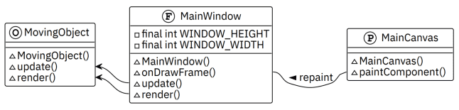
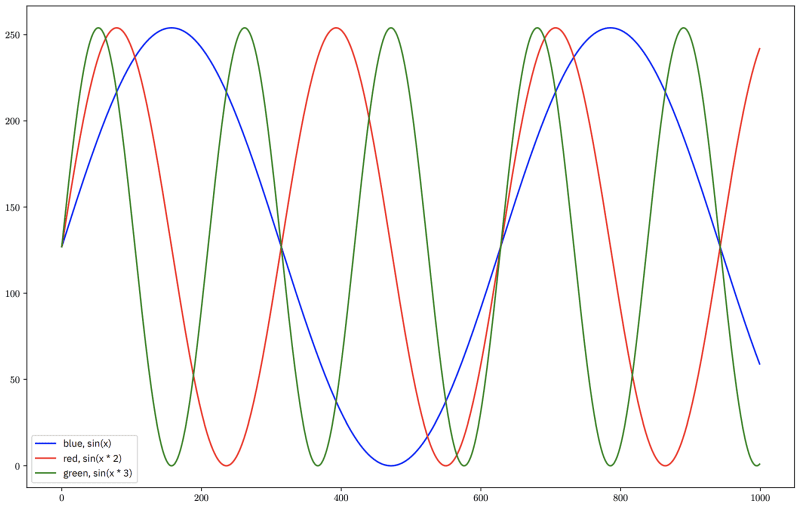
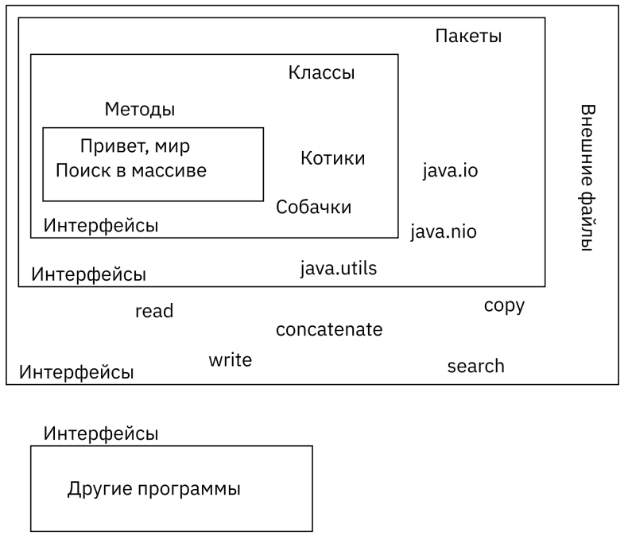
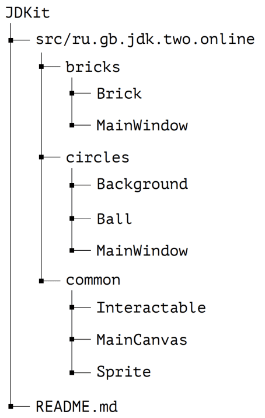

## Урок 2. Программные интерфейсы
- Программные интерфейсы — понятие и принцип работы;
- Ключевое слово implements;
- Наследование и множественное наследование интерфейсов;
- Реализация, реализации по-умолчанию;
- Частичная реализация интерфейсов, адаптеры;
- Анонимные классы;
- Исключения в графических фреймворках.

### Основное окно
Сложное окно не нужно: константы с размерами, координатами, и конструктор здесь же в основном методе. Самое важное сейчас это то, что окно – это объект с какими-то свойствами и каким-то поведением.
```java
public class MainWindow extends JFrame {
    private static final int POS_X = 400;
    private static final int POS_Y = 200;
    private static final int WINDOW_WIDTH = 800;
    private static final int WINDOW_HEIGHT = 600;

    private MainWindow() {
        setDefaultCloseOperation(WindowConstants.EXIT_ON_CLOSE);
        setBounds(POS_X, POS_Y, WINDOW_WIDTH, WINDOW_HEIGHT);
        setTitle("Circles");

        setVisible(true);
    }

    public static void main(String[] args) {
        new MainWindow();
    }
}
```

### Канва для рисования
Для рисования будет использоваться компонент JPanel, наследнику панели будет дано название MainCanvas. Любой компонент фреймворка Swing может перерисовываться, вызывая метод paintComponent(). Для начала, в конструкторе панели для отработки связи компонентов следует делать что-то незначительное, например, менять цвет фона на синий.

💡 Переопределив метод перерисовки панели не следует удалять вызов родительского метода, поскольку предполагается, что перерисовка панели происходит хорошо, но туда будет добавлена логика.

Также для универсализации дальнейших вызовов (удобства взаимодействия с канвой) следует добавить методы, возвращающие границы панели.
```java
public class MainCanvas extends JPanel {
    MainCanvas() {
        setBackground(Color. BLUE);
    }

    @Override
    protected void paintComponent(Graphics g) {
        super.paintComponent(g);
    }

    public int getleft() { return 0; }
    public int getRight() { return getWidth() - 1; }
    public int getTop() { return 0; }
    public int getBottom() { return getHeight() - 1; }
}
```

🔥 Нет прямого запрета на написание логики будущего движка или игры в классе канвы, но это архитектурно неверное решение, ведь на канве, на которой происходит рисование, должно происходить только рисование.

Исходя из принципа единой ответственности, принимается решение о том, что логика взаимодействия объектов будет описана в основном классе, а MainCanvas останется универсальным, чтобы иметь возможность в дальнейшем рисовать что угодно. Для этого следует описать в основном окне метод, который будет периодически вызываться канвой, например, onDrawFrame(). В нём будет описываться бизнес-логика. На начальном этапе, это два метода – update() который будет изменять состояние приложения, и render(), который будет отдавать команды рисующимся компонентам.
```java
private MainWindow() {
    setDefaultCloseOperation(WindowConstants.EXIT_ON_CLOSE);
    setBounds(POS_X, POS_Y, WINDOW_WIDTH, WINDOW_HEIGHT);
    setTitle("Circles");

    MainCanvas canvas = new MainCanvas():
    add(canvas);
    setVisible(true);
}

public void onDrawFrame() {
    update();
    render();
}

private void update() { }
private void render() { }
```

### Цикл отрисовки
Перерисовка канвы – это циклический процесс, и на каждой итерации MainCanvas должен вызывать метод onDrawFrame() основного класса. Для этого канве необходимо иметь ссылку на основное окно и внутри метода paintComponent() вызывается метод controller.onDrawFrame().
```java
public class MainCanvas extends JPanel {
    private final MainWindow controller;

    MainCanvas(MainWindow controller) {
        setBackground(Color.BLUE);
        this.controller = controller;
    }

    @Override
    protected void paintComponent(Graphics g) {
        super.paintComponent(g);
        controller.onDrawFrame();
    }
```
Далее, чтобы зациклить это действие, возможно два пути: самый простой – создать постоянно обновляющуюся канву, то есть в методе paintComponent() вызывать repaint() но это полностью нагрузит одно из ядер процессора только отрисовкой окна.
```java
public class MainCanvas extends JPanel {
    private final MainWindow controller;

    MainCanvas(MainWindow controller) {
        setBackground(Color .BLUE);
        this.controller = controller;
    }

    @Override
    protected void paintComponent(Graphics g) {
        super.paintComponent(g);
        controller.onDrawFrame();
        repaint();
    }
```
Второй путь – любой поток возможно заставить какое-то время поспать, для этого вызывается статический метод класса Thread, принимающий в качестве аргумента количество миллисекунд, которое поток должен обязательно поспать. Это даст FPS близкий к 60, приемлемый для применения в цифровой технике.
```java
@Override
protected void paintComponent(Graphics g) {
    super.paintComponent(g);
    controller.onDrawFrame();
    try {
        Thread.sleep(16);
    } catch (InterruptedException e) {
        throw new RuntimeException(e);
    }
    repaint();
}
```
В результате создан бесконечный цикл отрисовки, аналогичный циклу do-while, который сам себя заставляет крутиться с некоторой периодичностью и на каждой итерации сообщает контроллеру, что прошло около одной шестидесятой секунды.
```java
private MainWindow() {
    setDefaultCloseOperation(WindowConstants.EXIT_ON_CLOSE);
    setBounds(POS_X, POS_Y, WINDOW_WIDTH, WINDOW_HEIGHT);
    setTitle("Circles");

    MainCanvas canvas = new MainCanvas(this);
    add(canvas);|
    setVisible(true);
}
```
В код, вызывающий конструктор канвы, также требуется внести незначительные изменения. В канву необходимо передать ссылку на основное окно, на котором она находится, для этого используется ключевое слово this.

### Параметры отрисовки
Метод onDrawFrame() будет обновлять сцену и заставлять объекты на ней рисовать самих себя (рендерить сцену). Для обновления сцены, привязанного ко времени физического мира необходимо знать дельту времени, то есть период времени, прошедший с появления предыдущего кадра.

🔥 Писать логику обновления, исходя из частоты кадра, или из того, что канва «спит» 16 миллисекунд – очень сомнительная опора, потому что поток гарантированно ждёт 16 миллисекунд. При этом, сколько будут выполняться остальные действия – неизвестно, так как отрисовка происходит не через фиксированные промежутки времени, а по очереди сообщений окна и под влиянием множества других факторов.

Метод onDrawFrame() должен принимать от канвы ряд параметров и распределять их по методам обновления и рендеринга.
```java
public void onDrawFrame(MainCanvas canvas, Graphics g, float deltaTime) {
    update(canvas, deltaTime);|
    render (canvas, g);
}

private void update(MainCanvas canvas, float deltaTime) {

}

private void render(MainCanvas canvas, Graphics g) {

}
```
При вычислении дельты времени важно привести все единицы измерения к единому и привычному времени, например, к секундам. Скоростью в этом случае будет «пиксель в секунду» и из метода будет отдаваться время в секундах. При обращении к контроллеру передаётся также ссылка на текущий объект канвы и объект графики. Пока самое главное, что нужно понять об этих двух объектах – канва считает время в физическом мире и постоянно перерисовывает себя, сообщая об этом факте основному окну, а основное окно на этот факт как-то реагирует.
```java
private long lastFrameTime;

MainCanvas(MainWindow controller) {
    this.controller = controller;
    lastFrameTime = System.nanoTime();
}

@Override
protected void paintComponent (Graphics g) {
    super.paintComponent(g);
    try {
        Thread. sleep(16);|
    } catch (InterruptedException e) {
        throw new RuntimeException(e);
    }
    Float deltaTime = (System.nanoTine() - lastFrameTime) * 0.000000001f;
    controller.onDrawFrame(this, g, deltaTime);
    lastFrameTime = System.nanoTime();
    repaint();
}
```
Приложение будет рисовать какие-то объекты, и не важно, будут ли это кружки, квадратики, картинки, человечки или какие-то другие объекты. Важно, чтобы у программы было описано поведение этих объектов.

[](./scheme.png)

### Двумерный рисуемый объект (спрайт)
Класс Sprite описывает общие для всех рисуемых объектов в программе поведение и свойства. В графических фреймворках часто начало координат находится в верхнем левом или нижнем левом углу. Однако, очень часто, когда пишутся какие-то игры или другие приложения с использованием графики в качестве координат используется центр объекта. То есть необходимо условиться, что X и Y – это центр любого визуального объекта на канве. И, следовательно, удобно хранить не длину с шириной, а половину длины и половину ширины. А границы объекта, соответственно, будут отдаваться через геттеры и сеттеры. Дополнительно следует указать спрайту, что он умеет обновляться и рендериться, а его наследники уже смогут самостоятельно решать, как именно они хотят это делать.
```java
public abstract class Sprite {
    protected float x;
    protected float y:
    protected float halfWidth:
    protected float halfHeight;

    protected float getLeft() { return x - halfWidth; }
    protected void setLeft(float left) { x = left + halfWidth; }
    protected float getRight() { return x + halfwidth; }
    protected void setRight(float right) { x = right - halfWidth; }
    protected float getTop() { return y - halfHeight; }
    protected void setTop(float top) { y = top + halfHeight; }
    protected float getBottom() { return y + halfHeight; }
    protected void setBottom(float bottom) { y = bottom - halfHeight; }

    protected float getWidth() { return 2f * halfWidth; }
    protected float getHeight() { return 2f * halfHeight; }

    void update(MainCanvas canvas, float deltaTime) { }
    void render(MainCanvas canvas, Graphics g) { }
}
```

### Конкретный рисуемый объект
Инстанцировать абстрактный класс нельзя, поэтому, нужно создать класс шарика, который будет перемещаться по экрану. В конструкторе шарику задаются случайные размеры с определённым разбросом. Чтобы не усложнять пример отдельным объектами, описывающими физику мира, непосредственно объекту шарика будут заданы скорости по осям X и Y, и цвет.
```java
public class Ball extends Sprite {
    private static Random rnd = new Random();
    private final Color color;
    private float vX;
    private float vY;

    Ball() {
        halfHeight = 20 + (float) (Math.random() * 50f);
        halfWidth = halfHeight;
        color = new Color(rnd.nextInt());
        vX = 100f + (float) (Math.random() * 200f);
        vY = 100f + (float) (Math. random() * 200f);
    }

    @Override
    void update(MainCanvas canvas, float deltaTime) {
        x += vX * deltaTime;
        y += vy * deltaTime;

        if (getleft() < canvas.getLeft()) {
            setleft(canvas.getleft());
            vX = -vX;
        }
        if (getRight() > canvas.getRight()) {
            setRight(canvas.getRight());
            vX = -vX;
        }
        if (getTop() < canvas.getTop()) {
            settop(canvas.getTop());
            vY = -vY;
        }
        if (getBottom() > canvas.getBottom()) {
            setBottom(canvas.getBottom());
            vY = -vY;
        }
    }

    @Override
    void render(MainCanvas canvas, Graphics g) {
        g.setColor(color);
        g.fillOval((int) getleft(), (int) getTop(), (int) getWidth(), (int) getHeight());
    }
}
```
В классе шарика переопределяются методы обновления и рендеринга. Самый простой рендер – объекту графики задаётся цвет текущего шарика и вызывается метод fillOval(), которому передаются левая и верхняя координаты, ширина и высота. Несмотря на то, что объекты содержат поля типа float, работа происходит с пиксельной системой координат, а значит необходимо переводить в целые числа.

В методе обновления к текущим координатам шарика прибавляется расстояние, которое должен был преодолеть шарик за то время пока канва спала и рендерилась.  
$ball(x_n, y_n) = ball(x + vx * dt, y + vy * dt)$  
Дополнительно, обрабатываются отскоки от границ панели, то есть описаны четыре условия, что при достижении границы меняется направление вектора. В основном классе делается очень прямолинейно – создаётся массив из спрайтов, способный удержать десять шариков. В методе обновления каждый шарик из массива необходимо попросить обновиться, а в методе рендеринга – дать команду на отрисовку.

💡 Реализация обновления и отрисовки остаётся самим объектам, то есть инкапсулируется в них. Только каждый объект сам по себе знает, как именно ему обновляться с течением времени, и как рисоваться, а основной экран управляет на более высоком уровне – на какой канве, когда и что рисовать.

В конструкторе добавляется простой цикл инициализирующий приложение десятью шариками.
```java
private final Sprite[] sprites = new Sprite[10];

private MainWindow() {
    // ..
    for (int i = 0; i < sprites.length; i++) {
        sprites[i] = new Ball();
    }
    // ...
}

private void update(MainCanvas canvas, double deltaTime) {
    for (int i = 0; i < sprites.length; i++) {
        sprites[i].update(canvas, deltaTime);
    }
}

private void render(MainCanvas canvas, Graphics g) {
    for (int i = 0; i < sprites.length; i++) {
        sprites[i].render(canvas, g);
    }
}
```
Самое главное, что необходимо понять из этого приложения – это взаимодействия и взаимовлияния объектов. Наследование, полиморфизм, инкапсуляция поведений и свойств.

### Пример без интерфейсов
На первый взгляд, логично было бы предположить, что фон – это спрайт, имеющий прямоугольную форму и всегда рисующийся первым. Но, есть затруднения, связанные с таким подходом: при изменении размеров окна фон тоже желательно изменить в размерах, а это лишние слушатели и десятки строк кода, поэтому при отрисовке объекта фона гораздо проще будет дать команду канве на изменение фона.
```java
public class Background extends Sprite {
    private float time;
    private static final float AMPLITUDE = 255f / 2f;
    private Color color;

    @Override
    public void update(MainCanvas canvas, float deltaTime) {
        time += deltaTime;
        int red = Math.round(AMPLITUDE + AMPLITUDE * (float) Math.sin(time * 2f));
        int green = Math.round(AMPLITUDE + AMPLITUDE * (float) Math.sin(time * 3f));
        int blue = Math.round(AMPLITUDE + AMPLITUDE * (float) Math.sin(time));
        color = new Color(red, green, blue);
    }

    @Override
    public void render(MainCanvas canvas, Graphics g) {
        canvas.setBackground(color);
    }

// MainCanvas
sprites[0] = new Background();
for (int i = 1; i ‹ sprites.length; i++) {
    sprites[i] = new Ball();
}
```
Цвет фона меняется синусоидально по каждому из трёх компонентов цвета, поэтому изменение происходит плавно. Для реализации фона от спрайта, фактически, нужно только поведение, а свойства не нужны. Но и отказываться от наследования не очень правильно, потому что тогда не получится фон единообразно в составе массива спрайтов обновлять. Эти факты напрямую намекают на унификацию поведения – на интерфейс.

[](./graph.png)

### Понятие интерфейса
💡 Механизм наследования очень удобен, но он имеет свои ограничения. В частности, в языке Java допустимо наследование только от одного класса, в отличие, например, от языка С++, где имеется множественное наследование.

В языке Java проблему отсутствия множественного наследования частично позволяют решить интерфейсы. Интерфейсы определяют некоторый функционал, не имеющий конкретной реализации, который затем реализуют классы, применяющие эти интерфейсы. Один класс может применить к себе множество интерфейсов. Правильно говорить «реализовать интерфейс». Интерфейс можно очень примерно представить как очень абстрактный класс. Интерфейс – это описание методов.

💡 Интерфейс – это описание способов взаимодействия с объектом. Интерфейсы определяют функционал, не имеющий конкретной реализации.

Примером интерфейса в реальной жизни может быть интерфейс управления автомобилем, интерфейс взаимодействия с компьютером или интерфейс USB, так, компьютеру не важно, что именно находится по ту сторону провода – флеш накопитель, веб-камера или мобильный телефон, а важно, что компьютер умеет работать с интерфейсом USB, отправлять туда байты или получать. Потоки вводавывода, которые были изучены – это тоже своего рода интерфейс, соединяющий не важно какого отправителя, например, программный код и не важно какого получателя, например, файл. Интерфейсы объявляются также, как классы, и могут иметь очень похожую на класс структуру, то есть быть вложенным или внутренним. Чаще всего каждый отдельный интерфейс описывают в отдельном файле, также как класс, но используя ключевое слово interface. Ниже показаны примеры интерфейсов, человек и бык, в которых описаны методы «ходить» и «издавать звуки».

Все методы во всех интерфейсах всегда публичные, и в классическом варианте (до Java 1.8) не имеют никакой реализации. Поскольку все методы всегда публичные, то этот модификатор принято не писать.
```java
public interface Human {
    public void walk();
    public void talk();
}

public interface Bull {
    void walk();
    void talk();
}
```

### Реализация интерфейса
Продолжая учебный пример: созданы классы мужчина и бык. Класс мужчины реализовывает интерфейс человека, а класс быка – быка.

💡 Для реализации интерфейса необходимо переопределить все его методы, либо сделать класс абстрактным.

Множественного наследования нет, но существует возможность реализовать любое количество интерфейсов.
```java
public class Man implements Human {
    @Override
    public void walk() {
        System.out.println("Walks on two feet");
    }
    
    @Override
    public void talk() {
        System.out.println("Talks meaningful words");
    }
}


public class Ox implements Bull {
    @Override
    public void walk() {
        System.out.println("Walks on hooves");
    }

    @Override
    public void talk() {
        System.out .println("Moooooooooooooo");
    }
}
```
Одним из самых удобных следствий применения интерфейсов является возможность объявлять не только классы и создавать объекты, но и создать идентификторы, которые ссылаются на объект, реализующий интерфейс. То есть, по идентификатору типа интерфейса могут лежать абсолютно не связанные между собой объекты, главное, чтобы они реализовывали интерфейс. При этом сохраняется возможность работать с методами интерфейса которые могут быть для разных классов по-разному реализованы. Это иная форма изученного ранее полиморфизма.
```java
public class Main {
    public static void main(Stringl] args) {
        Man man0 = new Man(); //class Man
        Ox ox0 = new Ox(); // class Ox
        Human man1 = new Man(); // interface Human
        Bull ox2 = new Ox(); // interface Bull
    }
}
```
Для демонстрации ещё одного способа применения интерфейсов, будет описан класс минотавра, реализовывающий интерфейсы человека и быка своим собственным способом, а именно, ходил на ногах человека, но не мычал, как бык, а загадывал загадки.

💡 При использовании интерфейсов важно то, что классы не связаны между собой наследованием, а обращение к ним единообразно.

Интересно то, что в программе таким образом появляется возможность обратиться к минотавру не только как к человеку, но и как к быку, то есть гипотетически, можно создать некоторого Тесея, управляющего большим количеством минотавров.
```java
public class Main {
private static class Minotaurus implements Human, Bull {
    @Override public void walk() {
        System.out.println("Walks on two legs");
    }

    @Override public void talk() {
        System.out.println("Asks you a riddle");
    }

    public static void main(String[] args) {
        Bull minos0 = new Minotaurus();
        Human minos1 = new Minotaurus();
        Minotaurus minos = new Minotaurus();
        Human man1 = new Man();
        Bull ox2 = new Ox();
        Bull[] allBulls = {ox2, minos0, minos};
        Human[] allHumans = {man1, minos, minos1};
    }
}
```
Также важно, что в интерфейсах разрешено наследование. То есть, один интерфейс может наследоваться от другого интерфейса, соответственно, при реализации такого, наследующего интерфейса, необходимо переопределять не только методы интерфейса, но и методы всех его родителей, также, как если бы происходило переопределение методов абстрактного класса.

🔥 Следует обратить особенное внимание на то, что в интерфейсах разрешено множественное наследование.

### Применение интерфейса
В описанном ранее примере интерфейс помогает решить проблему единообразия поведения спрайтов и фона, при их различии в свойствах. То есть, сложилась ситуация в которой существует необходимость хранить в одном массиве объекты со схожим поведением, но наследовать их друг от друга не совсем логично.
```java
public interface Interactable {
    void update(MainCanvas canvas, float deltaTime);
    void render(MainCanvas canvas, Graphics g);
}
```
В качестве решения описан интерфейс Interactable, содержащий методы обновления и рендеринга без реализации.

🔥 Если описывать ещё более гибкое приложение, нужно создавать два интерфейса, Updatable и Renderable, чтобы иметь возможность отделить рисуемые объекты от обновляемых.

В данном случае интерфейс описывает объекты, которые должны уметь рисоваться и обновляться. В спрайте и фоне интерфейс реализуется. При этом получается, то фон никак не связан со спрайтом, но при этом, оба умеют рисоваться и обновляться, благодаря интерфейсу. Далее, при смене массива спрайтов на массив интерактивностей приложение не сломается.
```java
public abstract class Sprite implements Interactable { ... }
public abstract class Background implements Interactable { ... }
```

### Создание библиотечных классов
Если обратить внимание на развитие повествования по курсу, можно заметить, что сначала произошёл выход за пределы одного метода (методы, помимо main), потом за пределы одного класса (классы котиков, собачек, и т.д.), затем за пределы одного пакета (логическое разделение классов), за пределы программного кода (потоки ввода-вывода), а теперь код, который возможно использовать несколькими программами.

[](./inerface.png)

У классов канвы и спрайта, а также у интерфейса, нет никакой специфики, они ничего не «знают» о том, какие объекты существуют в программе и как эти объекты взаимодействуют между собой. Эти классы и интерфейс применимы, по сути, где угодно, не только в этой конкретной программе с этими конкретными классами. С использованием таких общих фрагментов кода становится возможным достаточно быстро написать вторую игру: новый пакет, новый класс, скопированный код от основного окна шариков. А полностью копировать спрайты и интерфейсы не целесообразно. Сделав правильное дробление по пакетам становится очевидно, что существует общий библиотечный пакет, и какие-то приложения с конкретными реализациями.

[](./structure.png)

В общий пакет классы скопировались без проблем, шарики перенеслись с минимальными изменениями – только публичные модификаторы понадобились. В главном окне с будущими летающими квадратиками создан аналогичный конструктор, размеры, положение. Но общей канвой воспользоваться невозможно. Это происходит, потому что канва может принимать в качестве параметра в конструкторе только основное окно из пакета кружочков. И далее канва уже у класса с кружочками вызывает метод onDrawFrame().

🔥 Привязка к классу ограничивает возможности

Решение на поверхности – использование интерфейсов. Необходимо написать интерфейс, который может по смыслу называться, например, CanvasRepaintListener, который будет уметь ожидать от канвы вызов метода и реализовывать его.
```java
public interface CanvasRepaintListener {
    void onDrawFrame(MainCanvas canvas, Graphics g, float deltaTime);
}
```
Такой интерфейс логично создавать в общем пакете и переписать канву так, чтобы она принимала на вход не класс, а объект, реализующий интерфейс. Далее, оба слушателя реализуются через интерфейс.
```java
public class MainCanvas extends JPanel {
    private final CanvasRepaintListener controller;
    private long lastFrameTime;

    public MainCanvas(CanvasRepaintListener controller) {
        this.controller = controller;
        lastFrameTime = System.nanoTime();
    }
}
```
Интерфейс может быть реализован классом, а окна приложений – это тоже классы. Это позволяет не только наследоваться от классов фреймворка Swing, но и реализовывать интерфейсы, описанные внутри приложения. Следовательно, окно без изменений продолжает передавать себя в конструктор, а метод интерфейса уже реализован. Чтобы подчеркнуть, что это реализация интерфейса – дописана аннотация @Override.
```java
public class MainWindow extends JFrame implements CanvasRepaintListener {
    private MainWindow() { ... }

    @Override
    public void onDrawframe(MainCanvas canvas, Graphics g, float deltalime) { ... }
}
```

### Особенности интерфейс
Интерфейсы были значительно переработаны в Java 1.8, было добавлено довольно много механизмов, об одном из которых нельзя не сказать. Реализация интерфейсов по умолчанию. Пример будет построен на основе тех интерфейсов, которые уже написаны – человек и бык. Очевидно, что именно у этих интерфейсов возможны реализации по умолчанию, например, для действия «ходить»: человек ходит на двух ногах, а бык на четырёх копытах. Для описания реализации по умолчанию используется ключевое слово default. Если написать реализацию, но не использовать данное ключевое слово, произойдёт ошибка компиляции (или среда разработки укажет на ошибочность такой конструкции).