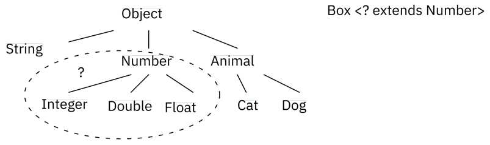
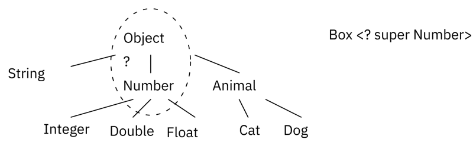
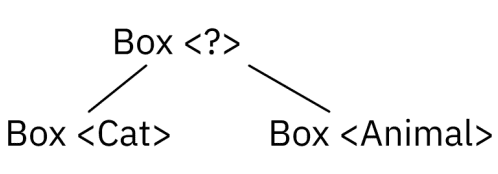

## Урок 3. Обобщенное программирование
Смысл обобщений в программировании примерно такой же, как и в обычной разговорной речи – отсутствие деталей реализации. С точки зрения проектирования обобщения – это более сложный полиморфизм. Будет рассмотрены diamond operator, обобщённые методы и подстановочные символы (Wildcards). Применение обобщений для ограничений типов сверху и снизу. Выведение и стирание типов, целевые типы и загрязнение кучи.
- Обобщения;
- Wildcard;
- Diamond operation;
- Стирание типа;
- Выведение типа;
- Сырой (raw) тип;
- Целевой тип.

### Работа без обобщений
Обобщения – это механизм создания общего подхода к реализации одинаковых алгоритмов, но с разными данными. Обобщения – это некоторые конструкции, позволяющие работать с данными не задумываясь о том, какие именно данные лежат внутри структуры или метода (строки, числа или коты). Обобщения позволяют единообразно работать с разными типами данных.

💡 Обобщённое программирование в Java позволяет создавать классы, интерфейсы и методы, которые могут работать с различными типами данных. В результате, код становится более универсальным и повторно используемым.

Для приведения примера поведения контейнера, который может хранить данные любого типа необходимо создать некоторый класс, который будет хранить внутри Object (любые данные Java). На примере чисел, в основном методе приложения созданы два экземпляра коробок с числами. Числа, которые сохранены в коробке желательно иметь возможность не только хранить, но и использовать, например, производить операцию сложения.
```java
private static class Box {
    private Object obj;

    public Box(Object obj) {
        this.obj = obj;
    }

    public Object getObj() {
        return obj;
    }
    public void setObj(Object obj) {
        this.obj = obj;
    }

    public void printInfo() {
        System.out.printf("Box (%s): %s\n", obj.getClass().getSimpleName(), obj.toString());
    }
}

public static void main(String[] args) {
    Box b1 = new Box(20);
    Box b2 = new Box(30);
    System.out.println(bl.getObj() + b2.getobj());
}
```
Поскольку в коробке, с точки зрения языка, хранятся объекты, а оператор сложения для объектов не определён, следует применить операцию приведения типов. Средства языка не запрещают создать больше коробок, например, со строками, и будет производиться уже не складывание чисел, а конкатенация строк. Проблема такого способа в том, что при каждом получении данных из коробки необходимо делать приведение типов, чтобы указать какие именно в контейнере лежат данные. Данную проблему для программы возможно решить организационно, если, например, называть переменные в венгерской нотации.
```java
public static void main(String[] args) {
    Box b1 = new Box(20);
    Box b2 = new Box(30);
    System.out.println((Integer) b1.getObj() + (Integer) b2.getObj());
    Box b3 = new Box("Hello, ");
    Box b4 = new Box ("World!");
    System.out.println((String) b3.getObj() + (String) b4.getObj());
}
```
💡 Венгерская нотация в программировании – соглашение об именовании переменных, констант и прочих идентификаторов в коде программ. Тип переменной указывается строчной буквой перед именем переменной, например для типа int переменная может называться iMyVariable.

Вторая проблема в том, что данные в контейнере ничем не защищены. Java не запрещает менять данные внутри контейнера, поскольку для платформы это объект. Проблему возможно решить сделав проверку instanceof перед приведением типов. Третья проблема в том, что все проблемы подобного рода проявляют себя только во время исполнения приложения, то есть у конечного пользователя перед глазами, когда разработчик ничего исправить не может.
```java
public static void main(String[] args) {
    Box iBox1 = new Box(20);
    Box iBox2 = new Box(30);
    if (iBox1.getObj() instanceof Integer && iBox2.getObj() instanceof Integer) {
        int sum = (Integer) iBox1.getObj() + (Integer) iBox2.get0bj();
        System.out println("sum = " + sum);
    } else {
        System.out.println("The contents of the boxes differ by type");
    }
    iBox1.setObj("sdf"); // Java: "What can go wrong here? You can do it!"
}
```
Таким образом, в языке Java возможно создавать классы, которые могут работать с любыми типами данных, но при любом обращении к таким классам и данным необходимо делать достаточно сложные проверки.

### Создание обобщения
- Java generics – это механизм языка, который позволяет создавать обобщенные (шаблонизированные) типы и методы в Java (особый подход к описанию данных и алгоритмов, позволяющий работать с различными типами данных без изменения внешнего описания);
- Java generics были добавлены в Java 1.5 и стали одной из наиболее важных новых функций в языке; — Java generics работают только со ссылочными типами данных;
- Java generics предоставляют безопасность типов во время компиляции, что означает, что ошибки связанные с типами данных могут быть обнаружены на этапе компиляции, а не во время выполнения программы.

Для описания обобщения в треугольных скобках пишется буква , чтобы обозначить Type, Тип. На этапе описания класса невозможно сказать, какого типа данные будут лежать в переменной во время исполнения (число, строка или кот).

🔥 Если написать T не в треугольных скобках при описании класса, то Java будет искать реально существующий класс, который она не видит.

Таким образом указывается, что это обобщение и тип будет задаваться при создании объекта. Естественно поменять его будет нельзя, потому что Java – это язык сильной статической типизации.
```java
private static class GBox<T> {
    private T value;

    public GBox(T value) {
        this.value = value;
    }

    public T getValue() {
        return value;
    }

    public void setValue(T value) {
        this.value = value;
    }

    public void showType() {
        System.out.printf("Type is %s, with value %s\\n", value.getClass().getName(), getValue());
    }
}

public static void main(String[] args) {
    GBox<String> stringBox = new GBox<>("Hello!");
    stringBox.showType();
    GBox<Integer> integerBox = new GBox<>(12);
    integerBox.showlype();
}
```
При вызове конструктора такого объекта, будет указано, что конструктор ожидает указанный ранее тип, а не T. При указании типа в левой части, этот тип подставляется во все места класса, где компилятор обнаружит T. При получении значений из integerBox и stringBox не требуется преобразование типов, integerBox.getValue() сразу возвращает Integer, а stringBox.getValue() – String. Если объект создан как Integer, то становится невозможно записать в него строку. При попытке написать такую строку кода, получится ошибка на этапе компиляции, то есть обобщения отслеживают корректность используемых типов данных. По соглашению, переменные типа именуются одной буквой в верхнем регистре. Если обобщённых переменных более одной – они пишутся через запятую.

💡 E – элемент (Element, Entity обширно используется Java Collections);
💡 K – Ключ;
💡 N – Число;
💡 T – Тип;
💡 V – Значение;
💡 S, U, и т. п. — 2-й, 3-й, 4-й типы

### Ограничения обобщений
Обобщения накладывают на работу с собой некоторые ограничения.
1. Невозможно внутри метода обобщённого класса создать экземпляр параметризующего класса T, потому что на этапе компиляции об этом классе ничего не известно. Это ограничение возможно обойти, используя паттерн проектирования абстрактная фабрика.
2. Нельзя создавать внутри обобщения массив из обобщённого типа данных. Но всегда можно подать такой массив снаружи.
3. По причине отсутствия информации о параметризируещем классе, невозможно создать статическое поле типа. Конкретный тип для параметра T становится известен только при создании объекта обобщённого класса.
4. Нельзя создать исключение обобщённого типа

### Работа с обобщёнными объектами
При обращении к обобщённому классу необходимо заменить параметры типа на конкретные классы или интерфейсы, например строку, целое число или кота.

🔥 «Параметр типа» и «аргумент типа» – это два разных понятия. Когда объявляется обобщённый тип GBox, то T является параметром типа, а когда происходит обращение к обобщённому типу, передается аргумент типа, например Integer.

Как и любое другое объявление переменной запись вида GBox integerBox сам по себе не создаёт экземпляр класса GBox. Такой код объявляет идентифиактор типа GBox, но сразу уточняет, что это будет коробка с целыми числами. Такой идентификатор обычно называется параметризованным типом.
```java
GBox<Integer> integerBox0;
GBox<Integer> integerBox1 = new GBox<Integer>(1);
GBox<Integer> integerBox2 = new GBox<>(1);
```
Чтобы создать экземпляр класса, используется ключевое слово new и, в дополнение, указывается, что создаётся не просто GBox, а обобщённый, поэтому пишется . Компиляторы, начиная с Java 1.7, научились самостоятельно подставлять в треугольные скобки нужный тип (выведение типа из контекста). Если тип совпадает с аргументом типа в идентификаторе, в скобках экземпляра его можно не писать. Это называется бриллиантовый оператор.

### Множество параметризированных типов
Ограничений на количество параметризированных типов не накладывается. Часто можно встретить обобщения с двумя типами, например, в коллекциях, хранящих пары ключ-значение. Также, нет ограничений на использование типов внутри угловых скобок.
```java
private static class KVBox<K, V> {
    private K key;
    private V value;

    public KVBox(K key, V value) {
        this.key = key;
        this.value = value;
    }

    public V getValue() {
        return value;
    }

    public K getKey() {
        return key;
    }

    public void showType() {
        System.out.printf("Type of key is %s, key = %s, " +
        "type of value is %s, value = %s\\n",
        key.getClass().getName(), getKey(),
        value.getClass().getName(), getValue());
    }
}

public static void main(String[] args) {
    KVBox<Integer, String> kvb0 = new KVBox<>(1, "Hello");
    KVBox<String, GBox<String>> kvb1 = new KVBox<>("World", new GBox<>("Java"));
}
```

### Raw type (сырой тип)
Сырой тип – это имя обобщённого класса или интерфейса без аргументов типа, то есть это, фактически, написание идентификатора и вызов конструктора обобщённого класса как обычного, без треугольных скобок. При использовании сырых типов, программируется поведение, которое существовало до введения обобщений в Java. Геттеры сырых типов возвращают объекты. Это логично, потому что ни на одном из этапов не указан аргумент типа.

🔥 GBox – это сырой тип обобщённого типа GBox. Однако необобщённый класс или интерфейс не являются сырыми типами.

Для совместимости со старым кодом допустимо присваивать параметризованный тип своему собственному сырому типу.
```java
GBox<Integer> intBox = new GBox<>(1);
GBox box = intBox;

GBox box = new GBox(1);
GBox<Integer> intBox = box;

GBox<Integer> intBox0 = new GBox<>(1);
GBox box0 = intBox0;
box.setValue(4);
```
Также, если присвоить параметризованному типу сырой тип, или если попытаться вызвать обобщённый метод в сыром типе, то буквально каждое слово в программе будет с предупреждением среды разработки. Предупреждения показывают, что сырой тип обходит проверку обобщённого типа, что откладывает обнаружение потенциальной ошибки на время выполнения программы.

Термин «unchecked» означает непроверенные, то есть компилятор не имеет достаточного количества информации для обеспечения безопасности типов. По умолчанию этот вид предупреждений выключен, поэтому компилятор в терминале на самом деле даёт подсказку. Note: .java uses unchecked or unsafe operations. Note: Recompile with -Xlint:unchecked for details. Чтобы увидеть все «unchecked» предупреждения нужно перекомпилировать код с опцией -Xlint:unchecked.

К предупреждениям среды в написанном коде желательно относиться внимательно, и придирчиво перепроверять код на наличие ненадёжных конструкций.

### Обобщённые методы
Обобщённые методы синтаксически схожи с обобщёнными классами, но параметры типа относятся к методу, а не к классу. Допустимо делать обобщёнными статические и не статические методы, а также конструкторы. Синтаксис обобщённого метода включает параметры типа внутри угловых скобок, которые указываются перед возвращаемым типом.
```java
private static <T> void setIfNull(GBox<T> box, T t) {
    if (box.getValue() == null) {
        box.setValue(t);
    }
}

public static void main(String[] args) {
    GBox<Integer> box = new GBox<>(null);
    setIfNull(box, 13);
    System.out.println(box.getValue());
    GBox<Integer> box0 = new GBox>(1);
    setIfNull(box0, 13);
    System.out.println(box0.getValue());
}
```

### Ограниченные параметры типа
Bounded type parameters позволяют ограничить типы данных, которые могут быть использованы в качестве параметров. Использование bounded type parameters в Java является хорошей практикой, которая позволяет более точно определить используемые типы данных и обеспечивает более безопасный и читаемый код.

### Ограничение «сверху»
В качестве примера необходимости ограничений будет использоваться уже написанная коробка. В коробке описывается операция сложения. Если сложение чисел и конкатенация строк – это понятные операции, то сложение котиков или потоков ввода-вывода не определены. Применение bounded type parameters позволяет более точно задавать ограничения на используемые типы данных, что помогает писать более безопасный и читаемый код. То есть, в обобщениях существует возможность ограничиться только теми типами, которые соответствуют определенным требованиям Например, коробку предлагается сделать так, чтобы в ней хранились только числа – наследники класса Number. Подобное ограничение делается с помощью ограниченного параметра типа (bounded type parameter). Чтобы объявить «ограниченный сверху» параметр типа необходимо после имени параметра указать ключевое слово extends, а затем указать верхнюю границу (upper bound), которой в данном примере является класс Number.
```java
public class BBox<V extends Number> {
    public V getValue() {
        return value;
    }

    public void setValue(V value) {
        this.value = value;
    }

    private V value;
}

private static <T extends Number> void setIfNull(BBox<T> box, T t) {
    if (box.getValue() == null) {
        box.setValue(t);
    }
}


public static void main(String[] args) {
    BBox<Integer> integerBBox = new BBox<>();
    BBox<String> stringBBox = new BBox<>();

    setIfNull(integerBBox, 4);
    setIfNull(stringBBox, "hello");
}
```
В рассматриваемом примере типы, которые можно использовать в параметризованных классах Box, ограничены наследниками класса Number. Если попытаться создать переменную с типом, например, Box, то возникнет ошибка компиляции. Аналогичным образом создаются обобщённые методы с ограничением.
```java
class Bird(}
interface Animal{}
interface Man{}
class CBox<T extends Bird & Animal & Man> {
    // ...
}
```
Также возможно задать несколько границ. При этом, важно помнить, что также, как и в объявлении классов, возможен только один класс-наследник и он указывается первым. Все остальные границы могут быть только интерфейсами и указываются через знак амерсанда.

💡 В языке Java, несмотря на строгость типизации, возможно присвоить идентификатору одного типа объект другого типа, если эти типы совместимы. Например, можно присвоить объект типа Integer переменной типа Object, так как Object является одним из супертипов Integer. В объектно-ориентированной терминологии это называется связью «является» («is a»).

Предположим, что существует метод, описанный с generic параметром.
```java
private static void boxTest(GBox<Number> n) { /* ... */ }

public static void main(String[] args) {
    boxTest(new GBox<Number>(10));
    boxTest(new GBox<Integer>(1)); // compile error
    boxTest(new GBox<Float>(1.0f)); // compile error
}
```
На первый взгляд кажется, что в метод возможно передать Integer или Float, но нельзя, так как Integer и Float не являются потомками Number.

🔥 Это частое недопонимание принципов работы обобщений, и это важно знать. Наследование не работает в Java generics так, как оно работает в обычной Java.

Идентификатор коробки с Number не может в себе хранить коробку с Integer. Обобщение защищает от попыток положить в коробку, например, строк – не строку. То есть, предположим, в коробку кладётся Integer, как наследник Number, а затем, например Float, получится путаница. Из приведённого примера возможно сделать вывод о том, что если методу с таким параметром передать коробку с Integer – он не будет работать. Чтобы допустить передачу таких контейнеров, в аргументе следует указать что в параметре возможен любой тип, являющийся наследником Number, то есть использовать маску . Ограничивать такую маску возможно как сверху так и снизу. Таким образом, обобщения защищают самих себя от путаницы и не дают складывать в одни и те же контейнеры разные типы данных. Поскольку коробку с чем то ещё, кроме Number и его наследников создавать нельзя, маскирование при вызове метода будет избыточно На самом деле обобщения – это так называемый синтаксический сахар. То есть, когда в коде используется обобщение, во время компиляции произойдёт так называемое «стирание», и все обобщённые типы данных преобразуются в Object, соответствующие проверки и приведения типов.

### Ограничение «снизу»
Ограничение типов возможно вводить как сверху, так и снизу. На примере обобщённых методов. Такие методы необходимы, когда требуется объединить несколько похожих, но всё же разных типов данных. Если подать на вход обобщённого метода два типа – Integer и Float в итоге для работы будет выбран ближайший старший для них обоих – Number.
```java
private static <T extends Number> boolean compare(T src, T dst) {
    return src. equals(dst);
}

public static void main(String[] args) {
    System.out.println(compare(1, 1.0f));
    System.out.println(compare(1.0f, 1.0f));
    System.out.println(compare(1, 1));
}
```
Например, даны два списка – один с Integer другой с Number, и требуется написать метод, который будет перекидывать числа из одного списка в другой. Для совершения этого действия описан метод, при работе которого возможны два сценария – копировать элементы Number в список Integer или элементы Integer в список Number.
```java
public static void copyTo(ArrayList src, ArrayList dst) {
    for (Object o : src) dst.add(o);
}
public static void main(String[] args) {
    ArrayList<Integer> ial = new ArrayList<>(Arrays. asList(1, 2, 3));
    ArrayList<Number> nal = new ArrayList<>(Arrays.asList(1f, 2, 3.0));
    System.out.println(ial);
    System.out.println(nal);
    copyTo(ial, nal);
    System.out.println(nal);
    copyTo(nal, ial);
    System.out.println(ial);
}
```
Правильным рабочим сценарием будет только второй – копирование более точного типа в более общий список. Java при компиляции пропустит в работу оба сценария, но действительно работающим всё равно остаётся только один. Для примера, описаны два класса: «животное» и наследник животного – «кот». На их основе создаются обобщённые списки и вызывается обобщённый метод копирования списков.
```java
public static void copyTo(ArrayList src, ArrayList dst) {
    for (Object o : src) dst.add(o);
}

private static class Animal {
    protected String name;

    protected Animal() { this.name = "Animal"; }

    @Override public String toString() { return name; }
}

private static class Cat extends Animal {
    protected Cat() { this.name = "Cat"; }
    public void voice() { System.out.println("meow"); }
}

public static void main(String[] args) {
    ArrayList<Cat> cats = new ArrayList<>(Arrays.asList(new Cat()));
    ArrayList<Animal> animals = new ArrayList<>(Arrays.asList(new Animal()));
    copyTo(animals, cats);
    System.out.println(cats);
    cats.get(1).voice();
}
```
При компиляции и исполнении ошибок не возникло. К классу кота добавляется метод голос и совершается попытка вызвать голос у объекта из списка.

При попытке вызвать у более общего «животного» метод более частного «кота» выбрасывается исключение о невозможности приведения типов. Для того, чтобы избежать подобных проблем, необходимо описать метод таким образом, чтобы он работал только с каким-то одним типом и списки будут и в цикле тоже будут перебираться элементы типа T. Если более не уточнять, получится, что в список котов возможно класть только котов, а в список животных класть только животных. Но кот – это наследник животного, его присутствие в списке животных уместно. Получается, что источником может быть список из заданного типа или его наследников, а приёмником – тип или его родители, и далее метод, виртуальная машина и другие механизмы сами разбираются, кто подходит под эти параметры. При таком описании метода, неверные варианты будут отсекаться на этапе компиляции.
```java
public static <T> void copyTo (ArrayList<? extends T> src, ArrayList<? super T› dst) {
        for (T o : src) {
            dst. add(o);
        }
}
```

### Выведение типов
Алгоритм выведения типов определяет типы аргументов, а также, если это применимо, тип, в который присваивается результат или в котором возвращается результат.

💡 Выведение типов – это возможность компилятора автоматически определять аргументы типа на основе контекста.

Алгоритм работает от наиболее общего типа (Object) к наиболее точному, подходящему к данной ситуации. Например, добавив к коту реализацию интерфейса Serializable и написав метод, работающий с одним и только одним типом данных T будет создана ситуация, в которой никакие аргументы не связаны наследованием.
```java
private static class Cat extends Animal implements Serializable {
    protected Cat() { this.name = "Cat"; }
    public void voice(){ System.out.println("meow"); }
}

private static <T> T pick(T first, T second) { return second; }

public static void main(String[] args) {
    Serializable se1 = pick("d", new Cat());
    Serializable se2 = pick("d", new ArrayList<String>());
}
```
В таком методе выведение типов определяет, что вторые аргументы метода pick, а именно Cat и ArrayList, передаваемые в метод имеют тип Serializable, но этого недостаточно, потому что первый аргумент тоже должен быть того же типа. Удачно, что строка – это тоже Serializable. В описании обобщённых методов, выведение типа делает возможным вызов обобщённого метода так, будто это обычный метод, без указания типа в угловых скобках.
```java
public class App {
    public static <U> void addBox(U u, List<Box<U>> boxes) {
        Box<U> box = new Box<>();
        box.setValue(u);
        boxes.add(box);
    }

    public static void main( String[] args ) {
        ArrayList<Box<Cat>> catsInBoxes = new ArrayList<>();
        App.<Cat>addBox(new Cat("Kusya"), catsInBoxes);
        addBox(new Cat("Kusya"), catsInBoxes);
        addBox(new Cat("Murka"), catsInBoxes);
        printBoxes(catsInBoxes);
    }
}
```
Очевидно, что в листинге обобщённый метод addBox() объявляет один параметр типа U. В большинстве случаев компилятор Java может вывести параметры типа вызова обобщённого метода, в результате чаще всего вовсе не обязательно их указывать. Чтобы вызвать обобщённый метод addBox(), возможно указать параметры типа (строка 10) либо опустить их, тогда компилятор языка автоматически выведет тип Cat из аргументов метода при вызове (строка 11).

Выведение типа при создании экземпляра обобщённого класса позволяет заменить аргументы типа, необходимые для вызова конструктора обобщённого класса пустым множеством параметров типа (пустые треугольные скобки, бриллиантовая операция), так как компилятор может вывести аргументы типа из контекста.

Очевидно, что конструкторы могут быть обобщёнными как в обобщённых, так и в необобщённых классах.
```java
public class Box<T> {
    <U> Box(U u) {
        // ...
    }

    public T getValue() {
        return value;
    }

    public void setValue(T value) {
        this.value = value;
    }

    private T value;
}

public static void main(String[] args) {
    Box<Cat> box = new Box<Cat>("Some message");
}
```
Например, возможно явно указать, что у коробки будет обобщённый аргумент «кот», а у конструктора – какой-то другой аргумент, например, строка или число. Компилятор выведет тип String для формального параметра U, так как фактически переданный аргумент является экземпляром класса String.

💡 Целевой тип выражения – это тип данных, который компилятор Java ожидает в зависимости от того, в каком месте находится выражение.

Например, как в методе emptyBox() (листинг, строка 12). В основном методе инициализация ожидает экземпляр Box. Этот тип данных является целевым типом. Поскольку метод emptyBox() возвращает значение обобщённого типа Box.
```java
public class TBox<T> {
    public static final TBox EMPTY_BOX = new TBox<>();

    public T getValue() { return value; }

    public void setValue(T value) {
        this.value = value;
    }

    private T value;

    static <T> TBox<T> emptyBox() {
        return (TBox<T>) EMPTY_BOX;
    }
}

public static void main( String[] args ) {
    TBox<String> box = TBox.emptyBox();
}
```

### Подстановочный символ (wildcard)
В обобщённом коде знак вопроса, называемый подстановочным символом, означает неизвестный тип. Подстановочный символ может использоваться в разных ситуациях: как параметр типа, поля, локальной переменной, иногда в качестве возвращаемого типа. Подстановочный символ никогда не используется в качестве аргумента типа для вызова обобщённого метода, создания экземпляра обобщённого класса или супертипа.

Передаваемые типы для уточнения, возможно ограничивать сверху и снизу. Ограниченный сверху подстановочный символ применяется, чтобы ослабить ограничения переменной.

Подстановочный символ <?> ограниченный сверху
[](./wildcart.png)

Чтобы написать метод, который работает с коробками, в которых содержится Number и дочерние от Number типы, например Integer, Double и другие, необходимо указать Box.
```java
private static class Animal {
    protected String name;

    protected Animal(String name) { this.name = name; }

    @Override public String toString() {
        return this.getClass().getSimpleName() + " with name" + name;
    }
}

private static class Cat extends Animal {
    protected Cat(String name) { super(name); }
}

private static class Dog extends Animal {
    protected Dog(String name) { super(name); }
}
```
Внутри метода, выводящего информацию о содержимом коробки присутствует ограниченный сверху подстановочный символ, где вместо Animal может быть любой тип.
```java
public static class TBox<T> {
    public static final TBox EMPTY_BOX = new TBox<>();
    private T value;

    public T getValue() { return value; }

    public void setValue(T value) { this.value = value; }

    static <T> TBox<T> emptyBox() {
        return (TBox<T>) EMPTY_BOX;
    }

    @Override public String toString() {
        return value. toString();
    }
}

static void printInfo(TBox<? extends Animal> animalInBox) {
    System.out.println("Information about animal: " + animalInBox);
}
```
```java
public static void main (String[] args) {
    TBox<Cat> catInBox = TBox.emptyBox();
    catInBox.setValue(new Cat("Vasya"));
    printInfo(catInBox);

    TBox<Dog> dogInBox = TBox.emptyBox();
    dogInBox.setValue(new Dog("Kusya"));
    printInfo(dogInBox);
}
```
Создав соответствующие объекты, положив их в коробки и запустив код возможно наблюдать, что коробка вмещает как животных, так и наследников животного, чего не произошло бы при использовании в параметре типа животного без подстановочного символа.

💡 Если просто использовать подстановочный символ, то получится подстановочный символ без ограничений. Box означает коробку с неизвестным содержимым (неизвестным типом).

Такой синтаксис существует для того, чтобы продолжать использовать обобщённый тип без уточнения типа, как следствие, без использования обобщённой функциональности. Неограниченный подстановочный символ полезен, если нужен метод, который может быть реализован с помощью функциональности класса Object. Когда код использует методы обобщённого класса, которые не зависят от параметра типа.

💡 В программах, использующих Reflection API конструкция Class< ? > используется чаще других конструкций, потому что большинство методов объекта Class< T > не зависят от расположенного внутри типа.

Например, метод printInfo() (строка 14) из листинга, не использует никаких методов животного, цель метода – вывод в консоль информации об объекте в коробке любого типа, поэтому в параметре метода можно заменить «коробку с наследниками животного» на «коробку с чем угодно», ведь в методе будет использоваться только метод коробки toString().
```java
static void printInfo(TBox<?> animalInBox) {
    System.out.println("Information about animal: " + animalInBox);
}
```
🔥 Важно запомнить, что Box< Object > и Box< ? > это не одно и тоже

Ограниченный снизу подстановочный символ ограничивает неизвестный тип так, чтобы он был либо указанным типом, либо одним из его предков. В обобщённых конструкциях возможно указать либо только верхнюю границу для подстановочного символа, либо только нижнюю.

То есть, если написать метод printInfo(), с параметром коробки и обобщённым аргументом не < ? >, а < Object >, то код также не будет работать, потому что метод будет ожидать не «животное и наследников», а «животное и родителей», то есть Object.

Подстановочный символ <?> ограниченный снизу
[](./wildcart2.png)

Обобщённые классы или интерфейсы связаны не только из-за связи между их типами. С обычными, необобщёнными классами, наследование работает по правилу подчинённых типов: класс Cat является подклассом класса Animal, и расширяет его.
```java
private static class Animal {
    protected String name;

    protected Animal(String name) { this.name = name; }

    @Override public String toString() {
        return this.getClass().getSimpleName() + " with name " + name;
    }
}

private static class Cat extends Animal {
    protected Cat(String name) { super(name); }
}


public static void main(String[] args) {
    Cat cat = new Cat("Vasya");
    Animal animal = cat;
    TBox<Cat> catInBox = new TBox<>();
    TBox<Animal> animalInBox = catInBox; // Incompatible types
}
```
Данное правило не работает для обобщённых типов. Несмотря на то, что Cat является подтипом Animal, Box< Cat > не является подтипом Box< Animal >. Общим предком для Box< Cat > и Box< Animal > является Box< ? >.

[](./wildcart3.png)

```java
TBox<? extends Cat> catInBox = new TBox<>();
TBox<? extends Animal> animalInBox = catInBox; // OK
```
В некоторых случаях компилятор может вывести тип подстановочного символа. Коробка может быть определена как Box, но при вычислении выражения компилятор выведет конкретный тип из кода, такой сценарий называется захватом подстановочного символа. В большинстве случаев нет нужды беспокоиться о захвате подстановочного символа, кроме случаев, когда в сообщении об ошибке появляется фраза capture of. В примере, приведённом в листинге компилятор обрабатывает параметр коробки как тип Object. Когда вызывается метод внутри testError(), компилятор не может подтвердить тип объекта, который будет присутствовать внутри коробки и генерирует ошибку. Обобщения были добавлены в Java именно для этого – чтобы усилить безопасность типов на этапе компиляции.
```java
static void testError(Box<?> box) {
    box.setValue(box.getValue()); // capture of ?
}
```
Когда есть уверенность в том, что операция безопасна, ошибку возможно исправить написав приватный вспомогательный метод (в англоязычной литературе private helper method),  захватывающий подстановочный символ.
```java
private static <T> void testErrorHelper(TBox<T> box) {
    box.setValue(box.getValue());
}

static void testError(TBox<?> box) {
    testErrorHelper(box);
}
```

### Краткое руководство по использованию подстановочных символов
Входная переменная. Предоставляет данные для кода. Для метода copy(src, dst) параметр src предоставляет данные для копирования, поэтому он считается входной переменной. Выходная переменная. Содержит данные для использования в другом месте. В примере copy(src, dst) параметр dst принимает данные и будет считаться выходной переменной.
1. Входная переменная определяется с ограничением сверху.
2. Выходная переменная определяется с ограничением снизу.
3. Если ко входной переменной можно обращаться только как к Object – неограниченный подстановочный символ.
4. Если переменная должна использоваться как входная и как выходная одновременно, НЕ использовать подстановочный символ.
5. Не использовать подстановочные символы в возвращаемых типах

### Стирание типа и загрязнение кучи
Обобщения были введены в язык программирования Java для обеспечения более жёсткого контроля типов во время компиляции и для поддержки обобщённого программирования. Для реализации обобщения компилятор Java применяет стирание типа.

### Стирание типа
- Механизм стирания типа фактически заменяет все параметры типа в обобщённых типах их границами или Object, если параметры типа не ограничены.
- Сгенерированный байткод содержит только обычные классы, интерфейсы и методы.
- Вставляет явное приведение типов где необходимо.
- Генерирует связующие методы, чтобы сохранить полиморфизм в расширенных обобщённых типах.
- Гарантирует, что никакие новые классы не будут созданы для параметризованных типов, следовательно обобщения не приводят к накладным расходам во время исполнения.

Компилятор Java также стирает параметры типа обобщённых методов. Обобщённый метод в котором используется неограниченный тип будет заменён компилятором на Object.

Аналогично классам для методов происходит стирание типа при расширении ключевым словом extends – параметр в угловых скобках заменяется на максимально возможного родителя.
```java
private static <T> void setIfNull(TBox<T> box, T t) {
    if (box.getValue() == null) {
        box.setValue(t);
    }
}

// ... both methods have same erasure
private static void setIfNull(TBox<Object> box, Object t) {
    if (box.getValue() == null) {
        box.setValue(t);
    }
}
```
Стирание типа имеет последствия, связанные с произвольным количеством параметров (varargs).

Материализуемые типы – это типы, информация о которых полностью доступна во время выполнения, такие как примитивы, необобщённые типы, сырые типы, обращения к неограниченным подстановочным символам. Нематериализуемые типы – это типы, информация о которых удаляется во время компиляции стиранием типов, например, обращения к обобщённым типам, которые не объявлены с помощью неограниченных подстановочных символов. Во время выполнения о нематериализуемых типах нет всей информации. Виртуальная машина Java не может узнать разницу между нематериализуемыми типами во время выполнения.

- Материализуемые типы (reifiable types) — это типы, информация которых полностью доступна во время выполнения
- Нематериализуемые типы (Non-reifiable types) — это типы, информация которых удаляется во время компиляции стиранием типов

### Загрязнение кучи
Загрязнение кучи (heap pollution) возникает, когда переменная параметризованного типа ссылается на объект, который не является параметризованным типом. Такая ситуация возникает, если программа выполнила операцию, генерирующую предупреждение unchecked warning во время компиляции. Предупреждение unchecked warning генерируется, если правильность операции, в которую вовлечён параметризованный тип (например, приведение типа или вызов метода) не может быть проверена. Если компилируются различные части кода отдельно, то становится трудно определить потенциальную угрозу загрязнения кучи.

### Ограничения обобщений (резюме)
В этом разделе приводится некоторое резюме вышесказанного в части наиболее частых ошибок при работе с обобщениями. Нельзя использовать при создании экземпляра примитивы. Выход из ситуации – использование классов-обёрток.
```java
TBox<int> box = new TBox<>();
```
Нельзя создавать экземпляры параметров типа. В качестве выхода из ситуации – передавать вновь созданный объект в обобщённые методы в качестве параметра.
```java
static <T> void add(Box<T> box) {
    T t = new T();
    // ...
    box.setValue(t);
}
```
Статические поля класса являются общими для всех объектов этого класса, поэтому статические поля с типом параметра типа запрещены. Так как статическое поле является общим для коробки с животным, коробки с котом и коробки с собакой, то какого типа это поле? Также запрещено использовать приведение типа к параметризованному типу, если он не использует неограниченный подстановочный символ.
```java
public class SBox<T> {
    private static T value;
    //...
}
```
Запрещено использовать приведения типов для обобщённых объектов. Так как компилятор стирает все параметры типа из обобщённого кода, то нельзя проверить во время выполнения, какой параметризованный тип используется для обобщённого типа.
```java
TBox<Integer> box1 = new TBox<>();
TBox<Number> box2 = (TBox<Number>) box1;
```
Запрещено создавать массивы параметризованных типов.
```java
Object [] stringLists = new TBox<String>[];
// compilation error, but let's say it's possible
stringLists[0] = new TBox<String>(); // 0K
stringLists[1] = new TBox<Integer>(); // here should be an ArrayStoreException exception, but the runtime cannot notice it.
```
Обобщённый класс не может расширять класс Throwable напрямую или опосредовано. Метод не может ловить (catch) экземпляр параметра типа. Однако можно использовать параметр типа в throws.
```java
// Extends Throwable non-direct
class MathException<T> extends Exception {/* ... */ } // compilation error

// Extends Throwable directly
class QueueFullException<T> extends Throwable { /* ... */ // compilation error

    public static <T extends Exception, J> void execute (TBox<J> box) {
        try {
            J j = box.getValue();
            // ...
        } catch (T e) { // compilation error
        }
    }

    class Parser<T extends Exception> {
        public void parse(File file) throws T { // 0K
            //
        }
    }
}
```
Класс не может иметь два перегруженных метода, которые будут иметь одинаковую сигнатуру после стирания типов. Такой код не скомпилируется.
```java
private static <T> void setIfNull(TBox<T> box, T t) {
    if (box.getValue() == null) {
        box.setValue(t);
    }
}

private static void setIfNull(TBox<Object> box, Object t) {
    if (box.getValue() == null) {
        box.setValue(t);
    }
}
```

### Практическое задание
1. Написать метод, который меняет два элемента массива местами (массив может быть любого ссылочного типа);
2. Большая задача:
- Есть классы Fruit -> Apple, Orange; (больше не надо)
- Класс Box в который можно складывать фрукты, коробки условно сортируются по типу фрукта, поэтому в одну коробку нельзя сложить и яблоки, и апельсины; Для хранения фруктов внутри коробки можете использовать ArrayList;
- Сделать метод getWeight() который высчитывает вес коробки, зная количество фруктов и вес одного фрукта (вес яблока — 1.0f, апельсина — 1.5f, не важно в каких единицах);
- Внутри класса коробки сделать метод compare, который позволяет сравнить текущую коробку с той, которую подадут в compare в качестве параметра, true — если их веса равны, false в противном случае(коробки с яблоками мы можем сравнивать с коробками с апельсинами);
- Написать метод, который позволяет пересыпать фрукты из текущей коробки в другую коробку(помним про сортировку фруктов, нельзя яблоки высыпать в коробку с апельсинами), соответственно в текущей коробке фруктов не остается, а в другую перекидываются объекты, которые были в этой коробке.

### Термины, определения и сокращения
**Diamond operation** автоматизация подстановки типа, пустые угловые скобки, вынуждающие компилятор вывести тип из контекста.

**Wildcard** в обобщённом коде знак вопроса, называемый подстановочным символом, означает неизвестный тип. Подстановочный символ может использоваться в разных ситуациях: как параметр типа, поля, локальной переменной, иногда в качестве возвращаемого типа.

**Выведение** типа это возможность компилятора автоматически определять
аргументы типа на основе контекста

**Обобщения** особый подход к описанию данных и алгоритмов, позволяющий работать с различными типами данных без изменения внешнего описания.

**Стирание типа** подготовка написанного обобщённого кода к компиляции таким образом, чтобы в байт-коде не было обобщённых конструкций.

**Сырой (raw)** тип это имя обобщённого класса или интерфейса без аргументов типа, то есть это, фактически, написание идентификатора и вызов конструктора обобщённого класса как обычного, без треугольных скобок.

**Целевой тип** это тип данных, который компилятор Java ожидает в зависимости от того, в каком месте находится выражение.
