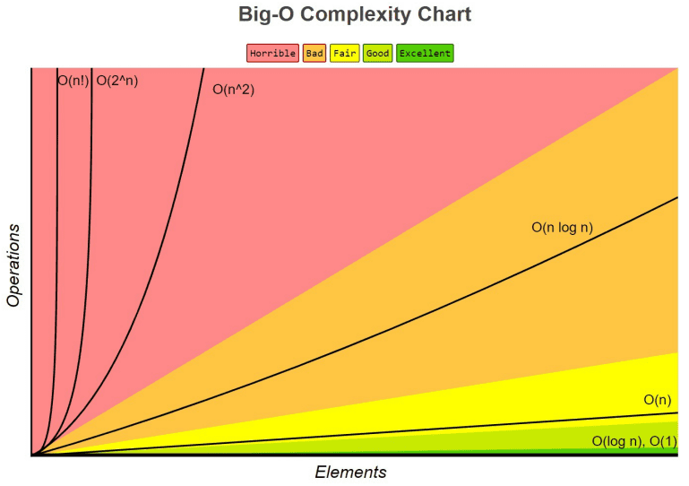
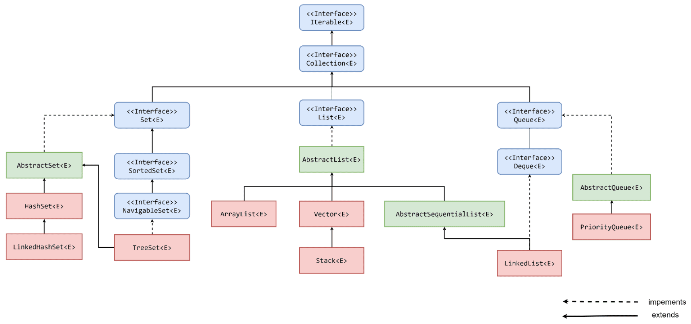
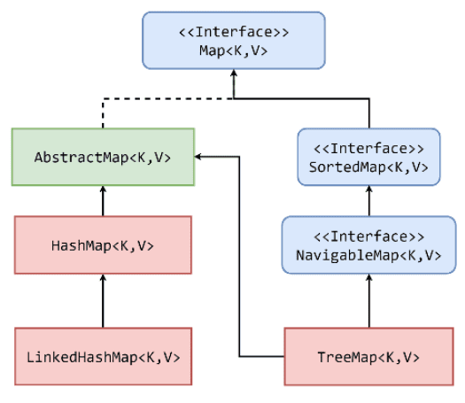
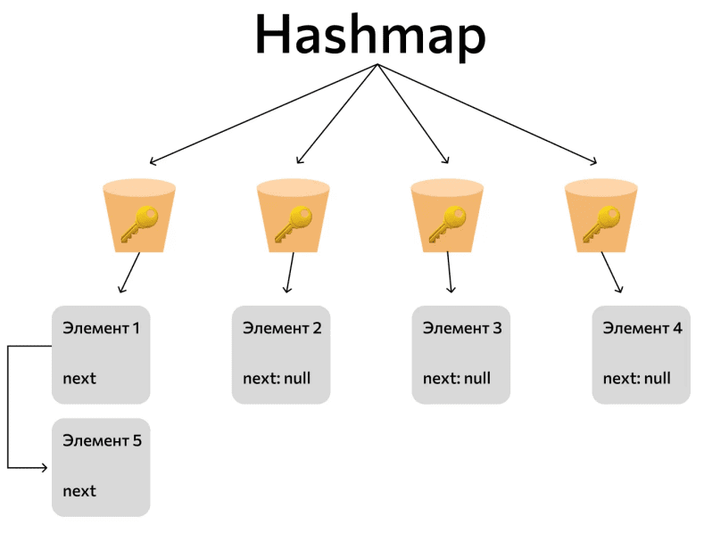

## Урок 4. Коллекции
- Массивы
- Интерфейс List
- Интерфейс Set
- Интерфейс Queue
- Интерфейс Map

### Термины, используемые в лекции
**Массив (Java Array)** — это структура данных, которая хранит набор пронумерованных значений одного типа (элементы массива).

**Big O или О большое** — нотация для описания временной сложности алгоритма

**LIFO (последний вошел — первый вышел)** — один из способов организации и манипулирования данными относительно времени и приоритетов

**FIFO (первый вошел — первый вышел)** — один из способов организации и манипулирования данными относительно времени и приоритетов

### О-большое
Коллеги, наверное наиболее интересная часть работы программиста это проектирование и разработка алгоритмов, необходимых для решения соответствующих прикладных задач, а также применение ранее разработанных механизмов. С точки зрения сегодняшней темы (хранение и доступ к спискам данных) нашу задачу можно сформулировать, как выбор наиболее эффективной коллекции, реализующей алгоритмы обработки соответствующих массивов данных — это и есть мастерство разработчика — понимание когда и какое решении эффективнее.

Но существует ли математическое обозначения для оценки сложности алгоритмов? Сегодня мы поговорим про О большое (Big O) — это оценка верхней асимптотической (оценка при наихудшем сценарии) границы времени работы алгоритма в зависимости от количества элементов n, которые необходимо обработать. Мы используем нотацию О большое, когда нужно определить эффективность алгоритма — помните, что время работы разных алгоритмов растет с разной скоростью.

Чтобы понять, что такое О большое давайте дадим оценку сложности алгоритма сортировки выбором (https://habr.com/ru/articles/422085/). Сортировка выбором – это алгоритм сортировки, который выполняет итерацию по списку, чтобы гарантировать, что каждый элемент с индексом i является i-м наименьшим/наибольшим элементом списка:
1. В не отсортированном подмассиве ищется локальный максимум (минимум).
2. Найденный максимум (минимум) меняется местами с последним (первым) элементом в подмассиве.
3. Если в массиве остались неотсортированные подмассивы — повторяем пункт 1.

В худшем случае на каждом шаге придется сравнивать элемент со всеми остальными не отсортированные ранее - т.е. первый раз n элементов, на втором шаге n-1 (первый элемент уже перемещен на позицию) и так далее - мы получили n²/2-n/2. Когда мы вычисляем О большое, мы заботимся только о доминирующих операторах, и не заботимся о коэффициентах. Таким образом, мы выбираем n² как О большое. Мы записываем его как O(n²), а произносим как «О большое в квадрате». На рисунке изображены графики функций соотносящиеся с наиболее часто встречающимися оценками Big O и их эффективность.

На рисунке изображены графики функций соотносящиеся с наиболее часто встречающимися оценками Big O и их эффективность.

[](./obig.png)

Примеры алгоритмов и их оценка О большое:
- O(1) или O константа — получение и вставка элемента в i позицию массива.
- O(log n) — двоичное (бинарное дерево) поиск в вставка элемента.
- O(n) — прохождение по элементам массива, списка (цикл for each).
- O(n log n) — алгоритм быстрой сортировки.
- O(n^2) — сортировка пузырьком, сортировка вставкой (двойной цикл).
- O(2^n) — рекурсивный расчет чисел Фибоначчи.
- O(n!) — задача коммивояжера.

Вам нужно помнить, что если вы сравниваете между собой два алгоритма с одинаковыми О большое, то это ничего не говорит о том какой из алгоритмов эффективнее (нужны другие средства оценки).

Мы будем использовать в этой лекции нотацию О большое при описании некоторых реализаций интерфейсов коллекций, для определения эффективности той или иной конструкции - в общем случае, нас интересует поиск элемента, вставка, удаление элемента коллекции.

### Массивы
В рамках решения прикладных задач при разработке программного обеспечения, мы постоянно сталкиваемся с необходимостью обработки некоторого набора (списка, группы) элементов — это могут быть данные полученные из базы, CSV файла, Json объекта и т.д.. Каждый раз встречаясь с такой задачей мы должны принять решения, какой интерфейс и какая реализация интерфейса наиболее эффективна в рамках взаимодействия с элементами данного списка — возможно мы будем чаще изменять данные нежеле их читать, возможно нам нужен уникальный набор значений или список отсортированный в определенном порядке.

Самым простым механизмом, позволяющим обеспечить упорядоченное хранение множества элементов являются разумеется массивы. Массив в Java (Java Array) — это структура данных, которая хранит набор пронумерованных значений одного типа (элементы массива).

Давайте оценим эффективность работы с массивом размера n с использованием нотации Big 0:
- Получение элемента массива O(1) — мы обращаемся напрямую к элементу по индексу.
- Поиск элемента в массиве O(n) — в худшем случае нужный нам элемент будет последний
- Поиск и замена элемента в массиве O(n) — поиск O(n) плюс вставка O(1).

Примечание. Такая оценка O большого для массива обеспечивается тем, что массив имеет фиксированный размер, также мы знаем тип объекта экземпляры которого мы помещаем в массив. Поэтому Java изначально выделяет кусок памяти, размер которого пропорционален количеству элементов и необходимый объект для хранения типа — это означает, что мы всегда знаем адрес i элемента массива.

Не смотря на то, что массив это простой и эффективный инструмент, но у него есть ряд недостатков:
- Фиксированный размер. В случае если необходимо добавить новый элемент к существующему массиву, придется создать новый массив большей длины и скопировать туда все элементы.
- Требуется заранее знать количество элементов. Не подходит для решения задач, в которых количество элементов динамически изменяется во времени.
- Нерациональное использование памяти. Под массив выделяется сразу столько памяти, сколько необходимо для хранения элемента определенного типа умноженного на размер массива.
- “Примитивный интерфейс” — для решения типовых прикладных задач, каждый раз необходимо кодировать соответствующие алгоритмы. Нет метода для добавление элемента (необходимо указывать конкретный index), нет метода для удаления элемента (можно только обнулить значение по index) и т.д..

### Коллекции
Для решения архитектурных ограничений массивов в Java и существует иерархия коллекций, предназначенных для решения типовых задач — соответствующие реализации интерфейсов могут быть гораздо эффективнее использование обычных массивов. Также стоит отметить, что массив может хранить примитивные типы — в этом случае мы используем его.

Иерархия коллекций

[](./Collection.png)

[](./Map.png)

- Синий — интерфейсы
- Зеленый — абстрактные классы
- Красный — реализация интерфейса

Обратите внимание, что интерфейс Map не является наследником интерфейса Collection, но он рассматривается в контексте организации хранения данных.

Все рассматриваемые интерфейсы являются Generic (нельзя работать с примитивными типами), т.е. вы должны однозначно определять класс объекта, который вы хотите поместить в коллекцию (для примитивных типов используем обертки — но это дополнительная память). Если вы хотите иметь возможность добавить любой элемент то укажите < Object >.

Примечание. При изучении коллекций мы будем следовать следующему плану:
- Определяем назначение интерфейса
- Описываем основные публичные методы
- Рассматриваем реализацию интерфейса и их применение.

### Collection
И так первый интерфейс который мы рассмотрим — это разумеется интерфейс Collection — он не имеет реализации (по умолчанию, но вы можете создать свою), но от него наследуются остальные базовые интерфейсы.

Примечание. Тут стоит напомнить, что класс, реализующий некоторый интерфейс коллекции, например List, реализовывает не только сам List но и интерфейс Collection, являющийся родительским для List (иерархия интерфейсов).

Давайте рассмотрим основные методы интерфейса Collection:
1. **boolean add(E item)** Добавляет элемент item
2. **boolean addAll(Collection<? extends E> col)** Добавляет в коллекцию все элементы из коллекции col. Если элементы будут добавлены успешно мы получим true
3. **void clear()** Удаляет все элементы коллекции
4. **boolean contains(Object item)** Проверяет наличие элемента item в коллекции
5. **boolean isEmpty()** Проверяет коллекцию на пустоту
6. **Iterator< E > iterator()** Возвращает объект Iterator для обхода элементов коллекции
7. **boolean remove(Object item)** Удаление элемента коллекции - если удачно то возвращается true
8. **boolean removeAll(Collection<?> col)** удаляет все объекты коллекции col из текущей коллекции
9. **boolean retainAll (Collection<?> col)** удаляет все объекты из текущей коллекции, кроме тех, которые содержатся в коллекции col
10. **int size ()** Возвращает размер коллекции
11. **Object[] toArray()** Возвращает массив из элементов коллекции

### Обход элементов коллекции
Наверное одним из самых частых действий, которые вы будете делать с коллекцией это итерироваться по ее элементам, т.е. последовательно проходить по каждому элементу и выполнять некоторую логику. Например вы получили список номеров телефонов абонентов энергосбытовой компании и формируете новую коллекцию должников, последовательно проверяя лицевой счет в списке задолженностей.

Первый вариант который мы рассмотрим это использование объекта Iterator, который мы получаем с помощью метода Collection.iterator(). Iterator предоставляет нам следующий интерфейс:
1. **E next()** Получение следующего элемента
2. **boolean hasNext()** Проверка наличия следующего элемента
3. **void remove()** удаление текущего элемента

Реализация интерфейса предполагает, что с помощью вызова метода next() можно получить следующий элемент. С помощью метода hasNext() можно узнать, есть ли следующий элемент, и не достигнут ли конец коллекции. И если элементы еще имеются, то hasNext() вернет значение true. Метод hasNext() следует вызывать перед методом next(), так как при достижении конца коллекции метод next() выбрасывает исключение NoSuchElementException. И метод remove() удаляет текущий элемент, который был получен последним вызовом next().
```java
public static void main(String[] args) {
    Collection‹String> colors = List.of("Белый", "Черный", "Красный", "Зеленый", "Синий");
    Iterator<String> iterator = colors.iterator();
    while (iterator.hasNext()) {
        System.out.println(iterator.next());
    }
}
```
Обход коллекции с помощью объекта Iterator относится к понятию внешнего итерирования — мы последовательно получаем объект из коллекции взаимодействует с ним и возвращаем обратно (пример внутреннего итерирования это технология stream API, но в рамках сегодняшней лекции мы не изучаем данный вопрос).

Также для обхода коллекции вы можете использовать цикл for each (на самом деле если обратиться к реализации мы увидим, что в данном случае также используется итератор):
```java
public static void main(String[] args) {
    Collection‹String> colors = List.of("Белый", "Черный", "Красный", "Зеленый", "Синий");
    for (String str : colors) {
        System.out.println(str);
    }
}
```

### List
Интерфейс Java List, java.util.List, используется для хранения упорядоченной последовательности объектов — он содержит основанные на индексах (первый элемент в имеет индекс 0, второй элемент имеет индекс 1 и т.д.) методы для вставки, обновления, удаления и поиска элементов. Он также может иметь повторяющиеся элементы и null в качестве значения.

На практике интерфейс List один самых широко применяемых интерфейсов для работы с коллекциями:
- Чтение данных из базы данных;
- Чтение данных из файла (например .csv);
- Получение данных из очереди брокер сообщений

Давайте рассмотрим основные методы интерфейса List:
1. **void add(int index, E obj)** Добавляет элемент obj в List по индексу index
2. **boolean addAll(int index, Collection<? extends E> col)** Добавляет в List по индексу index элементы коллекции col. Если в результате добавления список был изменен - возвращается true, иначе false
3. **E get(int index)** Возвращает объект из списка по индексу index
4. **int indexOf(Object obj)** Возвращает индекс первого вхождения объекта obj в список. Если объект не найден, то возвращается -1
5. **int lastIndexOf(Object obj)** Возвращает индекс последнего вхождения объекта obj в список. Если объект не найден, то возвращается -1
6. **ListIterator< E > listIterator ()** Возвращает объект ListIterator для обхода элементов списка
7. **static < E > List< E > of(elements…)** Создает из набора элементов объект List
8. **E remove(int index)** Удаляет объект из списка по индексу index, возвращая при этом удаленный объект
9. **E set(int index, E obj)** Присваивает значение объекта obj элементу, который находится по индексу index
10. **void sort(Comparator<? super E> comp)** Сортирует список с помощью функционального интерфейса Comparator comp
11. **List< E > subList(int start, int end)** Получает набор элементов, которые находятся в списке между индексами start и end

### Обход элементов коллекции
Мы уже говорили, что у классов имплементирующий интерфейс Collection, должен быть реализован метод iterator() — который возвращает объект Iterator используемый для обхода коллекции. Для List если вы обратили внимание, есть метод listIterator() который возвращает объект ListIterator предназначенный для обхода коллекций реализующий интерфейс List — в данном случае мы получаем доступ к более расширенному набору методов:
1. **E next()** Возвращает текущий элемент и переходит к следующему, если такого нет, то генерируется исключение NoSuchElementException
2. **boolean hasNext()** Проверка наличия следующего элемента
3. **void remove()** Удаление текущего элемента
4. **void add(E obj)** Вставляет объект obj перед элементом, который должен быть возвращен следующим вызовом next()
5. **boolean hasPrevious()** Возвращает true, если в коллекции имеется предыдущий элемент, иначе возвращает false
6. **E previous()** Возвращает текущий элемент и переходит к предыдущему, если такого нет, то генерируется исключение NoSuchElementException
7. **int nextIndex()** Возвращает индекс следующего элемента.
8. **int previousIndex()** Возвращает индекс предыдущего элемента.
9. **void set(E obj)** Присваивает текущему элементу, выбранному вызовом методов next() или previous(), ссылку на объект obj

### ArrayList
Не ошибусь, если скажу, что ArrayList является самой востребованной реализацией интерфейса Collection, более того большинство метод библиотек, которые возвращают объект типа List, не явно на самом деле возвращают ArrayList.

Сам ArrayList на самом деле является обычным массивом, обернутым в интерфейс List. Когда мы добавляет в коллекцию новый элемент, а размер массива не позволяет нам этого сделать происходит следующее:
- Создается новый массив размер которого больше текущего в 1.5 раза
- Элементы старого массива копируются в новый с сохранением позиции
- Добавляется новый элемент к массиву в конец.

Класс ArrayList использует динамические массивы в реализации, которые могут увеличиваться по мере надобности. По существу, класс ArrayList представляет собой списочный массив объектных ссылок переменной длины. Помните, что автоматическое увеличение размера это дополнительное выделение памяти, что является трудоемкой операцией, поэтому если вы заранее знаете количество элементов, которые планируете хранить сразу инициализируйте коллекцию нужного размера. Кстати, вы всегда можете получить обычный массив вызвать метод toArray().

Запомните, что автоматического уменьшения размера (количество ячеек) внутреннего массива при удалении элементов не происходит — уменьшается значение переменной size, которая указывает на количество действительно имеющихся в массиве элементов, но не на сам размер массива — мы не имеем доступа к внутреннего массиву и не можем узнать его длину. Вы можете уменьшить размер вручную с помощью метода trimToSize().

Теперь давайте посмотрим как мы можем создать новую коллекцию типа ArrayList:
```java
public static void main(String[] args) {
    // Пустой конструктор с начальной емкостью внутреннего массива = 10
    ArrayList<String> list = new ArrayList<>();
    
    // Конструктор принимает другую коллекцию, создавая новый массив с элементами переданной коллекции
    ArrayList<String> listFromCollection = new ArrayList<>(list);
    
    // В качестве параметра конструктора выступает значения начального размера внутреннего массива.
    ArrayList<String> listWithCapacity = new ArrayList<>(1000);
}
```
Отлично, мы знаем интерфейс ArrayList а также способ его создания, давайте теперь обсудим эффективность методов работы с этой реализацией коллекции:
- Доступ к элементу — O(1) — коллекция по своей сути обычный массив а значит мы точно знает место расположения любой ячейки в памяти.
- Добавление элемента — O(1) — опять же мы просто добавляем элемент в свободную ячейку массива. Правда если мы уже достигли максимального размера внутреннего массива, придется скопировать все элементы в новый, а значит мы получим O(n).
- Вставка элемента в середину по индексу — O(n) — в худшем случае мы решим добавить элемент на первую позицию, тогда придется сдвинуть все элементы вправо.
- Поиск индекса элемента — O(n) — в худшем случае нам придется пройтись по всем элементам (если такого элемента нет)
- Проверка наличия элемента в коллекции — O(n) — в худшем случае нам придется пройтись по всем элементам (если такого элемента нет)
- Удаление элемента — O(n) — в худшем случае нам придется пройтись по всем элементам (если такого элемента нет) 

Как видите ArrayList отлично подходит для хранения, добавления элементов в конец и получение элемента по индексу, но для удаления или вставки в середину данная коллекция не оптимальна - на практике довольно сложно придумать задачу, когда необходимо вставить элемент в середину.

### LinkedList
Теперь рассмотрим другую реализацию List — LinkedList. Обобщенный класс LinkedList< E > представляет структуру данных в виде связанного списка — т.е. каждый его элемент хранит ссылку на предыдущий и последующий. Также стоит отметить, что LinkedList имплементирует интерфейс Deque (описание будет в главе работы с Queue), а значит его можно использовать как двунаправленную очередь.

Довольно очевидно, что с точки зрения объема памяти, который необходим для хранения элементов коллекции LinkedList занимает гораздо больше места — кроме самого элемента надо хранить еще две ссылки (на предыдущий и следующий).

Создание LinkedList:
```java
public static void main(String[] args) {
    //Пустой конструктор
    LinkedList<String> linkedList = new LinkedList<>();

    // создает список, в который добавляет все элементы другой коллекции Collection
    LinkedList<String> linkedListFromCollection = new LinkedList<>(linkedList);
}
```
Теперь давайте оценим эффективность LinkedList и с сравним его с ArrayList:
- Добавление элемента — O(1) — LinkedList хранит информацию о первом и последнем элементе, поэтому нужно просто добавить ссылку последнему элементу на новый.
- Вставка элемента в середину по индексу — O(n) — вначале необходимо будет найти индекс перебрав все объекты с первого элемента до значения индекса
- Поиск - O(n) - в худшем случае мы переберем все элементы
- Удаление элемента O(n) — элемент вначале нужно найти
- Проверка наличия элемента в коллекции — O(n) — аналогично поиску

На самом деле сравнение коллекции ArrayList и LinkedList довольно частый вопрос на собеседовании на Java (тут в первую очередь проверяется ваше знание O большое и способность к рассуждению). Очевидно, что LinkedList менее эффективная коллекция по всем параметрам - но с определенной долей оговорок в некоторых ситуациях LinkedList работает быстрее при вставке в середину, так как не требуется создание нового массива и копирование всех элементов, мы просто находим элемент и меняем ссылки.

Но если быть еще более точным, то LinkedList в принципе не используется в промышленной разработке — даже его автор, не был уверен, что такую коллекцию кто то когда применял на практике — почти всегда вам достаточно будет ArrayList.

### Stack и Vector
Вы могли обратить внимание, что интерфейс List также реализуют коллекции Stack и Vector:
- Stack — реализует принцип LIFO (последний вошел — первый вышел)
- Vector — по сути тот же ArrayList, но его методы синхронизированы (термин из следующей главы про многопоточность)

На практике вы вряд ли встретитесь с этими коллекциями, так как они считаются устаревшими и не рекомендованы к использованию.

### Map
И так представьте, что перед вами стоит задача разработать телефонный справочник — он должен состоять из ФИО и номера телефона. Конечно можно хранить это значение как String (“Иванов Иван Иванович +7(960) 111-11-11”), но тогда будет проблематично организовать поиск по номеру телефона, также данное решение позволит создать несколько записей с одинаковым номером. Поэтому для решения задачи мы воспользуемся интерфейсом Map.

Интерфейс Map< K, V > представляет отображение (словарь), где каждый элемент представляет пару "ключ-значение". Map гарантирует, что все ключи уникальны. Такие коллекции облегчают поиск элемента V, если нам известен ключ — уникальный идентификатор объекта K (в примере ключом будет выступать номер телефона так как ФИО не уникально).

Примечание. Помните, что, интерфейс Map не расширяет интерфейс Collection.

Давайте рассмотрим основные методы интерфейса Map:
1. **void clear()** Очистка коллекции
2. **boolean containsKey(Object k)** Проверка, что коллекция содержит ключ k
3. **boolean containsValue(Object v)** Проверка, что коллекция содержит значение v
4. **Set< Map.Entry< K, V > > entrySet()** Возвращает набор элементов коллекции Set
5. **boolean isEmpty()** Проверка, что коллекция пустая
6. **V get(Object k)** Возвращает элемент V по ключу k
7. **V put(K k, V v)** Добавляет в коллекцию новый объект с ключом k и значением v. Если в коллекции уже был объект с ключом k, то он перезаписывается и предыдущее значение v возвращается. Если такого ключа не было то возвращается null.
8. **V putIfAbsent(K k, V v)** Добавляет в коллекцию новый объект с ключом k и значением v, если такого ключа не было
9. **Set< K > keySet()** Возвращает набор всех ключей Map
10. **Collection< V > values()** Возвращает набор всех значений Map
11. **V remove(Object k)** Удаляет объект с ключом k
12. **int size()** Возвращает количество элементов коллекции

Особое внимание обратите на метод entrySet() - возвращающий коллекцию Set всех пар значений. Обобщенный интерфейс Map.Entry< K, V > представляет объект с ключом типа K и значением типа V и определяет следующие методы:
1. **K getKey()** возвращает ключ объекта отображения
2. **V getValue()** возвращает значение объекта отображения
3. **V setValue(V v)** устанавливает для текущего объекта значение v
4. **int hashCode()** возвращает хеш-код данного объекта

Получение Set из элементов Map очень удобно, когда нам нужно воспользоваться интерфейсом Collection, т.е. его методами (Map не имплементирует интерфейс Collection)

### HashMap
Наиболее часто применяемой реализацией интерфейса Map является HashMap. Для примера давайте создадим HashMap, добавим элементы и распечатаем пары Map.Entry
```java
public static void main(String[] args) {
    HashMap<String, Integer> hashMap = new HashMap<>();
    hashMap.put("One", 1);
    hashMap.put("Two", 2);
    hashMap.put("Three", 3);
    for(Map.Entry<String, Integer> entry: hashMap.entrySet()) {
        System.out.println(entry.getKey() + " = " + entry.getValue());
    }
}
```
И так HashMap — структура из пар «ключ-значение» — или динамический массив ключей. Каждый элемент массива — это bucket (корзина), в каждом из которых хранится связанные списки со значением Map.Entry (если корзина пустая то связанный список будет состоять из одного элемента, а ссылаться этот элемент будет на null). Количество корзин может меняться со временем (по умолчанию их 16 и каждый раз их количество увеличивается в два раза).

[](./HashMap.png)

Давайте на примере рассмотрим как происходит добавление новой пары K,V в
HashMap< K,V >:
- Происходит вычисление K.hashCode() — тут сразу стоит вспомнить о важности переопределения методов hashCode() и equals() в классах которые вы проектируете;
- Происходит вычисление корзины куда стоит положить данную пару - самый простой вариант который для этого может применяться (зависит от реализации и версии JVM) это деление по модулю, где модуль это текущее количество корзин (по умолчанию 16);
- Далее мы обращаемся к связанному списку который храниться в корзине и сравниваем значение hashCode;
- Если hashCode не совпали мы добавляем новую пару в конец;
- Если hashCode совпали, то мы сравниваем K по equals;
- Если объекты K равны то просто отбрасываем новое значение;
- Если они отличаются то добавляем в конец списка. Мы помним, что hashCode может совпадать у разных объектов — коллизия.

Примечание. В современных версиях Java если длина связанного списка достигает значение 8, то список превращается в бинарное дерево (для более эффективного поиска).

Перебалансировка HashMap происходит когда “Коэффициент загрузки” ( Количество хранимых элементов / количество корзин) превышает допустимый коэффициент загрузки. По умолчанию коэффициент загрузки меньше 0.75 считается хорошим результатом — это значит, что при количестве корзин 16 перебалансировка произойдет если элементов станет 13.

И так давайте теперь оценим эффективность такой структуры данных - тут сразу нужно сделать примечание, что при оценке O большого мы будем предполагать, что для хранящихся элементов правильно переопределены методы hashCode и equals - что я имею в виду: представьте, что вы специально сломали функцию hashCode (пусть она всегда возвращает 1), тогда все объекты будут попадать в одну корзину (даже после перебалансировки) и фактически hashMap выродиться в связанный список (или красное черное дерево — зависит от реализации). А вот если мы все сделали правильно, то для поиска, удаления и добавления элемента в среднем наша оценка будет O(1) - отличный результат.

Еще хотелось бы добавить несколько слов о ключах K — всегда используйте только неизменяемые объекты (immutable) (более подробно в следующей главе про многопоточность) — т.е. объекты, чье состояние (значение атрибутов) не может быть изменено в процессе работы приложения — на практике чаще всего используют String. Причина в том, что вы можете положить в корзину объект, который потом может измениться в процессе работы приложения, а значит измениться equals и hashCode и при попытке добавить или проверить наличие такого экземпляра, мы не сможем правильно определить корзину и добавим пару еще раз (или не найдем).

### TreeMap
Также хотелось бы отметить еще одну реализацию Map - класс TreeMap< K, V > представляет отображение в виде дерева. Он наследуется от класса AbstractMap, также как и HashMap, но реализует интерфейс NavigableMap, а следовательно, также и интерфейс SortedMap. Поэтому в отличие от коллекции HashMap в TreeMap все объекты автоматически сортируются по возрастанию их ключей (натуральный порядок или comparator).

### Set
И так представьте, что у вас есть источник данных, и вам нужно получить уникальный список. Возможное решение это сохранить данные в ArrayList и с помощью Iterator пройтись по элементам коллекции добавляя их в новый List если метод contains(E elem) вернет false — получается довольно громоздкая реализация (оценка O(n)).

Мы же в качестве решения данной проблемы воспользуемся интерфейсом Set — который гарантирует уникальность входящих в коллекцию элементов. Сам интерфейс, являясь наследником интерфейса Collection и не добавляет новых методов. В частности, метод add() добавляет элемент в коллекцию и возвращает true, если в коллекции еще нет такого элемента.

Примечание. Стоит обсудить в данном контексте понятие уникальности — для этого достаточно вспомнить, что объекты сравниваются через метод equals(), которых необходимо обязательно переопределять, так как реализация этого метода в Object сравнивает ссылки, а не состояние объектов (т.е. значение атрибутов). Так же нужно переопределять и hashCode(). Вообще не переопределение данных методов, приводит к тому, что мы не можем в полной мере воспользоваться теми технологиями, которые подразумевают проверку на уникальность. Всегда переопределяйте методы hashCode() и equels()

### HashSet
HashSet самая популярная реализация интерфейса Set. Мы не просто так решили пропустить Set после List и вернулись к нему только когда обсудили HashMap. Дело в том, что HashSet это частный случай HashMap — вместо значения value используется константа.

Для поддержания постоянного времени выполнения операций время (фактически оценка O аналогична оценке для HashMap), затрачиваемое на действия с HashSet, должно быть прямо пропорционально количеству элементов в HashSet + «емкость» встроенного экземпляра HashMap (количество «корзин»). Поэтому для поддержания производительности очень важно не устанавливать слишком высокую начальную ёмкость (или слишком низкий коэффициент загрузки).

Давайте посмотрим как создать экземпляр данной коллекции и управлять емкостью и коэффициентом загрузки:
```java
public static void main(String[] args) {
    // Начальная емкость по умолчанию - 16, коэффициент загрузки - 0,75
    HashSet defaultConstructor = new HashSet();
    
    //Конструктор с заданной начальной емкостью. Коэффициент загрузки - 0,75
    HashSet constructorWithCapacity = new HashSet(32);
    
    //Конструктор с заданными начальной емкостью и коэффициентом загрузки
    
    HashSet constructorWithCapacityFactor = new HashSet(32, 0.6f);
    
    // Конструктор, добавляющий элементы из другой коллекции
    HashSet fromCollection = new HashSet(defaultConstructor);
}
```

### SortedSet, NavigableSet, TreeSet
Также стоит упомянуть еще реализацию TreeSet. Обобщенный класс TreeSet< E > представляет структуру данных в виде дерева, в котором все объекты хранятся в отсортированном виде по возрастанию (натуральный порядок или компаратор). TreeSet является наследником класса AbstractSet и реализует интерфейс NavigableSet (позволяет извлекать элементы на основании их значений), а следовательно, и интерфейс SortedSet (предназначен для создания коллекций, который хранят элементы в отсортированном виде).

Таким образом если в рамках решения задачи, вам необходима коллекция, гарантирующая уникальность и отсортированность элементов — TreeSet это ваш выбор.

Для TreeSet определены следующие конструкторы:
```java
public static void main (String[] args) {
    // Конструктор по умолчанию
    TreeSet defaultConstructor = new TreeSet();

    // Конструктор, добавляющий элементы из другой коллекции
    TreeSet fromCollection = new TreeSet(defaultConstructor);

    //Конструктор создает пустое дерево, где все добавляемые элементы впоследствии будут отсортированы компаратором
    TreeSet withComporator = new TreeSet(new Comparator() {
        @Override
        public int compare(Object o1, Object o2) {
            return 0;
        }
    });
}
```

### Queue
Очереди представляют структуру данных, работающую по принципу FIFO (first in — first out) — первый вошел, первый вышел. То есть чем раньше был добавлен элемент в коллекцию, тем раньше он из нее удаляется. Классы реализующие интерфейс Queue это однонаправленная очередь, а реализующие интерфейс Deque двунаправленные — т.е. элементы можно добавлять и читать как с конца очереди так и с начала. Вспомните, мы уже успели встретиться с реализацией интерфейса Deque — LinkedList.

Давайте рассмотрим основные методы интерфейса Queue:
1. **E element()** Возвращает элемент из начала очереди - без удаления. Если очередь пуста, генерирует исключение NoSuchElementException
2. **boolean offer(E obj)** Добавляет элемент obj в конец очереди
3. **E peek()** Возвращает элемент из начала очереди - без удаления. Если очередь пуста, возвращает значение null
4. **E poll()** Возвращает с удалением элемент из начала очереди. Если очередь пуста, возвращает значение null
5. **E remove()** Возвращает с удалением элемент из начала очереди. Если очередь пуста, генерирует исключение NoSuchElementException

Интерфейс Deque расширяет вышеописанный интерфейс Queue и определяет поведение двунаправленной очереди, которая работает как обычная однонаправленная очередь, либо как стек, действующий по принципу LIFO (последний вошел — первый вышел).

Примечание. Очереди не являются популярным способом организации хранения объектов и на практике используются крайне редко в отличии от ArrayList и HashSet.

### PriorityQueue
Сегодня в качестве примере реализации интерфейса Queue мы рассмотрим реализацию так называемой очереди с приоритетом. Представьте, что мы пишем приложение для управления очередью при посадке в самолет — да нам все еще нужно использовать принцип FIFO, но у нас есть клиенты первого и бизнес класса и их нужно обслужить раньше чем клиентов эконом. По умолчанию в PriorityQueue используется натуральный порядок сортировки (алфавит, числовой порядок, порядок времени) если не указан Comparator.

Первый элемент приоритетной очереди или элемент из начала очереди — это наименьший элемент, определенный с использованием естественного порядка или компаратора. Если имеется несколько элементов с одинаковым весом (Comparator при сравнении возвращает 0 — как пример пассажиры бизнес класса), очередь может произвольно возвращать любого из них.
```java
public static void main(String[] args) {
    PriorityQueue<Integer> integerQueue = new PriorityQueue<>();
    PriorityQueue<Integer> integerQueueWithComparator = new PriorityQueue<>((Integer c1, Integer c2) -> c2 - c1); // обратный порядок
    integerQueueWithComparator.add(3);
    integerQueue.add(3);

    integerQueueWithComparator.add(2);
    integerQueue.add(2);

    integerQueueWithComparator.add(1);
    integerQueue.add(1);

    System.out.println(integerQueue.poll());
    System.out.println(integerQueue.poll());
    System.out.println(integerQueue.poll());
    System.out.println(integerQueueWithComparator.poll());
    System.out.println(integerQueueWithComparator.poll());
    System.out.println(integerQueueWithComparator.poll());
}
```
Основываясь на интерфейсе Queue мы легко можем определить O большое для наших операций:
- Методы извлечения и удаления элемента из очереди — O(1) — мы всегда обращаемся к элементу в начале очереди
- Метод добавление элемента в очередь — O(n) — а вот тут мы вспоминает, что используется компаратор для упорядочивания элементов: мы добавляем элемент в конец очереди, но его значением может минимальным, поэтому в худшем случае мы сравним его со всеми элементами в очереди и поместим в начало.

### Collections
Класс java.util.Collections это утилитарный класс (состоит исключительно из статических методов), предоставляющий дополнительные методы для работы с Collection и Map. Этот класс реализует типовые задачи, с которым чаще всего приходиться встречаться во время разработки — использование данного класса в своем проекте существенно упростит процесс программирования.

Как и ранее нас будет интересовать публичный интерфейс данного класса (разумеется мы рассмотрим не все методы, поэтому рекомендуем изучить класс самостоятельно) https://www.tutorialspoint.com/java/util/java_util_collections.htm
1. **static List EMPTY_LIST, static Map EMPTY_MAP, static Set EMPTY_SET** Группа методов, которые позволяют получить экземпляры пустых коллекций. Каждый из таких экземпляров является immutable — т.е. не изменяемой коллекцией.
2. **static < T extends Comparable<? super T> > void sort(List< T > list), static < T > void sort(List< T > list, Comparator<? super T> c)** Метод sort() возвращает отсортированную коллекцию. В первом случае используется натуральный порядок (алфавит, числовой порядок, порядок времени). Во втором случае мы можем передать Comparator реализующий логику сортировки.
3. **static < T > int binarySearch(List<? extends Comparable<? super T>> list, T key)** Алгоритм бинарного поиска в списке list объекта key — результат поиска индекс элемента в list
4. static void reverse(List<?> list) Метод переворачивает список элементов коллекции list
5. static void shuffle(List<?> list) Метод перемешивает список элементов коллекции list в случайном порядке
6. static < T > void fill(List<? super T> list, T key) Заменяет все элементы коллекции list значением key
7. **static < T extends Object & Comparable<? super T> >T max(Collection<? extends T> coll),  static < T > T max(Collection<? extends T> coll, Comparator<? super T> comp),  static < T extends Object & Comparable<? super T>>T min(Collection<? extends T> coll),  static < T > T min(Collection<? extends T> coll, Comparator<? super T> comp)** Возвращает максимальный (max) и минимальный (min) элемент коллекции coll. В первом случае используется натуральный порядок (алфавит, числовой порядок, порядок времени). Во втором случае мы можем передать Comparator реализующий логику сортировки
8. **static < T > void copy(List<? super T> dest, List<? extends T> src)** Копирует элементы коллекции src в коллекцию dest
9. **static int frequency(Collection<?> coll, Object key)** Определяет количество вхождений элемента key в коллекцию col
10. static boolean disjoint(Collection<?> c1, Collection<?> c2) Проверяет, что две коллекции не имеют одинаковых элементов
11. static < T > boolean replaceAll(List< T > list, T oldVal, T newVal) Заменяет все элементы oldVal на новый элемент newVal для коллекции list
12. static void swap(List<?> list, int i, int j) Меняет местами элементы находящиеся на i и j позиции в коллекции list

### Итоги

Применение интерфейсов на практики:
- List — для организации хранения “обычных” списков;
- Set — для хранения уникальных объектов;
- Queue — для реализации задачи FIFO и LIFO;
- Map — для реализации ассоциативного массива.

Что можно почитать еще?
1. https://habr.com/ru/articles/444594/
2. https://www.tutorialspoint.com/java/util/index.htm (EN)
3. https://metanit.com/java/tutorial/5.1.php