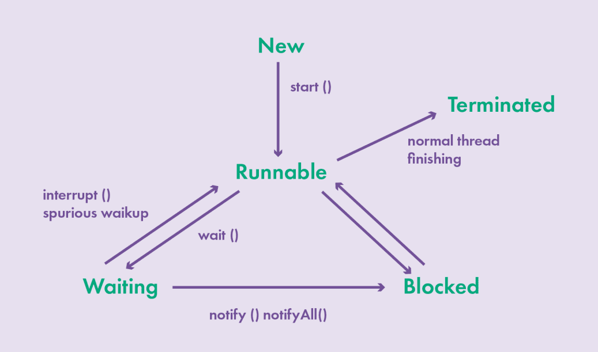

## Урок 5. Многопоточность
- Принципы разработки многотопочтных приложений
- Java memory model
- Процессы и потоки
- Примитивы синхронизации
- Коллекции и многопоточность

### Термины, используемые в лекции
**CPU (central processing unit)** — центральное обрабатывающее устройство, часто просто процессор;

**Многопоточность (Multithreading)** — свойство платформы или приложения, состоящее в том, что процесс, порождённый в операционной системе, может состоять из нескольких потоков, выполняющихся «параллельно», то есть без предписанного порядка во времени. При выполнении некоторых задач такое разделение может достичь более эффективного использования ресурсов вычислительной машины.

**Deadlock** — взаимная блокировка двух потоков

**Race Condition** — состояние гонки, при котором потоки выполняются в неверном порядке

**Volatile** — инструкция, запрещающая копировать переменную в stack процессора

**ThreadLocal** — переменная, уникальная для каждого потока

**UX (user experience)** — восприятие и ответные действия пользователя, возникающие в результате использования продукции, системы или услуги.

## Многопоточность
Для начала давайте дадим определение понятию многопоточного приложения. Любое java приложение состоит из одного процесса и несколько потоков (до этого момента мы с вами писали приложения состоящие только из одного потока).

Давайте определим назначение процесса:
- Каждый процесс состоит данных и кода, который их обрабатывает. Сам процесс создается операционной системой при запуске приложения, что является ресурсоемкой задаче. Также процесс обладает собственным виртуальным адресным пространством.
- Процессы работают независимо друг от друга, т.е. не имеют прямого доступа к данным других процессов.
- Операционная система выделяет ресурсы (память, время выполнения) для процесса.
- Если один из запущенных процессов заблокирован, то ни один другой процесс не может выполняться, пока он не будет снята блокировка.
- Процесс может инициировать создание и контролировать дочерние процессы, но он не может управлять процессами того же уровня.

Таким образом два приложения работающие под управлением одной операционной системы — это два независимых процесса.

Любой процесс состоит из потоков. Потоки (также их можно назвать легковесными процессами) выполняются параллельно друг с другом — они используют адресное пространство процесса, которое делят между собой.

Если говорить о многопоточности, то это одновременное выполнение двух или более потоков, с целью использования центрального процессора (CPU — central processing unit) максимально эффективно. Каждый поток работает параллельно и не требует отдельной области памяти, к тому же, переключение контекста между потоками занимает меньше времени. Многопоточность применяется для следующих целей:
- Эффективное использование одного CPU несколькими потоками: допустим один из запущенных потоков обрабатывает http запрос , в это время другой поток может использовать CPU для выполнения своих задач. Если же у сервера несколько процессоров (или несколько ядер), многопоточность позволяет запускать потоки на отдельных ядрах CPU.
- Оптимальное использование нескольких центральных процессоров (или несколько ядер одного процессора): многопоточность позволяет запускать потоки на отдельных ядрах CPU, чтобы задействовать все процессоры или и ядра - один поток может запускаться максимум на одном CPU.
- Улучшенный UX в плане скорости ответа на запрос: допустим, пользователь нажимает на элемент в графическом интерфейсе (это действие направляет запрос по сети серверу) — вопрос, какой поток выполняет этот запрос. В однопоточном приложении, этот же поток будет отвечать за любой вид взаимодействия пользователя с приложением - это значит, что пока запрос не будет обработан, мы не сможем продолжить взаимодействие с программой. В многопоточном приложении мы можем создать фоновый поток, который будет обрабатывать запрос, в то время как поток отвечающий за интерфейс мог продолжить реагировать на другие действия.
- Улучшенный UX в плане распределения ресурсов: т.е. справедливое распределение ресурсов сервера между пользователями. Представьте web приложение, которое принимает запросы от клиентов, при этом используется один поток для обработки всех запросов. Пока этот поток обрабатывает один из запросов пользователя, остальные будут находиться в очереди, ожидания завершения обработки предыдущего. В многопоточном приложении, ни один из пользовательских запросов, выполняемый собственным потоком, не сможет полностью захватить вычислительные ресурсы процессора.

**Применение многопоточности**
- Эффективное использование одного центрального процессора
- Оптимальное использование нескольких центральных процессоров или их ядер
- Улучшенный user experience в плане скорости ответа на запрос
- Улучшенный user experience в плане справедливости распределения ресурсов

Потоки процесса могут находиться в следующих состояниях:
- New – экземпляр потока создан, но он не запущен.
- Running — экземпляр потока запущен, процессор выделил ресурсы и начинается его выполнение. Во время выполнения потока может перейти в состояние Runnable, Dead или Blocked.
- Suspended — запущенный поток приостанавливает свою работу (выполнение потока можно возобновить) - поток продолжит работать с того места, где его он был остановлен.
- Blocked — поток ожидает высвобождения ресурсов или завершение операции ввода-вывода. Находясь в этом состоянии поток не потребляет процессорное время.
- Terminated — поток немедленно завершает свою работу (выполнение потока нельзя возобновить). Поток может быть завершен, если код потока был выполнен (т.е. поток выполнил свою задачу) или если во время выполнения потока было выброшено необработанное исключение.
- Dead — финальное состояние жизненного цикла потока: после того, как поток завершил свое выполнение, его состояние меняется на dead.

### Создание и запуск потока
Существует два основных способа создания потоков:
- Создать класс и имплементировать интерфейс Runnable. Нам необходимо реализовать единственный метод run при имплиминтации интерфейса Runnable, который должен содержать код, выполняющийся в потоке. Объект Runnable передается конструктору класса Thread. Этот способ считается наиболее гибким и применяется для высокоуровневых API управления потоками.
- Использовать подкласс Thread. Класс Thread сам имплементирует интерфейс Runnable: обратите внимание его метод run не выполняет никакой работы (необходимо переопределить поведение метода в наследнике). Можно объявить подкласс Thread, предоставляя собственную реализацию метода run. Данный способ больше подходит для “простых” приложений.

**implements Runnable**
```java
public static void main (String[] args) {
    //Мы всегда можем получить текущий поток выполнения
    System.out.println(Thread.currentThread().getName());
    Runnable task = new Runnable() {
        public void run() {
            System.out.println(Thread.currentThread).getName();
            System.out.println("Make some work!");
        }
    };
    Thread thread = new Thread(task);
    thread.start();
}
```

**extends Thread**
```java
public static void main (String[] args) {
    //Мы всегда можем получить текущий поток выполнения
    System.out.println(Thread.currentThread().getName());
    ExampleThread exampleThread = new ExampleThread();
    exampleThread.start();
}

public static class ExampleThread extends Thread {
    @Override
    public void run() {
        System.out.println(Thread.currentThread().getName());
        System.out.println( "Make some work");
    }
}
```
Обратите внимание, что новый поток создается только если вызвать метод start, который в свою очередь вызывает метод run - при попытке вызвать метод run напрямую, код выполняется в том же потоке. Так же при запуске JVM, создается главный поток с именем main и еще несколько служебных потоков.

### Остановка потока
Теперь мы умеем создавать и запускать потоки, но как мы можем выбранный поток остановить? Вы можете обратить внимание, что класс Java Thread содержит метод stop() (помечен как deprecated, т.е. не рекомендованный к использованию). Метод stop() не дает гарантий относительно состояния, в котором поток остановили. таким образом, все объекты Java, к которым у потока был доступ во время его выполнения, останутся в неизвестном состоянии (изменения состояния объектов не будут зафиксированы и видны другим потокам), что может привести к ошибкам — например при выполнении потока создается ресурс (например подключение к базе данных), который не будет закрыт и как следствие мы получим утечку памяти.

Вместо deprecated метода stop() вам следует использовать interrupt(). Если метод stop(), принудительно останавливал поток, то interrupt() только предлагает потоку остановить свое выполнение путем установки флага interrupted в true внутри потока решение об остановке принимает сам код потока. Данный флаг отображает статус прерывания (значение по умолчанию false). Если поток прерывается другим потоком то происходит следующее:
- Если поток ожидает выполнения прерываемого метода блокирования (Thread.sleep(), Thread.join() или Object.wait()), то процесс ожидание прерывается и выбрасывает InterruptedException — после этого флаг interrupted устанавливается в значение false.
```java
public static void main (String[] args) {
    Runnable task = () -> {
        try {
            Thread.sleep(10000);
        }
        catch (InterruptedException e) {
            System.out.println("Interrupted");
        }
    }
    Thread thread = new Thread(task);
    thread.start();
    thread.interrupt();
}
```
- Если поток не ожидает выполнения прерываемого метода блокирования, флаг interrupted устанавливается в значение true — теперь код потока должен обработать переменную в реализации метода run
```java
public static void main (String []args) {
    Runnable task = () -> {
        while(!Thread.currentThread().isInterrupted()) {

        }
        System.out.println("Finished");
    };
    Thread thread = new Thread(task);
    thread.start();
    thread.interrupt();
}
```
Также любой поток может остановиться сам — для этого необходимо вызвать static метод Thread.sleep() (самый простой способ взаимодействия с другими потоками). В операционной системе, с установленной JVM, имеется свой планировщик потоков, называемый Thread Scheduler. Данный планировщик принимает решение, какой поток и когда необходимо запускать. Метод Thread.sleep() может принимать в качестве параметра количество миллисекунд — время на которое поток попытается заснуть, возобновлением выполнения — обратите внимание, что абсолютная точность не гарантирована.
```java
public static void main (String[] args) {
    Runnable task = () -> {
        try {
            Thread.currentThread().sleep(10000);
            System.out.println("Waked up");
        } catch (InterruptedException e) {
            e.printStackTrace();
        }
    };
    Thread thread = new Thread(task);
    thread.start();
    System.out.println("you here");
}
```

### Очередность выполнения потоков
Теперь давайте представим, что в рамках решения задачи нам необходимо гарантировать, что поток не начнет свое выполнения пока не будет завершен другой поток. Для этого используется метод join() экземпляра класса Thread — он объединяет начало выполнения одного потока с завершением выполнения другого. Если метод join() вызывается на одном из потоков, то текущий Thread выполняющийся в этот момент блокируется до момента времени, пока поток, для которого вызван метод join не закончит свое выполнение.

Метод join() может (не обязательно) принимать в качестве параметра количество миллисекунд — количество времени ожидания. Если в качестве значения времени ожидания указать 0, то такой поток будет «ждать вечно».
```java
public static void main (String []args) throws InterruptedException {
    Runnable task = () -> {
        try {
            Thread.sleep(10000);
            System.out.println("work done");
        } catch (InterruptedException e) {
            System.out-println("Interrupted");
        }
    };
    Thread thread = new Thread(task);
    thread.start();
    thread.join();
    System.out.println("Finished");
}
```
Также обратите внимание на статический метод Thread.yield(), который заставляет CPU переключиться на обработку других потоков системы. Метод может быть полезным, если, когда поток, для которого вызван метод yield() ожидает наступления события, а проверка наступления происходила как можно чаще.

### Пул потоков
Процесс создания новых потоков и освобождение ресурсов являются дорогостоящей операцией. Мы можем изначально определить необходимое количество потоков, создать их и использовать для решения задач — в java для этого используются пулы потоков и очереди задач, из которых выбираются задачи для потоков. Пул потоков — это по сути контейнер, в котором находятся потоки, и после выполнения одной из задач они самостоятельно переходят к следующей.

Вы можете использовать такой контейнер для контроля создания и управления потоками — это экономит ресурсы связанные с процессом создания новых потоков. Рассмотрим классы и интерфейсы, которые отвечают создание и управление пулом потоков (Executor Framework in Java):
- Интерфейс Executor. Объекты, которые реализуют интерфейс Executor, могут выполнять runnable-задачу (Интерфейс имеет один метод void execute(Runnable command)).
- ExecutorService. Интерфейс ExecutorService наследуется от интерфейса Executor и предоставляет возможности для выполнения заданий Callable.
- Класс Executors. Утилитарный класс Executors создает классы, которые реализуют интерфейсы Executor и ExecutorService.

Теперь давайте посмотрим на основные реализации интерфейсов Executor и ExecutorServcie:
- ThreadPoolExecutor — пул потоков содержит фиксированное количество потоков - количество потоков определяется через конструктор.
- Executors.newCachedThreadPool() - возвращает пул потоков, если количество потоков в пуле не достаточно, то в нем будет создан новый поток.
- Executors.newSingleThreadExecutor() — пул потоков, который гарантирует, что в нем может быть только один поток.
- ScheduledThreadPoolExecutor — пул потоков используется для запуска периодических задач или задач, которые должны запуститься только раз по истечении некоторого промежутка времени.

### Синхронизация
Итак, мы научились создавать и запускать потоки. Теперь давайте обсудим, что происходит когда два и более потока начинают конкурировать за ресурсы (т.е. пытаются в параллели получить доступ к одному и тому же объекту или ресурсу).

При работе потоки нередко обращаются к каким-то общим ресурсам, которые определены вне потока, например, обращение к какому-то файлу или подключение к базе данных. Если одновременно несколько потоков обратятся к такому ресурсу на запись (т.е. с целью изменения состояния), то результаты выполнения программы будут сложно предсказуемыми или это может привести к ошибке выполнения.
```java
static Integer object = Integer. valueof(0);
public static void main (String []args) throws InterruptedException {
    Runnable task = () -> {
        object = object + 1;
        System.out.println(Thread.currentThread().getName());
    }
    Thread thread = new Thread(task);
    thread.start();
    System.out.println(Thread.currentThread().getName());
    object = object + 1;
    System.out.println(object.intValue());
}
```
Попробуйте несколько раз запустить данный код, чтобы убедиться, что последовательность запуска потоков отличается каждый раз.

Самым простым способом синхронизировать потоки (т.е. определить их поведение при работе с общим объектом) — это концепция «монитора» и ключевое слово synchronized (обратите внимание, что у любого наследника класса Object есть свой собственный «монитор» — именно поэтому нельзя синхронизировать примитивные типы). Монитор характеризуется следующей информацией:
- состоянии (locked) — признак, что монитор захвачен потоком;
- владелец (owner) — каким потоком захвачен монитор в текущий момент;
- перечень потоков, которые не смогли захватить монитор (blocked set), так как монитор захвачен другим потоком;
- перечень потоков у которых был вызван метод wait (wait set).

Для синхронизации потоков используется ключевое слово synchronized (обратите внимание, что всегда синхронизируется именно объект — только у него есть монитор). Давайте посмотрим, что происходит, когда поток пытается захватить монитор объекта:
- Поток попадает в синхронизированный блок кода (synchronized блок);
- В синхронизированном объекте проверяются переменные locked и owner монитора.
- Если эти поля false и null, соответственно, они заполняются. Если переменная owner не равна потоку, который хочет захватить монитор, то поток блокируется и попадает в blocked set монитора
- Поток начал выполнять код (соответствует открывающей фигурной скобке synchronized блока)
- Поток завершил выполнение кода (соответствует закрывающейся фигурной скобке блока синхронизации)
- Переменные locked и owner монитора очищаются.

Теперь давайте посмотрим как мы можем синхронизировать соответствующий объект. Во-первых, можно синхронизировать методы самого класса. В этому случае объектом синхронизации является сам объект — this:
```java
// используется монитор объекта this
public synchronized void doSomething() {
    // ... реализация бизнес логики метода
}
```
Во вторых, можно синхронизировать другой объект в целевом классе:
```java
public static void main (String []args) throws InterruptedException {
    Object objectToLock = new Object();

    Runnable task = () -> {
        synchronized (objectToLock) {
            System.out.println(Thread.currentThread().getName());
        }
    }

    Thread thread = new Thread(task);
    thread.start();
    // Если необходимо, чтобы task выполнился раньше используем метод join
    // thread.join();
    synchronized (objectToLock) {
        for (int i = 0; i < 10; i++) {
            Thread.currentThread.sleep(1000);
            System.out.println("step" + i);
        }
        System.out.println(Thread.currentThread().getName());
    }
}
```
В третьих, в случае синхронизации статических методов мы используем монитор самого класса:
```java
public static void doWork() {

    synchronized (MyClass.class) {
        //... Реализация логики
    }
}
```
Примечание. Почему же тогда просто не сделать все методы синхронизированными? Проблема в том, что синхронизация и переключение между потоками ресурсоемкая операция (время выполнения увеличивается и приложение начинает работать медленнее), поэтому использовать данные механизмы нужно осторожно, только там, где между потоками существует конкуренция за ресурсы.

Более того, неверное проектирование многопоточного исполнения программ, может привести к Deadlock. Deadlock (взаимная блокировка потоков) — это ошибка в многопоточном программировании, которая происходит когда несколько потоков имеют циклическую зависимость от пары синхронизированных объектов. Пусть один thread входит в монитор объекта A, а другой — объекта B. Если thread в объекте A пытается вызвать любой синхронизированный метод объекта B, а объект B в то же самое время пытается вызвать любой синхронизированный метод объекта A, то потоки будут заблокированы в процессе ожидания “навечно”.
```java
public static void main (String[] args) {
    ObjectToLock objectToLockOne = new ObjectToLock();
    ObjectToLock objectToLockTwo = new ObjectToLock();
    getThread(objectToLockTwo, objectToLockOne);
    getThread(objectToLockOne, objectToLockTwo);
}

private static void getThread(ObjectToLock objectToLockOne, ObjectToLock objectToLockTwo) {
    new Thread(new Runnable() {
        @Override
        public void run() {
            System.out.println("run:" + Thread.currentThread().getName());
            try {
                Thread.sleep(100);
            } catch (InterruptedException e) {
                e.printStackTrace();
            }
            objectToLockTwo.stepOne(objectToLockOne);
        }
    }).start();
}
    
static class ObjectToLock {
    public synchronized void stepOne(ObjectToLock object) {
        System.out.println("stepOne:" + Thread.currentThread().getName());
        object.stepTwo(this);
    }

    public synchronized void stepTwo(ObjectToLock object) {
        System.out.println("stepTwo:" + Thread.currentThread().getName());
        object.toString();
    }
}
```
И так мы теперь можем создать и запустить поток, а также синхронизировать потоки при использовании общих ресурсов, но в процессе работы приложения, довольно часто могут возникать ситуации, что поток ожидает события, необходимого для продолжения выполения своей работу (например ответ от web сервера на http запрос) — такой поток блокирует работу всего приложения — в этом случае логичным решением является уступить ресурс, другому потоку, который в текущий момент времени может выполнять свои задачи. У класса Object (а значит у всех не примитивных типов), есть следующие методы, которые позволяют управлять переключением потока:
- wait() — После вызова этого метода поток попадает в wait set монитора, сам же монитор освобождается (переменные locked и owner в мониторе очищаются)
- notify() — Для того чтобы потоки, которые находятся в wait set, продолжили свое выполнение, другой поток должен захватить монитор и вызвать методы notify(). После вызова метода notify() из wait set выбирается произвольный поток и переводится в blocked set. После того как этот поток выйдет из synchronized блока, нотифицированные потоки будут по одному захватывать монитор и продолжать выполнение
- notifyAll() — аналогично notify(), но все потоки из wait set переводятся в blocked set
На схеме мы видим переходы потока из одного состояния в другое.

[](./threads.png)

### Java memory model
Без преувеличения многопоточность одна из самых сложных и комплексных тем в программировании. Пока мы познакомились, только с базовыми механизмами создания и управления потоками, но прежде чем перейти к изучению паттернов и механизмов, применяемых в многопоточном программировании, нам необходимо понять, причины не очевидного поведения таких программ. Для этого нам предстоит узнать как Java работает с памятью и как это влияет на многопоточность.

Java Memory Model, JMM или модель памяти Java описывает поведение потоков в среде исполнения Java. Модель памяти — это часть семантики языка Java, которая определяет на что может и на что не должен рассчитывать разработчик при работе с потоками. Разумеется JMM посвящена большая глава в спецификации Java - сегодня мы рассмотрим только основные моменты.

Первое что нам необходимо понять, как Java структурирует выделенную ей для работы память. JVM использует следующие типы памяти:
- Heap – это регион памяти, где хранятся объекты Java. Куча является общей для всех потоков, ее содержимое управляется сборщиком мусора.

Куча содержит все объекты, созданные в вашем приложении, независимо от того, какой поток создал объект (к этому относятся и обертки примитивных типов).
- Stack – это область памяти, где хранятся локальные переменные и стек вызовов методов. Для каждого потока создается отдельный стек в JVM.

Стек содержит все локальные переменные для каждого метода. Соответствующий поток может получить доступ только к своему стеку - локальные переменные (т.е. переменные инициализированные в методе), невидимы для других потоков, кроме потока, который их создал. Представим, что два потока выполняют один и тот же код, т.е. вызвали один и тот же метод, всё равно все локальные переменные, будут созданы своих собственных стеках. Таким образом, каждый поток имеет свою версию локальной переменной соответствующего метода.
- Все локальные переменные примитивных типов (boolean, byte, short, char, int, long, float, double) полностью хранятся в стеке потоков и не видны другим потокам.
- Локальная переменная также может быть ссылкой на объект. В этом случае ссылка (локальная переменная) хранится в стеке потоков, но сам объект хранится в куче.
- Статические переменные класса также хранятся в куче вместе с определением класса.

К объектам в куче могут обращаться любые потоки, имеющие ссылку на соответствующий объект. Когда поток имеет доступ к объекту, он также может получить доступ к переменным-членам этого объекта. Если два потока вызывают метод для одного и того же объекта одновременно, они оба будут иметь доступ к переменным-членам объекта, но каждый поток будет иметь свою собственную копию локальных переменных..
- Method Area – это область памяти, где хранятся информация о классах и методах JVM. Здесь также хранятся константы и статические переменные.
- Program Counter Register – это регистр, который указывает на следующую инструкцию, которую нужно выполнить в текущем потоке.
- Native Method Stack – это стек, используемый для выполнения нативного кода.

Итак мы разобрали, как Java управляет памятью, теперь давайте обсудим, что может произойти, когда объекты и переменные хранятся в различных областях памяти — возникают следующие проблемы:
- Видимость изменений, которые произвел поток над общими переменными.

Пусть два или более потока работают с общим объектом (без использования volatile-объявления или синхронизации), то изменения в этом объекта, сделанные одним из потоком, могут быть невидимы для других.

Представьте: общий объект изначально хранится в Heap. Поток, выполняющийся на CPU, считывает общий объект в кэш этого же CPU. Там он вносит изменения в объект. Пока кэш CPU не был сброшен в основную память, измененная версия общего объекта не видна другим потокам. Таким образом, каждый поток может получить свою собственную копию общего объекта, каждая копия будет находиться в отдельном кэше CPU.
- Состояние гонки при чтении, проверке и записи общих переменных.

Пусть два или более потоков совместно используют один объект и более одного потока одновременно меняют состояние этого объекта (т.е. обновляют переменные), тогда может возникнуть состояние гонки или race condition. По сути это нарушения алгоритма выполнения задач потоками - один поток начинает свое выполнение раньше, чем это необходимо.

Представьте: поток X считывает переменную объекта в кэш своего процессора. Представьте также, что поток Y делает то же самое, но в кэш другого процессора. Теперь поток X прибавляет 1 к значению переменной count, и поток Y делает то же самое. Теперь переменная была увеличена дважды.

Если бы эти операции были выполнены последовательно (как и было задумано), переменная была бы увеличена дважды.

Тем не менее, обе операции были выполнены одновременно без использования синхронизации. Независимо от того, какой из потоков, записывает свою версию переменной в основную память, новое значение будет только на 1 больше исходного.

### Volatile
Ключевое слово volatile указывает, что взаимодействие потоков с этой переменной должно происходить минуя кэш процессора, т. е. напрямую (т.е. запрещено копировать переменную из Heap).

Когда потоки используют переменные (не volatile), они могут копировать значение этих переменных в кэш CPU для улучшения производительности. Если вы используете процессор с несколько ядрами, при этом каждый из потоков выполняется на отдельном ядре, то одна и та же переменная может находиться в разном состоянии на каждом ядре CPU. В результате мы получим несколько копий одной и той же переменной: копии в кэше каждого ядра процессора и копия переменной в Heap. При использовании не volatile переменных нельзя знать наверняка, когда JVM читает значение переменной из главной памяти и когда записывается значение в главную память.

Примечание. Помните, что объявление переменной как volatile достаточно, только когда один поток изменяет переменную, а другой поток читает ее значение - Если два потока одновременно меняют состояние переменной, то volatile уже недостаточно — все равно может быть race condition.

И так ключевое слово volatile гарантирует нам следующее:
- Если поток X пишет в volatile переменную, а затем второй поток Y читает значение, тогда все переменные, видимые потоку X перед записью в переменную volatile, также будут видны потоку Y после того как он прочитал переменную volatile.
- Если поток X читает переменную volatile, то все переменные, видимые потоку X при чтении переменной volatile, также будут перечитаны из основной памяти.

### Атомарные переменные
И так, теперь давайте рассмотрим ситуацию, когда два или более потоков пытаются изменить общий разделяемый ресурс: одновременно выполнять операции чтения и записи. Чтобы избежать состояния гонки, мы можем использовать synchronized-методы, synchronized-блоки (volatile нам в данном случае не подойдет). Без использования механизма синхронизации, результат может быть непредсказуемым, а значение не будет иметь никакого смысла для нашей программы. Но как было уже сказано выше, процесс синхронизации дорогостоящая операция, требующая существенных ресурсов CPU. Также этот способ блокирующий — одновременно выполняется только один поток, что сильно влияет на производительность системы в целом.

Для решения этой проблемы мы можем использовать неблокирующие алгоритмы.. Эти алгоритмы называются compare and swap (CAS) и базируются на том, что современные процессоры поддерживают некоторые операции на уровне машинных инструкций. В Java нам доступны классы атомарных переменных: AtomicInteger AtomicLong, AtomicBoolean, AtomicReference.

Алгоритм compare and swap работает следующим образом: есть ячейка памяти, текущее значение в ней и то значение, которое хотим записать в эту ячейку. Сначала ячейка памяти читается и сохраняется текущее значение, затем прочитанное значение сравнивается с тем, которое уже есть в ячейке памяти, и если значение прочитанное ранее совпадает с текущим, происходит запись нового значения. Следует упомянуть, что значение переменной после чтения может быть изменено другим потоком, потому что CAS не является блокирующей операцией.

### Неизменяемые объекты
И так главная проблема с которой мы сталкиваемся, при работе с несколькими потоками это использование общих ресурсов, которые могут изменить свое состояние (т.е. изменение значений атрибутов объекта) в процессе выполнения. Пожалуй одно из самых эффективных способов решения данной проблемы это использование неизменяемых объектов (механизмы синхронизации просто не нужны). Вы уже встречались с подобными объектами — любая обертка примитивного типа неизменяемый объект. Давайте обсудим принципы, которые позволяют нам проектировать неизменяемые объекты:
- Проверьте отсутствие mutable методов — т.е. классе не должно быть ни одного публичного метода, который могут бы изменить состояние объекта.
- Все поля следует объявить как private final — это гарантирует, что если поле ссылается на примитивный тип оно никогда не измениться, если на ссылочный тип то ссылка не может быть изменена.
- Если метод вашего класса возвращает изменяемый объект, то возвращайте его копию.
- Если при вызове конструктора вы передаете в него изменяемый объект, который должен быть присвоен полю, то создавайте его копию.
- Объявите ваш класс final

### ThreadLocal
Если в рамках реализации задачи, необходимо гарантировать, что каждый поток будет работать со своей уникальной переменной — воспользуйтесь классом ThreadLocal.

Класс ThreadLocal представляет хранилище тред-локальных переменных. По способу использования он похож на обычную обертку над значением, с методами get(), set() и remove() для доступа к нему, и дополнительным фабричным методом ThreadLocal.withInitial(), устанавливающим значение по-умолчанию.

Отличие такой переменной от обычной в том, что ThreadLocal хранит отдельную независимую копию значения для каждого ее использующего потока — соответственно работа с такой переменной потокобезопасна.

Таким образом объект класса ThreadLocal хранит внутри не одно конкретное значение, а хэш-таблицу (поток и соответствующее значение), и при использовании обращается к значению для текущего потока.
```java
private static Integer counter = 0;

public static void main (String []args) throws InterruptedException {
    new Thread(new ThreadTask()).start();
    new Thread(new ThreadTask()).start();
}

public static class ThreadTask implements Runnable {
    ThreadLocal<Integer> threadCounter = new ThreadLocal();
    
    public void run() {
        for (int i=0; i < 10; i++) {
            counter++;
            if (threadCounter.get() != null) {
                threadCounter.set(threadCounter.get() + 1);
            } else {
                threadCounter.set(0);
            }
        }
        System.out.println("Counter: " + counter);
        System.out.println("threadLocalCounter: " + threadCounter.get());
    }
}
```

### Semaphore
Semaphore один из примитивов синхронизации, позволяющий определить N потоков, которым позволено исполнять критическую секцию кода. Когда создается Semaphore, в конструктор передается количество разрешенных потоков (пропуск). Представьте, что вам нужно реализовать приложение для контроля количества свободных мест на парковке - если места на парковке закончились, то остальные машины должны ждать пока место не освободится.

Когда один из потоков попадает в Semaphore - количество допустимых пропусков уменьшается (при освобождении наоборот увеличивается). Вы можете в методе захвата семафора (acquire()) указать, какое количество пропусков возьмет поток, а в методе освобождения (release()) сколько будет возвращено (это количество не может быть больше, чем захваченное количество пропусков).

Если передать в конструктор вторым параметром true, потоки, которые ожидают получение пропуска (хотят войти в критическую секцию), выстраиваются в очередь (вместо blocking set используется очередь по типу FIFO).
```java
private static Integer count = Integer.valueof(0);

public static void main (String[] args) {
    Semaphore sem = new Semaphore(2); // N разрешений
    new Thread(new CountThread(sem)).start();
    new Thread(new CountThread(sem)).start();
    new Thread(new CountThread(sem)).start();
}

static class CountThread implements Runnable {
    Semaphore sem;

    CountThread(Semaphore sem) {
        this.sem = sem;
    }

    public void run () {
        try {
            System.out.println(Thread.currentThread.getName() + " ожидает разрешение");
            sem.acquire(); //получения разрешения у семафора
            for (int i = 1; i < 5; i+) {
                System.out.println(Thread.currentThread().getName() + ": " + count);
                count++;
                Thread.sleep(100);
            }
        }
        catch (InterruptedException e) {
            System.out.println(e getMessage());
        }
        System.out.println(Thread.currentThread().getName() + "освобождение монитора");
        sem.release(); // Освобождение монитора
    }
}
```

### Exchanger
Exchanger — точка синхронизации, позволяющая двум потокам обмениваться значениями. Представьте, что вы реализуете логистическое приложение — в рамках него двум автомобилям нужно пересечься в одной точке для обмена грузами — пока обмен не будет произведен, транспорт не может двинуться дальше по маршруту.

При создании экземпляра Exchanger указывается тип объекта, которым будут обмениваться потоки. Когда поток вызывает метод exchange(), а другой поток не готов к обмену значениями, текущий поток переходит в состояние WAITING. Отметим, что этот класс стоит использовать для обмена значениями между двумя потоками. Не стоит использовать Exchanger для одного потока (также для ситуации когда потоков больше чем 2) — такой поток будет в состоянии WAITING бесконечно долго. Когда поток X подготовил значение, и метод exchange выполняет поток Y, то поток Y после выполнения метода не блокируется. Также у класса есть перегруженный метод exchange, который принимает время, которое поток будет находится в состоянии WAITING — в этом случае если процесс обмена не завершился, то генерируется проверяемое исключение TimeOutException.
```java
public static void main(String[] args) {
    Exchanger‹String> ex = new Exchanger‹String>();
    new Thread(new NewThread(ex, "First message", "First Thread")).start();
    new Thread(new NewThread(ex, "Second message", "Second Thread")).start();
}

static class NewThread implements Runnable {
    Exchanger<String> exchanger;
    String message;
    String name;

    public NewThread(Exchanger<String> exchanger, String message, String name) {
        this.exchanger = exchanger;
        this.message = message;
        this.name = name;
    }

    public void run {
        try {
            message=exchanger.exchange(message);
            System.out.println(name + " has received: " + message);
        } catch(InterruptedException ex){
            System.out.println(ex.getMessage());
        }
    }
}
```

### CowntDownLatch
CowntDownLatch — это счетчик значение которого уменьшается каждый раз, когда поток использует счетчик (поток при этом блокируется). Когда значение счетчика будет равно нулю, все заблокированные потоки будут одновременно запущены. Представьте, что вы реализуете механизм старта начала автогонок — вам нужно гарантировать, что все машины встали у старта прежде чем разрешить движение.
- Для уменьшения числа в счетчике вызывается метод countDown(). После вызова этого метода поток продолжает свое выполнение.
- Метод await() используют для блокировки потока
```java
public static void main (String args[]) throws InterruptedException {
    CountDownLatch latch = new CountDownLatch(3);
    new Car(3000, latch, "CAR-1").start();
    new Car(2000, latch, "CAR-2").start();
    new Car(1000, latch, "CAR-3").start();

    // Ждем три потока
    latch.await();
    System.out.println(Thread.currentThread().getName() +" has finished");
}

static class Car extends Thread {
    private int delay;
    private CountDownLatch latch;

    public Car(int delay, CountDownLatch latch, String name) {
        super(name);
        this.delay = delay;
        this.latch = latch;
    }

    @Override
    public void run() {
        try {
            Thread.sleep(delay);
            latch.countDown();
            System.out.println(Thread.currentThread().getName() + " finished");
        } catch (InterruptedException e) {
            e.printStackTrace();
        }
    }
}
```

### CyclicBarrier
CyclicBarrier работает аналогично CountDownLatch, но есть несколько отличий:
- вместо методов countDown() и await() используется один метод await(), после вызова которого поток блокируется (если число не равно нулю);
- класс CyclicBarrier можно использовать повторно. Как только значение счетчика становится равным нулю, оно восстанавливается, и объект класса можно использовать заново;
- как только значение счетчика стало равным нулю, у вас есть возможность выполнить дополнительный метод имплементирующий интерфейс runnable, который может быть передан в конструктор CyclicBarrier. 

В качестве примера можно привести приложение для паромной переправы — пока паром не будет заполнен машины на 100% он не должен начинать движение.
```java
public static void main(String args[]) throws BrokenBarrierException, InterruptedException {
    CyclicBarrier cyclicBarrier = new CyclicBarrier(3);
    new Car(3000, cyclicBarrier, "CAR-1").start();
    new Car(2000, cyclicBarrier, "CAR-2").start();
    new Car(1000, cyclicBarrier, "CAR-3").start();
    System.out.println(Thread.currentThread().getName() + " has finished");
}

static class Car extends Thread {
    private int delay;
    private CyclicBarrier cyclicBarrier;

    public Car(int delay, CyclicBarrier cyclicBarrier, String name) {
        super(name);
        this.delay = delay;
        this.cyclicBarrier = cyclicBarrier;
    }

    @Override
    public void run(){
        try {
            Thread.sleep(delay);
            cyclicBarrier.await();
            System.out.println(Thread.currentThread().getName() + " finished");
        } catch (InterruptedException | BrokenBarrierException e) {
            e.printStackTrace();
        }
    }
}
```

### ReentrantLock
Теперь предлагаю рассмотреть высокоуровневые механизмы блокировки, как более удобная альтернатива synchronized. Давайте рассмотрим базовый интерфейс Lock:
- void lock() — захват блокировки (если доступна). Если блокировка занята другим потоком, текущий поток, который выполняет этот код, переходит в статус BLOCKED;
- void lockInterruptibly() — аналог lock(), но позволяет прервать блокированный поток и восстановить выполнение через InterruptedException;
- boolean tryLock() — неблокирующий вариант метода lock(). Если удалось получить блокировку, то метод возвращает true;
- boolean tryLock(long timeout, TimeUnit timeUnit) — то же, что tryLock(), за исключением того, что метод ждет определенное время, перед тем остановить попытку получения блокировки;
- void unlock() — отпускает блокировку.
Сегодня мы рассмотрим одну из реализаций интерфейса Lock — ReentrantLock. Он позволяет одному и тому же потоку вызывать метод lock, даже если он его вызывал ранее, без освобождения блокировки.

У класса ReentrantLock, кроме методов интерфейса Lock, есть фабричный метод newCondition(). Этот метод возвращает объект Condition, который позволяет добавить текущий поток в wait set данного объекта Condition. Это дает возможность организовывать разные условия ожидания по одной и той же блокировке, чего не позволяют ключевое слово synchronized и связки методов wait()/notify(). Для того чтоб объект попал в wait set для данного Condition объекта, нужно вызвать метод await(). Чтобы разбудить поток или потоки, которые есть в wait set, необходимо вызвать методы signal() или signalAll(). Эти методы аналогичны методам wait(), notify() и notifyAll() у объекта Object (методы wait(), notify() и notifyAll() в объекте Object — final, методам для объекта Condition придумали другие наименования).
```java
static Integer resource = Integer.valueof(0);

public static void main(String[] args) throws InterruptedException {
    ReentrantLock locker = new ReentrantLock(); // создаем Lock
    for (int i = 0; i < 5; i++){
        Thread thread = new Thread(new LockThread(locker));
        thread.start();
        thread.join();
    }
}

static class LockThread implements Runnable {
    ReentrantLock locker;
    
    LockThread(ReentrantLock locker){
        this.locker = locker;
    }

    public void run(){
        try {
            locker.lock(); // устанавливаем блокировку
            for (int i = 0; i < 5; i++){
                System.out.printf("%s %d \n", Thread.currentThread().getName(), resource.intValue());
                resource++;
                Thread.sleep(100);
            }
        } catch(InterruptedException e) {
            System.out .println(e.getMessage());
        } finally {
            locker.unlock(); // снимаем блокировку
        }
    }
}
```

### Коллекции в многопоточной среде
Обычные коллекции в Java не синхронизированы и не могут быть безопасно использованы в многопоточной среде. За исключением случаев, когда обращение к этим коллекциям происходит из синхронизированных блоков кода.

Синхронизированные коллекции

Первый вариант и самой простой вариант – это превратить обычную коллекцию в синхронизированную, для этого необходимо вызвать соответствующий ее типу метод Collections.synchronized*(). В этом случае будет применен паттерн декоратор к обычной коллекции, который оборачивает каждый метод в synchronized-блок, в результате при каждом чтении или изменении такой коллекции блокируются все остальные операции. Не самый оптимальный вариант для использования.

### Интерфейс List
CopyOnWriteArrayList следует применять, когда в вашем приложении есть множество потоков которые читают элементы из коллекции, и только несколько (относительно небольшое) потоков, которые редко пишут данные в коллекцию — т.е. изменение элементов коллекции происходит не часто (например некий справочник со статусами объектов). В качестве примера использования можно привести задачу с обработкой данных, полученных от некоторого источника (например сигнал GPS датчиков) — каждый поток должен обработать все данные — множество принимающих станций только читают сигнал.

При попытке записи структура Copy on write фактически создает новую копию данных. Это позволяет нескольким потокам одновременно читать данные, и одному потоку записывать элементы в коллекцию в каждый конкретный момент времени.
- Copy on write содержит volatile массив элементов и при каждом изменении коллекции: добавлении, удалении или замене элементов, создается новая локальная копия такого массива для изменений. После модификации измененная копия становится текущей.
- volatile используется используется для того, чтобы все потоки сразу увидели изменения в массиве (значение переменной не копируется в кэш CPU). Такой алгоритм гарантирует, что потоки которые будут читать не изменяющиеся во времени данные, а при параллельном внесении изменений не будет выброшено исключение — ConcurrentModificationException.
- Не вызывайте remove() при использовании Iterator для чтения коллекции — будет сгенерировано UnsupportedOperationException, потому что текущая копия коллекции не подлежит изменению.
- Для операций записи внутри класса CopyOnWriteArrayList создается блокировка, чтобы в конкретный момент времени только один поток мог изменять copy on write структуру данных.

### Интерфейс Set
CopyOnWriteArraySet (с точки зрения реализация это Copy on write коллекция рассмотренная выше) — гарантирует уникальность хранимых значений (мы используем интерфейс Set). CopyOnWriteArraySet реализован с использованием CopyOnWriteArrayList, таким образом их поведение аналогичны - по сути добавляет проверку на уникальность для элементов коллекции

CopyOnWriteArraySet это не упорядоченное множество, и если вам необходимо обеспечить сортировку элементов, то воспользуйтесь коллекцией ConcurrentSkipListSet, которая так же исплиментирует интерфейсы SortedSet и NavigableSet.

Реализация ConcurrentSkipListSet основана на соответствующей коллекции ConcurrentSkipListMap. Каждый элемент структуры (кроме самого значения), содержит ссылку на соседние элементы - аналог LinkedHashMap. В такой коллекции есть ссылки высших порядков, которые указывают на элементы, находящиеся впереди текущего, на произвольное число в определенном диапазоне, заданном для этого уровня ссылок. Для следующего уровня ссылок это число больше, чем для предыдущего.

Скорость поиска элемента обеспечивается за счет использования ссылок высших порядков - эффективность поиска сравнима с поиском элементов по бинарному дереву. Для изменения, вставки не требуется полной блокировки ConcurrentSkipListSet, достаточно найти элемент, который будет изменен, и заблокировать только два соседних элемента (для изменения ссылок), указывающих на элемент, подлежащий изменению.

### Интерфейс Map
Есть несколько реализаций интерфейса Map для использования в многопоточных коллекциях: HashTable, ConcurrentHashMap и ConcurrentSkipListMap.

Такие коллекции, реализующие интерфейс Map позволяют нам решать прикладные задачи, связанные с отображением списков используемых сразу в нескольких потоков. Представьте, что мы реализуем многопользовательское приложение - клиенту проходят процедуру идентификации, аутентификации и авторизуются - наша задача обеспечить хранение Map отображения идентификатора клиента на его сессию (любая сессия может обрабатываться любым потоком).

В первую очередь стоит упомянуть конечно же HashTable - это классическая реализация интерфейса Map, все методы которой синхронизированы - по этой причине она является deprecated и не рекомендована к применению.

Сегодня мы рассмотрим наиболее популярную реализацию - ConcurrentHashMap. ConcurrentHashMap это массив сегментов, каждый из которых представляет собой HashMap с массивом корзин. Мы помним, что каждая корзина или бакет HashMap это связанный список или бинарное дерево.

И так давайте посмотрим, что происходит при работе с ConcurrentHashMap:
- При добавлении значения (пары ключ и значение) блокируется только один из сегментов, а после добавления пары все происходит, как в обычной Map.
- При чтении, сегменты не блокируются - несколько потоков могут читать данные одновременно.
- Параллельное изменение возможно, только при обращении к двум разным сегментам.
- При внесении изменений в один из сегментов, другой поток может читать из него параллельно. При одновременном чтении и модификации данных в результате чтения вернется последнее измененное значение.
- Рехеширование в ConcurrentHashMap происходит по отдельности в каждом сегменте, поэтому оно может выполняться одновременно с записью в другой сегмент.

### Интерфейс Queue
BlockingQueue — мы используем интерфейс потокобезопасных очередей, если несколько потоков должны читать и писать из общей Queue. BlockingQueue способна блокировать поток, который добавляет или читает элементы из очереди — если очередь пуста, а поток пытается получить элемент то он блокируется, до того момента пока в очереди не будет добавлен новый. Также и в обратную сторону, если поток пытается добавить элемент в заполненную очередь, он также блокируется.

В качестве примера можно привести реализацию обычной электронной очереди в любом государственном учреждении — каждой операционист по сути это поток, который приступает к обслуживанию очередного клиента из очереди при освобождении.

BlockingQueue используются, когда одни потоки только добавляют элементы в очередь, а другие только читают — классический паттерн проектирования, применяемый при разработке микро сервисной архитектуры при использовании брокеров сообщений. Если поток добавляет объекты в очередь то его называют producer (Производитель) — добавление нового элемента в очередь возможно до тех пор, пока она не заполнится. Если поток которые читает значение то он consumer (Потребитель) — чтение из очереди возможно только если в ней есть элементы.

BlockingQueue реализует принцип FIFO. Элементы отсортированы по времени нахождения в очереди, а голова находится там дольше всех остальных.

BlockingQueue не поддерживает значение null — при попытке добавление, будет сгенерирован NullPointerException.

### Дополнительная литература
https://habr.com/ru/articles/510454/
https://habr.com/ru/sandbox/167189/
