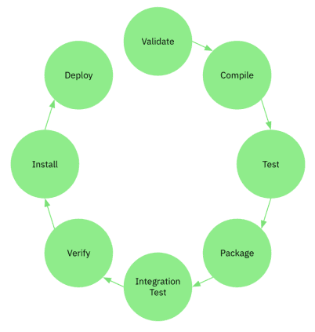

## Урок 6. Управление проектом: сборщики проектов
**План урока:**
- Инициализация проекта
- Знакомство с Apache Maven
- Подключение зависимостей
- Знакомство с Gradle

### Термины, используемые в лекции
- Библиотека — сборник подпрограмм или объектов для разработки программного обеспечения.
- Фреймворк — программная платформа, определяющая структуру программной системы; программное обеспечение, облегчающее разработку и объединение разных компонентов большого программного проекта. В отличие от библиотек, фреймворк в той или иной степени влияет на архитектуру приложения.
- Maven — программное обеспечение для управления и сборки проекта.
- pom.xml — корневой файл конфигурации Maven-проекта.
- Зависимости — библиотеки, которые используются в проекте для компиляции кода или его тестирования.

### Декларативная сборка
**Императивное программирование** — парадигма программирования, для которой характерны следующие черты:
- в исходном коде программы записываются инструкции (команды);
- инструкции должны выполняться последовательно;
- данные, полученные при выполнении предыдущих инструкций, могут читаться из памяти последующими инструкциями;
- данные, полученные при выполнении инструкции, могут записываться в память.

Императивная программа похожа на приказы, выраженные повелительным наклонением в естественных языках. То есть это последовательность команд. Пример императивных языков программирования: C#, C++, Java.

С точки зрения автоматизации сборки приложения императивный подход отвечает на вопрос — “Как получить результат?”, т.е. вы последовательно должны описать все шаги для получения необходимого результата от генерации байт кода и заканчивая развертыванием приложения.

Классическим примером такого подхода является утилита Make или проект Apache Ant. Кстати, стоит отметить, что проект можно создать не используя среду разработки или сторонние механизмы - вы можете использовать утилитами в составе самого JDK.

**Декларативное программирование** — парадигма программирования, в которой задается спецификация решения задачи, то есть описывается конечный результат, а не способ его достижения.

Пример декларативного языка — язык разметки HTML. При написании HTML-тегов мы не задумываемся о том, как элементы будут отображаться на странице, мы просто описываем, как эта страница должна выглядеть.

В отличии от императивной сборки, декларативная отвечает на вопрос - “Что вы хотите в результате?”. Т.е. вместо набора инструкций необходимо указать какой результат вы хотите получить (.jar, .war, .ear и т.д.). В основе этой идеи лежит следующий принцип:

**Соглашение важнее конфигурации** — это принцип проектирования программного обеспечения, цель которого — уменьшить количество лишних действий при создании проекта. Т.е. возможность декларативной сборки достигается, за счет применения всеми разработчиками общих принципов и соглашений. Именно такие механизмы автоматизации сборки приложений, реализующих декларативный подход и мы будем изучать на данном уроке.

### Apache Maven
В первую очередь мы познакомиться сегодня с проектом Apache Maven. В файлах описания проекта содержится его спецификация, а не отдельные команды выполнения. Все задачи по обработке файлов, описанные в спецификации, Maven выполняет посредством их обработки последовательностью встроенных и внешних плагинов.

Важные возможности Maven:
- простая настройка проекта в соответствии с лучшими практиками;
- управление зависимостями, включая автоматическое обновление;
- возможность работать с несколькими проектами одновременно;
- большое хранилище библиотек и метаданных для использования «из коробки» — вы можете использовать уже готовые решения, сконцентрировавшись на разработке тестов;
- расширяемость с возможностью написания своих плагинов;
- создание сайта и PDF с документацией;
- проверка корректности структуры проекта;
- компиляция исходного кода, отображение ошибок/предупреждений;
- тестирование проекта на основе уже написанных тестов;
- упаковка скомпилированного кода в артефакты (например, .jar, .war, .ear, .zip-архивы и многое другое);
- упаковка исходного кода в загружаемые архивы/артефакты;
- установка упакованных артефактов на сервер для последующего развертывания (деплоя) или в репозиторий для распространения;
- создание отчетов по тестированию;
- сообщение об удачной/неудачной сборке проекта.

В Apache Maven принцип “Соглашение важнее конфигурации” проявляется в том, что Maven предоставляет разумные настройки (готовые шаблоны) по умолчанию для управления сборкой проекта. Если они не подходят, разработчик может переопределить их на свои.

Данную идею можно можно сформулировать следующим образом: “если вы видели хотя бы один Java проект то вы видели все Java проекты”.

### Инициализация проекта
Тут стоит сразу обратить внимание, что если вы пользуетесь Intellij IDEA (или другую промышленную IDE), то установка Maven опциональна, так как в среду разработки уже встроены необходимые механизмы. Установка Maven может потребоваться, в случае если использование IDE невозможно, или она осуществляется сторонними приложениями, которые вызывают Maven напрямую. Так же вы сами можете попрактиковаться в работе с Maven с использованием консоли — в этом случае установка обязательна.

Официальная документация: [Installing Apache Maven](https://maven.apache.org/install.html).

Разберем процесс установки Apache Maven для Windows.
1. Скачайте дистрибутив Maven с [официального сайта](https://maven.apache.org/download.cgi).
2. Проверьте системные требования. Мы будем работать с Maven версии 4. Для этой версии нужен не ниже JDK 8.
3. Дистрибутив представляет собой архив, который нужно распаковать. Скачайте Binary zip archive для Windows: [apache-maven-3.9.1-bin.zip](https://dlcdn.apache.org/maven/maven-3/3.9.1/binaries/apache-maven-3.9.1-bin.zip).
4. Распакуйте архив в инсталляционную директорию.
5. Настройте переменные окружения:
    - Откройте «Свойства» компьютера.
    - Нажмите кнопку «Изменить параметры».
    - Перейдите на закладку «Дополнительно» и нажмите кнопку «Переменные среды».
    - Создайте новую переменную в блоке «Системные переменные». Название переменной MAVEN_HOME (рекомендованное), указываем полный путь до распакованного архива.
    - Установите переменную окружения Path: "%MAVEN_HOME%\bin". Переменную нужно будет создать, если ее у вас не было.
6. Перезагрузите компьютер.
7. Проверьте, что установка завершена успешно: откройте командную строку (cmd) и напишите команду mvn -version. На экране должно появиться соответствующее приветствие.

**Глобальные настройки Maven**

После установки Maven на вашу рабочую станцию, вы можете внести изменения в глобальные настройки Maven — они располагаются в файле C:\Users\${UserName}\.m2\setting.xml. setting.xml позволяет изменять параметры взаимодействия вашего локального maven с инфраструктурой репозиториев (хранилище библиотек) — здесь указываются адреса репозиториев, прокси серверы, параметры подключения, данные аутентификации. При работе с общедоступными артефактами через открытые каналы связи (не корпоративная сеть), вносить изменения в setting.xml не требуется.

**Настройка Maven в IDEA**

Так как мы используем IDEA, стоит также обратить внимание, на возможность конфигурации Maven непосредственно в среде разработки. Если вам потребуется изменить параметры Maven в IDEA, перейдите в File/Settings/Maven. Здесь вы можете:
- Указать место расположения setting.xml
- Изменить адрес локального репозитория
- Изменить политику работы с версиями артефактов и механизмов синхронизации репозиториев
- Указать используемую JDK для импорта зависимостей
- Указать используемые репозитории

На текущем этапе, вносить изменения в конфигурацию не требуется.

**Создание проекта**

И так, мы знаем, как установить Apache Maven и как его настроить, теперь давайте создадим свой первый Java проект с использование механизма автоматизации сборки:
- В IDEA выберите команду File/New/Project…
- Выберите проект Maven.
- Укажите SDK — по сути, версию Java. Для демонстрации используется 17-ю версия. Вы можете самостоятельно скачать и установить ее на вашу локальную машину или сделать это через интерфейс IDEA (для этого в выпадающем меню Project SDK есть команда Add JDK и Download JDK — не пугайтесь, что вы можете увидеть несколько вариантов для одной и той же версии — JDK пишуться сразу несколькми вендорами и для наших целей подходит любой).
- Обратите внимание, что есть возможность выбрать архетип (archetype) и на его основе создать проект. Архетип — это уже сконфигурированный проект (добавлены необходимые зависимости и плагины), которым вы можете воспользоваться. Вы можете создать архетип на основе своей конфигурации или импортировать уже готовый. Для нас данный шаг опциональный.
- Укажите:
    - Name — имя вашего проекта, фактически имя папки проекта (используйте латиницу)
    - Location — директорию проекта на локальной машине;
    - GroupId — имя «вашего» вендора (обычно указывается зеркальное имя домена компании разрабатывающее артефакт);
    - ArtifactId — имя проекта;
    - Version — версию проекта.

Примечание. Совокупность значений GroupId, ArtifactId и Version (Далее GAV) однозначно определяет необходимый артефакт (библиотеку или плагин), таким образом этой информации достаточно, чтобы подключить нужную зависимость к своему проекту. При этом нет разницы идет речь о приложении или вспомогательной библиотеки, любой java maven проект характеризуется GAV. И так ваш первый java maven проект создан, теперь можно перейти к конфигурации.

### Структура Maven-проекта
Вся структура проекта Maven описывается в файле pom.xml (POM — Project Object Model). Он должен находиться в корневой папке проекта и называться только pom.xml (декларативный подход).

Ключевое понятие Maven — артефакт — по сути, любая библиотека, хранящаяся в репозитории и характеризующаяся через GAV. Это может быть зависимость или плагин:
- зависимости — это те библиотеки, которые непосредственно используются в проекте для компиляции кода или его тестирования;
- плагины используются самим Maven при сборке проекта или для других целей (установка, архивирование, генерация отчетов и так далее).

Файл pom.xml это в первую очередь .xml-файл. Теперь давайте рассмотрим структуру этого файла конфигурации подробнее и его обязательные и опциональные атрибуты.
```xml
<?xml version="1.0" encoding="UTF-8"?>
<project xmlns="http://maven.apache.org/POM/4.0.0"
    xmlns:xsi="http://ww.w3.org/2001/XMLSchema-instance"
    xsi:schemaLocation="http://maven.apache.org/POM/4.0.0 http://maven.apache.org/xsd/maven-4.0.0.xsd">
    <modelVersion>4.0.0</modelVersion>
</project>
```
- project — Корневой элемент, в котором описана схема, облегчающая редактирование и проверку. Вся конфигурация приложения находится внутри этого тега.
- modelVersion — Версия POM

GAV
```xml
<groupId>org-max</groupId>
<artifactId>auto</artifactId>
<version>1.0-SNAPSHOT</version>
```

**Стратегия работы с версией**

Тут стоит обратить внимание на работу с версией приложения. В принципе вы можете указывать любое значение в этом поле, если не планируете публиковать свое решение в общедоступном репозитории. В случае промышленной разработки стоит задуматься о правилах формирования новой версии (использование мажорной и минорной части и т.д.).

Так же обратите внимание, что в примере используется ключевое слово SNAPSHOT. Дело в том, что алгоритм синхронизации зависимостей в Maven реализован следующем образом:
- Maven использует GAV для однозначного определения необходимой зависимости;
- Maven в первую очередь обращается в локальному репозиторию, для проверки наличия соответствующего .jar файла совпадающего с искомым GAV.
- В случае если объект не найден, Maven обращается к центральному репозиторию и пытается вытянуть зависимость.
- Если зависимость есть в локальном репозитории, Maven не обращается к центральному репозиторию и использует локальный файл.

Из этого алгоритма вытекает следующее правило — если вы ранее опубликовали в общедоступном репозитории свою библиотеку и захотели внести изменения, вы обязательно должны изменить GAV (указать новую версию), иначе, клиенты которые уже успели синхронизировать зависимость со своим локальным репозиторием, об этом никогда не узнают. И вот здесь использование SNAPSHOT в имени версии, позволяет указать Maven о необходимости каждый раз синхронизировать библиотеку с репозиторием. Т.е. состояние кода для проекта не зафиксировано — текущая версия в разработке и результирующий jar-файл может меняться.

**Переменные проекта**
```xml
<properties>
    <maven.compiler.source>17</maven.compiler.source>
    <maven.compiler.target>17</maven.compiler.target>
    <junit.version>5.7.2</junit.version>
    <surefire.version>2.22.2</surefire.version>
</properties>
```
Переменные проекта, используются для указания версий артефактов и переменных конфигураций, которые вы используете в проекте. Данный блок обычно помещается в начале конфигурационного файла и предназначен для управления переменными в одной точке. В случае если вы ссылаетесь на переменную, то необходимо указать ссылку на значение следующим образом ${junit.version}

**Кастомизация информации о проекте**
```xml
<name>Демо проект</name>
<description>Демонстрационный проект</description>
<url>http://demo.max.org</url>
```
В Maven предусмотрено большое количество специальных опциональных тегов для публикации информации о вашем проекте, начиная от имени и описания проекта, заканчивая данными о лицензировании. Стоит подумать о добавлении этих атрибутов, если вы планируете распространять ваше решение.

**Архивирование**
```xml
<packaging>jar</packaging>
```
- Тег \<packaging> определяет, какого типа файл будет создаваться как результат сборки. Возможные варианты — pom, jar, war, ear.
- Это необязательный тег. Значение по умолчанию — jar

**Добавление зависимостей**
```xml
<dependencies>
    <dependency>
        <groupId>org.junit.jupiter</groupId>
        <artifactId>junit-jupiter-engine</artifactId>
        <version>${junit.version}</version>
        <scope>test</scope>
    </dependency>
</dependencies>
```
- Блок \<dependencies> используется для добавления (подключения библиотек) артефактов к вашему проекту.
- Каждая зависимость \<dependency> характеризуется через GAV;
- Тэг \<scope> предназначен для определения области видимости зависимости на этапе сборки, деплоя и запуска приложения

В рамках своей профессиональной деятельности вы чаще всего будете вносить изменения в конфигурацию вашего Maven проекта именно в блок \<dependencies> - подключать новые или удалять уже ненужные зависимости, изменять версии библиотек или область видимости.

Эта функциональная возможность, наверное одна из самых значимых с точки зрения процесса автоматизации сборки приложения. Дело в том, что артефакты не существуют сами по себе, они также ссылаются на другие библиотеки (любой артефакт это такое же Maven приложение, у него есть соответствующий pom и блок с зависимостями, в процессе разработки он использует сторонние библиотеки), которые необходимо будет добавить в ваше решение. Представьте, что вам необходимо подключить новую библиотеку к вашему проекту (вы можете сделать это вручную File/Project Structure/Libraries) - вам нужно будет добавить не одну а все дерево зависимостей (каждая следующая библиотека может требовать подключения еще и еще). Maven берет на себя задачу анализа дерева зависимостей и подключения библиотек.

**Конфликт зависимостей**

Здесь правда стоит отметить еще одно поведение Maven связанное с работой с зависимостями, а именно стратегию разрешения конфликта зависимостей. Добавляя соответствующие зависимости в pom-файлы, вы добавляете не один jar, а все дерево зависимостей, которые связаны с библиотекой (обратите внимание на блок Dependencies, который был сформирован Maven). Вы не будете взаимодействовать с большей частью из них напрямую.

Когда вы добавляете несколько библиотек, которые могут ссылаться на одну и ту же дополнительную зависимость, но разной версии, случается конфликт. Maven должен выбрать и добавить к проекту только одну из них. Это и есть стратегия разрешения конфликтов зависимостей в Maven:
- Всегда выбирается библиотека, которую указал разработчик, — то есть та, которую вы сами прописали в pom-файле. Это решение можно использовать, если Maven добавляет в сборку библиотеку меньшей версии.
- Предпочтение отдается той библиотеке, что ближе к корню (уровень узла дерева).

Иногда при конфликте библиотек нельзя выбрать никакую из версий (выбираем одну версию перестает работать другая библиотека и т.д.). Это самая трудноустранимая проблема — приходится искать альтернативное решение: возможно, придется отказаться от использования какой-либо библиотеки или увеличить версию, что может потребовать изменений в программном коде.

**Область видимости зависимостей**

При добавлении зависимости к проекту, вы можете указать scope для указания области видимости зависимости. По умолчанию используется “Compile”.
- Compile — значение по умолчанию: библиотека используется на всем протяжении жизненного цикла приложения.
- Provided — аналогично compile, но библиотека не добавляется в итоговый jar-файл (сама библиотека может добавляться в classpath сервером приложения).
- Runtime — библиотеки, необходимые только во время работы приложения. Не используются при компиляции (например, драйверы JDBC).
- Test — библиотеки, которые используются только на этапе компиляции тестовых классов и запусков тестов.
```xml
<build>
    <plugins>
        <plugin>
            <groupId>org.apache-maven.plugins</groupId>
            <artifactId>maven-compiler-plugin</artifactId>
            <configuration>
                <source>17</source>
                <target>17</target>
            </configuration>
        </plugin>
        <plugin>
            <groupId>org.apache.maven.plugins</groupId>
            <artifactId>maven-surefire-plugin</artifactId>
            <version>${surefire.version}</version>
        </plugin>
    </plugins>
</build>
```
Блок предназначен для конфигурации и подключения новых плагинов используемых в процессе сборки. В данном примере было добавлено два плагина:
- maven-compiler-plugin — используется для компиляции java классов
- maven-surefire-plugin — используется для запуска тестов

**Блок \<reporting>**

Так же предназначен для подключения плагинов, не связанных непосредственно со сборкой (генерация javadoc, проверка стилей вашего исходного кода, отчеты и т.д.)

**Репозитории**

Самые частые изменения, которые вы будете вносить в pom.xml, — добавление новых зависимостей или изменения версий используемых библиотек. Сами библиотеки хранятся и публикуются в репозиториях.

Виды репозиториев:
- Локальный — место для хранения и обновления файлов проекта. Директория на компьютере разработчика, в которой Maven хранит все jar-файлы отдельного проекта, библиотеки и необходимые модули (зависимости). Сюда копируются все библиотеки из других типов репозиториев. Ваш локальный репозиторий по умолчанию располагается по адресу C:\Users\${UserName}\.m2\repository, где UserName — имя вашей учетной записи.
- Центральный — общее онлайн-хранилище. Здесь находятся все библиотеки, плагины и модули, созданные разработчиками сообщества Maven. Если во время сборки проекта система не находит нужную библиотеку (зависимость) в локальном репозитории разработчика, она автоматически обращается в центральный репозиторий Maven. Адрес центрального репозитория указывается в setting.xml.
- Удаленный — вы можете указать дополнительные репозитории в своем файле pom.xml (\<repositores>), где Maven также будет искать зависимости. Обычно удаленные репозитории предназначены для хранения коммерческих библиотек (внутренняя разработка) или используются для предоставления доступа только к разрешенным библиотекам (требования информационной безопасности).
```xml
<repositories>
    <repository>
        <id>mvnrepository</id>
        <url>https://mvnrepository.com/</url>
    </repository>
</repositories>
```
Несколько рекомендаций по работе с зависимостями. Представьте, что вам понадобилась новая функциональность (новая библиотека). Например, вы хотите найти и добавить инструмент для тестирования JUnit. При поиске помните о принципах:
- Выбирайте артефакты известных вендоров — помните, что одну и ту же задачу можно решить с помощью разных библиотек, но лучше использовать проверенные источники от крупных разработчиков.
- Выбирайте артефакты, для которых выпускаются обновления — если у библиотеки много версий, значит ее поддерживают, обновляют и исправляют ошибки.
- Не останавливайтесь на первом ответе — проанализируйте несколько статей, помните, что в интернете есть как хорошие, так и плохие ответы.
- Некоторые фреймворки, которые вы будете использовать, уже содержат необходимый пул библиотек (Spring Framework).

### Жизненный цикл Maven
Maven предоставляет пользователю три жизненных цикла. Подразумевается, что для выполнения определенного этапа все предыдущие должны успешно запуститься и завершиться. То есть предыдущие этапы нельзя пропускать.
- Clean используется для удаления ранее скомпилированных файлов (папка target проекта).
- Site используется для генерации документации.
- Default – основной или жизненный цикл по умолчанию. Отвечает за создание приложения.

Clean и site — вспомогательные жизненные циклы. Каждый из них состоит из одного одноименного этапа.

Default рассмотрим подробнее:
- validate — проверка структуры pom.xml;
- compile — компиляция исходного кода проекта и исходного кода тестов;
- test — запуск тестовых классов;
- package — упаковка проекта (по умолчанию — jar);
- verify — запуск интеграционных тестов;
- install — копирование jar (war, ear) в локальный репозиторий;
- deploy — публикация файла в удаленный (внешний) репозиторий.

[](./maven_life.png)

На практике мы чаще всего будем пользоваться командой mvn clean test для запуска тестов или mvn clean package для сборки проекта в jar файл.

Как команды понимают, что нужно делать при обращении к ним? Для этого используются plugins — фактически такие же зависимости, в которых реализована нужная бизнес-логика. В Maven они расположены на соответствующей вкладке — сейчас там только плагины по умолчанию, но список можно изменить, внеся изменения в pom-файл. На этом этапе нам достаточно плагинов по умолчанию.

Каждая команда связана с соответствующим плагином или несколькими плагинам, запускаемыми последовательно, через goal — по сути, функции плагина, которую мы можем вызвать. Плагин может состоять из нескольких goal, предназначенных для разных целей. Таким образом, вызывая команду, вы на самом деле обращаетесь к набору goal соответствующих плагинов.

### Gradle
И так мы познакомились с вами с Apache Maven, как примером декларативного подхода к сборки проекта, а сейчас мы поговорим о не менее популярном решении Gradle. Для начало давайте определим преимущества Gradle:
- Не только декларативный стиль. В Gradle есть возможность реализовывать собственные команды, что добавляет ему черты императивной сборки. В отличии от Maven для конфигурации используется не .xml файл с жесткой структурой тегов, а файл конфигурации позволяющий в том числе писать скрипты на языке Groove и Kotlin.
- Не только java. В отличии от Maven, Gradle позволяет работать и с другими языками программирования и технологиями.
- Постоянно развивается. Gradle относительно молодой проект и в него добавляются все новые и новые функции.
- Быстрее. Для этого существует так называем Gradle Demon - долгоживущий фоновый процесс, который запускается на выбранной JVM при первой сборке. Он помогает избежать затратного процесса начальной загрузки JVM, при этом кешируя данные о ваших предыдущих билдах в память, что заметно ускоряет скорость сборки проекта.

Главное, что вам нужно помнить, что Gradle разрабатывался как идейный наследник Apache Maven. С точки зрения управления чистым java проектом в них нет практически никакой разницы - все что было верно для Maven с высокой долей вероятности верно и для Gradle. Поэтому когда далее будем говорить о Gradle мы пройдем тот же путь останавливаясь на отличиях этих двух технологий.

### Инициализация проекта
**Установка Gradle**

Установка Gradle опциональна, так как в среду разработки уже встроены необходимые механизмы.

Официальная документация: [Installing Gradle](https://gradle.org/install/).

Разберем процесс установки Gradle для Windows.
1. Скачайте дистрибутив Gradle с [официального сайта](https://gradle.org/releases/).
2. Дистрибутив представляет собой архив, который нужно распаковать. Скачайте zip archive для Windows: [gradle-8.2-all.zip](https://gradle.org/next-steps/?version=8.2&format=all).
3. Распакуйте архив в инсталляционную директорию C:\Gradle.
4. Настройте переменные окружения:
    - Откройте «Свойства» компьютера.
    - Нажмите кнопку «Изменить параметры».
    - Перейдите на закладку «Дополнительно» и нажмите кнопку «Переменные среды».
    - Создайте новую переменную в блоке «Системные переменные». Название переменной GRADLE_HOME (рекомендованное), указываем полный путь до распакованного архива.
    - Установите переменную окружения Path: "%GRADLE_HOME%\bin". Переменную нужно будет создать, если ее у вас не было.
5. Перезагрузите компьютер.
6. Проверьте, что установка завершена успешно: откройте командную строку (cmd) и напишите команду gradle -v. На экране должно появиться соответствующее приветствие.

**Настройка Gradle в IDEA**

Если вам потребуется изменить параметры Gradle в IDEA, перейдите в File/Settings/Gradle.

**Создание проекта**

И так, мы знаем, как установить Apache Maven и как его настроить, теперь давайте создадим свой первый Java проект с использование механизма автоматизации сборки:
- В IDEA выберите команду File/New/Project…
- Выберите проект Gradle.
- Укажите SDK — по сути, версию Java. Для демонстрации используется 17-ю версия. Вы можете самостоятельно скачать и установить ее на вашу локальную машину или сделать это через интерфейс IDEA (для этого в выпадающем меню Project SDK есть команда Add JDK и Download JDK - не пугайтесь, что вы можете увидеть несколько вариантов для одной и той же версии - JDK пишуться сразу несколькми вендорами и для наших целей подходит любой).
- Обратите внимание, что мы должны выбрать тип проекта, в нашем случае это разумеется Java.
- Укажите:
    - Name - имя вашего проекта, фактически имя папки проекта (используйте латиницу)
    - Location — директорию проекта на локальной машине;
    - GroupId — имя «вашего» вендора (обычно указывается зеркальное имя домена компании разрабатывающее артефакт);
    - ArtifactId — имя проекта;
    - Version — версию проекта.

И так ваш первый java gradle проект создан. Теперь мы можем перейти к конфигурации.

### Структура Gradle проекта
В отличии от Maven (конфигурация состоит из одного pom.xml файл), конфигурация Gradle гораздо сложнее (обратите внимание, что при инициализации проекта было сгенерировано несколько служебных папок и файлов). В первую очередь нас будут интересовать следующие файлы:
1. settings.gradle — содержит настройки проекта.

Данный файл обязателен, только если вы работаете с многомодульным проектом — содержит глобальные настройки нашего проекта, в том числе подключаемые модули (первый конфигурационный файл, который Gradle пытается обнаружить при запуске)

2. build.gradle — конфигурация gradle модуля;

Файл с конфигурацией модуля gradle проекта. Определяет всю логику сборки данного модуля (что собираем, как собираем). Может быть написан на groovy (имя build.gradle) либо на kotlin (имя build.gradle.kts.)

3. gradle.properties — содержит переменные (ключ + значение).

Опциональный файл и по умолчанию не создается. Этот файл используется для настройки процесса Java, которые будет использоваться для выполнения сборки. Использование данного файла позволяет сохранять определенные настройки в системе управления версиями, чтобы вся команда могла работать в согласованной среде. Кроме того, его можно использовать для конфигурации самого проекта.

Gradle можно охарактеризовать двумя концепциями: проекты и задачи. Эти концепции объясняются следующим:
- Проект (Project) – это то, что мы создаем (например, файл JAR) или делаем (разворачиваем наше приложение в производственной среде). Проект состоит из одной или нескольких задач.
- Задача (Task) – это атомарная работа, выполняемая нашей сборкой (например, компиляция нашего проекта или выполнение тестов).

Каждая сборка Gradle состоит из одного или нескольких проектов. То, что представляет собой проект, зависит от того, какой результат вы хотите получить. Например, проект может представлять JAR-файл библиотеки или веб-приложение (WAR-файл). Он может представлять собой ZIP-файл дистрибутива, собранный из JAR-файлов, созданных другими проектами. Проект не обязательно является чем то что нужно собрать: это может быть и набор команд, определяющих то что нужно сделать, например, развертывание вашего приложения в тестовой или промышленной среде.

Действия, которые выполняет Gradle над проектом, определяются одной или несколькими задачами. Задача представляет собой некую атомарную часть процесса сборки. Это может быть компиляция некоторых классов, создание JAR-файла, создание Javadoc или публикация архивов в репозитории.

Для запуска задач применяются плагины и их не нужно определять самостоятельно.

**Процесс сборки проекта на Gradle**

В отличие от Maven в Gradle отсутствуют жестко фиксированные жизненные циклы, но в общем случае процесс автоматизации сборки можно определить следующим образом:
- Gradle запускается как новый процесс JVM;
- Gradle анализирует файл gradle.properties и соответствующим образом настраивает процесс.
- Создается экземпляр Settings для сборки.
- Сравнивается файл settings.gradle с объектом Settings.
- Создается иерархия Projects на основе настроенного объекта Settings.
- Gradle выполняет каждый файл build.gradle для своего проекта.

**Плагины**

```js
plugins {
    id 'java'
    id 'application'
}
```
- ‘java’ - плагин java приложения
- ‘application’ — плагин консольного приложения

Философия дизайна Gradle заключается в том, что все полезные функции предоставляются плагинами Gradle, которые необходимы для:
- Добавление новых Task в Project.
- Предоставление конфигурации по умолчанию для добавленных Task. Конфигурация по умолчанию добавляет новые соглашения к проекту (например, расположение файлов исходного кода).
- Добавление новых свойств, которые используются для переопределения конфигурации плагина по умолчанию.
- Добавление новых зависимостей в проект.

**Репозитории**
```js
repositories {
    mavenCentral()
}
```
Gradle использует те же механизмы для работы с репозиториями, что и Maven — таким образом вы можете работать с теми же источники артефактами, что и ранее при работе с Apache Maven.

Тут стоит отметить отличие Gradle при синхронизации репозиториев. Gradle при анализе зависимостей вычисляется хэш сумма — поэтому даже если, изменения будут внесены в старую версию библиотеки (что в принципе некорректно), Gradle подтянет библиотеку.

**Зависимости**

Одной из главных задач любой системы автоматизации сборки – это управление зависимостями, то есть определение перечня артефактов, которые необходимы для реализации проекта. Система сборки должна обеспечить их наличие в нужный момент и нужным образом собрать конечный артефакт нашего приложения.
```js
dependencies {
    testImplementation 'org.junit.jupiter:junit-jupiter-api:5.7.0'
    testRuntimeOnly 'org.junit.jupiter:junit-jupiter-engine:5.7.0'
}
```
Думаю вы с легкостью определите GAV на данном скриншоте. Также вы могли обратить внимание на команды testImplementation и testRuntimeOnly — это прямой аналог Scope Maven, определяющий область использования библиотеки.

### Дополнительная информация
1. [Apache Maven — основы / Хабр](https://habr.com/ru/articles/77382/)
2. [Getting Started | Building Java Projects with Maven](https://spring.io/guides/gs/maven/) (en)
3. [Сборка Java-проекта с использованием Maven | Spring по-русски!](http://spring-projects.ru/guides/maven/)

**Используемая литература**

1. [Maven Documentation](https://maven.apache.org/guides/) (en) — официальная документация
2. https://docs.gradle.org/current/userguide/userguide.html (en) — официальная документация