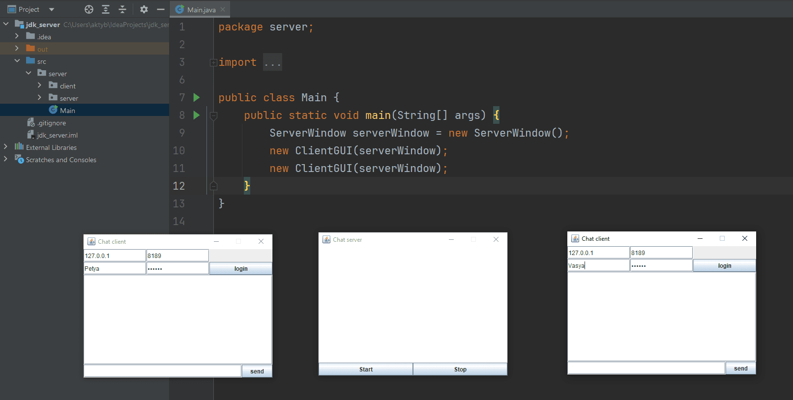
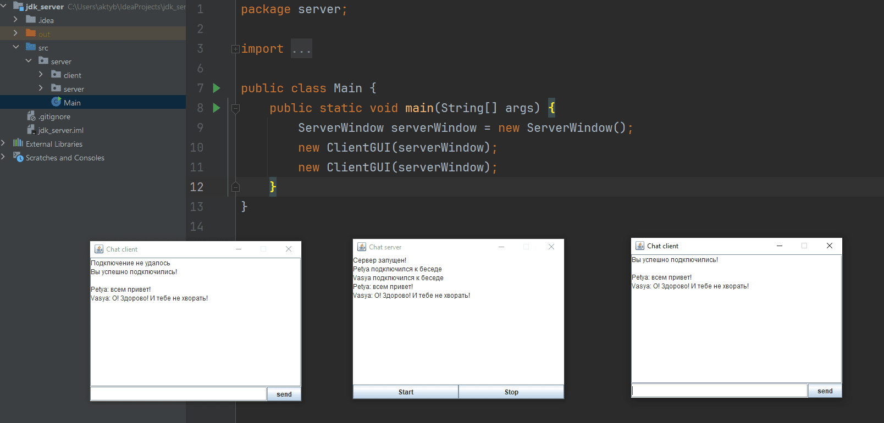

## **ТЗ**
1. Реализовать клиент-серверное приложение. Начало его можно увидеть в презентации к первому уроку, а можно ориентироваться на скриншоты. Результат можно увидеть на скриншотах, которые также можно найти в материалах к уроку
2. Клиентское приложение должно отправлять сообщения из текстового поля сообщения в серверное приложение по нажатию кнопки или по нажатию клавиши Enter на поле ввода сообщения;
3. Продублировать импровизированный лог (историю) чата в файле;
4. При запуске клиента чата заполнять поле истории из файла, если он существует. Обратите внимание, что чаще всего история сообщений хранится на сервере и заполнение истории чата лучше делать при соединении с сервером, а не при открытии окна клиента.

### **Используемые ресурсы**
- [Иконки](https://icons8.ru/)
- [Base64 to img](https://base64.guru/converter/encode/image)