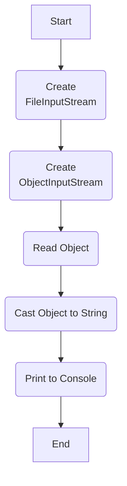
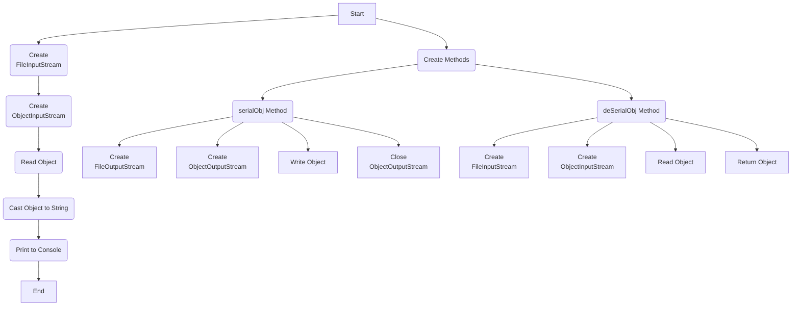

## Урок 3. Сериализация
Сериализация представляет собой механизм, который позволяет сохранять и загружать из файлов не только простой текст, но и готовые, инициализированные объекты. Мы встречаемся с этим процессом часто, например, при возвращении к сохраненным прохождениям игр или при сохранении таблиц Excel. Для сериализации объекта достаточно выполнить несколько шагов:
- Создание потока записи байт в файл.
- Создание потока записи объекта в файл.
- Запись объекта.
- Закрытие потоков

Представьте, что у вас есть любимый сериал, где каждая серия - это объект в программировании с персонажами, событиями и местами. Сериализация в Java подобна сохранению этого сериала на флеш-накопитель: вы сохраняете объекты для дальнейшего использования, подобно тому, как сохраняете серии на флешке.

Процесс сериализации важен для передачи объектов между приложениями и для сохранения их состояния. Теперь давайте погрузимся в мир сериализации и рассмотрим ключевые аспекты этой технологии.

Итак, если все просто, давайте попробуем сериализовать что-то! Рассмотрим пример:
```java
FileOutputStream fileOutputStream = new FileOutputStream("serialized_object");
ObjectOutputStream objectOutputStream = new ObjectOutputStream(fileOutputStream);
objectOutputStream.writeObject(someObject);
objectOutputStream.close();
```
В этом примере мы создаем поток записи байт в файл, поток записи объекта и выполняем запись объекта. После этого мы закрываем потоки. Этот процесс подобен сохранению серий на флешке, где мы создаём папку, помещаем в нее серии и закрываем флешку.
```java
String str = "Hello, everyone!";
FileOutputStream fileOutputStream = new FileOutputStream("serialized_object");
ObjectOutputStream objectOutputStream = new ObjectOutputStream(fileOutputStream);
objectOutputStream.writeObject(str);
objectOutputStream.close();
```
В этом примере мы создаем строку и сохраняем ее в файл, применяя тот же процесс сериализации. После записи мы освобождаем ресурсы, чтобы файл был читаемым. В результате получается бинарный файл, который содержит сериализованный объект.

Теперь, если даже десериализация не кажется сложной, давайте рассмотрим ее на примере:
```java
FileInputStream fileInputStream = new FileInputStream("serialized_object");
ObjectInputStream objectInputStream = new ObjectInputStream(fileInputStream);
String loadedString = (String) objectInputStream.readObject();
objectInputStream.close();
```
В этом примере мы создаем поток чтения байт из файла, поток чтения объекта и выполняем чтение объекта. Десериализация подобна извлечению данных с флешки, где мы открываем папку, читаем серии и закрываем флешку. Таким образом, сериализация и десериализация - это важные аспекты работы с объектами в Java, позволяющие эффективно сохранять и восстанавливать состояние объектов.



Пример
```java
FileInputStream fileInputStream = new FileInputStream("ser");
ObjectInputStream objectInputStream = new ObjectInputStream(fileInputStream);
String s = (String) objectInputStream.readObject();
System.out.println(s);
```
Здесь всё происходит наоборот! Сначала мы создаем поток для побайтного чтения из файла, затем формируем поток для побайтной загрузки объекта из указанного файла, и только после этого мы загружаем объект. Стоит отметить, что мы загружаем именно объект типа Object, и мы сами выполняем его приведение к нужному типу, например, String, прежде чем вывести его в консоль.

Теперь давайте усложним наш объект! Но прежде чем приступить, давайте создадим несколько методов для упрощения последующих шагов.



Пример
```java
public static void serialObj(Object o, String file) throws IOException {
    FileOutputStream fileOutputStream = new FileOutputStream(file);
    ObjectOutputStream objectOutputStream = new ObjectOutputStream(fileOutputStream);
    objectOutputStream.writeObject(o);
    objectOutputStream.close();
}

public static Object deSerialObj(String file) throws IOException, ClassNotFoundException {
    FileInputStream fileInputStream = new FileInputStream(file);
    ObjectInputStream objectInputStream = new ObjectInputStream(fileInputStream);
    return objectInputStream.readObject();
}
```

Это два метода для выполнения сериализации и десериализации. Новшество заключается в обработке исключений. Ранее не уточнялось, но операции чтения или записи в файл могут вызвать исключения по разным причинам. На данном этапе мы не будем глубоко обсуждать эти исключения, однако важно помнить, что подобные ситуации могут возникнуть. Давайте перейдем к усложнению объекта!
```java
ArrayList<String> list = new ArrayList<>();
for (int i = 0; i < 10; i++) {
    list.add(Character.getName(i));
}
serialObj(list, "ser");
```
В данном случае мы создали список с элементами типа String, заполнили его строковыми названиями букв (используя метод класса Character) и затем провели сериализацию. Давайте посмотрим, что теперь записано в файле.
```text
¬н sr java.util.ArrayListxЃТ™Зaќ I sizexp
w
t NULLt START OF HEADINGt
START OF TEXTt
END OF TEXTt END OF TRANSMISSIONt ENQUIRYt
ACKNOWLEDGEt BELt BACKSPACEt CHARACTER TABULATIONx
```
Что ж, текст изменился, и сейчас он более соответствует вашим ожиданиям! Теперь приступим к его десериализации.
```java
ArrayList<String> list = null;
list = (ArrayList<String>) deSerialObj("ser");
System.out.println(list);
```
В данном примере процесс кажется более простым: мы всего лишь десериализовали заранее подготовленный объект и вывели его содержимое в консоль.
```text
[NULL, START OF HEADING, START OF TEXT, END OF TEXT, END OF TRANSMISSION, ENQUIRY, ACKNOWLEDGE, BEL, BACKSPACE, CHARACTER TABULATION]
```
Вот что отобразилось в консоли - практически идентично оригинальному объекту. На текущем этапе всё выглядит довольно просто. Следовательно, переходим к следующему этапу и пробуем сериализовать собственный класс! Начнем с создания этого класса.
```java
class MyFCs {
    public String lName;
    public String fName;
    public String patronymic;

    public MyFCs(String fName, String lName, String patronymic) {
        this.lName = lName;
        this.fName = fName;
        this.patronymic = patronymic;
    }

    @Override
    public String toString() {
        return String.format("%s %s.%s ",
            fName,
            lName.toUpperCase().charAt(0),
            patronymic.toUpperCase().charAt(0));
    }
}
```
Это обычный класс на языке Java с ФИО, конструктором и переопределенным методом toString(). Давайте попробуем выполнить процессы сериализации и десериализации для объекта, созданного на основе этого нового класса.
```java
MyFCs myFCs = new MyFCs("Ivanov", "Ivan", "Ivanovich");
serialObj(myFCs, "ser");
```
Создали экземпляр класса MyFCs и вызвали метод сериализации
```text
Exception in thread "main" java.io.NotSerializableException: MyFCs
    at java.base/java.io.ObjectOutputStream.writeObject0(ObjectOutputStream.java:1198)
    at java.base/java.io.ObjectOutputStream.writeObject(ObjectOutputStream.java:358)
    at Main.serialObj(Main.java:29)
    at Main.main(Main.java:20)
```
Вот оно, первое исключение - нечто, что добавляет немного острых ощущений в наше программирование! И вот в чем дело: Java выдаёт нам NotSerializableException, подсказывая, что объект, который мы пытаемся сериализовать, не подходит для этой задачи. Это происходит потому, что он не реализует интерфейс сериализации. Возможно, это было лучше сделать с самого начала, но здесь мы сталкиваемся с исключением, что придает немного изюминки нашему коду!

Любой класс, который мы хотим сериализовать, должен реализовывать интерфейс Serializable. И вот интересный момент: для этого интерфейса не нужно реализовывать ни одного метода. Он всего лишь сообщает системе, что класс может быть сериализован. Давайте быстро добавим этот интерфейс в наш класс!
```java
class MyFCs implements Serializable{
    public String lName;
    public String fName;
    public String patronymic;

    public MyFCs(String fName, String lName, String patronymic) {
        this.lName = lName;
        this.fName = fName;
        this.patronymic = patronymic;
    }

    @Override
    public String toString() {
        return String.format("%s %s.%s ",
            fName,
            lName.toUpperCase().charAt(0),
            patronymic.toUpperCase().charAt(0));
    }
}
```
Вот что лежит в нашем файле:
```text
¬н sr MyFCs&†МѕѕрС L fNamet Ljava/lang/String;L lNameq ~ L
patronymicq ~ xpt Ivanovt Ivant Ivanovich
```
Тут есть и название класса и внутренние типы, ну и сами данные! Теперь проверим десериализацию.
```java
MyFCs myFCs = (MyFCs) deSerialObj("ser");
System.out.println(myFCs);
```
Теперь всё заработало, нет никаких исключений, и в консоли гордо написано. Ivanov I.I. Теперь давайте сделаем поля данных приватными!
```java
class MyFCs implements Serializable{
    private String lName;
    private String fName;
    private String patronymic;

    public MyFCs(String fName, String lName, String patronymic) {
        this.lName = lName;
        this.fName = fName;
        this.patronymic = patronymic;
    }

    @Override
    public String toString() {
        return String.format("%s %s.%s ",
            fName,
            lName.toUpperCase().charAt(0),
            patronymic.toUpperCase().charAt(0));
    }
}
```
Снова пробуем десериализацию!
```text
Exception in thread "main" java.io.InvalidClassException: MyFCs; local class incompatible: stream
classdesc serialVersionUID = 2776131339925385425, local class serialVersionUID =
-7063247849619523952
    at java.base/java.io.ObjectStreamClass.initNonProxy(ObjectStreamClass.java:597)
    at java.base/java.io.ObjectInputStream.readNonProxyDesc(ObjectInputStream.java:2076)
    at java.base/java.io.ObjectInputStream.readClassDesc(ObjectInputStream.java:1925)
    at java.base/java.io.ObjectInputStream.readOrdinaryObject(ObjectInputStream.java:2248)
    at java.base/java.io.ObjectInputStream.readObject0(ObjectInputStream.java:1760)
    at java.base/java.io.ObjectInputStream.readObject(ObjectInputStream.java:538)
    at java.base/java.io.ObjectInputStream.readObject(ObjectInputStream.java:496)
    at Main.deSerialObj(Main.java:35)
    at Main.main(Main.java:21)
```
И вот опять исключение! Но справиться с этим легко. Сохранённые данные и описание класса в программе не совместимы по версии! При сериализации и десериализации предполагается, что сохранённые данные соответствуют описанию класса. В противном случае правильно восстановить объект не получится. В языке Java для проверки этого введена специальная переменная serialVersionUID. Если вы не объявили её, то Java подсчитает её автоматически, учитывая типы и модификаторы видимости полей данных, а также сигнатуры методов исходного класса. Это сделано для предотвращения несовместимости данных и класса и обеспечения корректной работы с исключениями. Впрочем, вы можете добавить строчку кода (см пример ниже) с произвольным значением переменной serialVersionUID и изменять его при необходимости!
```java
private static final long serialVersionUID = 1L;
```
В данном случае мы изменили модификаторы видимости полей данных. Давайте снова проведём сериализацию и десериализацию нашего объекта, как в примерах выше. Всё прошло успешно, и в консоли торжественно высветилось "Ivanov I.I."! Однако теперь у вас, возможно, возник вопрос: как сериализация взаимодействует с приватными полями? Давайте вместо ответа рассмотрим более серьезный пример.
```java
class MyFCs implements Serializable{
    private static final long serialVersionUID = 1L;
    private static String lName;
    private final String fName;
    private String patronymic;

    public MyFCs(String fName, String lName, String patronymic) {
        this.lName = lName;
        this.fName = fName;
        this.patronymic = patronymic;
    }

    @Override
    public String toString() {
        return String.format("%s %s.%s.",
        fName,
        lName.toUpperCase().charAt(0),
        patronymic.toUpperCase().charAt(0));
    }
}
```
Приватные поля мы перевели в статические и финализированные. После запуска проекта в консоли гордо появилось "Ivanov I.I." На самом деле, для нас несущественно, как объявлено поле. При десериализации объекта мы выделяем необходимый объем памяти и, используя рефлексию, заполняем поля нужными данными, даже не прибегая к вызову конструктора! Больше забот могут вызвать аспекты наследования. Рассмотрим создание нового класса.
```java
class Dob{
    int day;
    int month;
    int year;
    public Dob(int day, int month, int year) {
        this.day = day;
        this.month = month;
        this.year = year;
    }
}
```
Ну и используем его в нашем, уже созданном классе.
```java
class MyFCs implements Serializable{
    private static final long serialVersionUID = 1L;
    private static String lName;
    private final String fName;
    private String patronymic;
    private Dob dob;

    public MyFCs(String fName, String lName, String patronymic) {
        this.lName = lName;
        this.fName = fName;
        this.patronymic = patronymic;
        this.dob = new Dob(01, 02, 03);
    }

    @Override
    public String toString() {
        return String.format("%s %s.%s. %s",
        fName, lName.toUpperCase().charAt(0),
        patronymic.toUpperCase().charAt(0),
        dob.day+"/"+dob.month+"/"+dob.year);
    }
}
```
Мы добавили дату рождения, и можем пробовать обновлённый код в деле!
```text
Exception in thread "main" java.io.NotSerializableException: Dob
    at java.base/java.io.ObjectOutputStream.writeObject0(ObjectOutputStream.java:1198)
    at java.base/java.io.ObjectOutputStream.defaultWriteFields(ObjectOutputStream.java:1583)
    at java.base/java.io.ObjectOutputStream.writeSerialData(ObjectOutputStream.java:1540)
    at java.base/java.io.ObjectOutputStream.writeOrdinaryObject(ObjectOutputStream.java:1449)
    at java.base/java.io.ObjectOutputStream.writeObject0(ObjectOutputStream.java:1192)
    at java.base/java.io.ObjectOutputStream.writeObject(ObjectOutputStream.java:358)
    at Main.serialObj(Main.java:29)
    at Main.main(Main.java:20)
```
И вот снова появилось исключение. Все классы, применяемые в процессе сериализации, должны реализовывать интерфейс Serializable. Это касается как суперклассов, так и классов, используемых в качестве полей. Добавим в пример 1.13 два слова "implements Serializable", и всё будет работать так, как нужно! Но даже с этим есть одна проблема. Что, если поле было унаследовано, и уже невозможно сделать его сериализуемым? В этот момент на помощь приходит ключевое слово transient.

По сути, оно сообщает яве не включать поле в процесс сериализации, и при десериализации не инициализировать его. Рассмотрим это на примере. В классе MyFCs добавим к модификаторам поля "dob" ключевое слово transient.
```java
class MyFCs implements Serializable{
    private transient Dob dob;
```
И теперь попробуем запустить.
```text
Exception in thread "main" java.lang.NullPointerException: Cannot read field "day"
because "this.dob" is null
at MyFCs.toString(Main.java:58)
at java.base/java.lang.String.valueOf(String.java:4225)
at java.base/java.io.PrintStream.println(PrintStream.java:1186)
at Main.main(Main.java:22)
```
И вот опять исключение, но обратите внимание на номер строки в стеке исключений. Строка 22 - это вывод информации в консоль, и сама ошибка - нулевой указатель (NullPointerException). Именно то, чего мы и ожидали. Это означает, что объект успешно сериализован без проблем, затем десериализован также без проблем, и проблемы начались только с неинициализированным полем. Теперь мы можем инициализировать его сами или вообще не использовать, если поле действительно унаследовано и в работе не требуется.

Давайте проведем небольшой обзор и вспомним, о чем мы говорили сегодня. Мы попробовали создать объект, сохранить его в файл и загрузить из файла с использованием механизма сериализации. Мы познакомились с интерфейсом Serializable, полем serialVersionUID и ключевым словом transient. И в общем-то это все. Код работает, данные хранятся, но что-то не дает покоя. Данные, например, хранятся прямо так, текстом, и если они приватные, и мы хотим их зашифровать, или transient поля, которые мы хотим использовать. Неужели нет более гибких механизмов? Ладно, рано проводить маленькую черту. Давайте еще познакомимся с одним интерфейсом сериализации - Externalizable! Это также интерфейс сериализации и в целом работает похожим образом. Давайте посмотрим, как будет выглядеть класс, реализующий этот интерфейс.
```java
class MyFCs implements Externalizable{
    private static final long serialVersionUID = 1L;
    private static String lName;
    private String fName;
    private String patronymic;
    private transient Dob dob;

    public MyFCs(){}

    public MyFCs(String fName, String lName, String patronymic) {
        this.lName = lName;
        this.fName = fName;
        this.patronymic = patronymic;
        this.dob = new Dob(01, 02, 03);
    }

    @Override
    public String toString() {
        return String.format("%s %s.%s. %s",
            fName, lName.toUpperCase().charAt(0),
            patronymic.toUpperCase().charAt(0),
            dob.day+"/"+dob.month+"/"+dob.year);
    }

    @Override
    public void writeExternal(ObjectOutput out) throws IOException {
        out.writeObject(this.dob);
        out.writeObject(this.fName);
        out.writeObject(this.patronymic);
        String tmp = lName;
        out.writeObject(tmp);
    }

    @Override
    public void readExternal(ObjectInput in) throws IOException, ClassNotFoundException
    {
        this.dob = (Dob) in.readObject();
        fName = (String) in.readObject();
        this.patronymic = (String) in.readObject();
        lName = (String) in.readObject();
    }
}

class Dob implements Serializable{
    int day;
    int month;
    int year;

    public Dob(int day, int month, int year) {
        this.day = day;
        this.month = month;
        this.year = year;
    }
}
```
Изменений, собственно, много — те же поля данных, но без модификаторов final. Причина в том, что при сериализации интерфейс Serializable использует рефлексию, и ему не важны модификаторы полей. Externalizable работает иначе: сначала создается объект с использованием конструктора, затем вызывается метод writeExternal, который сохраняет переменные. Десериализация происходит через конструктор по умолчанию, а затем вызывается метод readExternal, который инициализирует переменные. При таком подходе просто нет места для инициализации final полей. Externalizable не поддерживает final поля, поэтому, если они вам необходимы, используйте Serializable. Поле версии и переопределение метода toString остаются такими же, как раньше. Требуется обязательный конструктор по умолчанию (без параметров), а также два новых метода: writeExternal и readExternal — это и есть реализация интерфейса Externalizable.

Все используемые классы, как и раньше, должны быть сериализуемыми. Давайте попробуем запустить проект. И в консоли: "Ivanov I.I. 1/2/3"! В нашем случае даже transient поле сериализовалось, потому что мы явно прописали его в методах writeExternal и readExternal. Работа с Externalizable более быстрая и требует меньше памяти, поскольку не использует рефлексию. Всё, что вы хотите реализовать при сериализации/десериализации, теперь можно прописать в методах writeExternal и readExternal.

Теперь мы можем провести небольшой обзор, так как все вопросы о сериализации рассмотрены и проиллюстрированы на примерах! Конечно, у вас может возникнуть вопрос о самом процессе чтения и записи на диск. В Яве за это отвечают библиотеки Java IO и Java NIO. Вы уже встречались с ними на предыдущих курсах, когда загружали данные из файла, сохраняли их в файл, использовали логгеры или сегодня, неявно, при сериализации. Давайте кратко рассмотрим эти библиотеки и обсудим их плюсы и минусы.

### IO против NIO!
Java IO основывается на двух классах: InputStream и OutputStream. Эти классы позволяют организовать потоки чтения и записи данных. В качестве примера для чтения можно использовать удобный наследник — FileInputStream
```java
try(FileInputStream in = new FileInputStream("in.txt")) {
    System.out.println("Size of file is "+in.available()+" bytes");
    byte[] inArray = in.readAllBytes();
    System.out.println(Arrays.toString(inArray));
} catch (IOException e){
    System.out.println(e.getMessage());
}
```
А в качестве примера для записи FileOutputStream.
```java
String text = "Hello world!";
try(FileOutputStream out = new FileOutputStream("out.txt")){
    byte[] buffer = text.getBytes();
    out.write(buffer, 0, buffer.length);
    System.out.println("The file has been written");
} catch(IOException ex){
    System.out.println(ex.getMessage());
}
```
Это классические примеры потокового чтения и записи файла. Ещё два класса FileReader и FileWriter позволяют работать с файлами посимвольно.
```java
String fileName = "example.txt";

try (FileWriter fWriter = new FileWriter(fileName)) {
    fWriter.write("Это классические примеры потокового чтения и записи файла.\n");
    fWriter.flush();
} catch (IOException e) {
    e.printStackTrace();
}

try (FileReader fReader = new FileReader(fileName)) {
    char[] a = new char[200];
    fReader.read(a);
    for (char c : a) {
        System.out.print(c);
    }
} catch (IOException e) {
    e.printStackTrace();
}
```
При рассмотрении примеров использования Java IO сразу выделяются основные недостатки:
1. Множество проверяемых исключений.
2. Отсутствие явной ссылки на файл, а лишь на поток.
3. Потоки ограничены либо чтением, либо записью, что может быть неудобным.
4. Работа с файлом блокирует его, что делает невозможным одновременное чтение и запись.

Однако существует и положительная сторона: при работе с файлами размером в несколько сотен килобайт Java IO остается самым быстрым способом чтения и записи данных.

Java NIO (Non-blocking IO) построен на каналах (channels) и, в отличие от потоков, каналы являются двусторонними. Они позволяют одновременно выполнять чтение и запись в файл, устраняя ограничения потоков.
```java
try {
    RandomAccessFile file = new RandomAccessFile("file.txt", "rw");
    FileChannel channel = file.getChannel();
    
    ByteBuffer buf = ByteBuffer.allocate(100);
    int bytesRead = channel.read(buf);
    
    while (bytesRead != -1) {
        System.out.println("Read " + bytesRead);
        buf.flip();
        while(buf.hasRemaining()){
            System.out.print((char) buf.get());
        }
        buf.clear();
        bytesRead = channel.read(buf);
    }
    file.close();
} catch (IOException e) {
    throw new RuntimeException(e);
}
```
В представленном примере мы создаем объект "файл" в режиме чтения/записи и получаем доступ к каналу с помощью метода getChannel. После этого мы используем метод read для чтения данных в заранее подготовленный буфер. Заметим, что Java автоматически следит за тем, чтобы количество данных, прочитанных из файла, не превышало размер буфера.

Далее в цикле мы проверяем, был ли файл дочитан до конца, и выводим его содержимое в консоль. Это возможно благодаря буферу. ByteBuffer, который является наследником класса Buffer, предназначен для побайтного чтения и удобной манипуляции данными, прочитанными из файла. Метод allocate буфера определяет его размер. Хотя это не означает, что невозможно прочитать более объемные данные, об этом мы узнаем чуть позже. Метод flip переводит буфер в режим чтения, метод get позволяет прочитать единицу данных (например, байт), а метод clear готовит буфер для чтения новых данных. Есть также удобные методы, такие как rewind для перемотки и прочтения данных с начала, и order для переключения направления чтения от начала к концу или наоборот.

Таким образом, можно работать с файлами, используя более современный Java NIO API. Важно отметить некоторые преимущества этого подхода:
1. Меньше проверяемых исключений, что облегчает обработку ошибок.
2. Есть явная ссылка на файл, что позволяет работать с ним как с объектом.
3. Каналы могут быть переключены из режима записи в режим чтения.
4. Использование буфера позволяет реализовать неблокирующий ввод/вывод (NIO).

Конечно, есть и минус: более современный подход NIO требует создания большего количества объектов для работы, что может сказываться на производительности при работе с небольшими файлами.

Рассмотрим, на примере!  
Представьте, что Java IO и Java NIO — это два супергероя, которые помогают нам в работе с файлами и данными. Они как Бэтмен и Супермен, каждый со своими уникальными способностями!

Допустим, вы работаете в организации по защите информации, и ваша задача — создать систему для безопасного обмена сообщениями между сотрудниками. Сообщения должны быть зашифрованы и сохранены в файле, а затем прочитаны и расшифрованы. Время — критичный фактор, и вы должны выбрать между Java IO и Java NIO для реализации этого проекта.

Сценарий 1: Java IO (Бэтмен). Вы решаете начать с Java IO, потому что это проверенный временем метод.
```java
try(FileInputStream in = new FileInputStream("secret_message.txt")) {
    byte[] inArray = in.readAllBytes();
    // Дешифровка и вывод сообщения
} catch (IOException e) {
    System.out.println("Ошибка: " + e.getMessage());
}

// Запись сообщения:

String encryptedMessage = "Encrypted Hello World!";
try(FileOutputStream out = new FileOutputStream("secret_message.txt")){
    byte[] buffer = encryptedMessage.getBytes();
    out.write(buffer);
} catch(IOException ex){
    System.out.println("Ошибка: " + ex.getMessage());
}
```
Проблемы:  
Много исключений, которые нужно обрабатывать.  
Невозможно одновременно читать и писать в файл, что может быть критично в операциях в реальном времени.

Сценарий 2: Java NIO (Супермен)  
Теперь вы решаете попробовать Java NIO для той же задачи.
```java
// Чтение и запись сообщения:
try {
    RandomAccessFile file = new RandomAccessFile("secret_message.txt", "rw");
    FileChannel channel = file.getChannel();
    ByteBuffer buf = ByteBuffer.allocate(100);
    int bytesRead = channel.read(buf);

    // Дешифровка и вывод сообщения
    buf.flip();
    while(buf.hasRemaining()){
        // Работа с буфером
    }

    // Зашифровка и запись нового сообщения
    buf.clear();
    buf.put("New Encrypted Message".getBytes());
    buf.flip();
    while(buf.hasRemaining()) {
        channel.write(buf);
    }

    file.close();
} catch (IOException e) {
    throw new RuntimeException(e);
}
```
Одновременное чтение и запись.  
Меньше исключений для обработки.  
Большая скорость при работе с большими файлами.  

**Итог:**  
В итоге, вы выбираете Java NIO (Супермен) для вашего проекта по информационной безопасности из-за его преимуществ в скорости и возможности одновременного чтения и записи. Теперь сотрудники могут быстро и безопасно обмениваться сообщениями, и мир стал немного безопаснее!