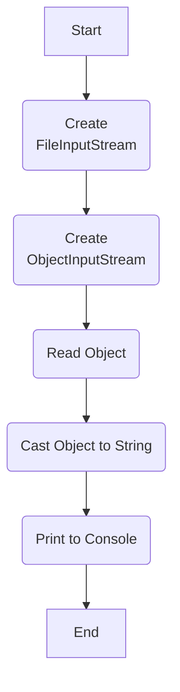
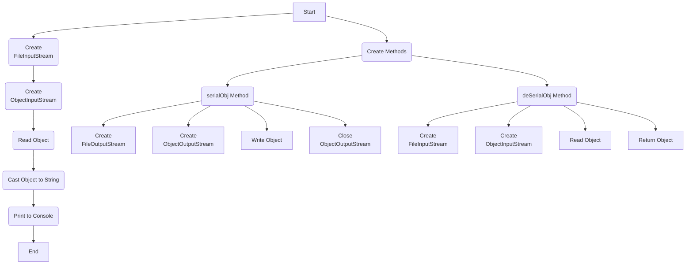

## Урок 3. Сериализация
Сериализация представляет собой механизм, который позволяет сохранять и загружать из файлов не только простой текст, но и готовые, инициализированные объекты. Мы встречаемся с этим процессом часто, например, при возвращении к сохраненным прохождениям игр или при сохранении таблиц Excel. Для сериализации объекта достаточно выполнить несколько шагов:
- Создание потока записи байт в файл.
- Создание потока записи объекта в файл.
- Запись объекта.
- Закрытие потоков

Представьте, что у вас есть любимый сериал, где каждая серия - это объект в программировании с персонажами, событиями и местами. Сериализация в Java подобна сохранению этого сериала на флеш-накопитель: вы сохраняете объекты для дальнейшего использования, подобно тому, как сохраняете серии на флешке.

Процесс сериализации важен для передачи объектов между приложениями и для сохранения их состояния. Теперь давайте погрузимся в мир сериализации и рассмотрим ключевые аспекты этой технологии.

Итак, если все просто, давайте попробуем сериализовать что-то! Рассмотрим пример:
```java
FileOutputStream fileOutputStream = new FileOutputStream("serialized_object");
ObjectOutputStream objectOutputStream = new ObjectOutputStream(fileOutputStream);
objectOutputStream.writeObject(someObject);
objectOutputStream.close();
```
В этом примере мы создаем поток записи байт в файл, поток записи объекта и выполняем запись объекта. После этого мы закрываем потоки. Этот процесс подобен сохранению серий на флешке, где мы создаём папку, помещаем в нее серии и закрываем флешку.
```java
String str = "Hello, everyone!";
FileOutputStream fileOutputStream = new FileOutputStream("serialized_object");
ObjectOutputStream objectOutputStream = new ObjectOutputStream(fileOutputStream);
objectOutputStream.writeObject(str);
objectOutputStream.close();
```
В этом примере мы создаем строку и сохраняем ее в файл, применяя тот же процесс сериализации. После записи мы освобождаем ресурсы, чтобы файл был читаемым. В результате получается бинарный файл, который содержит сериализованный объект.

Теперь, если даже десериализация не кажется сложной, давайте рассмотрим ее на примере:
```java
FileInputStream fileInputStream = new FileInputStream("serialized_object");
ObjectInputStream objectInputStream = new ObjectInputStream(fileInputStream);
String loadedString = (String) objectInputStream.readObject();
objectInputStream.close();
```
В этом примере мы создаем поток чтения байт из файла, поток чтения объекта и выполняем чтение объекта. Десериализация подобна извлечению данных с флешки, где мы открываем папку, читаем серии и закрываем флешку. Таким образом, сериализация и десериализация - это важные аспекты работы с объектами в Java, позволяющие эффективно сохранять и восстанавливать состояние объектов.



Пример
```java
FileInputStream fileInputStream = new FileInputStream("ser");
ObjectInputStream objectInputStream = new ObjectInputStream(fileInputStream);
String s = (String) objectInputStream.readObject();
System.out.println(s);
```
Здесь всё происходит наоборот! Сначала мы создаем поток для побайтного чтения из файла, затем формируем поток для побайтной загрузки объекта из указанного файла, и только после этого мы загружаем объект. Стоит отметить, что мы загружаем именно объект типа Object, и мы сами выполняем его приведение к нужному типу, например, String, прежде чем вывести его в консоль.

Теперь давайте усложним наш объект! Но прежде чем приступить, давайте создадим несколько методов для упрощения последующих шагов.



Пример
```java
public static void serialObj(Object o, String file) throws IOException {
    FileOutputStream fileOutputStream = new FileOutputStream(file);
    ObjectOutputStream objectOutputStream = new ObjectOutputStream(fileOutputStream);
    objectOutputStream.writeObject(o);
    objectOutputStream.close();
}

public static Object deSerialObj(String file) throws IOException, ClassNotFoundException {
    FileInputStream fileInputStream = new FileInputStream(file);
    ObjectInputStream objectInputStream = new ObjectInputStream(fileInputStream);
    return objectInputStream.readObject();
}
```

Это два метода для выполнения сериализации и десериализации. Новшество заключается в обработке исключений. Ранее не уточнялось, но операции чтения или записи в файл могут вызвать исключения по разным причинам. На данном этапе мы не будем глубоко обсуждать эти исключения, однако важно помнить, что подобные ситуации могут возникнуть. Давайте перейдем к усложнению объекта!
```java
ArrayList<String> list = new ArrayList<>();
for (int i = 0; i < 10; i++) {
    list.add(Character.getName(i));
}
serialObj(list, "ser");
```
В данном случае мы создали список с элементами типа String, заполнили его строковыми названиями букв (используя метод класса Character) и затем провели сериализацию. Давайте посмотрим, что теперь записано в файле.
```text
¬н sr java.util.ArrayListxЃТ™Зaќ I sizexp
w
t NULLt START OF HEADINGt
START OF TEXTt
END OF TEXTt END OF TRANSMISSIONt ENQUIRYt
ACKNOWLEDGEt BELt BACKSPACEt CHARACTER TABULATIONx
```
Что ж, текст изменился, и сейчас он более соответствует вашим ожиданиям! Теперь приступим к его десериализации.
```java
ArrayList<String> list = null;
list = (ArrayList<String>) deSerialObj("ser");
System.out.println(list);
```
В данном примере процесс кажется более простым: мы всего лишь десериализовали заранее подготовленный объект и вывели его содержимое в консоль.
```text
[NULL, START OF HEADING, START OF TEXT, END OF TEXT, END OF TRANSMISSION, ENQUIRY, ACKNOWLEDGE, BEL, BACKSPACE, CHARACTER TABULATION]
```
Вот что отобразилось в консоли - практически идентично оригинальному объекту. На текущем этапе всё выглядит довольно просто. Следовательно, переходим к следующему этапу и пробуем сериализовать собственный класс! Начнем с создания этого класса.
```java
class MyFCs {
    public String lName;
    public String fName;
    public String patronymic;

    public MyFCs(String fName, String lName, String patronymic) {
        this.lName = lName;
        this.fName = fName;
        this.patronymic = patronymic;
    }

    @Override
    public String toString() {
        return String.format("%s %s.%s ",
            fName,
            lName.toUpperCase().charAt(0),
            patronymic.toUpperCase().charAt(0));
    }
}
```
Это обычный класс на языке Java с ФИО, конструктором и переопределенным методом toString(). Давайте попробуем выполнить процессы сериализации и десериализации для объекта, созданного на основе этого нового класса.
```java
MyFCs myFCs = new MyFCs("Ivanov", "Ivan", "Ivanovich");
serialObj(myFCs, "ser");
```
Создали экземпляр класса MyFCs и вызвали метод сериализации
```text
Exception in thread "main" java.io.NotSerializableException: MyFCs
    at java.base/java.io.ObjectOutputStream.writeObject0(ObjectOutputStream.java:1198)
    at java.base/java.io.ObjectOutputStream.writeObject(ObjectOutputStream.java:358)
    at Main.serialObj(Main.java:29)
    at Main.main(Main.java:20)
```
Вот оно, первое исключение - нечто, что добавляет немного острых ощущений в наше программирование! И вот в чем дело: Java выдаёт нам NotSerializableException, подсказывая, что объект, который мы пытаемся сериализовать, не подходит для этой задачи. Это происходит потому, что он не реализует интерфейс сериализации. Возможно, это было лучше сделать с самого начала, но здесь мы сталкиваемся с исключением, что придает немного изюминки нашему коду!

Любой класс, который мы хотим сериализовать, должен реализовывать интерфейс Serializable. И вот интересный момент: для этого интерфейса не нужно реализовывать ни одного метода. Он всего лишь сообщает системе, что класс может быть сериализован. Давайте быстро добавим этот интерфейс в наш класс!
```java
class MyFCs implements Serializable{
    public String lName;
    public String fName;
    public String patronymic;

    public MyFCs(String fName, String lName, String patronymic) {
        this.lName = lName;
        this.fName = fName;
        this.patronymic = patronymic;
    }

    @Override
    public String toString() {
        return String.format("%s %s.%s ",
            fName,
            lName.toUpperCase().charAt(0),
            patronymic.toUpperCase().charAt(0));
    }
}
```
Вот что лежит в нашем файле:
```text
¬н sr MyFCs&†МѕѕрС L fNamet Ljava/lang/String;L lNameq ~ L
patronymicq ~ xpt Ivanovt Ivant Ivanovich
```
Тут есть и название класса и внутренние типы, ну и сами данные! Теперь проверим десериализацию.
```java
MyFCs myFCs = (MyFCs) deSerialObj("ser");
System.out.println(myFCs);
```
Теперь всё заработало, нет никаких исключений, и в консоли гордо написано. Ivanov I.I. Теперь давайте сделаем поля данных приватными!
```java
class MyFCs implements Serializable{
    private String lName;
    private String fName;
    private String patronymic;

    public MyFCs(String fName, String lName, String patronymic) {
        this.lName = lName;
        this.fName = fName;
        this.patronymic = patronymic;
    }

    @Override
    public String toString() {
        return String.format("%s %s.%s ",
            fName,
            lName.toUpperCase().charAt(0),
            patronymic.toUpperCase().charAt(0));
    }
}
```
Снова пробуем десериализацию!
```text
Exception in thread "main" java.io.InvalidClassException: MyFCs; local class incompatible: stream
classdesc serialVersionUID = 2776131339925385425, local class serialVersionUID =
-7063247849619523952
    at java.base/java.io.ObjectStreamClass.initNonProxy(ObjectStreamClass.java:597)
    at java.base/java.io.ObjectInputStream.readNonProxyDesc(ObjectInputStream.java:2076)
    at java.base/java.io.ObjectInputStream.readClassDesc(ObjectInputStream.java:1925)
    at java.base/java.io.ObjectInputStream.readOrdinaryObject(ObjectInputStream.java:2248)
    at java.base/java.io.ObjectInputStream.readObject0(ObjectInputStream.java:1760)
    at java.base/java.io.ObjectInputStream.readObject(ObjectInputStream.java:538)
    at java.base/java.io.ObjectInputStream.readObject(ObjectInputStream.java:496)
    at Main.deSerialObj(Main.java:35)
    at Main.main(Main.java:21)
```
И вот опять исключение! Но справиться с этим легко. Сохранённые данные и описание класса в программе не совместимы по версии! При сериализации и десериализации предполагается, что сохранённые данные соответствуют описанию класса. В противном случае правильно восстановить объект не получится. В языке Java для проверки этого введена специальная переменная serialVersionUID. Если вы не объявили её, то Java подсчитает её автоматически, учитывая типы и модификаторы видимости полей данных, а также сигнатуры методов исходного класса. Это сделано для предотвращения несовместимости данных и класса и обеспечения корректной работы с исключениями. Впрочем, вы можете добавить строчку кода (см пример ниже) с произвольным значением переменной serialVersionUID и изменять его при необходимости!
```java
private static final long serialVersionUID = 1L;
```
В данном случае мы изменили модификаторы видимости полей данных. Давайте снова проведём сериализацию и десериализацию нашего объекта, как в примерах выше. Всё прошло успешно, и в консоли торжественно высветилось "Ivanov I.I."! Однако теперь у вас, возможно, возник вопрос: как сериализация взаимодействует с приватными полями? Давайте вместо ответа рассмотрим более серьезный пример.