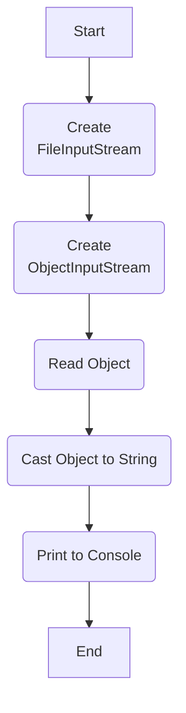

## Урок 3. Сериализация
Сериализация представляет собой механизм, который позволяет сохранять и загружать из файлов не только простой текст, но и готовые, инициализированные объекты. Мы встречаемся с этим процессом часто, например, при возвращении к сохраненным прохождениям игр или при сохранении таблиц Excel. Для сериализации объекта достаточно выполнить несколько шагов:
- Создание потока записи байт в файл.
- Создание потока записи объекта в файл.
- Запись объекта.
- Закрытие потоков

Представьте, что у вас есть любимый сериал, где каждая серия - это объект в программировании с персонажами, событиями и местами. Сериализация в Java подобна сохранению этого сериала на флеш-накопитель: вы сохраняете объекты для дальнейшего использования, подобно тому, как сохраняете серии на флешке.

Процесс сериализации важен для передачи объектов между приложениями и для сохранения их состояния. Теперь давайте погрузимся в мир сериализации и рассмотрим ключевые аспекты этой технологии.

Итак, если все просто, давайте попробуем сериализовать что-то! Рассмотрим пример:
```java
FileOutputStream fileOutputStream = new FileOutputStream("serialized_object");
ObjectOutputStream objectOutputStream = new ObjectOutputStream(fileOutputStream);
objectOutputStream.writeObject(someObject);
objectOutputStream.close();
```
В этом примере мы создаем поток записи байт в файл, поток записи объекта и выполняем запись объекта. После этого мы закрываем потоки. Этот процесс подобен сохранению серий на флешке, где мы создаём папку, помещаем в нее серии и закрываем флешку.
```java
String str = "Hello, everyone!";
FileOutputStream fileOutputStream = new FileOutputStream("serialized_object");
ObjectOutputStream objectOutputStream = new ObjectOutputStream(fileOutputStream);
objectOutputStream.writeObject(str);
objectOutputStream.close();
```
В этом примере мы создаем строку и сохраняем ее в файл, применяя тот же процесс сериализации. После записи мы освобождаем ресурсы, чтобы файл был читаемым. В результате получается бинарный файл, который содержит сериализованный объект.

Теперь, если даже десериализация не кажется сложной, давайте рассмотрим ее на примере:
```java
FileInputStream fileInputStream = new FileInputStream("serialized_object");
ObjectInputStream objectInputStream = new ObjectInputStream(fileInputStream);
String loadedString = (String) objectInputStream.readObject();
objectInputStream.close();
```
В этом примере мы создаем поток чтения байт из файла, поток чтения объекта и выполняем чтение объекта. Десериализация подобна извлечению данных с флешки, где мы открываем папку, читаем серии и закрываем флешку. Таким образом, сериализация и десериализация - это важные аспекты работы с объектами в Java, позволяющие эффективно сохранять и восстанавливать состояние объектов.



