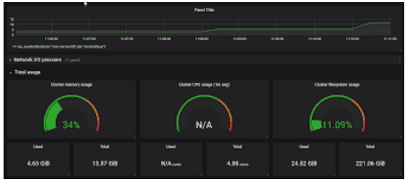

## Урок 11. Spring Actuator. Настройка мониторинга с Prometheus и Grafana

### Термины, используемые в лекции

**Spring Actuator** — Модуль Spring Framework, предоставляющий различные возможности мониторинга и управления приложением.

**Endpoints** — Эндпоинты предоставляют доступ к различным информационным и управляющим ресурсам в приложении. Примеры включают /actuator/health, /actuator/metrics и /actuator/info.

**Metrics** — Метрики представляют числовую информацию о работе приложения,такую как использование памяти, количество HTTP-запросов и другие метрики производительности.

**Health Indicator** — Компонент Spring Actuator, предоставляющий информацию о состоянии приложения. Индикаторы здоровья могут определять, находится ли приложение в рабочем состоянии.

**Custom Endpoints** — Spring Actuator позволяет создавать собственные эндпоинты, что делает возможным добавление собственных метрик и управляющих операций.

**Prometheus** — это система мониторинга и алертинга с открытым исходным кодом, которая используется для сбора и хранения временных рядов данных, таких как метрики приложения.

**Prometheus Actuator** — Этот модуль Spring Actuator предоставляет интеграцию с Prometheus. Он позволяет экспортировать метрики Spring Actuator в формате, понятном Prometheus.

**Grafana** — это популярный инструмент для визуализации данных и построения дашбордов для мониторинга.

**Data Source** — В контексте Grafana, источник данных (Data Source) представляет собой источник, из которого Grafana извлекает данные для визуализации, включая данные, собранные Prometheus.

**Dashboards** — Дашборды — это пользовательские интерфейсы в Grafana, на которы можно создавать графики и панели для визуализации метрик и данных мониторинга.

**Alerting** — Grafana также поддерживает систему алертинга, которая позволяет настраивать оповещения на основе данных мониторинга.

**Query Language** — Grafana предоставляет язык запросов, который позволяет выбирать и агрегировать данные из различных источников данных.

**Grafana Panels** — Графики, диаграммы и другие элементы визуализации данных, размещенные на дашборде Grafana, называются панелями.

**Exporters** — Программные компоненты, которые предоставляют данные мониторинга в формате, понятном системам мониторинга, такие как Prometheus.

### Spring Actuator

Spring Actuator — это подпроект Spring, который предоставляет готовые production-ready функции: метрики, мониторинг, даже некоторую информацию для отладки. Все эти данные предоставляются в виде RESTful сервиса, JMX бинов или даже через SSH. Да-да, это как многофункциональный швейцарский нож для вашего приложения.

Чтобы начать, добавьте зависимость в ваш pom.xml или build.gradle:
```xml
<dependency>
    <groupId>org.springframework.boot</groupId>
    <artifactId>spring-boot-starter-actuator</artifactId>
</dependency>
```

И… вуаля! В вашем приложении теперь есть эндпоинты, такие как /actuator/health, /actuator/info и так далее. Попробуйте зайти на http://localhost:8080/actuator/health и вы увидите JSON с информацией о состоянии вашего приложения. Это как если бы у вас была магическая кнопка в машине, нажав на которую, вы бы получили полный отчёт о её состоянии.

Так, мы поняли, что Spring Actuator это как своего рода «приборная панель» для вашего Spring Boot приложения.

Итак, почему это так круто? Во-первых, понимание состояния вашего приложения в реальном времени — это как иметь «шестое чувство». Вы знаете, когда что-то идет не так, даже прежде чем начнутся какие-либо проблемы. Это может быть невероятно ценным в production, где каждая секунда downtime может стоить деньги или репутацию. Серьезно, представьте, ваша система упала, а вы даже не знали, что она болеет.

Во-вторых, вам не придется изобретать велосипед. Всё уже сделано за вас. Хочешь метрики? Пожалуйста. Хочешь проверить health состояние базы данных или кэша? Да не вопрос. Хочешь custom metrics? Тоже можно. Всё это доступно «из коробки» или с минимальной настройкой. Это как купить смартфон, на котором уже установлены все необходимые приложения и даже чехол в комплекте.

Теперь давайте поговорим, почему каждый бэкенд-разработчик должен понимать и уметь работать с Spring Actuator. Представьте, вы — врач. Пациенты приходят к вам, и вы, не имея анализов и инструментов для диагностики, начинаете лечить их «на глаз». Звучит жутковато, правда?

Бэкенд — это сердце любого приложения. Если оно перестает работать, всёостальное тоже падает. Поэтому, так же как врачу нужны инструменты для диагностики, бэкенд-разработчику необходимы инструменты для мониторинга и анализа состояния приложения. Здесь Spring Actuator становится вашим лучшим другом: отслеживание активных соединений, состояния базы данных, использования памяти и многое другое. И все это можно даже красиво визуализировать с помощью Grafana, но об этом поговорим позже.

В итоге, знание и умение использовать Spring Actuator не просто «nice to have», это действительно «must-have» навык для серьезного бэкенд-разработчика. Поверьте, ваша команда и ваше приложение будут вам благодарны.

### Эндпоинт Health

Итак, уже поняли, что Spring Actuator — это must-have инструмент для любого бэкенд-разработчика. Но если бы я должен был выбрать одну фичу, один эндпоинт, который стоит знать в первую очередь, то это, безусловно, эндпоинт Health.

Допустим, вы хотите знать, всё ли в порядке с вашим приложением. Работает ли база данных? Все ли сетевые подключения стабильны? Это и многое другое можно узнать, обратившись к эндпоинту /actuator/health. Думайте об этом как о стетоскопе для вашего приложения. Как только вы «прикладываете» его, вы сразу узнаете, бьется ли «сердце» вашего приложения как надо.

**Как это работает?**

Когда вы отправляете GET-запрос на /actuator/health, вы получаете ответ в формате JSON, который может выглядеть примерно так:
```json
"status": "UP",
"components": {
    "db": {
        "status": "UP",
        "details": {
            // детали о состоянии базы данных
        }
    },
    "diskSpace": {
        "status": "UP",
        "details": {
            // детали о доступном дисковом пространстве
        }
    }
    // и так далее
}
```
В этом примере status: "UP" означает, что все системы функционируют нормально. Но если что-то не так, статус изменится, и вы сразу увидите, в какой именно компоненте проблемы.

### Кастомизация эндпоинта Health

Но что если вам нужно больше деталей или какие-то специфичные проверки? Spring Actuator предоставляет гибкие настройки для эндпоинта Health. Вы можете добавить собственные health indicators, которые проверяют, скажем, доступность внешнего API или состояние какой-либо очереди.

К примеру, создадим простой кастомный health indicator:
```java
@Component
public class MyHealthIndicator implements HealthIndicator {
    
    @Override
    public Health health() {
        // ваша логика проверки здесь
        if (someCheck()) {
            return Health.up().build();
        }
        return Health.down().withDetail("reason", "Тут причина проблемы").build();
    }

    public boolean someCheck() {
        // реализация проверки
        return true;
    }
}
```
Теперь, когда вы зайдете на /actuator/health, увидите и свой собственный индикатор там.

В общем, эндпоинт Health — это не просто удобная фича, это неотъемлемая часть мониторинга вашего приложения. И чем быстрее вы его освоите, тем лучше будет для вашего приложения и вашей команды.

### Эндпоинт Metrics

Если эндпоинт Health был стетоскопом, позволяющим слушать «сердцебиение» вашего приложения, то эндпоинт Metrics можно сравнить с персональным тренером. Он даст вам гораздо более детальную картину: сколько оперативной памяти используется, какова нагрузка на процессор, какие запросы к вашему API занимают больше всего времени, и так далее. Короче говоря, это ваш комплексный фитнес-тест для приложения.

**Почему Metrics крут?**

Просто представьте, вы собрались бегать марафон. Будет ли достаточно просто измерить пульс и сказать: «О, пульс нормальный, я готов?» Нет, конечно. Вам нужно знать много разных параметров: уровень кислорода в крови, скорость бега, выносливость и так далее. Точно так же и с приложением: только зная все эти метрики, можно гарантированно сказать, что система работает эффективно.

**Как это работает и что можно узнать?**

Для доступа к этому золотому карьеру данных отправьте GET-запрос на /actuator/metrics. В ответ получите список всех доступных метрик. Отсюда вы можете делать более конкретные запросы, например, /actuator/metrics/jvm.memory.used — чтобы узнать, сколько памяти сейчас использует ваше приложение.
```json
{
    "name": "jvm.memory.used",
    "description": "The amount of used memory",
    "baseUnit": "bytes",
    "measurements": [
        {
            "statistic": "VALUE",
            "value": 550295
        }
    ]
}
```
Эти данные можно использовать для анализа производительности, определения «узких мест» и планирования масштабирования.

### Кастомизация метрик

Как и с эндпоинтом Health, здесь у вас есть возможность кастомизации. Вы можете создать свои собственные метрики, чтобы отслеживать что-то уникальное для вашего приложения. Spring Boot делает это на удивление простым. Например:
```java
@Autowired
private MeterRegistry meterRegistry;

public void someMethod() {
    // Ваш код
    // Увеличиваем счетчик на единицу
    meterRegistry.counter("my.custom.counter").increment();
}
```
Теперь эту метрику тоже можно увидеть, запустив GET-запрос на /actuator/metrics/my.custom.counter.

В общем, эндпоинт Metrics в Spring Actuator — это ваш лучший друг в оптимизации и мониторинге приложения. И чем раньше вы начнете его использовать, тем более «здоровым» и «фитнес-готовым» будет ваш проект.

### Эндпоинт Info

Если эндпоинты Health и Metrics были как ваш доктор и персональный тренер, эндпоинт Info является чем-то вроде визитной карточки вашего приложения. В ней вы можете указать всю базовую информацию: кто разработчик, какая версия, какие основные функции и так далее. Это очень полезно, когда у вас большой проект и куча людей работают над разными частями. Представьте, что это ваше «Привет, меня зовут…» для всех, кто взаимодействует с вашим приложением.

**Зачем нужен Info?**

Может показаться, что это избыточная информация, но на деле она помогает в работе. Допустим, вы только что присоединились к разработке огромного проекта. Чтобы не запутаться во всех этих микросервисах, версиях и зависимостях, легче всего сходить на /actuator/info и быстро понять, что перед вами.

**Как настроить?**

Настройка проста как два плюс два. В application.properties или application.yml файле ваших проектов добавьте что-то вроде:
```yaml
info:
    app:
        name: "My Cool App"
        version: "1.0.0"
        description: "This app does something awesome!"
```
Теперь, когда кто-то пошлет GET-запрос на /actuator/info, получит:
```json
{
    "app": {
        "name": "My Cool App",
        "version": "1.0.0",
        "description": "This app does something awesome!"
    }
}
```
В идеале, можно даже динамически генерировать некоторую информацию. Например, вы можете использовать переменные окружения или значения из других источников. Суть в том, что здесь можно быть креативным.

Короче говоря, эндпоинт Info это ваша возможность представить ваше приложение в самом лучшем свете. Это как визитная карточка, которую вы оставляете после успешного собеседования. И кто знает, может, именно этот небольшой JSON сделает жизнь вашей команды немножко проще.

### Эндпоинт Loggers

**Что такое Loggers и зачем он нужен?**

Логирование — это как черный ящик в самолете; если что-то пошло не так, именно в логах вы найдете ответы на вопросы «что?» и «почему?». Эндпоинт Loggers позволяет вам управлять уровнями логирования для различных компонентов вашего приложения. Таким образом, вы можете подробно отслеживать только те аспекты системы, которые вас интересуют, не засоряя логи лишней информацией.

**Как этим управлять?**

Для начала отправьте GET-запрос на /actuator/loggers и увидите список всех доступных логгеров с текущими уровнями логирования. Что-то вроде:
```json
{
    "levels": ["OFF", "ERROR", "WARN", "INFO", "DEBUG", "TRACE"],
    "loggers": {
        "ROOT": {
            "configuredLevel": "INFO"
        },
        "com.example": {
            "configuredLevel": "DEBUG"
        },
        // ...
    }
}
```
Теперь, чтобы изменить уровень логирования для определенного логгера, вам нужно будет отправить POST-запрос. Например, чтобы установить уровень DEBUG для com.example, отправьте POST-запрос на /actuator/loggers/com.example с JSON-телом:
```json
{
    "configuredLevel": "DEBUG"
}
```
И вуаля! Теперь все логи от com.example будут на уровне DEBUG, позволяя вам глубоко погрузиться в дебри диагностики.

**Что это дает на практике?**

Представьте, что у вас есть некая проблема в определенной части вашего приложения. Вместо того, чтобы рыться в куче логов, вы просто «подкручиваете громкость» для этой конкретной части и получаете всю нужную информацию, не теряясь в шуме остальных данных.

### JVM метрики в Spring Actuator

**Почему это важно?**

Следить за состоянием JVM — это как следить за своим пульсом во время тренировки. Если что-то не так, лучше узнать об этом заранее. Это особенно критично в производственных системах, где высокая нагрузка и большое количество пользователей. С помощью JVM метрик вы можете отслеживать использование памяти, состояние потоков, загрузку классов и многое другое.

**Как посмотреть эти метрики?**

По умолчанию, если у вас настроен Spring Actuator, многие JVM метрики уже будут доступны через эндпоинт /actuator/metrics. Вы можете сделать GET-запрос к /actuator/metrics/jvm.memory.used, чтобы узнать, сколько памяти используется, или к /actuator/metrics/jvm.threads.daemon для информации о демон-потоках. Результатом будет JSON с метриками:
```json
{
    "name": "jvm.memory.used",
    "description": "The amount of used memory",
    // ... more metadata and values
}
```

**Как это использовать на практике?**

Скажем, вы заметили, что ваше приложение начало тормозить. Вместо того чтобы бросаться в код, вы можете сначала проверить JVM метрики. Возможно, проблема в неэффективном использовании памяти или в том, что у вас слишком много потоков, и они конфликтуют между собой. С этой информацией, уже гораздо проще идти и исправлять код, зная, в каком направлении копать.

Так что не забывайте про этот «медицинский аппарат» для вашего приложения. Он может дать невероятно ценную информацию о том, как ваш код взаимодействует с JVM и помочь вам оптимизировать приложение, даже не трогая сам код.

### HTTP метрики

После того как мы погрузились в медитативный мир JVM метрик, настало время
поближе познакомиться с тем, что происходит на самом «фронте» —
взаимодействие вашего приложения с внешним миром через HTTP.

**Зачем это нужно?**

Метрики по HTTP запросам помогут вам понять, как быстро ваше приложение отвечает, какие запросы наиболее часто выполняются, каковы временные метрики их выполнения и многое другое. Это критически важно для определения узких мест в производительности и для понимания, как пользователи взаимодействуют с вашим приложением.

**Как это работает в Spring Actuator?**

Spring Actuator предоставляет эндпоинт /actuator/metrics/http.server.requests для сбора данных о HTTP-запросах. Здесь вы можете увидеть различные метрики, такие как среднее время ответа (http.server.requests.seconds), количество запросов (count), и так далее.

Пример JSON ответа:
```json
{
    "name": "http.server.requests",
    "description": "HTTP Server Requests",
    // ... more data and values
}
```
Представьте, вы заметили, что ваше приложение стало медленным при определенных запросах. Сначала, вы можете проверить метрику среднего времени ответа для этих запросов. Если она высокая, это явный знак для действия. С этими данными в руке, вы уже сможете лучше понять, где искать проблему: может быть, это недостаток ресурсов, неэффективный код или что-то еще.

Знание — это сила, а HTTP метрики дадут вам много знаний о том, как ваше приложение взаимодействует с внешним миром. Так что не пренебрегайте этим инструментом; он может быть очень и очень полезным.

### Метрики баз данных

**Зачем они нужны?**

Слушайте, если ваше приложение тормозит и вы не знаете, почему, одним из первых мест, куда стоит заглянуть — это ваша база данных. Медленные запросы, проблемы с соединением, нехватка ресурсов — всё это может сказываться на производительности всего приложения. Метрики баз данных помогут вам понять, что именно является «узким местом».

**Как это устроено в Spring Actuator?**

Spring Actuator может интегрироваться с различными системами управления базами данных (DBMS), и в зависимости от вашей конкретной настройки, различные метрики будут доступны через эндпоинт /actuator/metrics. Например, если вы используете HikariCP как пул соединений, вы можете увидеть метрики типа hikaricp.connections.active или hikaricp.connections.idle.

Пример JSON’а:
```json
{
    "name": "hikaricp.connections.active",
    "description": "Active DB connections",
    // ... more data and values
}
```

**Практический пример**

Итак, представьте, что пользователи жалуются на задержки. Вы уже проверили HTTP и JVM метрики, и там все ок. Время проверить базу данных. Вы обнаруживаете, что у вас очень много активных соединений и понимаете, что нужно оптимизировать пул соединений или, возможно, даже масштабировать вашу базу данных.

Помните, что ваши данные — это сердце приложения, и знание о том, как ваш код взаимодействует с базой данных, может быть настоящим game changer’ом. Уделите этому должное внимание, и ваша база данных будет танцевать с вами в унисон, а не каждая по-своему.

### Логирование

Итак, мы уже разобрались, как следить за здоровьем и метриками вашего приложения и даже базы данных. Отлично, вы уже во многом в курсе. Но что если я скажу, что у нас есть ещё один козырь в рукаве? Этот козырь называется динамическое логирование. Да-да, вы не ослышались. С помощью Spring Actuator вы можете менять уровни логирования вашего приложения на лету, без перезагрузки. Звучит как магия, не так ли?

**Зачем это нужно?**

Представьте, что у вас есть какая-то проблема в приложении. В логах тишина, потому что уровень логирования слишком низкий. Вместо того чтобы перезапустить все с новыми настройками (и потерять текущее состояние), вы просто меняете уровень логирования на лету и сразу начинаете видеть нужную информацию. Сохраняйте время, нервы и ресурсы с этими фишками Spring Actuator.

**Как это сделать?**

Всё управляется через эндпоинт /actuator/loggers. Отправьте PUT-запрос с новым уровнем логирования, пример:
```sh
curl -i -X POST -H 'Content-Type: application/json' -d '{"configuredLevel": "DEBUG"}' http://localhost:8080/actuator/loggers/com.example.YourClass
```

**Почему это важно?**

Изменение уровня логирования на лету не просто крутая фича, это инструмент для быстрой отладки и оптимизации вашего кода. Вы сможете понять, что происходит в вашем приложении здесь и сейчас, без необходимости перезагружать что-либо или ждать, пока снова проявится проблема.

**Добавление своих эндпоинтов**

Ничего сложного. Для создания своего эндпоинта вам нужно определить класс и аннотировать его как @Endpoint или @WebEndpoint. Пример:
```java
import org.springframework.boot.actuate.endpoint.annotation.Endpoint;
import org.springframework.boot.actuate.endpoint.annotation.ReadOperation;

@Endpoint(id = "myCustomEndpoint")
public class MyCustomEndpoint {

    @ReadOperation
    public CustomResponse customMethod() {
        return new CustomResponse("Everything is awesome!", 42);
    }

    public static class CustomResponse {
        private String message;
        private int number;
        // getters and setters
    }
}
```
Теперь, отправьте GET-запрос на /actuator/myCustomEndpoint, и вы увидите ваш собственный ответ. Какой-то JSON в духе {"message": "Everything is awesome!", "number": 42} подарит вам уверенность в своих силах.

Может быть, вы захотите интегрировать Actuator с какими-то сторонними системами мониторинга или аналитики. Например, такими как Datadog, New Relic или что-то в этом роде. Обычно для этого достаточно подключить соответствующую библиотеку и настроить пару параметров в application.properties. Возможности практически безграничны.

Короче, Actuator — это не только инструмент «из коробки», это ещё и платформа для ваших экспериментов и кастомизаций. Это как LEGO: начинаешь с базового набора, а потом добавляешь свои детали, создавая нечто уникальное.

### Практика

**Шаг 1: Добавляем зависимости**
Открываем наш pom.xml и туда вставляем:
```xml
<dependency>
    <groupId>org.springframework.boot</groupId>
    <artifactId>spring-boot-starter-actuator</artifactId>
</dependency>
```

**Шаг 2: Включаем эндпоинты**

Переходим в application.properties:  
management.endpoints.web.exposure.include=*

Так, теперь у нас доступны все эндпоинты. Но помним, что в реальной жизни так делать не стоит, это только для учебных целей.

**Шаг 3: Пробуем Health**

Запускаем приложение и в браузере открываем /actuator/health. Что видим? Все работает? Прекрасно!

**Шаг 4: Заглянем в Metrics**

Теперь давайте перейдем по адресу /actuator/metrics. Здесь можно увидеть кучу полезной информации. Можно даже сузить поиск до конкретной метрики, например, /actuator/metrics/jvm.memory.used. Какова у вас сейчас потребляемая память?

**Шаг 5: Информацию о приложении**

Эндпоинт /actuator/info позволит вам добавить любую кастомную информацию о вашем проекте. В application.properties просто добавьте что-то вроде:
```yaml
info.app.name=My Awesome App
info.app.version=1.0.0
```
И вы увидите это все на /actuator/info

По сути, это быстрый старт, но он уже дает представление о том, насколько мощным инструментом может быть Spring Actuator в вашем проекте. И главное, это всё настолько просто, что кажется, будто ты только что научился велосипеду ездить, а уже катаешься как профессиональный гонщик.

### JMX, облачные платформы и не только

JMX, или Java Management Extensions, это стандартный механизм для мониторинга и управления ресурсами в Java. С помощью Actuator, вы можете легко экспортировать свои эндпоинты в JMX. Просто откройте application.properties и добавьте
```yaml
management.endpoints.jmx.exposure.include=*
```
Теперь вы можете использовать JConsole или любой другой JMX-клиент для подключения к вашему приложению. И это реально круто, если у вас уже есть какая-то система мониторинга, основанная на JMX.

Spring Actuator прекрасно интегрируется с облачными платформами типа AWS, Google Cloud и Azure. Это открывает перед вами совершенно новые возможности. Например, вы можете использовать AWS CloudWatch для сбора метрик или Azure Monitor для централизованного логирования и мониторинга.

### Системы мониторинга: Prometheus и Grafana

Ну и наконец, чтобы сделать вашу жизнь ещё проще, Spring Actuator можно без проблем подружить с Prometheus и Grafana. Prometheus будет собирать метрики, а Grafana превратит их в красивые и понятные графики. Конфигурация займет всего пару строк кода и немного времени.

В application.properties добавляем:
```yaml
management.metrics.export.prometheus.enabled=true
```
Запускаем Prometheus, указываем ему, где собирать данные, и вуаля, у вас есть супер-продвинутая система мониторинга!

В общем, как видите, Actuator — это не просто «еще одна штука» в вашем проекте. Это мощный инструмент для мониторинга и управления, который при правильном использовании просто не имеет аналогов.

### Micrometer: Как измерять всё и сразу

После того как мы обсудили всю эту крутую интеграцию и продвинутые возможности, давайте копнем глубже в тему метрик. И тут на сцену выходит Micrometer. Если бы Actuator был вашим швейцарским ножиком для мониторинга, то Micrometer стал бы надёжным компасом, который показывает, куда двигаться.

Micrometer — это фактически библиотека для сбора метрик, которую можно считать как SLF4J, но для метрик. Под капотом Spring Actuator, именно Micrometer обеспечивает все те красивые графики и числа, которые вы видите в своем мониторинговом решении.

Основная идея Micrometer заключается в том, чтобы предоставить простой и удобный способ для сбора метрик без привязки к конкретной системе мониторинга. То есть, сконфигурировали один раз — и используйте со всем, что угодно: Prometheus, InfluxDB, New Relic, и так далее.

Допустим, у вас есть REST-контроллер, и вы хотите замерить, как быстро обрабатываются запросы. С Micrometer это становится проще простого. Добавьте зависимость:
```pom
<dependency>
    <groupId>io.micrometer</groupId>
    <artifactId>micrometer-core</artifactId>
</dependency>
```
И в коде:
```java
import io.micrometer.core.instrument.MeterRegistry;

@RestController
public class MyController {
    private final MeterRegistry meterRegistry;
    
    public MyController(MeterRegistry meterRegistry) {
        this.meterRegistry = meterRegistry;
    }
    
    @GetMapping("/hello")
    public String sayHello() {
        meterRegistry.counter("requests_to_hello").increment();
        // ваша логика
        return "Hello, World!";
    }
}
```

Теперь каждый раз, когда кто-то обращается к /hello, счётчик requests_to_hello увеличивается. А это уже дает вам возможность отслеживать активность и реагировать на изменения в поведении вашего приложения.

Micrometer дает вам огромную гибкость. Вы можете создавать счетчики, гистограммы, таймеры и многое другое. Все это можно потом красиво визуализировать и анализировать.

Итак, Micrometer — это ваш лучший друг в мире метрик. Он делает сбор данных невероятно простым и позволяет вам сконцентрироваться на том, что действительно важно — на вашем приложении.

### Создание собственных метрик с Micrometer

Здорово, что теперь у нас есть общее представление о Micrometer. Но как всегда, теория — это только половина дела. Давайте перейдем к практике. Ведь настоящий мастер своего дела не просто знает инструменты, но и умеет их применять, правда?

[](./counter.png)

Чтобы создать свою метрику, нам сначала нужен объект MeterRegistry. Этот объект уже настроен Spring Boot’ом и можно его просто заинжектить в ваш компонент или сервис.
```java
import io.micrometer.core.instrument.Counter;
import io.micrometer.core.instrument.MeterRegistry;

@Service
public class MyService {
    private final Counter myCounter;
    
    public MyService(MeterRegistry meterRegistry) {
        myCounter = Counter.builder("my_custom_counter")
            .description("Counts something very important")
            .register(meterRegistry);
    }

    public void doSomethingImportant() {
        // Тут какая-то важная логика
        myCounter.increment();
    }
}
```
В этом примере, каждый раз когда вызывается метод doSomethingImportant, счетчик my_custom_counter увеличивается на 1. Как видите, у нас есть полное управление над именем и описанием метрики.

### Таймеры

[](./timer.png)

Таймеры в Micrometer не просто замеряют время, они собирают статистику: минимальное, максимальное и среднее время, и так далее. Вот как можно использовать таймер:
```java
import io.micrometer.core.instrument.Timer;
// ...

private final Timer myTimer;

public MyService(MeterRegistry meterRegistry) {
    myTimer = Timer.builder("my_custom_timer")
        .description("Timing something very important")
        .register(meterRegistry);
}

public void doSomethingTimed() {
    myTimer.record(() -> {
        // Тут какая-то важная логика, время выполнения которой мы хотим замерить
    });
}
```
После этого в вашей системе мониторинга появятся графики, отражающие эту информацию. Супер удобно для оптимизации и отладки!

### Гистограммы и более сложные метрики

[](./histogramm.png)

Micrometer предоставляет возможности и для более сложных метрик. Например, вы можете использовать гистограммы для того, чтобы узнать, как распределены значения какой-либо переменной в вашем приложении.

Это уже переходит в категорию продвинутого использования, но знать о такой возможности определенно стоит.

Итак, мы разобрались с основами создания собственных метрик в Micrometer. Это инструмент, который дает вам полный контроль над тем, что и как измерять в вашем приложении.

### Prometheus

**Тайм-серии для всех!**

Prometheus основан на концепции тайм-серий. Это значит, что он хранит значения метрик во времени. Возьмем, к примеру, загрузку CPU. Не просто «а сейчас у нас загрузка 90%», а «в 15:35 было 70%, в 15:40 – 80%, а в 15:45 – уже 90%». В итоге, это дает возможность не просто смотреть на текущую ситуацию, но и анализировать тренды.

**Простой и мощный язык запросов**

Один из козырей Prometheus — это его язык запросов PromQL. Он позволяет задавать вопросы типа «какая средняя загрузка CPU за последние 5 минут» или «сколько запросов в секунду приходит на мой бэкенд». И все это можно узнать прямо сейчас, в реальном времени.

Prometheus работает по принципу «пуллинга». Это значит, что он сам идет к вашему приложению и забирает нужные метрики. Это немного отличается от других систем мониторинга, где ваше приложение должно было бы «пушить» данные. В случае с Prometheus, все, что нужно от вас, — это предоставить эндпоинт, по которому он может забирать эти данные.

Понимание работы с Prometheus становится почти must-have навыком для современных разработчиков, особенно если вы работаете в микросервисной архитектуре. И не забудем, что Prometheus отлично интегрируется с другими инструментами, типа Grafana, о которой поговорим позже.

В общем, Prometheus — это не просто хранилище метрик, это мощный инструмент для их анализа, который позволяет сделать ваше приложение надежнее и устойчивее к проблемам.

### Настроим Prometheus в нашем Spring проекте

**Добавим зависимости**

Первым делом, нам нужно добавить пару зависимостей в pom.xml, если вы используете Maven, или в build.gradle, если у вас Gradle.
```xml
<dependency>
    <groupId>io.micrometer</groupId>
    <artifactId>micrometer-registry-prometheus</artifactId>
</dependency>
```
```groovy
implementation 'io.micrometer:micrometer-registry-prometheus'
```
Это даст возможность Micrometer (для тех, кто пропустил, это библиотека для метрик в Spring) экспортировать метрики в формате, который сможет прочитать Prometheus.

**Включим экспозицию метрик**

Теперь, в application.properties или application.yml, добавим следующую строчку:  
`management.endpoints.web.exposure.include=metrics,prometheus`  
Это включит экспозицию метрик и специальный эндпоинт для Prometheus.

**Настраиваем Prometheus**

Скачайте Prometheus с официального сайта и распакуйте архив. В папке с Prometheus найдете файл prometheus.yml. Добавьте в него конфигурацию для вашего Spring приложения. Например:
```yaml
scrape_configs:
    - job_name: 'spring-actuator'
    metrics_path: '/actuator/prometheus'
    static_configs:
        - targets: ['localhost:8080']
```
Это скажет Prometheus, что нужно идти по адресу http://localhost:8080/actuator/prometheus и забирать метрики оттуда.

Теперь у вас есть набор инструментов для сбора и анализа метрик, которые помогут сделать ваше приложение еще круче и надежнее.

**Открываем Prometheus UI**

Для начала, давайте откроем веб-интерфейс Prometheus. Если вы все сделали правильно, он должен быть доступен по адресу http://localhost:9090. Тут вы увидите поле для ввода запросов. Для проверки наших метрик введите, например, http_server_requests_seconds_count и нажмите «Execute».

Если все настроено правильно, вы увидите данные о количестве HTTP-запросов к вашему приложению. Не забудьте, что эти данные будут аккумулироваться с течением времени, так что не пугайтесь, если сначала увидите небольшие числа.

**Curl or Postman для теста**

Также вы можете использовать curl или Postman для отправки HTTP-запроса на ваш эндпоинт Prometheus в Spring приложении. Просто отправьте GET-запрос на http://localhost:8080/actuator/prometheus, и вы должны увидеть вывод в формате, который Prometheus может читать.

### Grafana для визуализации

Да, Prometheus UI неплох для быстрых проверок, но для полноценного мониторинга лучше использовать Grafana. Не будем вдаваться в подробности настройки Grafana сейчас (об этом поговорим позже), но учтите, что после настройки источника данных как Prometheus, вы сможете создать дашборды и графики на основе этих метрик. Вот где уже можно будет разгуляться по полной программе!

**Где тут связь с Prometheus?**

Grafana и Prometheus работают в паре, как Бэтмен и Робин в мире мониторинга. Если Prometheus отвечает за сбор данных, то Grafana превращает эти данные в понятные и легко читаемые графики, диаграммы, и даже алерты. Вы можете настроить Grafana так, чтобы она использовала Prometheus как источник данных, и автоматически обновляла показатели в реальном времени.

**Почему это круто для разработчика?**

Для разработчиков бэкенда понимание Grafana это почти необходимость. Иногда просто невозможно понять, что происходит с приложением, просто глядя на строчки логов или даже метрики в Prometheus. Grafana дает вам высокоуровневый взгляд на то, как ваше приложение взаимодействует с миром.

Например, вы можете увидеть, как часто определенный эндпоинт вызывается, какие времена отклика у разных частей системы, или даже какую нагрузку испытывает ваша база данных. И всё это - в реальном времени и с возможностью детализации по любому параметру.

Итак, давайте свяжем все воедино. Мы начали с Spring Actuator для сбора метрик в нашем приложении, потом использовали Prometheus для хранения этих метрик, и теперь мы будем использовать Grafana для их визуализации. Вот как все эти темы связаны между собой, и умение работать со всем этим стеком сделает вашу жизнь намного проще.

**Запуск Grafana**

Первое, что нужно сделать, это установить Grafana на ваш компьютер или сервер, где у вас уже крутится Prometheus. Инструкции для разных ОС можно найти на официальном сайте, но если вы используете Docker, дело сведется к одной команде:
```sh
docker run -d -p 3000:3000 grafana/grafana - targets: ['localhost:8080']
```

**Подключение к Prometheus**

Теперь, открываем веб-интерфейс Grafana. По умолчанию это http://localhost:3000/. Входите с помощью логина admin и пароля admin (менять его — хорошая идея).

Первым делом, давайте добавим Prometheus как источник данных. Заходим в Settings > Data Sources > Add data source и выбираем Prometheus. В поле HTTP URL вводим адрес, по которому доступен ваш Prometheus (обычно это http://localhost:9090). Сохраняем и тестируем. Если все настроено правильно, Grafana скажет, что все отлично.

**Первый Дашборд**

Наконец, создадим наш первый дашборд. Переходим в Create > Dashboard > Add new panel. Здесь вы можете выбрать метрику из Prometheus и настроить график так, как вам нужно. Например, давайте отобразим количество HTTP-запросов к нашему приложению.

В поле “Metrics” вбиваем что-то вроде:

rate(http_server_requests_seconds_count[5m])

Эта команда покажет нам среднее количество HTTP-запросов за последние 5 минут. Настройте график по своему вкусу: добавьте оси, легенду, и так далее.

## Алерты в Grafana

Что может быть круче того, чтобы просто наблюдать за метриками? Правильно, получать уведомления, когда что-то идёт не так. Возьмём наш последний пример с HTTP-запросами и дополним его алертами. Это особенно полезно, если вы хотите знать, когда ваше приложение становится нестабильным или перегруженным.

**Создание Алерта**

Переходим к уже созданному дашборду и выбираем нужную нам панель с графиком. Жмем на заголовок панели и выбираем «Edit». Далее переходим на вкладку «Alert».

Нажимаем «Create Alert» и дадим ему имя. Сразу под именем увидим блок «Conditions». Здесь мы настроим условия срабатывания алерта. Например, если среднее количество запросов в течение 5 минут превышает 100, то срабатывает алерт.

**Настройка Уведомлений**

Под блоком «Conditions» будет раздел «Notifications». Здесь можно настроить, куда будет отправлено уведомление. Это может быть ваш емейл, Slack-канал, и даже PagerDuty, если у вас критически важные сервисы.

Создайте новый «Notification channel» в Settings > Notification channels > Add channel, если необходимо. Затем вернитесь к алерту и выберите этот канал для отправки уведомлений.

**Проверка Алертов**

После всех настроек не забудьте протестировать алерт, чтобы удостовериться, что все работает как надо. Grafana дает такую возможность прямо в интерфейсе создания алерта.

Алерты в Grafana — это не просто функционал, это ваш персональный “сторож”, который не даст вашему приложению “заболеть”. Настройте его раз и навсегда, и спите спокойно!

**Управление Конфигурациями и Dashboard-as-Code: Как Сделать Жизнь Ещё Проще**

Итак, вы подумали, что управление дашбордами и алертами в Grafana — это уже круто? Ну что ж, позвольте вас удивить. Давайте поговорим о Dashboard-as-Code и том, как это может сделать вашу жизнь ещё комфортнее.

**Что Это и Зачем Надо?**

Dashboard-as-Code — это концепция, при которой все настройки вашего дашборда хранятся в коде. Любые изменения в настройках или алертах можно версионировать, следить за историей изменений и даже использовать системы контроля версий, такие как Git.

Это означает, что все ваши красивые панели и интеллектуальные алерты теперь можно хранить в виде кода и деплоить автоматически, как любую другую часть вашего приложения.

**Как Настроить?**
1. JSON-экспорт: Первый шаг — это экспортировать текущий дашборд в формате JSON. В Grafana это можно сделать, перейдя в Settings > JSON Model.
2. Сохранение в Git: Сохраните этот JSON-файл в вашем репозитории. Теперь у вас есть версионированный дашборд.
3. Автоматизация: Используйте инструменты автоматизации, такие как Ansible, Terraform или просто скрипты для автоматического развертывания дашбордов на новых инстансах Grafana.
4. Подключение к Grafana: Настройте Grafana так, чтобы она автоматически импортировала дашборды из вашего репозитория или из определенной папки на сервере.

**Преимущества Подхода**
1. Легкость Отката: Если что-то пошло не так, вы всегда можете откатиться к предыдущей версии дашборда.
2. Коллаборация: Работать над дашбордами можно командой, используя все преимущества системы контроля версий.
3. Масштабируемость: Легко дублировать настройки на разные инстансы Grafana, нет нужды делать все вручную.
Этот подход сделает управление вашими метриками и мониторингом еще более гибким и надежным.

### Snapshot и Sharing Dashboard

Под Dashboard-as-Code мы все поняли, но что делать, если нужно быстро поделиться дашбордом с коллегой или клиентом, который не имеет доступа к вашей Grafana? Или если хочется моментально сохранить текущее состояние для дальнейшего анализа? Приветствую вас в мире снапшотов и Sharing Dashboard.

**Сохраняем момент с Snapshot**

Снапшот — это моментальный снимок вашего дашборда, который захватывает все текущие графики, метрики и настройки. Он статичен, это как фотография текущего состояния вашей системы.
1. Как сделать снапшот?: Просто перейдите на дашборд, который хотите сохранить, и выберите Share > Snapshot.
2. Где хранить?: Вы можете сохранить снапшот либо на сервере Grafana, либо опубликовать на snapshot.raintank.io, чтобы поделиться с теми, у кого нет доступа к вашей Grafana.

**Sharing Dashboard: Быстрый способ поделиться дашбордом**

**Преимущества Подхода**
1. Получение ссылки: Для этого просто перейдите в Share > Link на нужном дашборде.
2. Параметры доступа: Вы можете выбрать, какие части дашборда будут видны, и даже создать шорткат, который автоматически применит нужные фильтры и временные рамки.

**Как выбрать между Snapshot и Sharing Dashboard?**
- Snapshot идеален для сохранения текущего состояния системы или для отправки информации людям без доступа к Grafana.
- Sharing Dashboard лучше всего подходит для коллаборации в реальном времени и долгосрочной работы над проектом.

Так что, в зависимости от ситуации, у вас есть разные инструменты для эффективного обмена данными и мониторинга. Используйте их на здоровье!

### Spring Boot Admin

Итак, мы много поговорили про Grafana и Prometheus, научились делать снапшоты и шарить дашборды как эксперты. Но давайте чуть отвлечемся от этого всего и рассмотрим альтернативу, которая нисколько не уступает в эффективности — Spring Boot Admin.

Spring Boot Admin — это мощный инструмент для мониторинга и управления Spring Boot приложениями. Это типа вашего персонального админ-панели, но круче. Если с Actuator вам нужно было лазить по эндпоинтам, то здесь все эти данные красиво и наглядно отображаются в UI.

**Почему стоит обратить внимание?**
1. Встроенный мониторинг: Метрики, логирование, информация о приложении — все в одном месте. Не нужно заниматься настройкой, просто запускайте и пользуйтесь.
2. Управление приложениями: Можете менять уровень логирования, смотреть активные сессии и даже отправлять команды на управление приложением — все через красивый и интуитивно понятный интерфейс.
3. Связь с Actuator: Да-да, Spring Boot Admin работает поверх Actuator, поэтому все, что вы узнали про Actuator, здесь тоже применимо.
4. Уведомления: Встроенная система уведомлений позволит быть всегда в курсе о состоянии ваших приложений.

**Как это всё настроить?**
1. Добавление зависимостей: Вам нужно добавить Spring Boot Admin Server в ваш проект. pom.xml
    ```xml
    <dependency> 
        <groupId>de.codecentric</groupId>
        <artifactId>spring-boot-admin-starter-server</artifactId>
        <version>2.5.1</version> 
    </dependency>
    ```
2. Настройка application.properties: Включаем админ-сервер. properties `spring.boot.admin.context-path=/admin`
3. Регистрация приложений: Ваши микросервисы или приложения, которые вы хотите мониторить, должны быть зарегистрированы. Это тоже делается через простую настройку.

Да, Spring Boot Admin это круто, но возвращаемся к нашей старой доброй Grafana. Зачем? Потому что мониторинг становится настоящим вызовом, когда нагрузка на ваше приложение начинает расти как на дрожжах. И что мы делаем? Масштабируем и оптимизируем!

**Масштабирование? Не проблема!**

Во-первых, Grafana позволяет разделять нагрузку, просто добавьте несколько Grafana серверов. Их можно легко сконфигурировать для работы с одной и той же базой данных. Вашей команде доступны все те же дашборды, но с меньшей нагрузкой на каждый индивидуальный сервер.

**Оптимизация запросов, чтобы не ждать вечность**
1. Сокращение временного диапазона: Зачем загружать данные за год, если нужны данные только за последние 24 часа? Уменьшение временного диапазона помогает снизить нагрузку на базу данных и ускорить загрузку.
2. Использование агрегации: Графики слишком подробные? Можно агрегировать данные прямо в запросе, снижая таким образом количество точек на графике.
3. Кеширование: Многие базы данных и хранилища данных поддерживают кеширование запросов. Если вы знаете, что некоторые запросы выполняются очень часто, настройте кеширование на уровне базы данных.

**Производительность на стероидах**

Если у вас есть средства и вы хотите прокачать производительность до максимума, рассмотрите возможность использования специализированных решений для хранения временных рядов, таких как InfluxDB или TimescaleDB.

Так что не бойтесь масштаба. С правильной настройкой и некоторой оптимизацией, Grafana будет работать как часы, даже если у вас миллионы пользователей.

### От теории к практике

Да, масштабирование и оптимизация это круто, но как это выглядит на практике? Давайте рассмотрим кейс-стадии, в котором использовались все наши любимые инструменты: Spring Actuator, Prometheus, и Grafana.

**Проблема: Падение производительности в пиковые часы**

Представьте, что вы работаете в стартапе, который разрабатывает социальное медиа приложение. Все было бы хорошо, но в определенные часы (вечер пятницы, к примеру) нагрузка на сервера увеличивается в разы. И вот приложение начинает тормозить, пользователи недовольны.

**Диагностика**

Сначала, давайте взглянем на метрики в Grafana, которые мы собрали с помощью Prometheus и Actuator. Особенно интересны метрики, связанные с временем ответа сервера и загрузкой базы данных. Ух ты, а тут оказывается, что время ответа API увеличилось в 4 раза, а CPU базы данных просто в огне.

**Решение: Оптимизация запросов и кеширование**
1. Оптимизация SQL запросов: Первым делом мы обратили внимание на медленные SQL запросы и оптимизировали их. Это сразу дало нам прирост в производительности.
2. Введение кеширования: Мы внедрили кеширование для самых частых и тяжелых запросов, чтобы снизить нагрузку на базу данных.
3. Автоскейлинг: И последний шаг — автоскейлинг наших серверов, чтобы увеличивать их количество в пиковые периоды.

**Результат**

После всех этих манипуляций, пиковая нагрузка стала для нас не страшнее обыденной. Производительность наладилась, а метрики в Grafana показывают, что все системы функционируют в штатном режиме.

Вот так, друзья, мониторинг помогает не только «пожары тушить», но и прогнозировать возможные проблемы, чтобы они не превращались в катастрофы.

Забавно, но рано или поздно каждый разработчик сталкивается с тем, что код — это лишь вершина айсберга. Да, писать качественный код крайне важно, но что делать, когда он уже написан и даже запущен? Ответ прост: следить за тем, как ваше приложение ведет себя в «дикой природе» и быстро реагировать на возникающие проблемы. В этом и заключается суть мониторинга и управления приложениями.

Помните наш кейс-стади? Если бы у нас не было настроенного мониторинга, мы бы даже не узнали, что что-то идет не так, пока не столкнулись бы с массовым недовольством пользователей. А это, поверьте, ни в коем случае не добавит вам популярности.

**Spring Actuator на страже порядка**

И вот тут на помощь приходит Spring Actuator. Этот набор полезных инструментов позволяет «под капот» заглянуть, а главное — сделать это быстро и без боли. Не нужно ничего дополнительно настраивать, всё уже есть «из коробки». Понимание этой библиотеки и умение работать с ней могут сэкономить вам уйму времени и нервов. Плюс, эта штука прекрасно интегрируется с такими мощными инструментами, как Prometheus и Grafana, которые открывают перед вами почти безграничные возможности в плане мониторинга и анализа данных.

Со всеми этими инструментами в вашем арсенале, мониторинг становится не просто задачей, а стратегическим инструментом, позволяющим вовремя выявлять «болевые точки» вашего приложения и оптимизировать его под нужды реального мира. Так что, если вы серьезно относитесь к разработке, эта тема для вас просто must-have.
