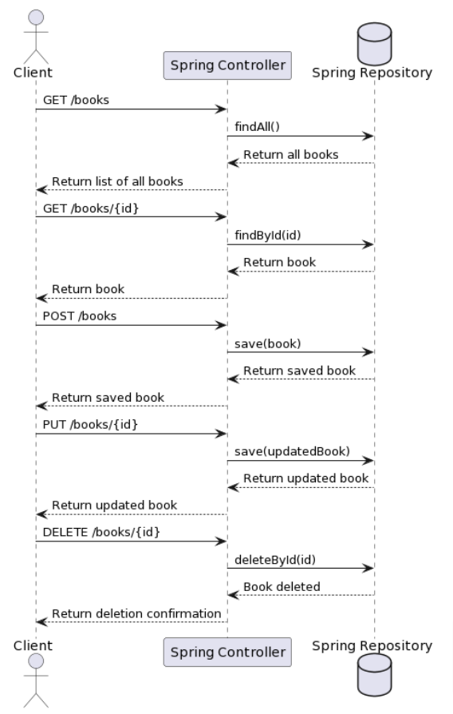

## Урок 6. Проектирование и реализация API для серверного приложения

### <u>Термины, используемые в лекции</u>

**API (Application Programming Interface)** — интерфейс приложения, который позволяет разработчикам взаимодействовать с другими программами или сервисами.
**REST (Representational State Transfer)** — архитектурный стиль проектирования сетевых приложений.
**HTTP методы** — такие как GET, POST, PUT, DELETE, и другие.
**Endpoint** — конечная точка доступа API, обычно указывает на конкретный ресурс или коллекцию ресурсов.
**JSON (JavaScript Object Notation)** — формат обмена данными, часто используемый в RESTful API.
**Authentication & Authorization** — аутентификация и авторизация пользователей.
**OAuth** — стандарт авторизации, который часто используется для предоставления доступа к ресурсам без раскрытия учетных данных.
**Rate Limiting** — ограничение количества запросов, которые пользователь или приложение может сделать к API за определенный промежуток времени.
**Swagger/OpenAPI** — инструменты и спецификации для документирования и тестирования API.

### <u>API: возвращение к основам</u>

API, или интерфейс программирования приложений, это своеобразная «договоренность», контракт между клиентом и сервером. Он указывает, какие запросы может делать клиент, и какие ответы он должен ожидать. Все это в формате, который машины понимают. Если вспомнить, это как меню в ресторане: вы выбираете блюдо, официант передает ваш заказ кухне (серверу), и вам приносят то, что вы заказали. Весь этот процесс регулируется “меню” - нашим API.

API могут быть различными: веб-API, операционные системы имеют свои API, библиотеки программирования также используют API. Но в контексте веб-разработки на Spring мы главным образом будем говорить о веб-API. Это позволяет клиентам, например, веб-браузерам или мобильным приложениям, общаться с нашим сервером, делать запросы и получать ответы.

В общем, API – это ключевой элемент любого веб-приложения. Это то, что позволяет нам создавать интерактивные, динамические и полнофункциональные приложения, которые мы видим и используем каждый день.

### <u>CRUD и интеграции</u>

CRUD – это аббревиатура, которая означает четыре базовые функции, которые большинство веб-сервисов обеспечивают пользователям: Создание (Create), Чтение (Read), Обновление (Update) и Удаление (Delete). Называют их так, потому что каждая буква в слове “CRUD” соответствует начальной букве каждой из этих операций на английском языке.

Так, давайте разберемся с каждой из этих операций:
1. Создание (Create): Эта операция обеспечивает возможность создания нового объекта в базе данных. Например, создание нового пользователя, нового поста в блоге или нового товара в интернет-магазине.
2. Чтение (Read): Операция чтения позволяет пользователям получать данные из базы. Это может быть чтение списка всех пользователей, отдельного поста в блоге или информации о конкретном товаре.
3. Обновление (Update): Операция обновления позволяет изменить существующие данные. Например, обновление профиля пользователя, редактирование поста в блоге или изменение описания товара.
4. Удаление (Delete): И, наконец, операция удаления. Она позволяет удалить существующие данные. Это может быть удаление учетной записи пользователя, поста в блоге или товара из каталога.

Почему же CRUD так важен? Потому что большинство веб-сервисов основаны на этих четырех операциях. Они формируют основу любого интерактивного веб-приложения, которое позволяет пользователям вносить, извлекать, обновлять и удалять данные. Без них, ваши пользователи просто не смогут взаимодействовать с вашим приложением.

Так что, когда мы говорим о проектировании и реализации API, мы часто говорим о создании эффективных и безопасных способов для выполнения этих CRUD-операций.

Представьте, что вы строите дом. Операции CRUD - это как строительные блоки, кирпичи, из которых вы строите основу дома. Но дом - это не только стены. У вас могут быть окна, двери, плитка на полу, камин. Эти элементы представляют собой интеграции в нашем мире веб-разработки.

Так что же такое интеграции? В общем смысле, интеграции - это способы взаимодействия вашего приложения с другими приложениями или сервисами. Это как двери и окна в вашем доме - они обеспечивают связь с внешним миром.

Давайте рассмотрим несколько примеров. Возможно, вы когда-нибудь использовали веб-сайт или приложение, которое позволяет вам войти с помощью вашего аккаунта Google или Facebook. Это пример интеграции с сервисами аутентификации Google и Facebook.

Еще один пример – интеграция с сервисами оплаты, такими как PayPal или Stripe. Если вы когда-либо покупали что-то в интернете, скорее всего, вы использовали один из этих сервисов для оплаты.

Интеграции могут быть еще более сложными, включая взаимодействие с API других сервисов, таких как сбор и анализ данных, обработка изображений, машинное обучение и многое другое.

Зачастую, во время интеграции используются те самые строительные блоки - CRUD-операции. Важно понимать, что иногда они не могут покрыть все потребности вашего приложения. Возможно, вам потребуется взаимодействовать с другими сервисами или предоставить пользователям более сложные возможности. Именно в этих случаях вы будете использовать интеграции.

### <u>Проектирование API</u>

Так, мы разобрались, что такое API и для чего он нужен. Но почему важно правильно проектировать API? Что может пойти не так, если в компании неправильно подходят к этому процессу? Давайте разберемся вместе.

Представьте, что вы строите мост. Этот мост должен быть прочным, надежным и безопасным для проезда автомобилей. Но что произойдет, если вы не правильно спроектируете мост? Он может оказаться нестабильным, опасным для проезда или даже может обрушиться. Как минимум, это вызовет недовольство у тех, кто пытается пользоваться мостом. В худшем случае, это может привести к серьезным последствиям.

То же самое с проектированием API. Если API плохо спроектирован, это может вызвать ряд проблем. Вот некоторые из них:
1. Непредсказуемое поведение: Если API неправильно спроектирован, он может работать не так, как ожидается. Это может привести к ошибкам, багам и проблемам при взаимодействии клиентов с сервером.
2. Сложности в поддержке: Неправильно спроектированный API может быть сложно поддерживать и обновлять. Это может стать большой проблемой, особенно когда ваше приложение растет и развивается.
3. Проблемы с безопасностью: Несмотря на то что важность безопасности при проектировании API трудно переоценить, недостаточно хорошо спроектированный API может иметь уязвимости, которые злоумышленники могут использовать для атаки на ваше приложение.
4. Плохой пользовательский опыт: Если ваш API сложно использовать или понять, разработчики, которые пытаются использовать ваш API, могут столкнуться с проблемами. Это может отпугнуть их от использования вашего API или приложения.

Так что проектирование API - это не просто задача, это ответственность. Это ответственность перед пользователями, перед разработчиками и перед будущим вашего приложения. Именно поэтому так важно уделить этому процессу должное внимание.

### <u>Обработка ошибок</u>

Один из самых узких моментов в проектировании API – ошибки. Ведь важно не просто их исправлять, правильно?

Представьте, что вы смотрите фильм, и вдруг он внезапно прерывается. Экран становится черным, и вы не понимаете, что произошло. Вас переполняет недоумение, раздражение и, возможно, даже злость. С другой стороны, если на экране появляется сообщение с объяснением, что произошло и что делать дальше, вы, хоть и расстроены, чувствуете себя в курсе дела.

То же самое с ошибками в API. Всегда будут случаи, когда что-то пойдет не так. Важно не просто обрабатывать эти ошибки, но и давать понятные, информативные сообщения об ошибках. Это помогает пользователям вашего API понять, что произошло и как исправить проблему.

Именно здесь вступают в игру стандарты HTTP-кодов ошибок. Эти стандарты представляют собой набор кодов состояния HTTP, которые используются для описания различных типов ошибок, которые могут возникнуть при обработке HTTP-запроса.

Вот несколько примеров:
- 4xx ошибки клиента: Эти ошибки указывают на проблемы, связанные с запросом, отправленным клиентом. Например, “404 Not Found” означает, что запрошенный ресурс не найден на сервере.
- 5xx ошибки сервера: Эти ошибки указывают на проблемы на стороне сервера. Например, “500 Internal Server Error” означает, что на сервере произошла ошибка, и он не может обработать запрос.

Умение правильно обрабатывать ошибки и использовать соответствующие коды состояния HTTP - это ключевой навык при проектировании и реализации API. Это помогает сделать ваш API более понятным, прозрачным и легким в использовании.

### <u>Исключения в Spring</u>

В Spring есть несколько способов обработки исключений и возврата соответствующих ответов клиенту. В качестве базового инструмента мы имеем механизм исключений Java, который можно дополнить специфическими для Spring функциями.

Допустим, у нас есть простой контроллер, который возвращает данные пользователя. Но что, если пользователь с запрашиваемым идентификатором не найден? Мы можем выбросить исключение, которое будет обработано соответствующим образом.
```java
@GetMapping("/users/{id}")
public User getUser(@PathVariable Long id) {
    return userRepository.findById(id)
        .orElseThrow(() -> new ResourceNotFoundException("User not found with id " + id));
}
```
Здесь, если пользователь не найден, мы выбрасываем исключение ResourceNotFoundException. Но как нам перехватить это исключение и вернуть правильный HTTP-ответ?

Один из способов - использовать аннотацию @ExceptionHandler внутри нашего контроллера:
```java
@ControllerAdvice
public class GlobalExceptionHandler {
    @ExceptionHandler(ResourceNotFoundException.class)
    public ResponseEntity<?> handleResourceNotFoundException(ResourceNotFoundException exception) {
        return ResponseEntity
            .status(HttpStatus.NOT_FOUND)
            .body(exception.getMessage());
    }
}
```
Здесь мы создали класс GlobalExceptionHandler, который будет обрабатывать исключения на уровне всего приложения (благодаря аннотации @ControllerAdvice). Внутри этого класса мы определили метод, который будет обрабатывать исключения типа ResourceNotFoundException.

При обработке такого исключения, мы возвращаем ответ с HTTP-статусом 404 (Not Found) и сообщением об ошибке из исключения.

Такой подход обеспечивает ясность и предсказуемость ваших API: когда что-то идет не так, клиент получает понятное сообщение об ошибке и соответствующий код состояния HTTP.

### <u>Практика</u>

Представьте, что вы работаете в компании, которая разрабатывает веб-приложения, и вам только что дали новое задание. Ваша задача - проектировать и разработать сервис для управления книжным магазином. Клиенты должны иметь возможность просматривать список книг, добавлять новые книги, обновлять информацию о существующих книгах и удалять книги. Все это должно быть реализовано с помощью API на базе Spring.

При этом, ваш сервис должен обеспечивать следующие возможности:
- Получение списка всех книг;
- Получение информации о конкретной книге;
- Добавление новой книги;
- Обновление информации о существующей книге;
- Удаление книги.

Задача кажется сложной, но не беспокойтесь! Мы разобьем ее на несколько шагов и разберем каждый из них по отдельности. В конечном итоге, мы пройдем следующие этапы:
1. Проектирование API: Сначала мы определим, как должен выглядеть наш API, какие эндпоинты будут доступны и какие данные будут передаваться.
2. Создание проекта и моделей: Затем мы создадим новый проект Spring и определим основные модели данных.
3. Реализация репозитория: Далее, мы реализуем репозиторий для работы с базой данных.
4. Реализация слоя сервисов: Затем, мы создадим слой сервисов, который будет обрабатывать бизнес-логику приложения.
5. Реализация контроллера: И, наконец, мы реализуем контроллер, который будет обрабатывать HTTP-запросы и взаимодействовать со слоем сервисов.

### <u>Шаг 1: Проектирование API сервиса для книжного магазина</u>

При проектировании API, важно подумать о том, какой функционал нам необходим, и как он будет представлен в виде HTTP-маршрутов и методов. Здесь нашей главной целью является обеспечение CRUD-операций над книгами.

Давайте начнем с проектирования эндпоинтов:
1. GET /books: Получение списка всех книг. Это будет основной запрос, который позволит пользователям видеть все доступные книги.
2. GET /books/{id}: Получение информации о конкретной книге. Здесь {id} - это идентификатор книги. Этот запрос позволит пользователям получать подробную информацию о конкретной книге.
3. POST /books: Добавление новой книги. Здесь данные о новой книге будут отправляться в теле запроса в формате JSON.
4. PUT /books/{id}: Обновление информации о существующей книге. Здесь {id} - это идентификатор книги, а обновленные данные о книге будут отправляться в теле запроса в формате JSON.
5. DELETE /books/{id}: Удаление книги. Здесь {id} - это идентификатор книги.

Мы выбрали эти эндпоинты и методы, потому что они соответствуют стандартному подходу к проектированию RESTful API и позволяют нам ясно и прозрачно представить CRUD-операции над книгами.

Мы использовали метод GET для получения данных, POST для создания новых записей, PUT для обновления существующих записей и DELETE для удаления записей, как это рекомендуется в принципах REST.

Теперь, давайте определим структуру данных для нашей книги. Каждая книга будет иметь следующие атрибуты:
- id: Уникальный идентификатор книги.
- title: Название книги.
- author: Автор книги.
- isbn: Уникальный номер ISBN книги.
- publicationYear: Год публикации книги.

Это базовая информация о книге, которую мы хотим хранить и предоставлять пользователям.

Таким образом, мы проектируем API, который позволяет пользователям просматривать, добавлять, обновлять и удалять книги в нашем книжном магазине, а также получать подробную информацию о каждой книге.

[](./end-point.png)

Данная диаграмма описывает последовательность взаимодействия между клиентом, контроллером Spring и репозиторием Spring.
1. В верхнем блоке мы видим взаимодействие при запросе списка всех книг. Клиент отправляет GET запрос на эндпоинт “/books”, контроллер обращается к репозиторию с запросом findAll(), репозиторий возвращает все книги контроллеру, который, в свою очередь, отправляет их клиенту.
2. Второй блок описывает процесс получения информации о конкретной книге. Клиент отправляет GET запрос на эндпоинт “/books/{id}”, контроллер обращается к репозиторию с запросом findById(id), репозиторий возвращает информацию о книге, которую контроллер отправляет клиенту.
3. Третий и четвертый блоки описывают процесс добавления новой книги и обновления существующей. В обоих случаях клиент отправляет POST или PUT запрос на соответствующий эндпоинт, контроллер вызывает метод save() репозитория, который сохраняет или обновляет информацию о книге и возвращает ее контроллеру. Контроллер затем отправляет эту информацию обратно клиенту.
4. Последний блок описывает процесс удаления книги. Клиент отправляет DELETE запрос на эндпоинт “/books/{id}”, контроллер вызывает метод deleteById(id) репозитория, который удаляет книгу. Контроллер затем возвращает подтверждение об удалении клиенту.

### <u>Шаг 2: Создание проекта и моделей</u>

Для начала создания проекта мы будем использовать Spring Initializr, веб-интерфейс, который позволяет нам быстро и легко создать структуру проекта Spring Boot.
1. Перейдите на Spring Initializr.
2. Выберите “Maven Project”, “Java” и версию Spring Boot (рекомендуется последняя стабильная версия).
3. Введите информацию о проекте в соответствующие поля.
4. Добавьте необходимые зависимости. Для нашего проекта нам понадобятся: Spring Web, Spring Data JPA, Spring HATEOAS и H2 Database.
5. Нажмите “Generate” для создания проекта.

После этого вам будет предложено скачать архив с шаблоном проекта, который можно разархивировать и открыть в вашей любимой среде разработки.

Теперь, давайте перейдем к моделям. Нам нужна модель для книги. В Java модели представлены в виде классов. Давайте определим класс Book:
```java
import javax.persistence.Entity;
import javax.persistence.GeneratedValue;
import javax.persistence.GenerationType;
import javax.persistence.Id;

@Entity
public class Book {
    @Id
    @GeneratedValue(strategy = GenerationType.AUTO)
    private Long id;
    private String title;
    private String author;
    private String isbn;
    private int publicationYear;
    // getters and setters
}
```
Здесь:
- @Entity: Это аннотация говорит Spring, что данный класс является сущностью, которую нужно учесть при создании схемы базы данных.
- @Id и @GeneratedValue: Эти аннотации указывают, что поле id является уникальным идентификатором (ключом) для каждой книги и что его значение будет автоматически генерироваться.
- private Long id; private String title; private String author; private String isbn; private int publicationYear; Это поля нашего класса. Каждое поле представляет собой атрибут, который мы хотим хранить для каждой книги.
- getters and setters: Это методы, которые позволяют нам получать и устанавливать значения полей класса.

### <u>Шаг 3: Реализация слоя репозитория</u>

После создания модели мы можем перейти к реализации слоя репозитория. Репозиторий - это слой, который отвечает за взаимодействие с базой данных. С его помощью мы можем выполнять CRUD-операции и другие запросы к базе данных.

В Spring, для создания репозиториев, мы используем Spring Data JPA, который предоставляет нам готовые интерфейсы, включающие множество удобных методов для работы с базой данных. Давайте создадим репозиторий для нашего класса Book:
```java
import org.springframework.data.jpa.repository.JpaRepository;

public interface BookRepository extends JpaRepository<Book, Long> {
}
```
Здесь:
- BookRepository: Это имя нашего репозитория. Обычно оно базируется на имени соответствующего класса модели с добавлением суффикса “Repository”.
- extends JpaRepository: Здесь мы говорим, что наш репозиторий должен расширять JpaRepository, что дает нам доступ к ряду готовых методов для работы с базой данных, таких как findAll(), findById(), save(), deleteById(), и других.
- Book, Long: Это параметры типа для JpaRepository. Book - это класс сущности, с которым будет работать репозиторий, а Long - тип идентификатора этой сущности.

Итак, в нашем репозитории у нас уже есть базовые CRUD-операции. В случае необходимости выполнить более сложные запросы, мы можем добавить в репозиторий собственные методы.

### <u>Шаг 4: Реализация сервис-слоя</u>

После создания слоя репозиториев переходим к реализации слоя сервисов. Для этого создадим сервисный класс BookService, который будет содержать бизнес-логику нашего приложения:
```java
import org.springframework.beans.factory.annotation.Autowired;
import org.springframework.stereotype.Service;
import java.util.List;
import java.util.Optional;

@Service
public class BookService {
    private final BookRepository bookRepository;

    @Autowired
    public BookService(BookRepository bookRepository) {
        this.bookRepository = bookRepository;
    }

    public List<Book> findAll() {
        return bookRepository.findAll();
    }

    public Optional<Book> findById(Long id) {
        return bookRepository.findById(id);
    }

    public Book save(Book book) {
        return bookRepository.save(book);
    }

    public void deleteById(Long id) {
        bookRepository.deleteById(id);
    }
}
```
- @Service: Это аннотация Spring, которая указывает, что данный класс является сервисом. Это помогает Spring определить этот класс при сканировании компонентов.
- private final BookRepository bookRepository; Здесь мы инжектируем наш репозиторий в сервис. Это позволяет нам использовать методы репозитория внутри сервиса.
- @Autowired: Это аннотация Spring, которая автоматически инжектит бин в конструктор. В данном случае, Spring будет автоматически передавать экземпляр BookRepository при создании экземпляра BookService.
- public List findAll(); public Optional findById(Long id); public Book save(Book book); public void deleteById(Long id); Это наши методы сервиса. Каждый из этих методов обращается к соответствующему методу репозитория для выполнения операции и возвращает результат.

Таким образом, слой сервисов выступает как посредник между контроллерами и репозиториями, обеспечивая место для бизнес-логики нашего приложения.

### <u>Шаг 5: Реализация контроллера</u>

Теперь, когда у нас есть слой сервисов, который обеспечивает бизнес-логику, мы можем перейти к созданию контроллера. Контроллеры в Spring – это классы, которые обрабатывают входящие HTTP-запросы и возвращают ответы.

Давайте создадим класс BookController для обработки запросов, связанных с книгами:
```java
import org.springframework.beans.factory.annotation.Autowired;
import org.springframework.http.ResponseEntity;
import org.springframework.web.bind.annotation.*;
import java.util.List;
import java.util.Optional;

@RestController
@RequestMapping("/books")
public class BookController {
    private final BookService bookService;

    @Autowired
    public BookController(BookService bookService) {
        this.bookService = bookService;
    }

    @GetMapping
    public List<Book> findAll() {
        return bookService.findAll();
    }

    @GetMapping("/{id}")
    public ResponseEntity<Book> findById(@PathVariable Long id) {
        Optional<Book> book = bookService.findById(id);
        return book.map(ResponseEntity::ok)
            .orElseGet(() -> ResponseEntity.notFound().build());
    }

    @PostMapping
    public Book save(@RequestBody Book book) {
        return bookService.save(book);
    }

    @PutMapping("/{id}")
    public Book update(@RequestBody Book book, @PathVariable Long id) {
        book.setId(id);
        return bookService.save(book);
    }

    @DeleteMapping("/{id}")
    public void deleteById(@PathVariable Long id) {
        bookService.deleteById(id);
    }
}
```
- @RestController: Это аннотация Spring, которая говорит, что данный класс является контроллером и должен быть инициализирован при запуске приложения.
- @RequestMapping(“/books”): Эта аннотация задает базовый маршрут для всех методов в этом контроллере. В данном случае, все наши эндпоинты будут начинаться с “/books”.
- private final BookService bookService; Здесь мы инжектируем наш сервис в контроллер. Это позволяет нам использовать методы сервиса внутри контроллера.
- @Autowired: Эта аннотация Spring автоматически инжектирует бин в конструктор. В данном случае, Spring будет автоматически передавать экземпляр BookService при создании экземпляра BookController.
- @GetMapping; @PostMapping; @PutMapping; @DeleteMapping: Эти аннотации Spring задают HTTP-метод для каждого из методов контроллера. Они соответствуют стандартным CRUD-операциям: получение, создание, обновление и удаление.
- public List findAll(); public ResponseEntity findById(@PathVariable Long id); public Book save(@RequestBody Book book); public Book update(@RequestBody Book book, @PathVariable Long id); public void deleteById(@PathVariable Long id); Это наши методы контроллера. Каждый из этих методов обращается к соответствующему методу сервиса для выполнения операции и возвращает результат.

Таким образом, слой контроллеров отвечает за обработку HTTP-запросов и взаимодействует со слоем сервисов для выполнения бизнес-логики.

### <u>Запуск и тестирование сервиса</u>

После реализации всех слоев нашего приложения пришло время его запустить и протестировать.

Для запуска нашего приложения, мы можем просто запустить главный класс приложения, который был автоматически создан Spring Initializr при создании проекта. Этот класс содержит метод main(), который запускает наше приложение. В большинстве IDE запуск проекта осуществляется простым нажатием кнопки “Run”.

После того, как наше приложение запущено, мы можем протестировать его, используя любой HTTP-клиент. Один из самых популярных HTTP-клиентов – это Postman, но вы также можете использовать любой другой клиент или даже командную строку.

Во время тестирования нам следует опираться на результаты нашего проектирования API. Мы создали эндпоинты для выполнения CRUD-операций над книгами, и теперь мы можем проверить их работу.
1. GET /books: Введите этот URL в вашем HTTP-клиенте и отправьте GET-запрос. В ответе вы должны получить список всех книг.
2. POST /books: Отправьте POST-запрос на этот URL с JSON-объектом, содержащим информацию о книге, в теле запроса. В ответе вы должны получить созданную книгу.
3. GET /books/{id}: Замените {id} на идентификатор книги и отправьте GET-запрос на этот URL. В ответе вы должны получить информацию о соответствующей книге.
4. PUT /books/{id}: Замените {id} на идентификатор книги и отправьте PUT-запрос на этот URL с JSON-объектом, содержащим обновленную информацию о книге, в теле запроса. В ответе вы должны получить обновленную книгу.
5. DELETE /books/{id}: Замените {id} на идентификатор книги и отправьте DELETE-запрос на этот URL. В ответе вы должны получить подтверждение об удалении книги.

Таким образом, мы можем убедиться, что наше приложение работает правильно и соответствует требованиям, которые мы определили во время проектирования.

Этап проектирования — это неотъемлемая часть любого процесса разработки программного обеспечения. Он служит основой для всего процесса и задает направление для всех последующих шагов. Переход к написанию кода без проведения детального этапа проектирования — это как строительство дома без проекта: возможно, некоторые вещи вы получите правильно, но велик шанс, что без твердого плана вы столкнетесь с непредвиденными проблемами, которые могли бы быть избежаны.
1. Недостаток структуры и организации: Без продуманного проектирования ваш код может стать сложным и запутанным. Это может усложнить работу с кодом, внесение изменений и поиск ошибок.
2. Неэффективность и повторение кода: Без четкого плана вы можете внезапно обнаружить, что пишете один и тот же код снова и снова, что не только увеличивает время разработки, но и делает код менее эффективным и труднее для поддержки.
3. Проблемы с производительностью: На этапе проектирования мы обычно учитываем вопросы производительности. Без проектирования вы можете упустить важные оптимизации, что приведет к медленной работе вашего приложения.
4. Трудности в интеграции: Без проектирования сложнее гарантировать, что разные части вашего приложения будут корректно работать вместе. Интеграция компонентов может стать настоящим вызовом, если вы не продумали их взаимодействие заранее.
5. Увеличение времени и стоимости разработки: Все вышеуказанные проблемы приводят к увеличению времени и стоимости разработки. Недостатки в проектировании обычно выявляются только после того, как код уже написан, что означает, что исправление этих недостатков может потребовать больших изменений в коде.

Таким образом, хотя этап проектирования может показаться временем, которое можно было бы потратить на написание кода, на самом деле это критически важная фаза, которая позволяет сэкономить время, уменьшить ошибки и улучшить качество вашего кода в долгосрочной перспективе.

### <u>Инструменты для проектирования API</u>

На этапе проектирования мы создаем своего рода “дорожную карту” нашего приложения, включающую в себя структуру данных, бизнес-логику, архитектуру API и другие важные аспекты. Существует множество инструментов, которые могут облегчить этот процесс и помочь нам организовать наши идеи.
1. Swagger (OpenAPI): Swagger — это один из самых популярных инструментов для проектирования, создания, документирования и тестирования RESTful веб-сервисов. Он использует спецификацию OpenAPI для описания структуры API и обеспечивает интерактивную документацию, которую можно просматривать и тестировать в веб-браузере. Этот инструмент часто используется в крупных компаниях, таких как IBM, Microsoft и Adobe.
2. Postman: Postman – это платформа для тестирования API, которая также предлагает функции для проектирования, мониторинга, документирования и публикации API. Он предоставляет удобный графический интерфейс для создания и тестирования запросов, а также инструменты для автоматизации тестирования и мониторинга производительности API.
3. Apiary: Apiary предлагает инструменты для проектирования, документирования и тестирования API. Он поддерживает как REST, так и JSON API, и позволяет разработчикам создавать макеты API и тестировать их прямо в браузере.
4. AWS CloudFormation: AWS CloudFormation – это сервис Amazon Web Services (AWS), который помогает пользователям моделировать и устанавливать ресурсы в облаке. Этот инструмент активно используется для проектирования облачных инфраструктур.
5. Microsoft Azure API Management: Этот инструмент предоставляет решение для публикации, управления, обслуживания и мониторинга API в Microsoft Azure.

Важно отметить, что выбор инструмента во многом зависит от ваших конкретных требований и предпочтений. Некоторые инструменты предлагают более широкий набор функций, в то время как другие могут быть проще в использовании.

### <u>Автоматическая документация API</u>

Когда дело доходит до API, хорошая документация играет критически важную роль. Она помогает разработчикам понять, как использовать ваш API, и облегчает процесс интеграции. Однако ручное создание и обновление документации может быть трудоемким процессом. Именно здесь на помощь приходит автоматическая документация, и один из наиболее популярных инструментов для этого – Swagger.

Swagger – это набор инструментов для работы с OpenAPI-спецификацией, который, в частности, позволяет автоматически генерировать документацию для вашего API. Он собирает информацию прямо из вашего кода и создает интерактивную документацию, которую можно просматривать в браузере.

Существуют два основных способа использования Swagger для автоматической документации:
1. Аннотации Swagger в коде: Вы можете добавить специальные аннотации Swagger непосредственно в свой код, чтобы описать функциональность вашего API. Swagger затем просматривает эти аннотации и создает на их основе документацию.
2. Swagger Codegen: Это инструмент, который генерирует серверные стабы и клиентские SDK на основе вашей OpenAPI-спецификации. То есть вы можете начать с написания спецификации вашего API, а затем Swagger Codegen сгенерирует большую часть кода за вас, включая документацию.

Оба эти подхода могут значительно упростить процесс создания документации, обеспечивая актуальность и точность документации и экономя время разработчиков. Кроме того, поскольку документация Swagger является интерактивной, разработчики могут прямо в браузере просматривать доступные эндпоинты API, их параметры и даже отправлять тестовые запросы.

### <u>Генерация документации Swagger</u>
Для генерации документации Swagger для нашего проекта, нам нужно сначала
добавить зависимость Swagger в наш проект. Для этого в файл pom.xml (если вы
используете Maven) или build.gradle (если вы используете Gradle) нужно добавить
следующую зависимость:
```xml
<!-- для Maven -->
<dependency>
    <groupId>io.springfox</groupId>
    <artifactId>springfox-boot-starter</artifactId>
    <version>3.0.0</version>
</dependency>
```
```groovy
// для Gradle
implementation 'io.springfox:springfox-boot-starter:3.0.0'
```
После того, как вы добавили зависимость, вам нужно настроить Swagger. Создайте новый конфигурационный класс SwaggerConfig следующим образом:
```java
import springfox.documentation.builders.RequestHandlerSelectors;
import springfox.documentation.spi.DocumentationType;
import springfox.documentation.spring.web.plugins.Docket;
import springfox.documentation.swagger2.annotations.EnableSwagger2;

@EnableSwagger2
@Configuration
public class SwaggerConfig {
    @Bean
    public Docket api() {
        return new Docket(DocumentationType.SWAGGER_2)
            .select()
            .apis(RequestHandlerSelectors.basePackage("com.example"))
            .build();
    }
}
```
Здесь мы создаем экземпляр Docket, который настраивает Swagger. Мы указываем, что хотим использовать Swagger 2 и затем выбираем API, которые хотим документировать. В этом случае мы документируем все API в пакете com.example.

После того, как вы настроили Swagger, вы можете запустить свое приложение и перейти по адресу http://localhost:8080/swagger-ui/ (предполагая, что ваше приложение запущено на порту 8080). Здесь вы увидите интерактивную документацию Swagger для вашего API, включая описание всех ваших эндпоинтов, их параметров и возможных ответов.

Так, например, для нашего эндпоинта GET /books Swagger покажет, что этот эндпоинт возвращает список книг, и позволит вам нажать кнопку “Try it out” для отправки тестового запроса к этому эндпоинту.