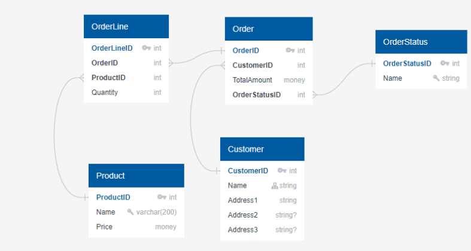
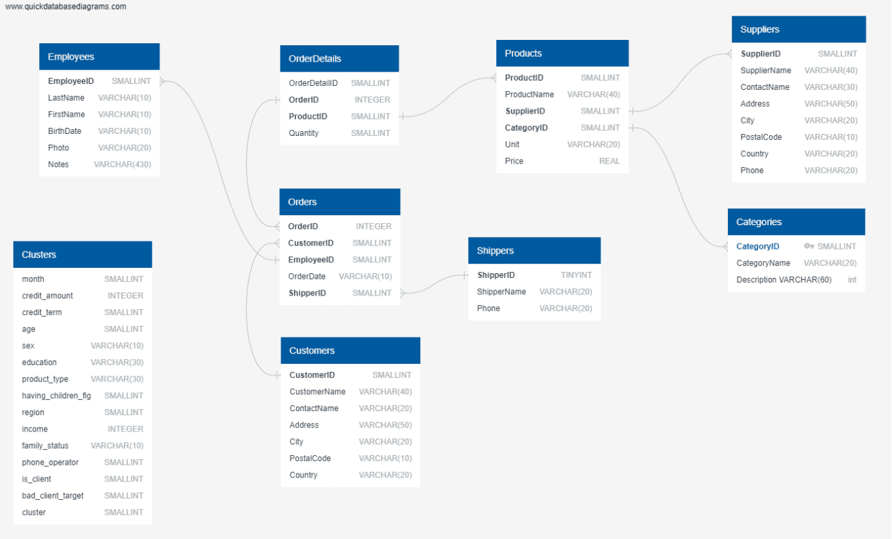

## Урок 1. Инструменты для работы с базами данных

### Термины, используемые в лекции

**СУБД** – Система управления базами данных. Комплекс программ, позволяющих создать базу данных и манипулировать данными (вставлять, обновлять, удалять и выбирать).

**SQL** – Structured Query Language. Формально не относится к классическим языкам программирования, а является инструкциями для управления данными, которые хранятся в системе управления базами данных. Как правило, когда говорят SQL подразумевают реляционные базы данных.

**NoSQL** – Подход к управлению базами данных, который может работать с широким спектром моделей данных, таких как key-value, колоночная, документная и т.д. База данных NoSQL обычно означает, что она нереляционная, распределенная, гибкая и масштабируемая. Первоначально термин NoSQL можно было понять дословно, то есть SQL не используется для доступа к данным. Однако повсеместное распространение и полезность SQL заставили многие базы данных NoSQL добавить поддержку SQL. Сегодня общепринято, что NoSQL означает «Не только SQL». Таким образом, если вы знаете SQL, то сможете работать со всеми базами данных.

**ACID** – (atomicity, consistency, isolation, durability) — набор требований к транзакционной системе, обеспечивающий наиболее надежную и предсказуемую её работу.

**Первичный ключ** — это специальное поле в таблице, которое однозначно идентифицирует каждую запись/строку в БД. Они содержат уникальные значения. NULL в столбце первичного ключа стоять не может.

**Внешний ключ** — поле таблицы, которое ссылается на поля другой таблицы.

**Реляционные базы данных** – базы данных, которые используются для хранения и предоставления доступа к взаимосвязанным элементам информации. Реляционные базы данных основаны на реляционной модели — интуитивно понятном, наглядном табличном способе представления данных. Каждая строка, содержащая в таблице такой базы данных, представляет собой запись с уникальным идентификатором, который называют ключом. Столбцы таблицы имеют атрибуты данных, а каждая запись обычно содержит значение для каждого атрибута, что дает возможность легко устанавливать взаимосвязь между элементами данных.

**Нереляционные базы данных** – база данных, в которой в отличие от большинства традиционных систем баз данных не используется табличная схема строк и столбцов. В этих базах данных применяется модель хранения, оптимизированная под конкретные требования типа хранимых данных.

**Кортеж** — группа взаимосвязанных элементов, строка в таблице.

### Типичные задачи аналитика данных

Как бы это не звучало тривиально основные задачи аналитика данных заключаются в анализе данных. При этом задачи условно можно разделить на ad-hoc’и и регулярные.

Ad-hoc’и - это как правило небольшие задачи типа выгрузить данные из таблиц по определенному правилу, рассчитать бизнес метрику на клиентах и тому подобное.

Например, нужно посмотреть как меняется во времени средний бак, когда клиенты у нас заправляют топливо. Естественно, что разные виды топлива здесь необходимо разделить. Если вы заправляете дизель, то в среднем заливаете 44 литра, а для бензина эта величина составляет 25 литров.

В первую очередь, такие различия вызваны тем, что для расчета среднего бака брались все пистолеты на АЗС, как легковые, так и грузовые. При этом грузовики часто работают на дизеле и всегда заправляются большими объемами.

Конечно, здесь можно усложнить логику, если вы хотите сравнивать средний бак для дизеля и бензина. Можно исключить чеки, которые прошли по грузовым (отдельным) пистолетам. Тогда действительно средний бак дизеля уменьшится. Но даже в этом случае, из-за того что на дизеле у нас ездят крупные внедорожники, средний бак будет больше.

Другая возможная задача — посчитать LTV (life time value, прибыль, которую приносит вам пользователь за все время работы с ним) для клиентов в различных разрезах. И здесь уже нужно проявить некоторую фантазию. Посчитать деньги просто. Но как определить время жизни клиента, когда клиент к нам не вернется, а когда может вернуться. Если у вас сервис на абонентской плате, то здесь можно принять простое решение. Человек не оплатил три абонентских платы, считаем, что он не вернется. А если вы работаете в медицинской клиники. Среднее время между визитами у клиентов 8-10 месяцев, 15% клиентов между визитами имеют расстояние больше трех лет. Как тогда здесь определить время жизни клиента. Сразу скажу, что точного ответа на этот вопрос нет и команда принимает взвешенное решение.

При решении подобного класса задач помимо доступа к базам данных и знания SQL понадобиться владеть и Python. Часто приходится выгружать данные и потом их удобно анализировать, считать метрики и строить графики средствами Python.

Если мы будем говорить про регулярные задачи, то к таким можно отнести задачи получения отчетов. Раз в неделю вам нужно запустить скрипт, проверить, что он отработал. Проверить получившиеся числа. Проконтролировать направление изменений этих чисел и принять решение что делать дальше.

К регулярным задачам также можно отнести задачи разработки дашбордов. Когда вместо еженедельных отчетов у вас будет автоматически собираться информация в виде финальных красивых графиков и эти данные все заинтересованные люди смогут наблюдать в «реальном» времени.

При решении регулярных задач аналитику-разработчику понадобиться дополнительно знать программы класса BI (Business intelligence), такие как PowerBI, Tableay, QlikSense и другие. Данные платформы предлагают расширенные инструменты визуализации данных и их доставки пользователям.

Во всех этих задачах приходится обрабатывать данные. Предполагается, что эти данные где-то хранятся, они систематизированы и регулярно обновляются. Вот как раз для этого и используются базы данных.

### Типы баз данных

Бизнесмен Клайв Хамби в 2006 году сказал: «Данные — это новая нефть», а вице-президент американской Ассоциации рекламодателей (Association of National Advertisers) Майкл Палмер развил эту мысль: «Данные похожи на сырье. Оно полезно, но в необработанном виде непригодно для использования. Его необходимо преобразовать в газ, пластмассу, химикаты и тому подобные вещи…». Сейчас, чтобы принять решение и глубоко понимать свои стратегии, необходимо управлять и анализировать большой объем данных. Все эти данные, будь то логи пользователей, их покупки и траты и даже картинки и видео, необходимо где-то хранить и уметь обрабатывать. Для всего этого используются различные базы. Давайте разберемся, какие данные существуют и где их можно хранить.

**Реляционные базы данных** — исторически одна из первых структур упорядоченного хранения данных. Данный курс в целом будет посвящен именно реляционным базам данных, как хранить данный, обрабатывать и получать необходимые результаты. Название «реляционный» здесь происходит из двух принципов. Во-первых, от слова relation, то есть в реляционной базе данных есть таблицы, между которыми имеется связь. Во-вторых, к таким таблицам может применяться реляционная алгебра (операции объединения, пересечения, разности и т.д.).

В целом в реляционной базе данных таблицы напоминают всем известные таблицы в Excel. Каждый столбец в таблице имеет определенное имя и тип тех данных, который хранится в нем. То есть если у нас есть столбец DATE, то в этом столбце будут храниться даты в определенном формате и база данных не позволит вам записать туда строковые переменные. Каждая строка представляет отдельную запись или элемент данных в таблице (кортеж), который содержит значения для каждого из столбцов.

На рисунке приведен пример организации таблиц и связей между ними на примере реляционных баз данных.

[](./sql_bd.png)

Как видно из рисунка, в каждой таблице есть идентификатор (id) для каждой записи в этой таблице (первичный ключ), идентификаторы на смежные таблицы (внешний ключ) и поля, характерные для таблицы. Как раз с помощью первичного и внешнего ключа формируется связь между таблицами. На этом примере можно определить виды связей. У каждого заказа в один момент времени может быть определенный статус, что обеспечивает нам связь один к одному. При этом в каждом заказе может быть несколько продуктов, что говорит о связи один ко многим. При этом разные клиенты могли заказывать разные продукты. Это приводит к формированию связи многих к многим.

К реляционным базам данных относятся следующие примеры:

**MSSQL** — продукт от Microsoft, который часто применяется в крупных корпорациях.

**MySQL** — популярная база данных от Oracle с открытым исходным кодом.

**PostgreSQL** — это опенсорсная реляционная СУБД. Работа с PostgreSQL не отличается от работы с любой другой СУБД. Данная База данных часто применяется для Web приложений поскольку легко масштабируется.

**SQLite** — автономная база данных без сервера SQL. Можно применять для простых локальных приложений, когда нет необходимости создавать громоздкие решения.

**Нереляционные базы данных** — большая группа различных типов баз данных, предлагающих подходы, отличные от стандартного реляционного шаблона. Также такие базы данных часто называют NoSQL. Говоря NoSQL, подразумевают либо «не-SQL», либо «не только SQL». При этом запросы в такие базы данных допускает SQL подобный диалект. Таким образом, если вы знаете SQL, то сможете разобраться и с работой нереляционных баз данных. Давайте посмотрим, какие основные типы нереляционных баз данных существуют и где они применяются.
1. Колоночные базы данных. Колоночные базы данных призваны решить проблему неэффективной работы традиционных СУБД в аналитических системах и системах в подавляющим большинством операций типа «чтение». Пожалуй этот тип баз данных будет встречаться в аналитике чаще всего после традиционных реляционных баз данных. Они позволяют на более дешевом и маломощном оборудовании получить прирост скорости выполнения запросов. При этом, благодаря компрессии, данные будут занимать на диске меньше места, чем в случае с традиционными баз данных. У колоночных баз данных есть и недостатки — они медленно работают на запись, не подходят для транзакционных систем и как правило, ввиду «молодости» имеют ряд ограничений для разработчика, привыкшего к развитым традиционным базам данных. Обычно колоночные базы данных применяются в аналитических системах класса business intelligence и аналитических хранилищах данных (data warehouses). Причем объемы данных могут быть достаточно большими — есть примеры по 300-500ТБ и даже случаи с >1ПБ данных. Примерами таких баз данных являются ClickHouse, Hbase и Vertica.
2. Key-value база данных. База данных на основе пар «ключ‑значение» – это тип нереляционных баз данных, в котором для хранения данных используется простой метод «ключ‑значение». База данных на основе пар «ключ‑значение» хранит данные как совокупность пар «ключ‑значение», в которых ключ служит уникальным идентификатором. Как ключи, так и значения могут представлять собой что угодно: от простых до сложных составных объектов. Базы данных с использованием пар «ключ‑значение» поддерживают высокую разделяемость и обеспечивают беспрецедентное горизонтальное масштабирование, недостижимое при использовании других типов баз данных. Например, Amazon DynamoDB выделяет дополнительные разделы на таблицу, если существующий раздел заполняется до предела и требуется больше пространства для хранения. Данный тип баз данных скорее применяется для временного хранения данных, таких как хранилище сессий приложений или корзина в интернет магазине. Ее ключевое преимущество в том, что данные могут храниться в оперативной памяти, в результате мы получаем самый быстрый доступ к данным. Примеры таких баз данных — это Redis, MemcacheDB.
3. Документные базы данных. Тип нереляционных баз данных, предназначенный для хранения и запроса данных в виде документов в формате, подобном JSON. Документная модель хорошо работает в таких примерах использования, как каталоги, пользовательские профили и системы управления контентом, где каждый документ уникален и изменяется со временем. Примеры таких баз данных — MongoDB, Amazon DocumentDB.

### CAP теорема

Для каждой задачи выбирается необходимый тип базы данных. Каждая база имеет свои преимущества и ограничения. При увеличении количества данных приходится данные хранить сразу на нескольких устройствах. В 2000 году Эрик Брюер представил CAP теорему, в которой говорится, что в распределенной (данные хранятся на нескольких устройствах) системе хранения возможно выбрать только два из трех свойств:
- C (Consistency) — согласованность. Каждое чтение даст вам самую последнюю запись, т.е. пользователи всегда будут видеть только актуальную и одинаковую для всех версию данных.
- A (Availability) — доступность. Каждый узел (не упавший) всегда успешно выполняет запросы (на чтение и запись).
- P (Partition tolerance) — устойчивость к разделению. При разбиении системы на несколько составляющих (разные сервера, доступные по сети) она продолжает работать корректно. Даже если между узлами нет связи, они продолжают работать независимо друг от друга.

### ACID концепция

**Требования ACID** — набор требований, которые обеспечивают сохранность ваших данных. Что особенно важно для финансовых операций. Мы же не хотим остаться без денег из-за разрыва соединения или ошибки в ПО, не так ли?

Давайте пройдемся по каждой букве ACID и посмотрим на примерах, чем архив лучше 10 разных файлов. И чем транзакция лучше 10 отдельных запросов.

**Atomicity** — Атомарность. Гарантирует, что каждая транзакция будет выполнена полностью или не будет выполнена совсем. Не допускаются промежуточные состояния.

**Consistency** — Согласованность. Это свойство вытекает из предыдущего. Благодаря тому, что транзакция не допускает промежуточных результатов, база остается консистентной. Есть такое определение транзакции: «Упорядоченное множество операций, переводящих базу данных из одного согласованного состояния в другое». То есть до выполнения операции и после база остается консистентной.

**Isolation** — Изолированность. Во время выполнения транзакции параллельные транзакции не должны оказывать влияния на её результат.

**Durability** — Надёжность (постоянство). Если пользователь получил подтверждение от системы, что транзакция выполнена, он может быть уверен, что сделанные им изменения не будут отменены из-за какого-либо сбоя. Обесточилась система, произошел сбой в оборудовании? На выполненную транзакцию это не повлияет.

Самый простой и очевидный пример — денежные переводы. Вы хотите отправить деньги подруге. Для этого они должны списаться с вашего счета и быть зачислены на счет подруги. И допустим, что у нас 2 отдельных запроса. А теперь посмотрим, что будет при возникновении ошибок:
● У вас на балансе нет нужной суммы — система вывела сообщение об ошибке, но катастрофы не произошло, атомарность тут не нужна.
● У подруги заблокирована карточка, истек срок годности — деньги ей не поступили. Запрос отменен. Но минуточку... У вас то они уже списались!

Вот как раз для таких ситуаций и нужен принцип ACID, чтобы быть уверенным, что все операции выполнены верно.

### Реляционная алгебра

Реляционная алгебра — это как раз те операции с данными, которые мы с вами будем делать, для того, чтобы получить необходимые метрики и измерения. Допустим у нас есть две таблицы А и В. Можно выделить традиционные операции над этими таблицами (множествами).
- Объединение — мы берем все элементы из таблицы А и В (А UNION В).
- Пересечение — мы берем только общие элементы, которые встречаются в двух таблица (А INTERSECT В).
- Разность — мы берем такие элементы из А, которых нет в В (А MINUS В)
- Декартово произведение — Каждому элементу таблицы А сцепляются элементы таблицы В (А TIMES В). Например, у вас 10 товаров, которые продаются в 5 городах. Финальная таблица из 50 элементов, в которой будут перечислены все возможные комбинации город-товар, будет результатом декартового произведения.

### Порядок выполнения SQL-операций

Мы привыкли, что компьютер выполняет команды программиста последовательно, в том порядке, который указал автор кода. Однако SQL относится к декларативным языкам, то есть SQL-запрос описывает ожидаемый результат, а не способ его получения.

База данных выполняет команды в строгой очерёдности, о которой полезно знать любому разработчику. Залог оптимального запроса тот же, что и залог успеха в приготовлении вкусного блюда: важно знать не только ингредиенты, но и когда каждый из них должен попасть в блюдо. Если база данных отойдет от стандартного сценария выполнения команд, то ее производительность может сильно пострадать.

Допустим, у нас есть таблица EMPLOYEE с работниками. Давайте разберем простой запрос:
```sql
SELECT LAST_NAME, FIRST_NAME
FROM EMPLOYEE
WHERE DEPARTMENT = 'IT'
```
В первую очередь выполняется FROM EMPLOYEE и мы получаем доступ ко всем полям этой таблицы.

Затем наступает очередь фильтрации WHERE DEPARTMENT = ‘IT’, который фильтрует колонку DEPARTMENT.

И наконец SELECT FIRST_NAME, LAST_NAME скрывает ненужные колонки и возвращает финальный результат.

Отлично! После первого препарирования выяснилось, что простой запрос с операторами SELECT, FROM, и WHERE выполняется по следующей схеме:
- FROM (выбор таблицы)
- WHERE (фильтрация строк)
- SELECT (возврат результирующего датасета).

Допустим, что начальнику не понравился отчет, основанный на предыдущем запросе, потому что он хочет видеть имена в алфавитном порядке. Исправим это с помощью ORDER BY:
```sql
SELECT LAST_NAME, FIRST_NAME
FROM EMPLOYEE
WHERE DEPARTMENT = 'IT'
ORDER BY FIRST_NAME
```
Давайте разберём, в какой последовательности выполняются шесть операций в SQL: SELECT, FROM, WHERE, GROUP BY, HAVING и ORDER BY.

Выполняться такой запрос будет так же, как и предыдущий. Только в конце ORDER BY отсортирует строки в алфавитном порядке по колонке FIRST_NAME:

Таким образом, команды SELECT, FROM, WHERE и ORDER BY выполняются в следующей последовательности:
- FROM (выбор таблицы)
- WHERE (фильтрация строк)
- SELECT (возврат результирующего датасета)
- ORDER BY (сортировка)

Усложним задачу. Посчитаем количество сотрудников каждого отдела с зарплатой выше 80 000 и остортируем результат по убыванию. Нам подойдёт следующий запрос:
```sql
SELECT DEPARTMENT, COUNT(*)
FROM EMPLOYEES
WHERE SALARY > 80000
GROUP BY DEPARTMENT
ORDER BY COUNT(*) DESC
```
Если не вдаваться в тонкости написания запроса, то план выполнения данного запроса следующий:
- FROM (выбор таблицы)
- WHERE (фильтрация строк)
- GROUP BY (агрегирование данных)
- SELECT (возврат результирующего датасета)
- ORDER BY (сортировка).

Добавим выражение HAVING. HAVING — это аналог WHERE для GROUP BY. С его помощью можно фильтровать агрегированные данные.

Давайте применим HAVING и определим, в каких отделах (за исключением отдела продаж) средняя зарплата сотрудников больше 80 000.
```sql
SELECT DEPARTMENT
FROM EMPLOYEES
WHERE DEPARTMENT <> 'SALES'
GROUP BY DEPARTMENT
HAVING AVG(SALARY) > 80000
```
Порядок выполнения для данного запроса следующий:
- FROM (выбор таблицы)
- WHERE (фильтрация строк)
- GROUP BY (агрегирование данных)
- HAVING (фильтрация агрегированных данных)
- SELECT (возврат результирующего датасета).

Примеры разных запросов убедительно продемонстрировали, что существует строгий порядок выполнения операций. Но этот порядок может меняться в зависимости от набора команд в запросе. Вот универсальная шпаргалка по очередности выполнения операций в SQL-запросах:
- FROM (выбор таблицы)
- JOIN (комбинация с подходящими по условию данными из других таблиц)
- WHERE (фильтрация строк)
- GROUP BY (агрегирование данных)
- HAVING (фильтрация агрегированных данных)
- SELECT (возврат результирующего датасета)
- ORDER BY (сортировка).

### OLAP и OLTP системы

Аналитическая обработка онлайн (OLAP) и обработка транзакций онлайн (OLTP) – это системы обработки данных, которые помогают хранить и анализировать бизнес-данные. Можно собирать и хранить данные из нескольких источников, таких как веб-сайты, приложения, интеллектуальные счетчики и внутренние системы. OLAP объединяет и группирует данные, чтобы вы могли анализировать их с разных точек зрения. OLTP надежно и эффективно хранит и обновляет большие объемы транзакционных данных. Базы данных OLTP могут быть одним из источников данных для системы OLAP.

Основная цель аналитической обработки онлайн (OLAP) – анализ объединенных данных, а основная цель обработки транзакций онлайн (OLTP) – обработка транзакций базы данных. Вы используете системы OLAP для создания отчетов, выполнения сложного анализа данных и выявления тенденций, а системы OLTP – для обработки заказов, обновления запасов и управления счетами клиентов.

Давайте рассмотрим крупную розничную компанию, которая управляет сотнями магазинов по всей стране. У компании есть огромная база данных, которая отслеживает продажи, запасы, данные о клиентах и другие ключевые показатели.

Компания использует OLTP для обработки транзакций в реальном времени, обновления уровней запасов и управления счетами клиентов. Каждый магазин подключен к центральной базе данных, которая обновляет уровни запасов в реальном времени по мере продажи товаров. Компания также использует OLTP для управления счетами клиентов, например, для отслеживания баллов лояльности, управления платежной информацией и обработки возвратов.

Кроме того, компания использует OLAP для анализа данных, собранных OLTP. Бизнес-аналитики компании могут использовать OLAP для создания отчетов о тенденциях продаж, уровне запасов, демографических характеристиках клиентов и других ключевых показателях. Они выполняют сложные запросы к большим объемам исторических данных для выявления закономерностей и тенденций, которые могут помочь в принятии бизнес-решений. Они определяют популярные продукты в определенный период времени и используют эту информацию для оптимизации бюджета запасов.

В целом, как аналитики мы будем работать скорее с OLAP системами. Однако вы должны понимать существование различных систем и требований, которые к ним выносятся.

### Нормализации и денормализации данных

Одним из ключевых моментов проектирования баз данных является нормализация данных — устранение избыточности информации, при которой каждый факт должен храниться только в одном месте. Однако в последнее время положение дел стремительно меняется. Предметные области усложняются, количество сущностей, описывающих предметную область, увеличивается, а с применением нормализации, их число возрастает как минимум в 2-3 раза. Объемы хранимой информации постоянно растут, таблицы с десятками и сотнями тысяч записей никого не удивляют. В современных СУБД все больше появляются и активно используются специализированные типы данных (например, универсальные уникальные идентификаторы UUID, xml, json, геометрические типы), которые могут занимать большие объемы памяти. Сами таблицы уже не хранятся в одной папке одного диска, а могут быть распределены по нескольким дискам, находящимся на разных серверах. В результате выборка и анализ данных из таких таблиц становится уже дорогостоящим занятием. Объединение распределенных таблиц с большим количеством записей и объемными полями может занимать большое количество времени и ресурсов.

В связи со всем вышеизложенным, на передний план все чаще выходит понятие денормализации данных. Процесс, обратный нормализации, когда приходится объединять данные в одну таблицу или добавлять дополнительные поля. Такие действия сразу ведут к появлению избыточности данных, но позволяют уменьшить затраты на получение информации.

Давайте рассмотрим на примере. Ниже приведена схема взаимосвязей таблиц. Мы видим в центре таблицу Orders, которая связана с 7 другими таблицами. В этих таблицах данные нормализованы и содержат только ключи на описания из других таблиц. То есть в таблице Orders есть заказы пользователей, по полу CustomersID мы можем получить всю нужную информацию о пользователе. С другой стороны, талица Clusters не имеет связей, в ней большое число колонок и один кортеж данных из этой таблицы представляет полную информацию о пользователе, его характеристиках и его кластере. В результате при получении данных нам не приходится дополнительно делать объединение таблиц. И это является примером денормализации.

[](sheme.png)
