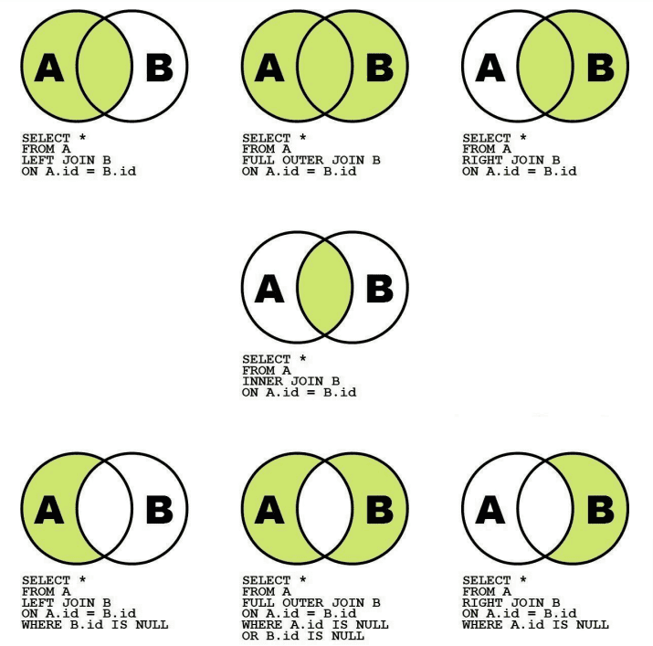
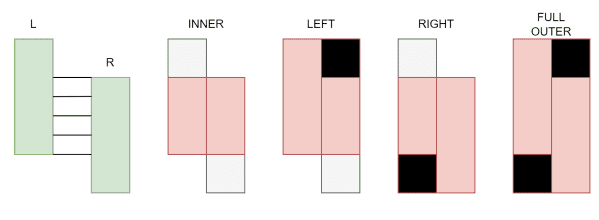
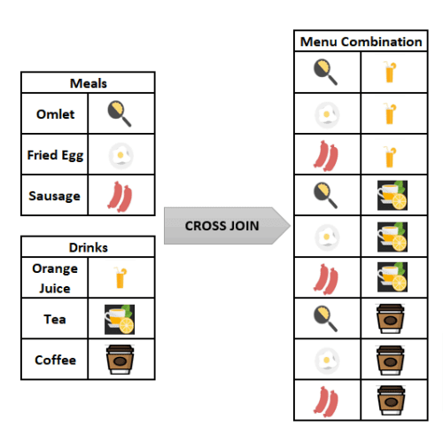
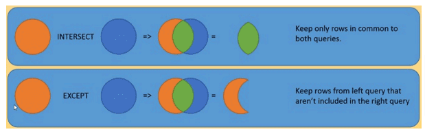

## SQL – объединение таблиц union, соединение - join, подзапросы

### Виды объединения таблиц

Для начала давайте определимся с терминологией. При операциях объединения таблицы условно принято называть левая и правая. Данное определение введено для удобства, и таблица, которая стоит первой в запросе называется левой, а вторая таблица — правой. Данные названия прижились из картинок, которые иллюстрируют создаваемые множества при объединении. Для иллюстрации объединения используется стандартная диаграмма, которая изображена ниже.

[](join.png)

Для объединения таблиц необходим ключ, по которому происходит сравнение (объединение). Значение ключа в левой таблице сравнивается со значениями ключа в правой, и по заданному правилу происходит объединение. Существует основных три вида объединения таблиц (про декартово произведение поговорим ниже отдельно). Остальные виды объединения получаются суперпозицией основных трех
1. INNER JOIN. Пожалуй основной и часто используемый вид объединения (центральная фигура). Для простоты можно писать просто JOIN, опуская ключевое слово INNER. Как видно из рисунка, при таком объединении остаются только ключи, которые есть как в левой таблице А, так и в правой таблице В. Если ключу в левой (правой) таблице нет сопоставления ключу в правой (левой) таблице, то такие строки не включаются в результат объединения.
2. LEFT (RIGHT) JOIN. В данном случае мы хотим оставить все строки левой (правой) таблицы и дополнить их значениями правой (левой) таблицы, если происходит ключи совпадают. Если совпадения не происходит, то соответствующие значения заполняются NULL.
3. FULL OUTER JOIN. Полное объединение таблиц. Для строк, у которых ключи не совпали, соответствующие значения заполняются NULL.

Как видно из картинки, другие виды объединения (нижний ряд) получаются из первых трех типов добавлением условий на значения соответствующих ключей.

На следующей схеме представлена альтернативная диаграмма объединения таблиц. Допустим, у нас есть две таблицы L и R, которые совпадают по части ключей. В результате каждого типа объединения мы получаем данные, которые заполнены красным цветом. Соответствующие пустые места после объединения заполняются NULL (черный цвет).

[](join2.png)

### Получение данных: блок JOIN

При объединении таблиц в качестве ключа можно использовать любой тип данных. Например, можно таблицы можно объединить по датам совершения операций или по названию объектов. Однако, для ускорения объединения лучше использовать ключи с типом данных INT, поскольку сравнение и поиск таких данных происходит быстрее

Давайте разберем синтаксис написания запроса с объединением таблиц. Объединения таблиц можно разделить на четыре основных блока.
1. Как всегда в блоке SELECT указываем поля, которые хотим получить в результирующей выборке.
2. В блоке FROM указываем левую таблицу. Обязательно нужно указать алиенс (короткое название) для таблицы. Например, FROM left_table lf. В данном случае lf является алиенс левой таблицы. Обычно для алиенс используют абривеатуру таблицы, чтобы легко было читать.
3. Затем в блоке JOIN указываем правую таблицу с соответствующим алиенс (JOIN right_table rt). При этом используем нужный тип JOIN.
4. Затем в блоке ON указываем по каким ключам происходит сопоставление (ON lt.key = rt.key).

Давайте посмотрим на примере, как это происходит. У нас есть таблица заказов (Orders), давайте для каждого заказа узнаем название фирмы, которая производит доставку (таблица Shippers)
```sql
SELECT *
FROM Orders o
JOIN Shippers s
on s.ShipperID = o.ShipperID
```
Как видно, обе таблицы имеют поле ShipperID. поэтому в блоке ON нам пришлось использовать алиенс таблиц, чтобы указать колонки из какой таблицы мы берем. В блоке SELECT мы использовали *, поэтому получили в результирующей выдаче все колонки, в том числе колонка ShipperID задублировалась. Таким образом, если в таблицах у вас есть уникальные колонки, то их можно писать без алиенс (а можно и с алиенс), а для неуникальных колонок необходимо указывать алиенс, чтобы база данных знала, какую колонку вы хотите использовать.
```sql
SELECT TOP 10 orderid
,customerid -- уникальное название без алиенс
,o.orderdate -- уникальное название с алиенс
,s.shipperid -- неуникальное название с алиенс
,s.ShipperName
FROM Orders o
JOIN Shippers s
on s.ShipperID = o.ShipperID
```
Как видно, сейчас мы отобрали несколько колонок из левой и правой таблицы и тем самым задали последовательность таблиц для выдачи.

Дальше к полученным результатам можно делать все обычные операция, например дополнить еще одним JOIN, сделать фильтрацию WHERE, произвести группировку GROUP BY и т.д.

Давайте узнаем для каждого заказа какой категории продукт был куплен. А затем посчитаем количество заказов для каждой категории.
```sql
SELECT c.categoryname
,o.OrderDate
,od.OrderID
,p.productname
FROM Orders o
JOIN OrderDetails od
ON o.OrderID = od.OrderID
JOIN Products p
on p.productid = od.ProductID
JOIN Categories c
on c.CategoryID = p.CategoryID
ORDER by o.OrderID
```
Как видно, при таком способе сортировки в один заказ у нас попадает несколько товаров. При этом некоторые товары могут быть из одной категории. Давайте теперь посчитаем, сколько заказов было совершенно для каждой категории.
```sql
SELECT c.categoryname
,count(od.OrderID) as cnt
,count(DISTINCT od.OrderID) as distinct_cnt
FROM Orders o
JOIN OrderDetails od
ON o.OrderID = od.OrderID
JOIN Products p
on p.productid = od.ProductID
JOIN Categories c
on c.CategoryID = p.CategoryID
GROUP BY c.categoryname
ORDER by distinct_cnt DESC
```
И вот здесь мы видим самую большую возможную ошибку при расчете значений. Значение колонок cnt и distinct_cnt отличаются как раз из-за того, что в одном заказе могли быть товары одной категории. Таким образом нужно точно понимать, какую метрику мы хотим получить. В данном случае, если мы хотим посчитать количество заказов для каждой категории, то скорее всего нам необходима колонка distinct_cnt.

Очень часто, приходится также производить объединение таблиц друг с другом. На собеседованиях часто задают такую задачу. Представьте, что у вас есть таблица сотрудников в разных отделах, вам необходимо вывести сотрудников, которые получают большие зарплаты (либо больше руководителя, либо больше среднего по отделу). Давайте перефразируем эту задачу на наши данные и решим ее. Необходимо отметить однако, что данная задача также может быть решена с помощью оконных функций и мы вернемся к ней на следующей лекции.

И так, у нас есть клиенты в таблице Clusters, давайте посмотрим на тех, кто получает больше среднего по кластеру. Если нам нужно просто больше среднего, то мы могли бы написать подзапрос на определение среднего и использовать его в блоке WHERE. Однако сейчас нам нужно это делать для каждого кластера. Для этого нам нужно получить новую колонку со средней зарплатой в кластере и сравнивать с текущей зарплатой клиента.

Давайте сначала напишем запрос на получение средней зарплаты в кластере с помощью GROUP BY.
```sql
SELECT cluster, AVG(income) as avg_income
FROM Clusters c
GROUP BY cluster
```
Отлично, теперь, когда мы знаем среднюю зарплату в кластере, то мы можем для каждого клиента привязать соответствующую среднюю зарплату из его кластера, а потом уже отобрать тех, кто удовлетворяет нашему условию. Опять же сделаем это двумя способами, через вложенный запрос и через обобщенное табличное выражение (WITH)
```sql
select income, avg_income, sex, c.cluster
from Clusters c
join (SELECT cluster, AVG(income) as avg_income
FROM Clusters c
GROUP BY cluster) ai
on c.cluster = ai.cluster
where avg_income < income
ORDER BY c.cluster, sex
with avg_income as (SELECT
cluster,
AVG(income) as avg_income
FROM Clusters c
GROUP BY cluster)
select income, avg_income, sex, c.cluster
from Clusters c
join avg_income ai on c.cluster = ai.cluster
where avg_income < income
ORDER BY c.cluster, sex
```
В целом, оба запроса выглядят одинаково, но на мой вкус использование обобщенного табличного выражения позволяет сделать основную часть запроса более компактной и, в результате, более читабельной.

Давайте теперь на этом примере, посмотрим как работают левое и правое объединение. Давайте в запросе поставим ограничение на номера кластеров (cluster >= 3), и посмотрим три разных варианта (INNER, LEFT, RIGHT) JOIN
```sql
with avg_income as (SELECT
cluster,
AVG(income) as avg_income
FROM Clusters c
WHERE cluster >=3
GROUP BY cluster)
select income, avg_income, sex, c.cluster
from Clusters c
join avg_income ai on c.cluster = ai.cluster
where avg_income < income
ORDER BY c.cluster, sex
```
Как не удивительно, мы получили везде одинаковый результат. у нас отсутствуют в выборке кластера с номерами менее 3-х. Почему так происходит, где те значения NULL, про которые я говорил раньше.

Ответ простой, все дело в конечном условии, когда мы отбираем клиентов с зарплатой более среднее зарплаты. Чтобы убедиться в этом, давайте сделаем LEFT JOIN и уберем это условие. 
```sql
with avg_income as (SELECT
cluster,
AVG(income) as avg_income
FROM Clusters c
WHERE cluster >=3
GROUP BY cluster)
select income, avg_income, sex, c.cluster
from Clusters c
left join avg_income ai on c.cluster = ai.cluster
--where avg_income < income
ORDER BY c.cluster, sex
```
Видим, что теперь у нас есть все клиенты и для 0 - 2 кластеров значение средней зарплаты NULL. А если мы пытаемся сравнивать зарплату клиента с NULL, что было в предыдущем запросе, то такое сравнение не валидно и все такие клиенты пропадают. Что мы и наблюдали ранее.

Поэтому при операциях объединения таблиц всегда проверяйте и контролируйте результат: сколько данных должно было выгрузиться и выгрузилось на самом деле.

### Получение данных: блок CROSS JOIN

CROSS JOIN используется для создания парной комбинации каждой строки первой таблицы с каждой строкой второй таблицы. Этот тип соединения также известен как декартово соединение.

Предположим, мы сидим в кафе и решаем заказать завтрак. Вскоре мы просмотрим меню и начнем думать, какое сочетание еды и напитка может быть вкуснее. Наш мозг получит этот сигнал и начнет генерировать все комбинации еды и питья.

На следующем изображении показаны все комбинации меню, которые может сгенерировать наш мозг. SQL CROSS JOIN работает аналогично этому механизму, поскольку создает все парные комбинации строк таблиц, которые будут соединяться.

[](join3.png)

Синтаксис CROSS JOIN в SQL будет выглядеть следующим образом:
```sql
SELECT ColumnName_1,
ColumnName_2,
ColumnName_N
FROM [Table_1]
CROSS JOIN [Table_2]
```
Или мы можем использовать следующий синтаксис вместо предыдущего. Этот синтаксис не включает ключевое слово CROSS JOIN; только таблицы, которые будут объединены, мы будем размещать после предложения FROM и разделять запятой.
```sql
SELECT ColumnName_1,
ColumnName_2,
ColumnName_N
FROM [Table_1],[Table_2]
```
Набор результатов не меняется ни для одного из этих синтаксисов. Кроме того, мы должны обратить внимание на один момент, касающийся CROSS JOIN. В отличие от INNER JOIN, LEFT JOIN и FULL OUTER JOIN, CROSS JOIN не требует условия соединения.

Давайте на примере нашей таблицы Categories посмотрим все возможные комбинации названий категорий.
```sql
SELECT c1.CategoryName, c2.CategoryName
from Categories c1, Categories c2
```
или
```sql
SELECT c1.CategoryName, c2.CategoryName
from Categories c1
CROSS JOIN Categories c2
```
Оба варианта возвращают 64 строки данных, поскольку в таблице хранится 8 различных категорий.

SQL-запросы, содержащие ключевое слово CROSS JOIN, могут быть очень дорогостоящими. Мы пытаемся сказать, что эти запросы могут потреблять больше ресурсов и могут вызывать проблемы с производительностью. Поэтому нужно с осторожностью пользоваться данными запросами, особенно c большими таблицами. Также нужно внимательно следить за условиями объединения таблиц в обычных блоках JOIN. Так, ошибка при написании запроса, который представлен ниже, приводит декартовому произведению, а неклассическому объединению
```sql
SELECT c1.CategoryName, c2.CategoryName
from Categories c1
JOIN Categories c2 on c1.CategoryID = c1.CategoryID
```

### Получение данных: блок UNION

До этого мы разобрали горизонтальное объединение таблиц. Как вы понимаете, так же существует и вертикальное объединений, когда к результату первого запроса снизу мы присоединяем результаты второго запроса. Для этой цели используется блок UNION. При данном объединении можно использовать параметр ALL, при котором сохраняются все дубликаты возвращаемых строк; в противном случае набор результатов включает только уникальные строки. Обратите внимание, что любое количество запросов может быть объединено. Более того, порядок объединения можно изменить с помощью круглых скобок.

При использовании блока UNION следует соблюдать следующие условия:
- Количество столбцов каждого запроса должно быть одинаковым;
- Столбцы набора результатов каждого запроса должны сравниваться по типу данных друг с другом;
- В наборе результатов используются имена столбцов из первого запроса;
- Предложение ORDER BY применяется к результату объединения, поэтому его можно записать только в конце объединенного запроса.

Давайте посмотрим на примере, как использовать данное объединение. У нас в
таблице Cluster есть информация, какой размер кредита запрашивали клиенты.

Предположим общий размер переплаты зависит от размера кредита, и для кредита до 20 т.р. составляет 20%, а для кредита более 20 т.р. - 40%. Давайте выведем полный размер, который клиент должен вернуть в банк. Для этого мы сделает один запрос для кредитов до 20 т.р. и второй запрос - более 20 т.р. и объединим их.
```sql
SELECT credit_amount, credit_amount * 1.2 as total_amount
FROM Clusters
where credit_amount < 20000
UNION ALL
SELECT credit_amount, credit_amount * 1.4 as total_amount
FROM Clusters
where credit_amount >= 20000
```
Как видно, в результате такого запроса мы получили размер запрашиваемого кредита и возвращаемую сумму в банк. При этом количество возвращаемых строк равно 1473. То есть мы получили все строки (всех клиентов), которые есть в нашей таблице. При этом некоторые клиенты запрашивают одинаковый размер кредита. Если мы уберем ключевое слово ALL из запроса, то получим только уникальные суммы кредита. Естественно, использовать блок UNION для такого запроса не эффективно. Здесь лучше было бы воспользоваться функцией CASE.

Давайте посмотрим на второй пример, где без UNION не обойтись. Давайте посмотрим на заказы, таблица ORDERS. Один покупатель в заказе имеет несколько товаров, каждый из которых попадает в определенную категорию. Давайте посмотрим, сколько людей (уникальных) делали заказы в каждой категории товаров.
```sql
SELECT CategoryName,
count(DISTINCT CustomerID) as cnt_distinct
from Orders o
join OrderDetails od on o.OrderID = od.OrderID
join Products p on p.ProductID = od.ProductID
join Categories c on c.CategoryID = p.CategoryID
group BY CategoryName
```
Отлично, мы знаем количество уникальных клиентов для каждой категории. Мы видим, что в категории Seafood было 40 человек. Но вопрос, 40 человек это много или мало. Нам необходимо посчитать, сколько всего было уникальных клиентов. Но мы не можем просто сложить все числа из колонки cnt_distinct, поскольку люди покупали товары в разных категориях, и таким образом мы их учтем дважды. Для этого нам нужно добавить строку со значением count(DISTINCT CustomerID) по всей таблице. Вот здесь как раз и пригодится блок UNION. Общий результат будет выглядеть следующим образом.
```sql
SELECT CategoryName
,count(DISTINCT CustomerID) as cnt_distinct
from Orders o
join OrderDetails od on o.OrderID = od.OrderID
join Products p on p.ProductID = od.ProductID
join Categories c on c.CategoryID = p.CategoryID
group BY CategoryName
UNION
SELECT 'TOTAL'
,count(DISTINCT CustomerID)
from Orders o
ORDER BY CategoryName
```
В этом запросе мы как раз можем видеть все требования к блоку UNION. Мы во втором запросе никак не называли колонки и названия получены из первого запроса. Нам пришлось во втором запросе сделать первую колонку со значением TOTAL, чтобы количество и тип колонок совпал. И сортировка идет самым последним элементом для всех запросов.

### Получение данных: блоки EXCEPT, INTERSECT

Следующие два блока применяются достаточно редко. Лично я их применяю, когда необходимо проверить консистентность двух таблиц (подвыборок). Допустим У вас есть таблицы А и В. В данных таблицах должны находиться одинаковые данные. Вы хотите знать, что данные действительно одинаковые или, наоборот, найти различия по данным.

Блок INTERSECT выведет вам только те строки, которые находятся в обеих таблицах. И если таблицы абсолютно одинаковые, то выведет полную таблицу. Если данные совпадают частично, то выведет только те данные, которые совпадают.

Блок EXCEPT Выведет вам данные из первой таблицы, которых нет во второй.

Все правила, которые мы говорили про UNION для этих двух блоков также актуальны.

Тем самым используя эти два блока можно понять, какие данные различаются. В целом, такую задачу можно реализовать с помощью блока JOIN.

[](join4.png)

Давайте проверим работу данных блоков на этих двух примерах
```sql
SELECT *
from Clusters c
where credit_amount > 20000
EXCEPT
SELECT *
from Clusters c
where credit_amount > 25000
ORDER BY credit_amount
```

```sql
SELECT *
from Clusters c
where credit_amount > 20000
INTERSECT
SELECT *
from Clusters c
where credit_amount > 25000
ORDER BY credit_amount
```
В первом случае мы получили строки, в которых величина кредита больше 20 т. р. вплоть до 25 т.р., то есть строки, которые есть в первом запросе, но нет во втором.

Во втором случае выгрузка содержит данные по кредитам более 25 т.р. - строки общие для первого и второго запроса.