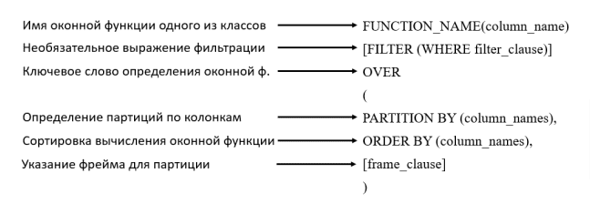
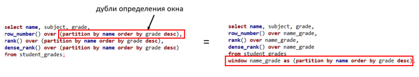

## SQL – оконные функции

### Описание оконных функций

Оконная функция применяется к набору строк. Окно — стандартный термин SQL, служащий для описания контекста в котором работает функция. Для указания окна в SQL используется предложение OVER. Вот пример запроса:
```sql
SELECT ProductName
,CategoryID
,Price
,ROW_NUMBER() OVER(PARTITION by CategoryID ORDER BY Price DESC)
FROM Products p
```
Как видно из примера, нам для каждой категории удалось ранжировать продукты по цене от самых дорогих до дешевых. То есть в строчках 1, 13 и 25 мы получили самые дорогие товары в своей категории и у них значение в последней колонке равно 1.

В чем заключается главное отличие оконных функций от функций агрегации с группировкой? При использовании агрегирующих функций предложение GROUP BY сокращает количество строк в запросе с помощью их группировки и расчета соответствующих метрик. Так мы можем легко написать запрос, который будет возвращать цену самого дорогого продукта в соответствующей категории.
```sql
SELECT CategoryID
,max(Price)
FROM Products p
Group by CategoryID
```
Но даже здесь, чтобы получить название дорогого продукта, придется использовать объединение таблиц по цене и категории товара. Применение оконных функций, позволяет упростить получение некоторых результатов.

Как мы видели из нашего первого примера, при использовании оконных функций количество строк в запросе не уменьшается по сравнении с исходной таблицей. Мы для каждой строки нашего результата получим значение агрегата.

На этом этапе нам снова необходимо вспомнить порядок выполнения запросов, потому что оконные функции можно использовать только в блоках SELECT и ORDER BY.

|SELECT| list of columns window functions|
|-|-|
|FROM| table / join tables / subquery|
|WHERE| filtering clause|
|GROUP| BY list of columns|
|HAVING| aggregation filtering clause|
|ORDER BY| list of columns window functions|

В таблице представлена схема написания запросов. Порядок выполнения следующий:
- Сначала выполняется команда выборки таблиц, их объединения и возможные подзапросы под командой FROM.
- Далее выполняются условия фильтрации WHERE, группировки GROUP BY и возможная фильтрация c HAVING
- Только потом применяется команда выборки столбцов SELECT и расчет оконных функций под выборкой.
- После этого идет условие сортировки ORDER BY, где тоже можно указать столбец расчета оконной функции для сортировки.
- Здесь важно уточнить, что партиции или окна оконных функций создаются после разделения таблицы на группы с помощью команды GROUP BY, если эта команда используется в запросе.

### Синтаксис оконных функций

Синтаксис оконных функций вне зависимости от их класса будет так или иначе состоять из идентичных команд.

[](window.png)

- FILTER clause поддерживается не во всех СУБД

Оконные функции можно прописывать как под командой SELECT, так и в отдельном ключевом слове WINDOW, где окну дается алиас (псевдоним), к которому можно обращаться в SELECT выборке.

[](window2.png)

### Классы Оконных функций

Множество оконных функций можно разделять на 3 класса:
- Агрегирующие (Aggregate)
- Ранжирующие (Ranking)
- Функции смещения (Value)

|Aggregate| Ranking| Value|
|-|-|-|
|AVG()| DENSE_RANK()| FIRST_VALUE()|
|COUNT()| NTLILE()| LAST_VALUE()|
|MAX()| RANK() LAG()||
|MIN()| ROW_NUMBER()| LEAD()|
|SUM()| CUME_DIST()| NTH_VALUE()|

**Агрегирующие**

Можно применять любую из агрегирующих функций — SUM, AVG, COUNT, MIN, MAX
```sql
SELECT CategoryID
,ProductName
,sum(Price) over (partition by CategoryID) as sum_Price
,avg(Price) over (partition by CategoryID) as avg_Price
,count(Price) over (partition by CategoryID) as count_Price
,min(Price) over (partition by CategoryID) as min_Price
,max(Price) over (partition by CategoryID) as max_Price
FROM Products p
ORDER BY CategoryID, ProductName
```
С помощью такого запроса мы смогли рассчитать соответствующие метрики по категории продуктов и дополнить таблицу этими метриками для каждого товара.

**Ранжирующие**

В ранжирующих функция под ключевым словом OVER обязательным идет указание условия ORDER BY, по которому будет происходить сортировка ранжирования.

**ROW_NUMBER()** — функция вычисляет последовательность ранг (порядковый номер) строк внутри партиции, независимо от того, есть ли в строках повторяющиеся значения или нет.

**RANK()** — функция вычисляет ранг каждой строки внутри партиции. Если есть повторяющиеся значения, функция возвращает одинаковый ранг для таких строчек, пропуская при этом следующий числовой ранг.

**DENSE_RANK()** — то же самое что и RANK, только в случае одинаковых значений DENSE_RANK не пропускает следующий числовой ранг, а идет последовательно.

**CUME_DIST()** — вычисляет интегральное распределение значений в группе значений. Другими словами, CUME_DIST вычисляет относительное положение указанного значения в группе значений. Исходя из восходящего порядка сортировки, CUME_DIST значения для строки r — это число строк со значениями, меньшими или равными значению r, деленное на число строк, полученных в секции или результирующем наборе запроса. Функция CUME_DIST подобна функции PERCENT_RANK.

**NTLILE()** — распределяет строки упорядоченной секции в заданное количество групп. Группы нумеруются, начиная с единицы. Для каждой строки функция NTILE возвращает номер группы, которой принадлежит строка. Поддерживается не во всех СУБД.

```sql
SELECT CategoryID
,ProductName
,Price
,ROW_NUMBER() over (partition by CategoryID order by Price) as
ROW_NUMBER_Price
,RANK() over (partition by CategoryID order by Price) as RANK_Price
,DENSE_RANK() over (partition by CategoryID order by Price) as
DENSE_RANK_Price
,CUME_DIST() over (partition by CategoryID order by Price) as
CUME_DIST_Price
FROM Products p
ORDER BY CategoryID, Price
```

**Функции смещения**

Это функции, которые позволяют перемещаясь по выделенной партиции таблицы обращаться к предыдущему значению строки или крайним значениям строк в партиции.

**LAG()** — функция возвращает предыдущее значение столбца по порядку сортировки.

**LEAD()** — функция возвращает следующее значение столбца по порядку сортировки. На простом примере ниже видно, как можно в одной строке получить текущую цену, предыдущую и следующую цены на продукты в группе.

**FIRST_VALUE()/LAST_VALUE()** — функции возвращающие первое или последнее значение столбца в указанной партиции. В качестве аргумента указывает столбец, значение которого нужно вернуть. В оконной функции под словом OVER обязательное указание ORDER BY условия.

```sql
SELECT CategoryID
,ProductName
,Price
,first_value(productname) over (partition by CategoryID order by Price) as
first_value_productname
,last_value(productname) over (partition by CategoryID order by Price) as
last_value_productname
,lag(productname) over (partition by CategoryID order by Price) as
lag_productname
,lead(productname) over (partition by CategoryID order by Price) as
lead_productname
FROM Products p
ORDER BY CategoryID, Price
```
Как видно, использование функций LAG/LEAD не вызывает вопросов. Мы получаем предыдущее и последующее значение, соответственно. Для первой и последней строки мы видим, что получили NULL, как и следовало ожидать. Такие функции принято применять в ситуации, когда нужно получить последовательность действий пользователей. Допустим к вам пришел менеджер, и просит посчитать среднее время между активностями пользователя (то есть нужно знать, сколько проходит время между покупками у покупателей или время между заходами в приложение). Тогда для каждого пользователя вы сортируете активности по времени, добавляете для каждой строки колонку с датой предыдущей активности и рассчитываете время между заказами. Ниже мы реализуем такой запрос.

**Использование функции FIRST_VALUE**

Эта оконная функция возвращает первое из упорядоченного набора значений. Теперь мы можем без подзапросов, выделив в окне набор категорий продуктов из текущей строки запроса с помощью предложения PARTITION BY и упорядочив его, получить названия продукта с минимальной ценой.

**Засада с LAST_VALUE**

Казалось бы, какая разница брать первое или последнее значение брать из упорядоченного набора? Но давайте посмотрим, что мы получим, если в запросе заменить FIRST_VALUE на LAST_VALUE. Видим, что последнее значение совпадает с самим значением или, если цены одинаковые, то совпадает с последним значением при той же цене.

Что мы делаем в подобных случаях? Конечно, обращаемся к документации, а там мы читаем... Нет, постойте, сначала полный синтаксис оконной функции:
```sql
LAST_VALUE | FIRST_VALUE ( [ скалярное_выражение ] ) [ IGNORE NULLS | RESPECT
NULLS ] OVER ( [ предложение_partition_by ] предложение_order_by [
предложение_rows_range ] )
```
Здесь

IGNORE NULLS или RESPECT NULLS определяют, будут ли учитываться NULL-значения;

предложение_rows_range задает параметры окна.

А теперь читаем:

`💡 Внимание: Диапазоном по умолчанию является RANGE BETWEEN UNBOUNDED PRECEDING AND CURRENT ROW.`

Т.е. окном является диапазон от текущей строки и неограниченно выше. Поскольку мы выбираем последнюю строку диапазона, то всегда будет выводиться текущая строка, как бы не сортировались строки. Т.е. сколько бы строк выше не оказалось при сортировке.

Значит нам просто нужно явно (и правильно!) задать параметры окна, а именно, от текущей строки и неограниченно ниже, поскольку мы выбираем последнее значение:
```sql
SELECT CategoryID
,ProductName
,Price
,first_value(productname) over (partition by CategoryID order by Price) as
first_value_productname
,last_value(productname) over (partition by CategoryID order by Price
RANGE BETWEEN CURRENT ROW AND UNBOUNDED FOLLOWING) as
last_value_productname
,first_value(productname) over (partition by CategoryID order by Price
DESC) as desc_first_value_productname
FROM Products p
ORDER BY CategoryID, Price
```
Здесь мы переписали запрос для LAST_VALUE. Как видно, мы получили наконец ожидаемый результат. Здесь мы с вами научились очень важному моменту. Всегда нужно проверять промежуточные результаты запросов, чтобы оценить корректность написанного кода, и всегда нужно смотреть документацию.

Дополнительно, можно заметить, что шестая колонка в нашей выгрузке получилась с помощью функции FIRST_VALUE. Мы изменили порядок сортировки для оконной функции и получили валидный результат. Поэтому помним, что любое решение можно получить несколькими способами. Таким же образом можно менять результат работы функций LAG/LEAD.

### Примеры использования оконных функций.

**Пример 1.**

Давайте начнем с задачи, которую объявили выше, посчитаем, сколько в среднем проходит времени между заказами наших пользователей и дополнительно выведем людей, у которых в среднем между заказами минимальное время.

В первую очередь нам необходимо получить для каждого заказа время между последовательными заказами. Для удобства оформим через обобщенное табличное выражение.
```sql
with ord as (SELECT
customerid
,DATEDIFF(day, CAST(orderdate as date)
,CAST(LEAD(orderdate) over (partition by customerid ORDER by
orderdate) as date) ) as diff
FROM Orders )
SELECT * from ord
```
Мы получили время между заказами. Видно, что иногда мы получаем NULL, это происходит когда покупателем сделан первый или единственный заказ.

Замечательно, теперь мы можем посчитать для каждого клиента, его среднее время между заказами. Заметим, что для расчета общего количества заказов клиента мы использовали count(*)+1. Дополнительная единица нам необходима, поскольку мы удаляем строки первого заказа, для которых не можем подсчитать DIFF.
```sql
with ord as (SELECT
customerid
,DATEDIFF(day, CAST(orderdate as date)
,CAST(LEAD(orderdate) over (partition by customerid ORDER by orderdate)
as date) ) as diff
FROM Orders )
SELECT
customerid
,AVG(diff) as avg_diff
,count(*)+1 as cnt
from ord
where diff is not NULL
group by customerid
ORDER BY avd_diff
```
Отлично. Теперь на этом этапе можно рассчитать среднее время между заказами у клиентов. Сейчас мы для удобства предыдущий запрос тоже поместили в блок WITH и рассчитали среднее значение между заказами у клиентов и среднее число заказов клиентов.
```sql
with ord as (SELECT
customerid
,DATEDIFF(day, CAST(orderdate as date)
,CAST(LEAD(orderdate) over (partition by customerid ORDER by orderdate) as
date) )as diff
FROM Orders ),
dif as (SELECT
customerid
,AVG(diff) as avg_diff
,count(*)+1 as cnt
from ord
where diff is not NULL
group by customerid)
SELECT AVG(avg_diff*1.0), avg(cnt*1.0) from diff
```
В результате мы получили, что между заказами клиенты делают перерыв в среднем 48,9 дней и на одного клиента приходится 3,3 заказа.

Внимание вопрос. Где в данном запросе закралась логическая ошибка. Что мы сделали неверно?

Ошибка связана с определением среднего количества заказов, приходящихся на одного клиента. Когда мы поставили условие where diff is not NULL, мы исключили клиентов, которые совершили всего один заказ. А таких клиентов очень много, в результате мы получили завышенную оценку количества заказов. Если убрать это условие, то количество заказов будет равно 3,6. При этом время между заказами не меняется, поскольку значения NULL игнорируются при расчете среднего значения.

**Пример 2.**

На прошлой лекции мы с помощью группировки и объединения таблиц искали клиентов, у которых заработная плата выше среднего по сегменту. Давайте сейчас решим эту задачу с помощью оконной функции. Кажется, что было бы удобно написать запрос и в блок WHERE поставить условие с использованием оконной функции. Однако, такое не возможно и вот по чему. Допустим для какого-нибудь сегмента средняя заработная плата равна 5. Тогда в условии мы ограничим людей с зарплатой ниже 5. Ясно что у оставшихся заработная плата будет больше 5 и средняя зарплата вырастет. Тем самым в условии мы отсечем следующих людей, опять увеличится средняя заработная плата и так далее, пока не останется человек с наибольшей зарплатой. Поэтому нам придется использовать подзапросы. В подзапросе мы для каждого клиента получим новую колонку со средней зарплатой по соответствующему сегменту, а затем уже сделаем фильтрацию.
```sql
WITH avg_income as(SELECT cluster
,sex
,income
,AVG(income) over (partition by cluster) as avg_clus_inc
from Clusters)
select *
FROM avg_income
where avg_clus_inc< income
order by avg_clus_inc,income,sex
```
В результате мы получили клиентов с зарплатами выше среднего по сегменту. Как видно, мы дополнительно сделали первичную сортировку по средней зарплате в сегменте. Тем самым сначала у нас идет сегмент с самой низкой зарплатой, а последний сегмент — с самой высокой и конечная выгрузка автоматически сгруппирована по сегментам

**Пример 3.**

Если посмотреть на уникальные даты совершения заказов в нашем магазине, то можно заметить, что иногда заказы идут каждый день, а в некоторые дни есть пропуски и не было заказов. Например, 4 и 5 сентября магазин работал, потом был перерыв 6 и 7. После этого магазин работал с 8 по 12 и с 15 по 19.

Ваш заказчик хочет получить таблицу из двух колонок в которой будет указана даты начала и конца всех непрерывных периодов работы магазина. Если бы смогли получить новую колонку, в которой каждый непрерывный период обозначен уникальным элементом, как сейчас красные буквы на изображении, то сделав группировку и определив минимальную и максимальную дату, мы получим искомую таблицу. Для решения этой задачи нам пригодится оконная функция ROW_NUMBER(). Если приглядеться, то между двумя датами при непрерывной работе разница ровно 1 день. И номера последовательных строк отличаются тоже на 1. В результате мы можем написать следующий запрос.
```sql
WITH dt as (SELECT DISTINCT orderdate
from Orders),
dif_dt as (SELECT *
--, datediff(day, GETDATE(), orderdate) as dd
--,ROW_NUMBER() OVER (ORDER BY orderdate) as row_num
,datediff(day, GETDATE(), orderdate) - ROW_NUMBER() OVER (ORDER BY orderdate) AS
dif
from dt)
select min(orderdate) as start, max(orderdate) as finish from dif_dt
group by dif
```
В результате приведенного запроса мы получили даты периодов начала и конца работы магазина. Видно, что в большинстве случаев, между этими датами пять дней, что говорит о корректности запроса и, что магазин не работает два дня в неделю.

В приведенном запросе сейчас две закомментированные строки. Вы можете раскомментировать их и посмотреть на содержание промежуточной таблицы DIF_DT.

**Пример 4.**

Сейчас к вам пришел менеджер нашего магазина и просит предоставить ему данные, как меняется день ко дню накопительная выручка за месяц. Другими словами, мы сдаем кассу в конце месяца и менеджер хочет знать сколько денег в кассе каждый день (накопительная сумма). Чтобы получить такие данные, придется вспомнить все что мы проходили. Для начала нам необходимо получить стоимость каждого заказа и дату его совершения. Для этого нам необходимо объединить таблицу Orders (здесь мы возьмем дату заказа) с таблицей OrderDetails (возьмем количество проданного продукта) и с таблицей Products (возьмем стоимость продукта). Затем необходимо сделать группировку по дням и посчитать выручку за день. А после с помощью оконной функции рассчитать скользящую выручку начиная с начала месяца. В результате конечный запрос будет выглядеть следующим образом.
```sql
with day_sum as (select orderdate
,sum(od.Quantity * p.Price) as cash
from orders o
join OrderDetails od on o.OrderID = od.OrderID
join Products p on p.ProductID =od.ProductID
GROUP BY o.orderdate)
SELECT orderdate
,sum(cash) over (partition by MONTH (orderdate) ORDER by orderdate) as
total_сash
FROM day_sum
order by orderdate
```

**Пример 5.**

Теперь ваш менеджер хочет знать, в какие 5 дней каждого месяца были наибольшие продажи. Мы уже умеем получать продажи за день. Теперь нужно для каждого месяца взять пять дней с максимальными продажами. Для этого нам пригодится оконная функция ROW_NUMBER(). Общий результат может выглядеть следующим образом. Сначала мы рассчитали дневную выручку, затем с помощью оконной функции определили порядок дней по размеру выручки для каждого месяца. И в финале выбрали только пять самых лучших дней каждого месяца.
```sql
with day_sum as (select orderdate
,sum(od.Quantity * p.Price) as cash
from orders o
join OrderDetails od on o.OrderID = od.OrderID
join Products p on p.ProductID =od.ProductID
GROUP BY o.orderdate),
rn as (SELECT orderdate
,cash
,ROW_NUMBER() over (partition by MONTH(orderdate) ORDER by cash
desc) as row_number_сash
FROM day_sum)
SELECT *
FROM rn
WHERE row_number_сash <= 5
ORDER BY YEAR(orderdate),MONTH(orderdate), row_number_сash
```