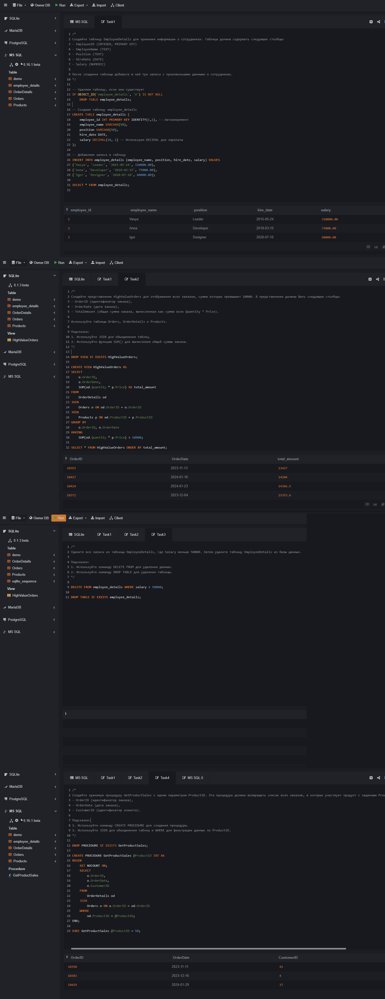

## SQL: Создание таблиц и представлений

[онлайн тестирование БД](https://sqliteonline.com/)

### Задание 1: Создание таблицы и изменение данных

**Задание**: Создайте таблицу EmployeeDetails для хранения информации о сотрудниках. Таблица должна содержать следующие столбцы:
- EmployeeID (INTEGER, PRIMARY KEY)
- EmployeeName (TEXT)
- Position (TEXT)
- HireDate (DATE)
- Salary (NUMERIC)

После создания таблицы добавьте в неё три записи с произвольными данными о сотрудниках.

```sql
-- Удаляем таблицу, если она существует
IF OBJECT_ID('employee_details', 'U') IS NOT NULL 
    DROP TABLE employee_details;

-- Создаем таблицу employee_details
CREATE TABLE employee_details (
    employee_id INT PRIMARY KEY IDENTITY(1,1), -- Автоинкремент
    employee_name VARCHAR(50),
    position VARCHAR(50),
    hire_date DATE,
    salary DECIMAL(18, 2) -- Используем DECIMAL для зарплаты
);

-- Добавляем записи в таблицу
INSERT INTO employee_details (employee_name, position, hire_date, salary) VALUES 
('Vasya', 'Leader', '2015-05-24', 320000.00),
('Anna', 'Developer', '2018-03-15', 75000.00),
('Igor', 'Designer', '2020-07-10', 60000.00);

SELECT * FROM employee_details;
```

### Задание 2: Создание представления

**Задание**: Создайте представление HighValueOrders для отображения всех заказов, сумма которых превышает 10000. В представлении должны быть следующие столбцы:
- OrderID (идентификатор заказа),
- OrderDate (дата заказа),
- TotalAmount (общая сумма заказа, вычисленная как сумма всех Quantity * Price).

Используйте таблицы Orders, OrderDetails и Products.

Подсказки:
1. Используйте JOIN для объединения таблиц.
2. Используйте функцию SUM() для вычисления общей суммы заказа.

```sql
DROP VIEW IF EXISTS HighValueOrders;

CREATE VIEW HighValueOrders AS
SELECT 
    o.OrderID,
    o.OrderDate,
    SUM(od.Quantity * p.Price) AS total_amount
FROM 
    OrderDetails od
JOIN 
    Orders o ON od.OrderID = o.OrderID
JOIN 
    Products p ON od.ProductID = p.ProductID
GROUP BY 
    o.OrderID, o.OrderDate
HAVING 
    SUM(od.Quantity * p.Price) > 10000;

SELECT * FROM HighValueOrders ORDER BY total_amount;
```

### Задание 3: Удаление данных и таблиц

**Задание**: Удалите все записи из таблицы EmployeeDetails, где Salary меньше 50000. Затем удалите таблицу EmployeeDetails из базы данных.

Подсказки:
1. Используйте команду DELETE FROM для удаления данных.
2. Используйте команду DROP TABLE для удаления таблицы.

```sql
DELETE FROM employee_details WHERE salary < 50000;

DROP TABLE IF EXISTS employee_details;
```

### Задание 4: Создание хранимой процедуры

**Задание**: Создайте хранимую процедуру GetProductSales с одним параметром ProductID. Эта процедура должна возвращать список всех заказов, в которых участвует продукт с заданным ProductID, включая следующие столбцы:
- OrderID (идентификатор заказа),
- OrderDate (дата заказа),
- CustomerID (идентификатор клиента).

Подсказки:
1. Используйте команду CREATE PROCEDURE для создания процедуры.
2. Используйте JOIN для объединения таблиц и WHERE для фильтрации данных по ProductID.

```sql
DROP PROCEDURE IF EXISTS GetProductSales;

CREATE PROCEDURE GetProductSales @ProductID INT AS
BEGIN
	SET NOCOUNT ON;
    SELECT 
        o.OrderID,
        o.OrderDate,
        o.CustomerID
    FROM 
        OrderDetails od
    JOIN 
        Orders o ON o.OrderID = od.OrderID
    WHERE 
        od.ProductID = @ProductID;
END;

EXEC GetProductSales @ProductID = 50;
```

[](./Screenshot_tasks.png)