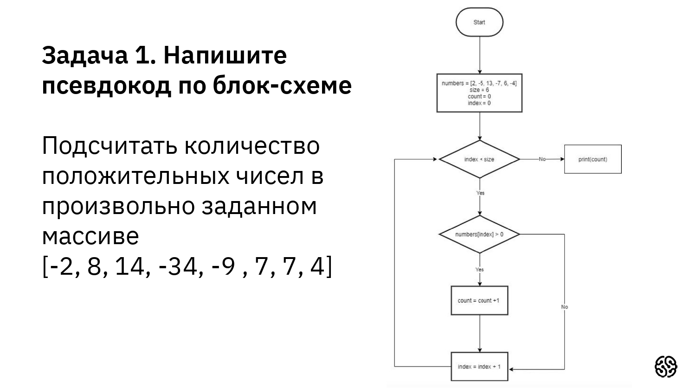
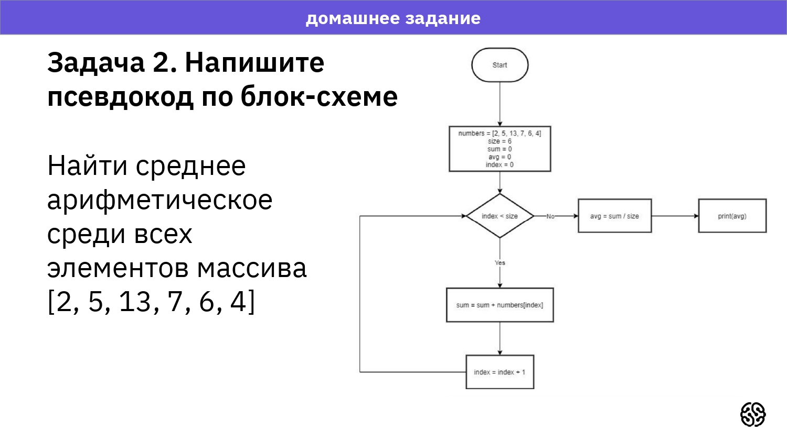

```
numbers = [2, -5, 13, -7, 6, -4]
size = 6
count = 0
index = 0
while (index < size)
    if (numbers[index] > 0) then
        count = count + 1
    index = index + 1
print(count)
```

```
numbers = [2, 5, 13, 7, 6, 4]
size = 6
sum = 0
avg = 0
index = 0
```