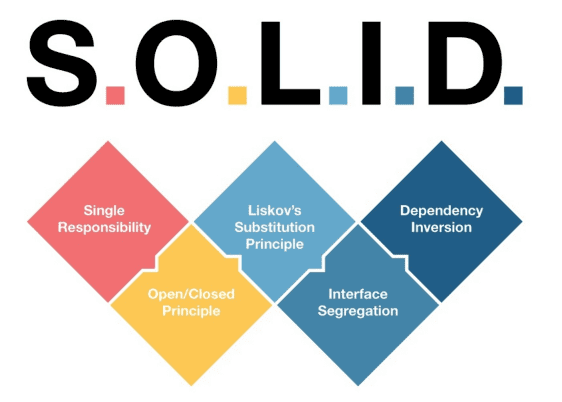
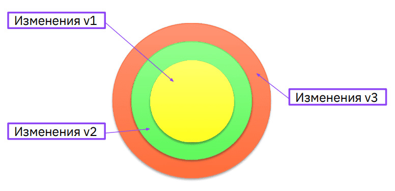
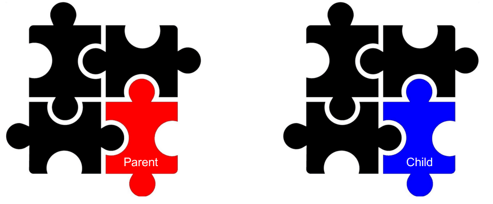
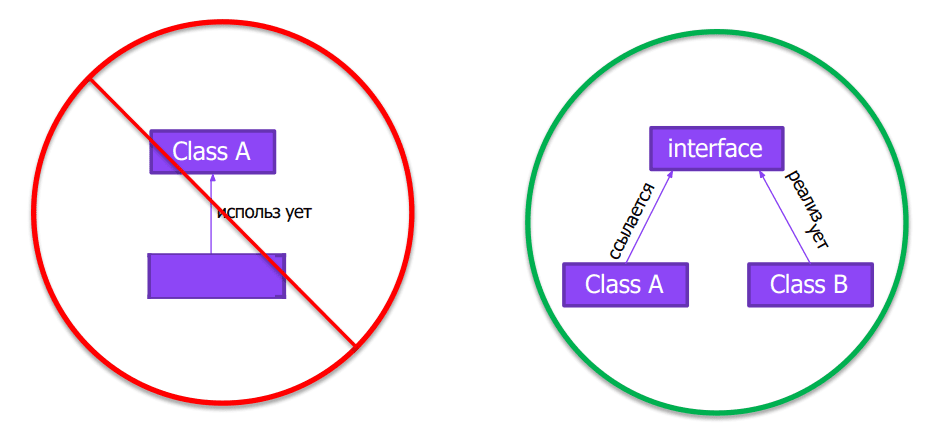

## Урок 6. ООП Дизайн и Solid
**SOLID**  

**Принцип единственной ответственности (Single Responsibility Principle)**  

**Принцип открытости/закрытости (Open Closed Principle)**  

**Принцип подстановки Барбары Лисков (Liskov’s Substitution Principle)**  

**Принцип разделения интерфейса (Interface Segregation Principle)**  

**Принцип инверсии зависимостей (Dependency Inversion Principle)**  

### Домашнее задание:
Проект work6: продемонстрировать применение принципов, усвоенных на семинаре.  
Нужно в проекте прокомментировать участки кода, которые рефакторим, какой принцип применяем и почему.