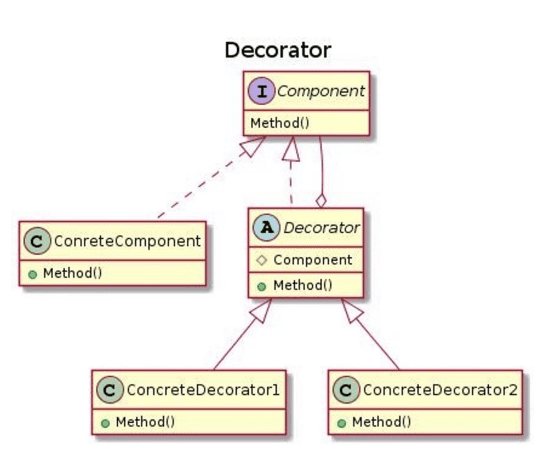
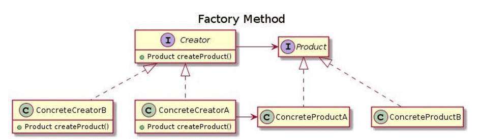
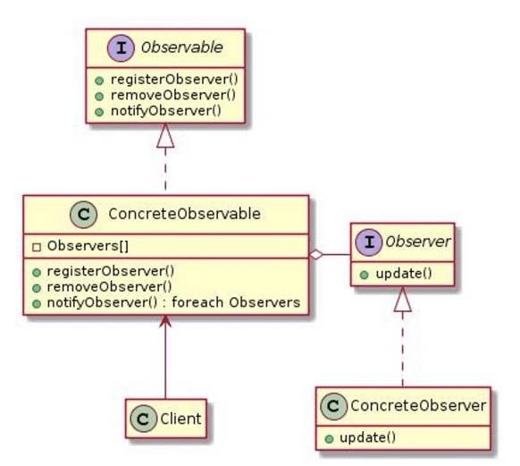
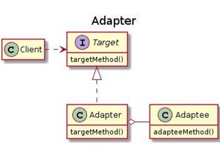

## Урок 7. ООП Дизайн и Solid ч.2
#### Паттерны проектирования, что это такое и зачем они нужны
**Декоратор**  
Структурный паттерн, расширяет объект новой функциональностью не используя наследование.

**Фабричный метод**  
Порождающий паттерн, динамически создающий необходимый класс по интерфейсу из семейства классов.

**Наблюдатель**  
Поведенческий паттерн, позволяет наблюдать за изменениями объектов, при этом наблюдаемый объект и наблюдатель не имеют прямой связи.

**Адаптер**  
Структурный паттерн, адаптирует один интерфейс под другой

### Задачи:
1. Проект DecoratorFactory: Создать логирование операций, для класса Calculator. Класс Calculator не должен изменится
2. Проект Observer: Добавить нового наблюдателя (сейчас два наблюдателя Master и Student), организовать наблюдение за объектом Company.
3. Проект Adapter: Включить датчик от другой компании, интерфейс которого отличается от предыдущих, в систему. Первоначальный интерфейс MeteoSensor, адаптируем SensorTemperature.
4. *Создать проект калькулятора комплексных чисел (достаточно сделать сложение,
умножение и деление).
   - Применить при создании программы архитектурные паттерны, добавить
логирование калькулятора.
   - Соблюдать принципы SOLID, паттерны проектирования. 