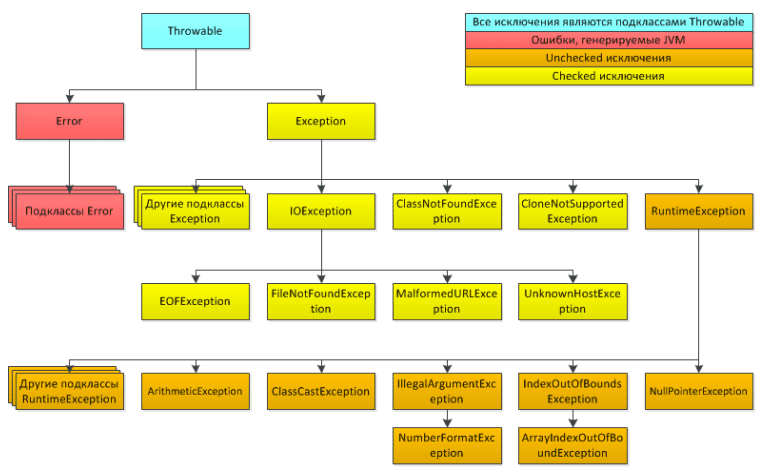

## Урок 2. Исключения и их обработка
План урока:
- Разберём виды исключений в Java, какую иерархию они образуют и в чём её смысл
- Узнаем, чем исключения отличаются от ошибок
- Поймём, как не дать исключениям «ронять» приложение
- Узнаем, почему некоторые исключения компилятор заставляет обрабатывать, а некоторые нет

**Отказоустойчивые приложения** — приложения, которые при возникновении некритичных ошибок могут продолжать свою работу.

### Типы исключений

| Тип исключения                 | Описание                                                    |
|--------------------------------|-------------------------------------------------------------|
| ArithmeticException            | Арифметическая ошибка                                       |
| ArrayIndexOutOfBoundsException | Выход индекса за пределы массива                            |
| ClassCastException             | Неверное приведение типов                                   |
| IllegalArgumentException       | Употребление недопустимого аргумента при вызове метода      |
| IndexOutOfBoundsException      | Выход индекса некоторого типа за допустимые пределы         |
| NullPointerException           | Обращение к несуществующему объекту                         |
| NumberFormatException          | Неверное преобразование символьной строки в числовой формат |
| IOException                    | Ошибка при работе с потоками ввода/вывода                   |
| FileNotFoundException          | Файл не найден                                              |
| ClassNotFoundException         | Класс не найден                                             |
| UnsupportedOperationException  | Попытка выполнения нереализованного метода                  |

### Иерархия исключений

[](./misc/exceptions.png)

Корневым элементом в иерархии служит класс Exception. Если создать класс и унаследовать его от Exception (или его подкласса), то получим новый тип исключений. Таким простым способом и создаются новые типы исключений, но об этом — позднее. Подробнее про создание собственных исключений — на следующем занятии.

Exception наследуется от типа Throwable, что указывает на возможность «бросания» исключений. Второй веткой от Throwable идёт класс Error и его подклассы. Посмотрим, в чём их отличие.

Исключения (Exception) можно перехватить, обработать, после чего приложение продолжит свою работу в штатном режиме. Если же в процессе работы возникла и была брошена ошибка (Error), это указывает на ошибку в JVM и приводит к аварийному завершению работы приложения.

Чтобы стало понятно, почему Error — это совсем нехорошая ситуация, разберём небольшой пример. Как вы знаете, JVM не имеет права без причины удалять из кучи объекты, если на этот объект есть ссылка в коде. Посмотрим, что произойдёт, если вы создадите массив строк и в каждую такую строку закинете содержимое файла в 100 мб. Если массив будет иметь достаточную длину, то скоро места в куче не останется, и перед JVM возникнет выбор:

1. Удалить какую-то из существующих строк, чтобы освободить место в куче для создания новой большой строки.
2. За неимением места уронить приложение.

JVM выберет второй путь.

**Почему первый вариант не решение проблемы?**

Если JVM станет без причины удалять объекты, вы никогда не будете уверены, что ваше приложение работает как задумано. Потому что на ровном месте можно получить NullPointerException, где его быть никак не должно.

В результате будет выброшена ошибка OutOfMemoryError, обозначающая, что в куче больше нет места, и его никак нельзя высвободить. Затем работа приложения прекратится, и в консоль выведется сообщение об ошибке.

**Как бороться с OutOfMemoryError**
Продумывать код так, чтобы:
- объекты не могли заполнить кучу,
- либо заранее увеличить её максимальный размер. 
- Либо использовать слабые ссылки на объекты, чтобы JVM в случае проблем с памятью могла спокойно удалять объекты по этим ссылкам.

Подведём промежуточный итог по разнице Exception и Error:

1. Exception — это ошибка, которую можно «на лету» перехватит и исправить.
2. Error — это критическая (непоправимая) ошибка, которую невозможно обработать, и которая приведёт к завершению работы JVM.

**По схеме выше остался только один вопрос: чем «жёлтые» исключения отличаются от «оранжевых»?**

Все исключения делятся на две группы:

1. Checked: класс Exception и его подклассы — исключения, которые вы обязаны обработать в собственном коде. Если этого не сделать, возникнет ошибка на этапе компиляции.
2. Unchecked: класс RuntimeException и его подклассы — исключения, охватывающие такие ситуации, как деление на ноль или ошибочная индексация массивов. Их можно обрабатывать, если есть вероятность возникновения. А можно и не обрабатывать, поскольку предполагается, что при правильном поведении программы такие исключения вовсе не должны возникать. Действительно, если массив состоит из 8 элементов, код не должен обращаться к десятому. Или при любом целочисленном делении надо проверять делитель.

### Обработка исключений
С Error разработчик ничего не должен делать, так как он не может контролировать их появление. А Exception, напротив, нужны, чтобы программист мог контролировать их появление. Для этого есть понятие «Обработка исключений». Обработка исключений производится одним из двух способов:
1. Поместить код, бросающий исключение, в блок try-catch.
2. Пробросить исключение методу на уровень выше, то есть методу, который вызывает текущий метод. Для этого используется ключевое слово throws.
3. [плохой путь] Вообще не обрабатывать исключение. Но в таком случае ваш код либо не скомпилируется, либо будет работать крайне нестабильно.

При обнаружении попытки деления на ноль исполняющая среда Java приостанавливает выполнение программы, генерирует исключение и бросает его. Брошенное исключение долетает до стандартного обработчика исключений JVM, производится печать в консоль сообщения об ошибке, программа останавливает свою работу.

**Что мы можем сделать, чтобы программа не упала?**
Воспользоваться try-catch.

Try-catch — это стандартный обработчик исключений Java, который удобен для отладки. Но, как правило, обрабатывать исключения приходится вручную, так как это позволяет исправить возникшую ошибку и предотвратить прерывание выполнения программы. Для этого достаточно разместить контролируемый код в блоке оператора try, за которым должен следовать блок оператора catch, с указанием типа перехватываемого исключения.

Рассмотрим пример программы, использующей блоки операторов try и catch для обработки исключения типа ArithmeticException, генерируемого при попытке деления на ноль:
```Java
public static void main(String[] args) {
    try {
        int a = 0;
        int b = 10 / a;
        System.out.println("Это сообщение не будет выведено в консоль");
    } catch (ArithmeticException e) {
        System.out.println("Деление на ноль");
    }
    System.out.println("Завершение работы");
}
Результат в консоли:
Деление на ноль
Завершение работы
```
Вызов метода println() в блоке оператора try не выполнится, поскольку при возникновении исключения управление сразу же передаётся из блока try в блок catch. По завершении блока catch управление передаётся в строку кода, следующую после всего блока операторов try/catch.

Цель большинства правильно построенных операторов catch — исправление исключительных ситуаций, логирование такого события при необходимости и продолжение нормальной работы программы.

В классе Throwable определён метод printStackTrace(), который выводит полную информацию об исключении в консоль, что бывает полезным на этапе отладки программы. Например:
```Java
public static void main(String args[]) {
    System.out.println("Начало");
    try {
        int а = 0;
        int b = 42 / а;
    } catch (ArithmeticException e) {
        e.printStackTrace();
    }
    System.out.println("Конец");
}
Результат в консоли:
Начало
java.lang.ArithmeticException: / by zero
at MainClass.main(MainClass.java:7)
Конец
```
В приведённом выше примере при делении на ноль была выведена полная информация об исключении, и программа продолжила свою работу.

**Применение нескольких операторов catch.** Иногда в одном фрагменте кода может возникнуть несколько разных исключений. Чтобы справиться с такой ситуацией, можно указать два или больше оператора catch, каждый из которых предназначается для перехвата отдельного типа исключения. Когда генерируется исключение, каждый оператор catch проверяется по порядку, и выполняется тот из них, что совпадает по типу с возникшим исключением. По завершении одного из операторов catch остальные пропускаются, и выполнение программы продолжается с оператора, следующего сразу после блока операторов try/catch. В следующем примере программы перехватывают два разных типа исключений
```Java
public static void main(String args[]) {
    try {
        int a = 10;
        a -= 10;
        int b = 42 / a;
        int[] с = {1, 2, 3};
        с[42] = 99;
    } catch (ArithmeticException e) {
        System.out.println("Деление на ноль: " + e);
    } catch (ArrayIndexOutOfBoundsException e){
        System.out.println("Ошибка индексации массива: " + e);
    }
    System.out.println("Пocлe блока операторов try/catch");
}
```
Применяя несколько операторов catch, помните, что перехват исключений из подклассов должен следовать до перехвата исключений из суперклассов. Дело в том, что оператор catch, где перехватывается исключение из суперкласса, будет перехватывать все исключения этого суперкласса, а также все его подклассы. Это означает, что исключения из подкласса вообще не будут обработаны, если попытаться перехватить их после исключений из его суперкласса. Недостижимый код считается Java-ошибкой.

Рассмотрим в качестве примера такую программу
```Java
public static void main(String args[]) {
    try {
        int а = 0;
        int b = 42 / а;
    } catch (Exception е) {
        System.out.println("Exception");
    } catch (ArithmeticException е) { // ошибка компиляции: недостижимый код !
        System.out.println("Этот код недостижим");
    }
}
```
Если попытаться скомпилировать эту программу, то появится сообщение об ошибке, уведомляющее, что второй оператор catch недостижим, так как исключение уже перехвачено. Класс исключения типа ArithmeticException считается производным от класса Exception, и поэтому первый оператор catch обработает все ошибки, относящиеся к классу Exception, включая и класс ArithmeticException. Это означает, что второй оператор catch так и не будет выполнен. Чтобы исправить это положение, придётся изменить порядок следования операторов catch.

Оператор throws. Если метод способен вызвать checked-исключение, которое сам не обрабатывает или просто не может корректно обработать, он должен задать своё поведение таким образом, чтобы вызывающий его код мог обезопасить себя от такого исключения.

С этой целью в объявление метода вводится оператор throws, где перечисляются типы исключений, которые может генерировать метод. В таком случае метод «пробрасывает» указанные исключения.

Здесь список_исключений обозначает разделяемый запятыми список исключений, которые может сгенерировать метод. В примере ниже в методе createReport() может возникнуть исключение IOException, которое сам метод createReport не обрабатывает, следовательно, вызов такого метода надо взять в блок try/catch
```Java
public static void main(String args[]) {
    try {
        createReport();
    } catch (IOException e) {
        e.printStackTrace();
    }
}

public static void createReport() throws IOException {
    PrintWriter writer = new PrintWriter("report.txt");
    writer.close();
}
```
**Оператор finally.** При возникновении исключения часть кода может оказаться невыполненной. Если исключение произошло в блоке try, то строки кода после возникновения исключения не будут выполнены, а управление передается блоку catch. Это может привести к проблемам.

Например, когда файл открывается в начале метода и закрывается в конце, может возникнуть проблема с закрытием файла, если в этом методе возникнет исключение. Для таких непредвиденных обстоятельств и служит оператор finally.

Оператор finally образует блок кода, который выполняется по завершении блока операторов try/catch, но перед следующим за ним кодом. Он выполняется независимо от того, было ли сгенерировано исключение или нет, было ли оно перехвачено блоком catch или нет. Это удобно для закрытия файловых дескрипторов либо для освобождения других ресурсов, которые были выделены в начале метода и должны быть освобождены перед возвратом из него. Блок finally необязателен, но каждому оператору try требуется хотя бы один оператор catch или finally. Ниже приводится общая форма блока обработки исключений.
```Java
try {
    // блок кода, в котором отслеживаются исключения
} catch (ТипИсключения1 e) {
    // обработчик исключения тип_исключения_1
} catch (ТипИсключения2 e) {
    // обработчик исключения тип_исключения_2
} finally {
    // блок кода, который обязательно выполнится по завершению блока try
}
```
💡 При правильной работе приложения и без попыток системного прерывания блок finally будет выполнен всегда.

**Многократный перехват исключений.** Есть возможность перехвата и обработки сразу нескольких исключений в одном и том же операторе catch при условии, что для этого используется одинаковый код. Для организации такого перехвата достаточно объединить типы исключений в операторе catch посредством логического оператора ИЛИ.

## Контрольные вопросы
1. Какие типы исключений вы знаете, и в каких случаях они возникают?
2. Чем Checked-исключения отличаются от Unchecked?
3. Может ли одновременно сработать несколько блоков catch?
4. Зачем нужен блок finally?