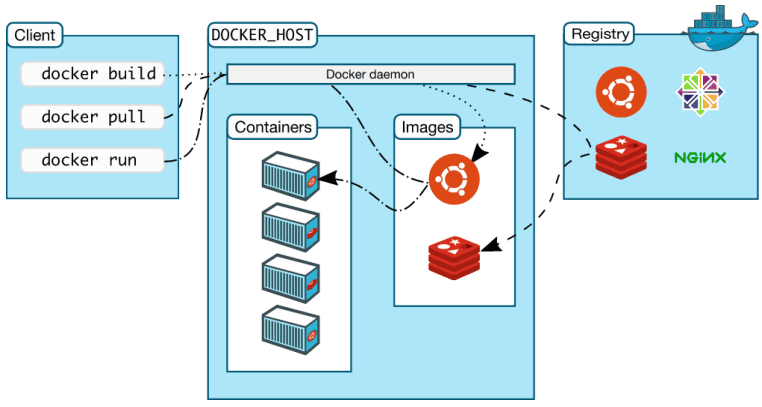

## Урок 5. Лекция. Введение в Docker
План урока:
1. Архитектура Docker
2. Процесс установки docker
3. Процесс работы с одним из репозиториев Docker
4. Основные команды, необходимые для работы с Docker

### Вступление
Технологии контейнеризации получили довольно широкое применение всфере разработки ПО, тестирования ПО, анализа данных и еще во многих сферах. Данные технологии не только помогают сделать приложения более безопасными, облегчить их перенос между платформами и развертывание, но и улучшают возможности с точки зрения масштабирования и позволяют сэкономить деньги. Так как в последние годы тренд роста технологий контейнеризации все актуальнее и актуальнее, необходимо знать их и уметь использовать!

Docker - это платформа, предназначенная для быстрой разработки, развертывания, тестирования и запуска приложений в контейнерах и может быть использована во многих командах при разработке ПО.

На данный момент давайте запомним: контейнер - это программа. Пока контейнер запущен, внутри запущена программа, выполняя ряд полезных действий.

Вы, вероятно, задаетесь вопросом: “Для чего это нужно?”. И действительно - для чего нам изучать контейнеризацию, ограничивать приложения, запускать их в какой-то “виртуальной” среде…

Пример! Раньше чтобы установить какую-нибудь БД или библиотеку, разработчику необходимо было прочитать инструкцию на сайте, скачать набор ПО и зависимостей. А при смене версий на более новые эти зависимости необходимо было удалять и устанавливать обновленные. А если зависимостей много? А если необходимо запускать одновременно и старую версию ПО, и новую? Давайте сюда еще добавим необходимость работы с различными проектами одновременно - и все становится понятно: одного сервера с ОС недостаточно. Необходимо как-то разграничивать среды и приложения между собой.

С контейнерами все проще. Все необходимые компоненты уже находятся внутри контейнера и ПО может их использовать. Не нужно удалять что-либо из системы при переустановке, также не остается никаких следов использования тех или иных зависимостей и версий ПО.

Кроме того, есть еще и единый интерфейс управления, который позволяет исключить необходимость запоминания индивидуальных команд. Достаточно лишь знать команды самого docker и все. А, если возникнут какие-либо ошибки, благодаря изоляции они не затронут хостовую операционную систему.

Пример номер два. Предположим, ваш продукт уже готов и его необходимо протестировать. При этом все тесты занимают около получаса, а установка ПО - час. При этом, находя баг, необходимо декларировать его и отправлять разработчикам на доработку. После устранения багов, процесс повторяется. А теперь представьте: у вас сырой продукт и количество ошибок, найденных на разных этапах тестирования, может достигать десятков и сотен. Каждый раз тратить большее количество времени на установку, чем на тестирование неразумно.

Теперь представим эту же ситуацию. У нас приложение контейнеризировано. Изначально на контейнеризацию и автоматическую сборку приложения тратится некоторое количество времени, но зато потом, чтобы развернуть рабочее ПО необходимо буквально пару минут. Процесс заметно ускорится при таком подходе и у команды появится время, которое можно будет потратить на другие задачи.

Пример номер три. Но перед его началом давайте введем определение.

**CI/CD (Continuous Integration/Continuous Delivery)** — методология разработки программного обеспечения, которая обеспечивает надежность и скорость создания продукта. Относится к одной из типовых DevOps-практик.

Ее основное отличие в том, что тестирование и сборка кода проводится в
автоматическом режиме. Такой подход позволяет избежать ошибок на ранних
этапах и сводит риски к минимуму.

Автоматизация. Предположим, что у нас разрабатывается продукт, который довольно быстро выходит на рынок. Для этого необходимо обеспечить процесс работы так, чтобы разработчики занимались лишь написанием кода, тестировщики - его тестированием, администраторы - сетевыми задачами компании, а devops’ы - автоматизацией доставки кода. В этом нам тоже помогут контейнеры и докер. Всю процедуру разработки приложения можно автоматизировать только в случае, если у нас имеется контейнеризация и полная изоляция сред и приложений. Если же мы каждую версию разрабатываемого приложения будем устанавливать на один и тот же компьютер - рано или поздно мы получим конфликты из-за накопленного в ОС программного мусора, который остается при каждой установке ПО.

За счет изоляции исполняемых сред этот процесс будет протекать без проблем, так как каждая новая версия ПО устанавливается на чистую ОС. 

### Виртуализация vs контейнеризация
Первой попыткой экономии денег явилась технология виртуализации. Виртуальные машины существуют гораздо дольше контейнеров и точкой отсчета здесь можно считать 2005-2006 годы. Именно тогда начали появляться технологии виртуализации, которыми сейчас пользуются многие люди и компании.

Вторая попытка экономии - контейнеризация. О ней мы говорили предыдущие два урока, рассматривая значимые аспекты работы механизма. Важные отличия от виртуализации, которые стоит знать на данный момент:
- Меньшее потребление ресурсов
- Легче переносить между окружениями
- Более быстрый запуск и переход в работоспособное состояние

Начать работу с Docker лучше всего с разбора архитектуры. В этом нам поможет следующая схема:
[](./docker.png)

### Образ контейнера
Давайте начнем с теории, которую потом продемонстрируем на практике. Помимо контейнера, есть еще образ (он же image).

Образ - это некий неизменный шаблон проекта (либо программы), который используется в дальнейшем для создания контейнеров с одинаковой базой. В таком контейнере содержится базовая система, набор необходимых библиотек и все это собрано в виде сущности - образа, из которого можно создать контейнер.

Образ также содержит в себе и файловую систему, которая в дальнейшем будет доступна приложению, и ряд метаданных (команды, которые будут выполнены при запуске контейнера, например).

Образ можно скачать с репозитория. Репозиторий - это место, где хранятся в актуальном виде (с поддержкой версий) данные. В нашем случае - образы. Иными словами, репозиторий - это коллекция различных образов контейнеров в реестре.

Важный момент: образы можно как скачать с репозитория, так и создать самостоятельно. После создания образа на локальном компьютере (либо сервере) его можно отправить в хранилище, чтобы остальные пользователи после могли бы его переиспользовать.

Каждый образ состоит из слоев, которые в совокупности обеспечивают содержимое, которое мы видим в запущенных контейнерах. Слой - это некий результат способа создания образов.

Важный момент! При работе с Docker запускаются именно контейнеры, а не образы!

### Docker Container
Да, определение этой сущности мы уже давали, однако, давайте дадим расширенное понятие с дополнительной информацией.

Итак, контейнер, иными словами, это собранный проект, который состоит из образов. По сути, это упакованное приложение на основе образов. Вместе с приложением упаковке подлежит и среда контейнера. Выполняемый контейнер - это запущенный процесс, который изолирован от других процессов на выполняемой системе, имеющий свои ограничения на потребление ресурсов (ЦПУ, ОЗУ, диска и так далее).

### Docker Daemon
**Docker daemon** - это служба, управляющая Docker-объектами, такими как: образы, контейнеры, хранилища разного рода, сети и так далее. Также это программная платформа для создания, упаковки, выполнения и распространения приложения. С ее помощью можно скачать образы с хранилища (registry) и запустить из них контейнер.

### Docker Registry
**Registry server** - это репозиторий, где хранятся образы. После создания образа на локальном устройстве, им можно поделиться с остальными, отправив образ в registry. А затем - извлечь его оттуда. Примеры репозиториев: Docker Hub, Google Cloud Container Registry и тд. Помимо хранения образов, registry хранит в себе документацию о предоставляемом ПО. 

В репозитории есть функция поиска. Столбец слева: продукты. Нам необходимы только образы (не расширения, не плагины), так как мы планируем запускать контейнер.

Галочки “Доверенного содержимого”. Здесь доступны несколько вариантов:
- Docker Official Image - таким флагом помечаются официальные образы, которые и рекомендуется использовать. Они точно проверены, имеют достаточную документацию и не доставят проблем при использовании.
- Verified Publisher - таким флагом отмечаются образы, которые загружены проверенным издателем. Их также можно использовать. Чаще всего такими флагами помечаются аккаунты производителей ПО, например, Dell. Такие образы скачиваются клиентами без каких-либо ограничений скорости.
- Docker Sponsored Open Source Software (Docker OSS) - с этим флагом содержится ПО с открытым исходным кодом, которое спонсирует Docker. Это образы, которые спонсируются через программу Docker.
  
Далее, что можно выбрать: тип ОС - Linux или Windows. И, напоследок, архитектуру. Контейнеры могут быть построены под различную архитектуру процессоров и выполняться на разных устройствах: от привычных нам x86, x86-64 платформ до ARM и, например, IBM Z платформ.

Также образы сортируются в списке по наилучшему совпадению и большему числу загрузок. Собственно, необходимый нам образ - первый в списке. Откроем его.

Первое, что мы видим - вкладки. У каждого образа могут быть теги. С их помощью мы можем выбрать необходимый нам образ: Ubuntu 18.04, Ubuntu 20.04 и тд. По умолчанию, если не указывать тег, будет загружаться последний доступный образ. То есть образ с тегом latest. Для простейших примеров это удобно. Но при разработке и построении сложных систем крайне рекомендуется указывать конкретную версию, а не latest.

Простой пример: у нас есть сайт, состоящий из нескольких контейнеров - веб и БД. При очередном обновлении у веб-части сменился python с версии 2.7 на версию 3.9. Те, кто изучал python, знают, что версии 2.х и 3.х несовместимы и код, написанный под 2 версию не будет работать с третьей. При очередном обновлении сайт просто перестанет работать.

Идем дальше. Следом идет описание контейнера, который нас заинтересовал с подробным описанием, переменными, которые можно использовать в контейнере и куча дополнительной полезной информации.

Напоследок - лицензионное соглашение, описывающее возможности использования этого контейнера.

### Установка Docker
https://docs.docker.com/get-docker/

Перед установкой предлагается ознакомиться с системными требованиями, которые имеются у каждого продукта. Для наших работ имеется машина, удовлетворяющая этим требованиям: минимум 4Гб ОЗУ, также на машине имеется 4 процессорных ядра.

Далее выбираем ОС - Ubuntu и видим перед собой список команд, которые предлагается выполнить.

На текущей системе не было установлено никаких систем, поэтому удалять старые версии не нужно.
```bash
# Обновим пакеты
sudo apt-get update
# Установим необходимый набор зависимостей
sudo apt-get install ca-certificates curl gnupg lsb-release
# Добавляем ключи
sudo mkdir -p /etc/apt/keyrings
curl -fsSL https://download.docker.com/linux/ubuntu/gpg | sudo gpg --dearmor -o /etc/apt/keyrings/docker.gpg
# Добавим репозиторий
echo "deb [arch=$(dpkg --print-architecture) signed-by=/etc/apt/keyrings/docker.gpg] https://download.docker.com/linux/ubuntu $(lsb_release -cs) stable" | sudo tee /etc/apt/sources.list.d/docker.list > /dev/null
# Теперь все готово! Повторно обновляем список пакетов, чтобы добавились пакеты из свежедобавленных репозиториев:
sudo apt-get update
# И установим набор необходимых компонентов:
sudo apt-get install docker-ce docker-ce-cli containerd.io docker-compose-plugin
# Проверить работу достаточно просто - запустим команду:
sudo docker run hello-world
```
А вот теперь давайте разбираться! Первое, что видим как результат запуска - сообщение о недоступности образа. Это система пытается найти образ с названием hello-world. Не найдя его локально, система идет искать образ в публичный registry. По умолчанию - это https://hub.docker.com/. Тут содержится большинство образов. Скачав образ, система сверяет хэш в целях безопасности и проверяя образ на целостность и затем запускает, о чем и уведомляет нас в консоли.

Давайте выполним последнюю команду повторно! Как мы видим, повторное скачивание не производилось, так как контейнер уже доступен локально.

### Основные команды Docker
- **docker --help** - выведет список доступных команд, если вы вдруг что-то забудете.
- **docker <command> --help** - выведет информацию о команде. Пример: docker images --help.
- **docker --version** - выведет нам версию установленного докера
- **docker info** - если вы хотите вывести больше информации о рабочей системе
- **docker search debian** - поиск образа через консоль. Здесь в списке также есть отметка об “официальности” образа.
- **docker pull ubunt** - скачать образ, без разворачивания контейнера. Как видим, докер начал скачивать версию образа с тегом latest (последний доступный). Чтобы скачать ubuntu версии 18.04., нужно ввести: **docker pull ubuntu:18.04**
- **docker images** - список доступных образов в системе, которые могут отличаться тегами (и, соотвественно, версиями). Чтобы вывести только идентификаторы образов: **docker images -aq**.
- **docker rmi ubuntu:18.04** - удалить старый образ ubuntu версии 18.04
- **docker rmi $(docker images -aq)** - удалить все образы из системы
- **docker run hello-world** - запуск контейнера. По сути, команда скачивает образ hello-world и запускает из него контейнер.
- **docker run -it ubuntu bash** - первая половина говорит о том, что нужно запустить контейнер из образа убунту. Флаг -it говорит о том, что нужно запустить контейнер в интерактивном режиме (не в фоновом режиме), а приписка bash говорит, какую команду из контейнера необходимо запустить для работы. В частности, можно запустить командный интерпретатор bash, shell и, тем самым, остаться работать внутри контейнера. В случае, если мы, например, запустим docker run -it ubuntu date, система просто выведет нам текущую дату и время и завершит работу контейнера.
- **docker run -–publish 8080:80 nginx** - Итак, запускать контейнер мы научились, а теперь давайте сделаем публикацию портов. То есть сделаем контейнер доступным извне (аналог NAT у маршрутизаторов). В этот раз мы запустим контейнер nginx, так как он сразу позволит выводить данные. Таким образом, мы сказали системе открыть изнутри контейнера порт 80 и сделать его доступным снаружи через порт 8080. Давайте проверим, что все работает командой curl. `curl 127.0.0.1:8080`. Как видим, nginx запустился. В одном окне мы получили от него ответ, а в другом - лог о том, что происходил запрос в систему.
- **docker run --name testcontainer ubuntu** - установить имя запускаемому контейнеру
- **docker ps** - посмотреть список запущенных контейнеров. Чтобы посмотреть список всех контейнеров, необходимо вводить **docker ps -a**.
- **docker start testcontainer** - запуск контейнера по имени
- **docker rm testcontainer** - удалить контейнер по имени
- **docker rm $(docker ps -a -q)** - удалить все контейнеры. **docker ps -a -q** - выводит id всех контейнеров в системе.
- **docker system df** - посмотреть занятое место на диске. Рекомендуется периодически проверять и запускать команду в целях мониторинга.
- **docker system prune -af** - удалить неиспользуемые данные и очистить дисковое пространство. (Будут удалены остановленные контейнеры и не используемые образы)

### Заключение
Давайте проведем параллели этого урока с уже изученной информацией. Первые два урока на лекциях мы рассматривали механизм пространства имен и механизм контрольных групп. А на практике запускали изолированные приложения и процессы, проверяя, что все строго локализовано, ограничено и не имеет доступа в хостовую систему.

Сегодня же мы запустили те же приложения (командный интерпретатор bash, например) и изолировали теми же способами, что и ранее, но уже в полуавтоматическом режиме. Большую часть работы за нас уже сделал docker: создал изолированные пространства имен, выделил ресурсы для запуска. На семинаре же мы разберем более детально эти процессы и попробуем ограничить запускаемые приложения.

В заключении важно подчеркнуть, что на данном уроке мы познакомились непосредственно с Docker, изучили набор основных команд, которые в дальнейшем будем использовать, а также научились работать с репозиторием Docker. На практике мы обязательно рассмотрим более сложное взаимодействие с контейнерами и рассмотрим различные флаги, которые используются для работы.

### Термины, используемые в лекции
**Зависимость** - это значит полагаться на что-то. Например, если сказать, что люди слишком много полагаются на мобильные телефоны, то, получается, они зависят от них. Когда приложение A использует некоторую функциональность из приложения B, тогда говорят, что приложение A зависимо от приложения B.
