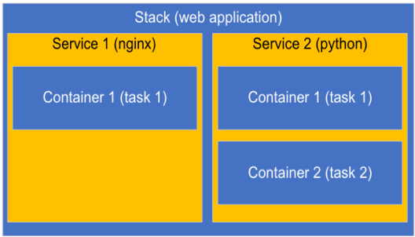

## Урок 9. Лекция. Docker Compose и Docker Swarm
План урока:
1. Принцип связи запущенных контейнеров
2. Изучим особенности работы Docker Compose
3. Docker Swarm: познакомимся и создадим свой кластер
4. Виртуальные сети в Docker

## Вступление
Как мы помним, Docker - это платформа контейнеризации с открытым исходным кодом. С ее помощью можно автоматизировать создание приложений, доставку и управление. Docker позволяет быстрее тестировать и выкладывать приложения, запускать на одной машине требуемое количество контейнеров.

В целом, благодаря докеру, разработчикам не нужно задумываться о том, в какой среде будет инсталлировано приложение, будут ли на сервере необходимые зависимости и ПО, которое, возможно, может конфликтовать между собой.

Мы уже изучили запуск и создание контейнеров, однако, теперь нужно двигаться дальше! На этом уроке мы будем изучать великолепный инструмент - NDocker Compose. Благодаря ему вы сможете запускать подготовленную инфраструктуру всего за пару кликов и это будет максимально быстро и продуктивно!

## Что такое Docker Compose (ДК)?
ДК позволяет управлять несколькими контейнерами из одного yml-файла. Про них мы поговорим немного позднее. С использованием этого инструмента отпадает необходимость писать множественные docker run вместе с кучей аргументов, которые раздувают запуск одного контейнера до нескольких строк. ДК - это инструментальное средство, которое находится в составе докера.

Следует напомнить, что основное его предназначение - решение задач по развертыванию проектов, состоящих из одного или нескольких контейнеров. В рамках одного запуска нет ограничений на количество сущностей. Я думаю, в современных реалиях мы скорее столкнемся с недостатком ресурсов на узле, чем превысим максимально доступное количество контейнеров на ноде.

Резюмируя, разница между Docker и Docker Compose состоит в том, что докер предназначен для управления одиночными контейнерами, из которых может состоять приложение. ДК же позволяет управлять сразу несколькими контейнерами, запуская и останавливая их в одну команду. По сути, ДК предлагает те же возможности, что и докер, но, при этом, позволяет работать с более сложными приложениями со сложной внутренней архитектурой и составляющими.

Давайте рассмотрим простой пример, которого мы уже касались ранее. У нас все также есть сайт, который со временем оброс кучей сервисов, каждый из которых представляет собой отдельно работающее ПО. Давайте перечислим парочку для ясности:
- БД. Пусть будет MariaDB
- Web-составляющая, которая отвечает за отрисовку страниц нашего ресурса
- Платежная система для приема оплат онлайн
- Почтовый сервис

Ну, для начала достаточно. Тут также стоит сказать, что одного рабочего экземпляра каждой составляющей точно будет недостаточно. Давайте не будем забывать о больших нагрузках на сервер, об отказоустойчивости, о тестировании новых версий и т.д. и т.п. Тут у нас могут быть запущены различные тестовые версии сайта со всеми компонентами, могут работать версии сайта для различных устройств (мобильная версия, версия для планшетов, настольная версия и так далее).

Как вы поняли, список можно продолжать до бесконечности и основной посыл здесь в том, что наш сайт состоит из множества различных контейнеризованных сервисов, которые вместе образуют большой сервис.

Так вот, давайте представим, что сервис наш стал настолько популярным, что мощностей сервера, на котором он работает, стало недостаточно. Придется переносить и перенастраивать как минимум часть сервисов. Для того, чтобы перенести проект или его часть на новое место, необходимо выполнить ряд настроек, загрузить резервную копию БД и вообще вспомнить процедуру деплоя этих компонентов.

В случае, если у нас не докер, а ДК, все гораздо проще. И вопрос переноса сервиса будет куда проще в связи с тем, что все команды будут задокументированы в YML-файлы. Нам же необходимо лишь запустить одну команду и выгрузить необходимый набор данных на новый сервер, например, БД. Перед началом практики хотелось бы напомнить вам о том, что в реальности, при работе с контейнеризацией, необходимо запускать не один контейнер, а несколько. Более того: запускать их нужно в связке между собой, так как каждый контейнер может быть отдельной частью крупного проекта.

Перед началом практики хотелось бы напомнить вам о том, что в реальности, при работе с контейнеризацией, необходимо запускать не один контейнер, а несколько. Более того: запускать их нужно в связке между собой, так как каждый контейнер может быть отдельной частью крупного проекта.

Давайте для начала мы разберем простой пример запуска проекта, состоящего из двух контейнеров. Все будет довольно просто. Мы возьмем лишь часть от описания выше:
1. Эта часть состоит из БД. Для простоты пусть будет mariaDB. И отвечать она будет за хранение данных
2. Эта часть отвечает за веб-составляющую. Для простоты пусть это будет adminer.

Так вот, для запуска этого простого проекта с помощью докера необходимо выполнить две команды:
```bash
docker run --name some-mysql -e MYSQL_ROOT_PASSWORD=my-secret-pw -d mysql:8.0.31
docker run --name myphp -d --link some-mysql:db -p 8081:80 phpmyadmin/phpmyadmin
```
Как можно видеть, в данном случае для запуска каждой сущности необходимо выполнять отдельную команду. А теперь давайте вернемся к нашему примеру раньше и представим, что таких сущностей в проекте десятки или даже сотни?

А как же “связывать” контейнеры между собой? Все тоже довольно просто.  
Самое интересное в этом аргументе: --link name:alias.  
**name** — имя нашего контейнера с БД, alias — имя, под которым этот контейнер будет известен запускаемому.

Запуск команд приведет не только к запуску 2 отдельных контейнеров, но и к ряду дополнений в механизме работы: во-первых, в контейнере с веб-составляющей у нас появится набор переменных окружения, указывающих на контейнер db, во-вторых в /etc/hosts контейнера с web появится алиас (она же - ссылка) на контейнер с db, указывающий на ip, на котором мы запустили контейнер с базой данных.

Теперь мы планово можем переходить к ДК. Он и позволит нам не вводить сотни команд, а использовать всего лишь одну команду. Про них мы и поговорим дальше, прежде чем попробуем запустить тот же самый проект с помощью ДК.

Для того, чтобы идти дальше, нужно дать важное определение, так как с ним мы будем сталкиваться довольно часто.

YAML — это язык для сериализации данных, который отличается простым синтаксисом и позволяет хранить сложноорганизованные данные в компактном и читаемом формате.

YAML — это язык для хранения информации в формате, понятном человеку. Его название расшифровывается как, «Ещё один язык разметки». Однако, позже расшифровку изменили на — «YAML не язык разметки», чтобы отличать его от настоящих языков разметки.

Язык похож на XML и JSON, но использует более минималистичный синтаксис при сохранении аналогичных возможностей. YAML обычно применяют для создания конфигурационных файлов в программах типа Инфраструктура как код (Iac), или для управления контейнерами в работе DevOps.

Чаще всего с помощью YAML создают протоколы автоматизации, которые могут выполнять последовательности команд, записанные в YAML-файле. Это позволяет вашей системе быть более независимой и отзывчивой без дополнительного внимания разработчика.

Особенности YAML:
- понятный человеку код;
- минималистичный синтаксис;
- заточен под работу с данными;
- встроенный стиль, похожий на JSON (YAML является его надмножеством);
- поддерживает комментарии;
- поддерживает строки без кавычек;
- считается «чище», чем JSON;
- дополнительные возможности (расширяемые типы данных, относительные якоря и маппинг типов с сохранением порядка ключей).

Применение: YAML лучше всего подходит для приложений с большим объемом данных, которые используют DevOps конвейеры или виртуальные машины. Кроме того, улучшение читаемости данных пригодится в командах, где разработчики часто с ними взаимодействуют.

Давайте теперь посмотрим на YAML-файл, который мы будем использовать чуть позже на практике.
```YAML
version: '3.9'
services:
    db:
        image: mariadb:10.10.2
        restart: always
        environment:
            MYSQL_ROOT_PASSWORD: 12345

    adminer:
        image: adminer:4.8.1
        restart: always
        ports:
            - 6080:8080
```

Давайте рассмотрим подробнее его “начинку” и правила формирования. Итак, в случае работы с ДК файл может начинаться без каких-либо отступов изначально, так как стандарт позволяет это сделать.

Идем дальше: сервисы. Тоже без дополнительных отступов. Вообще файл представляет из себя пары “ключ-значение”. Как раз в первой строке это четко и явно видно. Ключ - версия. Значение - ее номер. Однако, сервисы - тут просто двоеточие. Это значит, что данная переменная (или ключ, если хотите) имеет вложенные значения, которые будут описаны ниже в файле. Привести пример неправильного написания файла обязательно!

Итак, все вложенные ключи должны иметь отступ, а именно: обязательно на один отступ больше, чем было в родительской переменной.

По сути, мы будем заниматься оркестрацией контейнеров. Оркестрация контейнеров — это централизованное и эффективное управление, а также мониторинг контейнеров. И важное замечание: не только самих контейнеров, но и их окружения, включая их отношения и связи друг с другом. С этим мы познакомимся позже.

Инструмент оркестрации должен иметь как минимум 3 ключевых элемента:
- Развертывание
- Масштабирование
- Надежность  

Давайте пройдемся по каждому элементу.

Развертывание - это возможность эффективно деплоить наши контейнеры в соответствии с заданными параметрами. Оно обычно осуществляется с помощью манифестов. Манифест — это файл JSON, содержащий всю информацию о контейнерах Docker, которые необходимо развернуть.

Под масштабированием здесь стоит понимать возможность увеличения количества запущенных контейнеров простым способом. Например, если у нас есть контейнер, в котором работает веб-сервер (или БД), и трафик растет, мы можем масштабировать его и дублировать один и тот же контейнер столько раз, сколько необходимо для удовлетворения всех входящих запросов. Масштабирование работает не только в сторону роста, количество реплик контейнера также может быть уменьшено, если, например, уменьшится трафик.

Также сюда стоит включить умение управлять внутренней сетью. Это также немаловажно, так как контейнеры чаще всего - это одноразовые сущности, которые запускаются и останавливаются в соответствии с конкретными потребностями приложения и запросов, поступающих к нему. Почему сеть важна? С учетом того, что наши контейнеры могут масштабироваться в обе стороны, необходим механизм управления IP-адресами. Для этого инструмент оркестрации должен уметь генерировать и внутренние сегменты сети, и службы, которые будут отвечать за ее обслуживание. Например, необходим набор служб, которые способны балансировать нагрузку между запущенными контейнерами, а также - необходимые службы DNS, чтобы была возможность обращения к различным элементам приложения по имени без необходимости запоминания IP-адресов.

Теперь давайте поговорим о надежности. Помимо всего прочего, оркестратор должен быть способен поддерживать работоспособность нашего приложения. Что здесь имеется ввиду: как только мы объявим контейнеры, которые необходимо развернуть для нашего приложения, оркестратор должен позаботиться о том, чтобы были развернуты они и вся инфраструктура, которая необходима. Учитывая, что в зависимости от нагрузки контейнеры могут быть развернуты дополнительно либо удалены (лишние имеется в виду), оркестратор также должен быть способен выполнять эти задачи автоматически: поднимать дополнительные контейнеры, останавливать избыточные, чтобы экономить ресурсы.

На первый взгляд, это может показаться чем-то сложным, но на практике все довольно просто. На самом деле, оркестратор берет на себя решение множества сложных задач и выполняет их в фоне. Нам же нужно будет беспокоиться лишь о правильном объявлении того, что мы хотим запустить. Как и ранее, на практике все встанет на свои места.

### Основные команды ДК
Прежде чем мы окончательно перейдем к практике, предлагаю рассмотреть набор доступных команд. Он невелик и достаточно прост:
- docker-compose build - команда позволяет собрать сервисы, описанные в конфигурационных файлах
- docker-compose up -d - запускает наш проект. В данном случае проект запустится в фоновом режиме, так как в команде присутствует флаг -d
- docker-compose start - запускает любые остановленные ранее сервисы в соответствии с указанными параметрами
- docker-compose down - останавливает наш проект и, что немаловажно, удаляет все сервисы, которые были запущены ранее
- docker-compose stop - эта команда просто останавливает все сервисы, описанные в конфигурации. Она не удаляет контейнеры, тома, сети и прочие сущности, описанные в конфигурационном файле
- docker-compose logs -f [service name] - с помощью этой команды можно посмотреть логи нашего сервиса
- docker-compose ps - выводит на экран список всех доступных контейнеров
- docker-compose exec [service name] [command] - с ее помощью можно выполнить команду в сервисе, не заходя при этом в контейнер. Ранее мы рассматривали подобное на уроке “Введение в Docker”
- docker-compose images - позволяет вывести список образов.

### Описание проекта
Итак, разобравшись с теорией, самое время перейти к практике. Начнем ее с уже известного нам манифеста:
```YAML
version: '3.9'
services:
    db:
        image: mariadb:10.10.2
        #как пример показать и такое в режиме лайвкода:
        build: ./db
        restart: always
        environment:
            MYSQL_ROOT_PASSWORD: 12345

    adminer:
        image: adminer:4.8.1
        restart: always
        ports:
            - 6080:8080
```
В целом, манифест довольно прост. Давайте перейдем к комментариям и описанию:
- version: '3.9' - в этой строке описывается версия compose-файла. Каждый файл обязательно должен начинаться с тега версии. Глобально версий всего три. Первая, которая более не поддерживается, вторая и третья. Каждой версии файла соответствует определенная версия докера, установленная на машине. Например, для версии 3.1 необходимо, чтобы установленный докер был не ниже версии 1.13.1, а вот версия 3.8 уже требует минимум версию 19.03.0.
- services - эта строка говорит о том, что далее в файле будут описаны сервисы (один или несколько), которые необходимо запустить или остановить (зависит от команды, передаваемой в докер). Важно помнить, что ДК работает с сервисами (1 сервис = 1 контейнер). Сервисом при этом может быть клиент, сервер, сервер БД и так далее.
- db: - это название первого сервиса. Название каждый может придумать какое угодно вам. Понятное название сервиса поможет определить его роль и сделать манифесты более читаемыми.
- build: ./db - ключевое слово, позволяющее задать путь к файлу докерфайл, который будет использован для создания собственного образа и который, в свою очередь, позволит запустить сервис.
- image: mariadb - если вместо build указан этот вариант, система будет использовать готовые образы с docker hub. На лекции, в примерах, мы будем использовать этот вариант. На практике попробуем разобрать варианты с построением собственных образов.
- restart: always - позволяет определить политику перезапуска контейнера. Существует несколько вариантов:
    - no - не перезапускать контейнер автоматически. Это значение по
    умолчанию. Если мы ничего не укажем, контейнер не будет
    перезапускаться
    - on-failure [max retries] - перезапускать контейнер, если он был
    завершен не с нулевым кодом выхода. В данном случае необходимо
    указать максимальное количество попыток перезапуска
    - always - всегда перезапускать контейнер, если он был остановлен.
    Здесь стоит быть аккуратнее в связи с тем, что в этом случае возможен
    цикличный перезапуск контейнера с проблемами
    - unless-stopped - всегда перезапускать контейнер. По сути, этот вариант
    аналогичен always кроме случаев, когда он был остановлен вручную.
    При этом он не перезапускается после перезапуска демона докера.
    - environment - в этом блоке прописываются переменные, которые могут
    быть использованы для работы контейнера
    - ports - указывает на то, какие порты необходимо открыть для связи с
    контейнером

### Немного практики
Итак, ознакомившись с проектом, можно приступить к практике. Первым делом проверим, что у нас ничего не запущено:
```bash
docker ps -a
root@testVM:~/lesson5# docker images
```
Отлично, давайте запустим наш проект. Для этого перейдем в директорию с нашим yml-файлом и запустим:  
`docker-compose up`

Как мы видим, процесс пошел:
```bash
docker-compose up
Creating network "lesson5_default" with the default driver
Pulling db (mariadb:10.10.2)...
10.10.2: Pulling from library/mariadb
039ecd174df7: Pull complete
f9e5f484f6bc: Pull complete
Digest: sha256:940985c1cf37812ffb3bb6c7b34b4e40233e0907fc786ec7d63c49553d7d1454
Status: Downloaded newer image for mariadb:10.10.2
Pulling adminer (adminer:4.8.1)...
4.8.1: Pulling from library/adminer
be31139c5821: Pull complete
d183076dd611: Pull complete
Digest: sha256:3b4e25b39404729b27bbb2895fa0a8fefe8ec19cdad1fe85c85500f4c080c7f4
Status: Downloaded newer image for adminer:4.8.1
```
Сначала произошло скачивание первого образа (который с БД), затем второго. Ну и далее, как можем видеть, запустилась наша БД и adminer. Учитывая, что мы запускали приложения не в фоновом режиме, они заняли нашу консоль.

Итак, как же все это произошло? Теперь можем обсудить последствия выполнения нашего манифеста.

Первое - были скачаны два различных образа из официального репозитория. Это довольно простая операция и тут все должно быть предельно ясно.

Второе - из образов были созданы контейнеры. В целом, тоже ничего сложного.

Третье - оба этих контейнера должны общаться друг с другом. Это также значит, что они формально имеют какую-либо общую сетевую инфраструктуру. Это может показаться сложным, однако, сейчас давайте поверим на слово, что инфраструктура (то бишь сеть) у них общая. Оба контейнера получили свои IP-адреса. Этот момент давайте проверим на всякий случай. Для этого запустим замечательную команду:
```bash
docker container inspect adminer
docker container inspect mariadb
```
Как видим, контейнеры имеют корректные адреса. Значит, действительно, сеть у них есть и эта сеть - общая. О тонкостях работы сетевых интерфейсов мы поговорим немного позднее.

А сейчас же давайте насладимся результатом работы! Для этого мы перейдем в браузер и попробуем посмотреть на результат нашей работы. Важно отметить, что мы выполнили проброс портов. То есть, мы имеем доступ внутрь контейнера через сетевой интерфейс хостовой машины. Далее вводим адрес нашей машины вместе с портом и видим приветственное окно adminer:

Вводим логин и пароль, который мы указывали (root/12345) и получаем вход в нашу БД.

Однако, есть проблема. Мы запустили наши контейнеры не в фоновом режиме. Давайте несколько изменим команду, добавив флаг -d:
```sh
docker-compose up -d
Starting lesson5_adminer_1 ... done
Starting lesson5_db_1 ... done
```
Теперь все запущено и работает. Можем проверить это. Нужно заострить внимание в этом случае на именовании запущенных контейнеров.
```sh
docker ps
CONTAINER ID IMAGE COMMAND CREATED
STATUS PORTS NAMES
bbf5aff9e554 adminer:4.8.1 "entrypoint.sh docke…" 9 minutes ago Up 45 seconds 0.0.0.0:6080->8080/tcp, :::6080->8080/tcp lesson5_adminer_1
3e6fb7a7f0e4 mariadb:10.10.2 "docker-entrypoint.s…" 9 minutes ago Up 46 seconds 3306/tcp lesson5_db_1
```
Теперь все отлично работает и никак не мешает нам. Давайте рассмотрим ряд описанных выше команд:
```sh
docker-compose stop #здесь показать, что контейнеры были остановлены, но не удалены!
docker ps -a #отображаем остановленные контейнеры
docker-compose start -d #снова запускаем и проверяем, что все хорошо
docker-compose logs #показать, что логи тоже есть
Start existing containers. #заострить внимание на этом!
docker ps -a
docker-compose down #показать, что в этом случае они удалятся
docker ps -a #проверяем удаление
docker-compose start #пытаемся запустить удаленное и получаем ошибку
Starting db ... failed
Starting adminer ... failed
ERROR: No containers to start
ERROR: 1
```

### Что такое Docker Swarm (ДС)
Итак, деплой приложения, состоящего из нескольких контейнеров мы освоили. Теперь давайте добавим к этому отказоустойчивость! Давайте научим наш докер работать не на одном сервере (ноде), а на трех, что принесет несколько плюсов:
1. Отказоустойчивость - при выходе из строя одной ноды из трех наши
контейнеры смогут продолжать работу на остальных узлах кластера.
2. Увеличение ресурсов - в случае работы в кластере, существенно увеличивается мощность, доступная контейнерам для работы.

Прежде чем мы продолжим, давайте дадим несколько определений, которыми будем оперировать в дальнейшем.

**Node (нода)** - это наш сервер с установленным на нем Docker. По сути, нодой могут быть как физические сервера, так и виртуальные машины. На лекционных и семинарских занятиях в качестве нод мы и будем использовать виртуальные машины - их мощностей более чем достаточно для наших примеров.

**Stack** - это набор сервисов, которые могут быть связаны между собой логически. Иными словами, это набор сервисов, которые описываются в обычном compose файле. Важно заметить, что части стека могут располагаться как на одной ноде, так и на различных.

Пример стека представлен на изображении ниже:

[](./stack.png)

**Сервис** - это составляющая стека. Сервис является описанием того, какие контейнеры необходимо создать. Ранее мы уже рассмотрели ДК файлы и, по сути, на практике познакомились с этой сущностью.

**Task (задача)** - непосредственно созданный контейнер, который движок докера создает на основе предоставленной информации.

Итак, разобравшись с набором терминов, предлагаю перейти непосредственно к знакомству.

**ДС** - это стандартный оркестратор для контейнеров, который изначально встроен в механизм работы докера. Он отлично подойдет для развертывания приложений в рабочей среде кластера. Его несомненный плюс - не нужно будет переписывать наши ДК файлы, а просто применять их для работы с ДС.

Также хочу заметить, что у ДС есть два типа нод (узлов):
- manager node - управляющий сервер. Он способен управлять нашим кластером: добавлять и удалять сущности (например, ноды кластера). На нем также возможно запускать и контейнеры.
- worker node - на этом узле возможен лишь запуск контейнеров. Управление кластера с данного типа узлов недоступен.

Существует несколько вариантов делегации прав. Если вы строите кластер из 3 нод, можно сделать только одну ноду управляющей, а оставшиеся две - управляемыми с точки зрения безопасности и оградить управляющую ноду от лишних соединений извне. С другой стороны, если наш кластер содержится в отдельной сети, к которой злоумышленники наверняка не получат доступ, можно сделать все три ноды управляющими. Это позволит управлять кластером с любой ноды, а также, в случае выхода из строя одной из нод, не будет теряться управление кластером.

Вторая вариация: 5-нодовый кластер. В данном случае можно сделать 2 или 3 ноды управляющими, а остальные - рабочими. На самом деле это дело вкуса. Каждый конфигурирует кластер так, как считает нужным и как ему это удобно.

В случае, если вы хотите развернуть большое производство с сотнями контейнеров и общим хранилищем, оптимально рассмотреть как минимум второй вариант.

Итак, для создания нашего кластера необходимо установить компоненты докера. Их мы установили ранее и приступим непосредственно к созданию кластера.

Теперь давайте инициализируем наш кластер:  
`docker swarm init`  
В ответ на это мы получили следующую команду:  
`docker swarm join --token SWMTKN-1-3un77cn4m5ok3ijrdouwg3mit69uwmfwx96krc7taua7ovpjha-97y4zk9ppc8hxk2caxlig23xo 192.168.50.90:2377`  
Это команда, с помощью которой мы сможем присоединить другие узлы нашего будущего кластера. По сути, ввести их в кластер. На всех этих узлах необходимо ее выполнить.  
Давайте это и сделаем!  
Теперь, когда все команды выполнены успешно, давайте проверим состояние нашего кластера:
```sh
docker node ls
ID HOSTNAME STATUS AVAILABILITY MANAGER STATUS ENGINE VERSION
u6v4f0i3n88d4ab71m3nlolw8 * docker-1 Ready Active Leader 20.10.21
zjgj80mu5gk1sjlclfx41dwxh docker-2 Ready Active 20.10.21
xeh4kycewpk780ytv6zjqvl06 docker-3 Ready Active 20.10.21
```
Итак, как мы видим, в кластере отображается ID каждой ноды, ее hostname и еще ряд информации: доступна ли она в настоящий момент времени и в каком статусе преобладает, готова ли она к запуску контейнеров или нет. Также, в самой правой колонке отображается информация о типе ноды manager или work нода в кластере.

Если вы думали, что инициализация кластера - сложное дело, то вы ошибались. Итак, наш кластер создан и готов к работе!

Однако, у нас есть еще одна нода. Давайте добавим и ее.
```sh
docker swarm join --token SWMTKN-1-3un77cn4m5ok3ijrdouwg3mit69uwmfwx96krc7taua7ovpjha-97y4z k9ppc8hxk2caxlig23xo 192.168.50.90:2377
docker node ls
```
Она необходима будет для демонстрации вывода из кластера при различных условиях.  
Отлично, она добавлена. Теперь давайте выведем ее из кластера:  
`docker swarm leave`

Теперь давайте посмотрим, в каком статусе содержится нода:  
`docker node ls # необходимо немного времени`

Как можно видеть, нода теперь имеет статус не ready, а down. С этого момента ДС не будет использовать ее для размещения контейнеров и можно спокойно далее эксплуатировать кластер, не боясь за сохранность содержимого.

Давайте попытаемся повторно ввести ноду в кластер и посмотрим, что из этого выйдет.  
Для того, чтобы можно было окончательно удалить эту ноду, нужно выполнить на менеджере:  
`docker node rm (ID ноды)`

Теперь у нас нет задвоения нод в списке и все в порядке. Давайте продолжим дальше.

Как можно видеть, у нас только одна нода в статусе менеджера. Давайте увеличим это количество до двух:
```sh
docker node promote docker-2
root@docker-1:~# docker node promote docker-2
Node docker-2 promoted to a manager in the swarm.
root@docker-1:~# docker node ls
ID HOSTNAME STATUS AVAILABILITY MANAGER STATUS ENGINE VERSION
u6v4f0i3n88d4ab71m3nlolw8 * docker-1 Ready Active Leader 20.10.21
zjgj80mu5gk1sjlclfx41dwxh docker-2 Ready Active Reachable 20.10.21
x2hc3z3irk25mi8cd7dcwyxm0 docker-3 Ready Active 20.10.21
```
Теперь же состояние второй ноды изменилось, однако, оно стало не leader, как можно было подумать, а reachable. Формально, она стала запасным лидером.

Далее, что же можно еще сделать с нашими нодами? Давайте введем следующую команду и посмотрим на предложения:
```sh
docker node --help
Usage: docker node COMMAND
Manage Swarm nodes
Commands:
demote Demote one or more nodes from manager in the swarm
inspect Display detailed information on one or more nodes
ls List nodes in the swarm
promote Promote one or more nodes to manager in the swarm
ps List tasks running on one or more nodes, defaults to current node
rm Remove one or more nodes from the swarm
update Update a node
```
Давайте рассмотрим, какая информация о ноде содержится в кластере:  
`docker node inspect`

### Docker Swarm и Overlay сети
Итак, с нодами мы разобрались. Теперь пришло время разобраться еще с одной сущностью, которая также важна в организации кластера - сети.

Первое, о чем может быть вопрос - зачем создавать дополнительные сети, если итак все работает?! И это правда. Можно ничего не знать об этой сущности и использовать инструмент “как есть”, однако, существуют некоторые тонкости, о которых пойдет речь далее.

Overlay-сети используются в кластерах ДС, где виртуальная сеть, используемая контейнерами, связывает несколько физических хостов, на которых запущен Docker. В случае, когда мы запускаем контейнер на swarm-кластере (как часть сервиса), множество сетей присоединяется по умолчанию, и каждая из них соответствует разным требованиям связи.

Также хочу отметить, что существует несколько типов этих сетей:
- Overlay - создает простую подсеть, которая может быть использована контейнерами на разных хостах swarm-кластера. В этом случае контейнеры, которые располагаются на разных физических хостах будут обмениваться именно через overlay сеть. Важное условие - каждый компонент должен иметь доступ к такой сети. Технически при выборе данной сети, мы получаем дополнительный слой
- ingress - этот тип сети используется в ДС по умолчанию при создании кластера. Она отвечает за связи, которые устанавливаются между контейнерами (то есть сущностями внутри кластера и внешним миром). Посредством этой сети происходит балансировка нагрузки, которую по умолчанию и предоставляет ДС кластер.
- vxlan - при использовании этого типа сетей, у нас не просто происходит создание Overlay-сети. В этом случае происходит инкапсуляция пакетов 2 слоя модели OSI в четвертый. С помощью этого действия докер и создает этот тип сети. Любые конечные точки, содержащие этот тип сети, видят друг друга так, будто они подключены друг к другу посредством одного свитча. Эта сеть является технологией сетевой виртуализации, созданной для решения проблем масштабируемости в больших системах облачных вычислений.
- docker_gwbridge - эта сеть создается на каждом узле кластера. Она позволяет соединить трафик из контейнеров, находящихся внутри ДС кластера с внешним миром. Например, в случае, если мы из контейнера запустим команду ping ya.ru, будет использована эта сеть.

### Советы по использованию ДК и ДС
Итак, ознакомившись с основами и поняв, как работает ДК, можно перейти к ряду более глобальных советов по его использованию. Есть несколько общих рекомендаций, которых было бы здорово придерживаться при использовании этого инструмента. Давайте о них напоследок и поговорим.

### Совет 1: используйте виртуальные сети для различных проектов
Этот момент очевидный, но мало кто к нему сразу приходит. Связано это с тем, что “из коробки” все и так работает. Использование сети хоста не рекомендовано в связи с тем, что, резервируя какой-либо порт одним контейнером, вы его занимаете и не можете использовать повторно.

Это чревато тем, что другие приложения использовать его не смогут и вы, например, не сможете запустить две версии своего контейнеризированного приложения. А если у вас есть разное ПО, которое при этом использует схожие порты - вам вдвойне не повезло, так как искать причину неработоспособности вы будете довольно долго, не зная о существовании виртуальных сетей.

Вы можете спросить: “Какие еще преимущества дает использование виртуальных сетей?

А их не так уж и мало:
1. Изолированная сеть от хоста и остальных приложений. Это значит, что в сети не будет содержаться никакого паразитного трафика, который может повлиять тем или иным способом на работу ваших приложений. Также в этом случае крайне маловероятно, что особенности нашего хостового окружения приведут к изменению поведения сборки нашего контейнеризированного ПО.
2. В случае использования основной сети (хостовой), контейнеры прослушивают адрес 0.0.0.0. Если же мы открываем какой-либо порт для контейнера, то этот же порт открывается и у хоста, а это уже серьезная брешь в безопасности! В случае использования виртуальной сети таких проблем также не возникнет.
3. При использовании докера и его компонентов, процессы (контейнеры) могут обмениваться данными друг с другом не только по IP-адресу, но и по имени. Используя виртуальные сети, можно ограничить подобного рода обращения, можно развернуть рядом несколько окружений (dev, stage, prod) без какой-либо вероятности конфликтов между окружениями.

### Совет 2: Корректно открывать порты, не используя адрес 0.0.0.0
Эту ошибку мы допустили и на этом уроке, и на предыдущих. Мы открывали порты, записывая их как 8080:80. В целом это выглядит обычно и очень даже безобидно, однако, дьявол кроется в деталях. Эта привязка довольно часто встречается в мануалах и, в общем, сама по себе корректна. Однако, она не просто будет перенаправлять порт с контейнера на локальный хост, она перенаправит его на хост и сделает доступным этот порт абсолютно на каждом сетевом интерфейсе нашей системы, включая и те, которые имеют доступ в сеть интернет. Сами понимаете, что это довольно серьезная брешь в безопасности. Если мы делаем какие-то небольшие проекты у себя дома, находясь за роутером, который защитит от подобного, то проблема не столь существенна и может быть проигнорирована. Однако, если мы находимся в корпоративной сети или хуже - наш сервер имеет прямой выход в интернет - все куда сложнее.

Да, разумеется, можно продолжить использовать эту простую запись и плохого ничего не будет. Но для этого необходимо корректно настраивать фаервол на сервере, либо на маршрутизаторе, чтобы злоумышленник не смог воспользоваться этой лазейкой.

### Сетевые сущности на практике
Итак, рассмотрев теорию, давайте перейдем к практике. Начнем с самого простого - с просмотра имеющихся у нас сетей в кластере:
```sh
docker network ls
NETWORK ID NAME DRIVER SCOPE
d857a206d442 bridge bridge local
ee1cd270bcc9 docker_gwbridge bridge local
06feb6eea007 host host local
1iwj1bt3rhus ingress overlay swarm
c357f8c1dbcd none null local
```
На этом моменте важно заметить, что ID сети уникален, однако, на каждой ноде кластера имеется только одна сеть, которая имеет один и тот же ID - Ingress.

Теперь же давайте создадим нашу сеть с помощью следующей команды:
```sh
docker network create --driver overlay --subnet 4.5.6.0/24 test-network --attachable b8y23nyh0m8yu7y35vw890bl1
root@docker-1:~# docker network ls
NETWORK ID NAME DRIVER SCOPE
d857a206d442 bridge bridge local
ee1cd270bcc9 docker_gwbridge bridge local
06feb6eea007 host host local
1iwj1bt3rhus ingress overlay swarm
c357f8c1dbcd none null local
b8y23nyh0m8y test-network overlay swarm
```
Давайте проверим, что сеть доступна и с другой ноды кластера. Смотрите, ID нашей сети также остается одним и тем же на каждой ноде кластера. Итак, идем дальше. Давайте теперь запустим контейнер и подключим его к нашей
сети.  
`docker run -d --ip 4.5.6.7 --net test-network --name container-1 busybox sleep 3600`  
Как можем видеть, контейнер был успешно запущен. Давайте следом запустим второй, но на другой ноде:  
`docker run -d --ip 4.5.6.8 --net test-network --name container-2 busybox sleep 3600`  
Теперь же давайте войдем внутрь первого контейнера и выполним проверку доступности.  
`docker exec -it container-1 sh`  
Теперь давайте проверим, что контейнеры между собой могут общаться и доступны:
```sh
ping 4.5.6.7
PING 4.5.6.7 (4.5.6.7): 56 data bytes 
64 bytes from 4.5.6.7: seq=0 ttl=64 time=0.160 ms
64 bytes from 4.5.6.7: seq=1 ttl=64 time=0.137 ms
--- 4.5.6.7 ping statistics ---
2 packets transmitted, 2 packets received, 0% packet loss
round-trip min/avg/max = 0.137/0.148/0.160 ms
ping 4.5.6.8
PING 4.5.6.8 (4.5.6.8): 56 data bytes
64 bytes from 4.5.6.8: seq=0 ttl=64 time=0.850 ms
64 bytes from 4.5.6.8: seq=1 ttl=64 time=0.407 ms
```
Как можно видеть, из первого контейнера доступны оба адреса: его и второго контейнера, который при этом расположен на совершенно другой ноде.

Теперь давайте попытаемся понять несколько больше: выйдем из этого контейнера.

Теперь мы снова на хосте. Давайте повторим пинг контейнеров. Как можно видеть, оба недоступны. У нас ничего не получилось в связи с тем, что сам хост абсолютно ничего не знает об адресации 4.5.6.0/24.

Окей, вроде бы стало понятно: как контейнеры работают друг с другом, однако, каким образом происходит связь оверлейной сети и реальных (физических) адаптеров?

Давайте попробуем это понять. Для этого давайте посмотрим на доступные сетевые пространства имен:
```sh
root@docker-1:~# ll /var/run/docker/netns
total 0
drwxr-xr-x 2 root root 140 Nov 29 07:23 ./
drwx------ 8 root root 180 Nov 29 07:23 ../
-r--r--r-- 1 root root 0 Nov 29 06:58 1-1iwj1bt3rh
-r--r--r-- 1 root root 0 Nov 29 07:23 1-q8ns9akstq
-r--r--r-- 1 root root 0 Nov 29 07:23 a205613434af
-r--r--r-- 1 root root 0 Nov 29 06:58 ingress_sbox
-r--r--r-- 1 root root 0 Nov 29 07:23 lb_q8ns9akst
```
Здесь нас интересует наша оверлейная сеть. Давайте попробуем побольше узнать о ней:  
`nsenter --net=/var/run/docker/netns/1-q8ns9akstq ip -d link show`

В пространстве имен оверлей сети содержится три интерфейса (вместе с lo):
- br0: бридж
- veth2: виртуальный интерфейс veth, который связан с интерфейсом eth0 в нашем контейнере и который подключен к бриджу.
- vxlan0: интерфейс типа «vxlan», который также подключен к бриджу.

Собственно, на этом моменте становится понятнее: в эту сеть подключен виртуальный адаптер, который и связывает эту сеть с сетью хоста. Благодаря этому подключению и возможна связь между контейнерами узла.

На практике мы подробнее изучим запуск контейнеров из наборов конфигурационных файлов. Также изучим более подробно работу виртуальных сетей и аспекты работы в кластере.