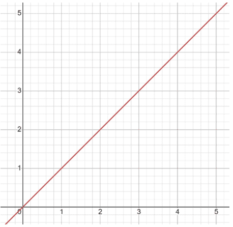
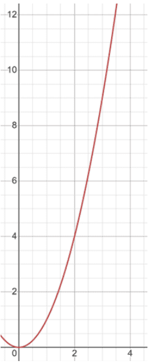
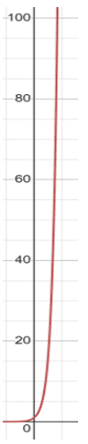
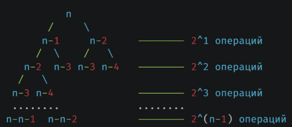
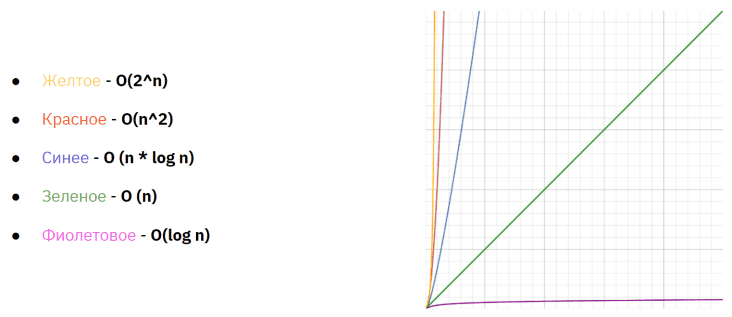

## Урок 1. Вводная лекция. Алгоритмы. Сложность алгоритмов
План урока:
- Определение алгоритма, для чего нужен, где используется
- Разбор графического представления алгоритма в виде блок-схемы
- Познакомиться с нотацией O, разобрать особенности использования
- Разобрать примеры линейной сложности алгоритма. Поиск суммы чисел от 0 до N. Поиск допустимых делителей для числа.
- Разобрать примеры квадратичной сложности алгоритма. поиск простых чисел в диапазоне от 1 до N
- Разобрать пример экспоненциальной сложности алгоритма. Вычисление с рекурсией чисел Фибоначчи. Поиск количества комбинаций, удовлетворяющим условиям для игральных кубиков в количестве N с количеством граней K.
- Разобрать пример квадратичной сложности для рекурсивных алгоритмов
- Привести примеры сложения и перемножения сложности, а также правила сокращения множителей

**Алгоритм** — это точно определённая инструкция, последовательно применяя которую к исходным данным, можно получить решение задачи. Часто алгоритм можно представить в виде блок-схемы.

Почему это важно? Когда мы пишем какую-либо инструкцию для человека мы можем пропустить часть информации или оставить нечеткие инструкции, если это не критично. В итоге, человек сможет интерпретировать полученные данные, даже если они оформлены размыто и исполнить инструкцию. Так же человек способен самостоятельно принимать решения по корректировке процесса на основе новых вводных, полученных в процессе исполнения инструкции. Но компьютер не является человеком и не умеет свободно интерпретировать информацию. Для него важно получить полностью исчерпывающий набор шагов, который он сможет исполнять ровно так, как было описано в его инструкции и упадет с ошибкой в случае не предусмотренного поведения. Именно поэтому для любого разработчика критично важно уметь правильно разбивать процесс решения задачи на четко определенные шаги, чтобы компьютер мог их исполнять.

На текущий момент нам уже не требуется визуализировать каждый из наших алгоритмов в виде блок-схемы, но вместо нее выступает языки программирования, которыми можно описать требуемые действия в текстовом виде. А от разработчика требуется умение разбить и записать процесс решения поставленной задачи четкими и понятными для компьютера шагами.

Критерии сложности алгоритма
- Скорость работы
- Объем потребляемой памяти (Оперативной и/или постоянной)

Чаще всего, когда речь идет про оценку сложности алгоритма, имеется ввиду оценка числа операций относительно размера входящих данных. Но это не единственный показатель, по которому можно оценить алгоритм и определить его пригодность для той или иной ситуации. Также не стоит забывать про оценку затрат оперативной памяти.

Несмотря на то, что оценка памяти производится гораздо реже, есть ощутимое количество операций, где она может играть существенное значение. Например, если перед нами стоит задача вычислить кратчайший путь между двумя точками на карте города. Классически такая задача решается через поиск кратчайшего пути в графе, но требует построение и вычисление этого графа для каждого из запросов. Этот подход требует регулярных вычислений, но потребуется небольшое количество памяти при использовании. При этом, если потребность в количестве таких вычислений растет, становится рациональным сохранять результаты вычислений и переиспользовать их по мере необходимости. Если на нашей карте количество точек небольшое, то это так же не займет много памяти, например, при наличии 10 точек, нам потребуется хранить результаты в таблице 10 х 10 (работает по принципу таблицы умножения). А если таких точек несколько миллионов, то и таблица получится очень большой и будет занимать много памяти, но и поиск по таблице будет гораздо быстрее чем вычисление значения заново.

Также в качестве примера алгоритма, зависящего от объема памяти, можно взять работу с большими файлами. Например, когда нам необходимо отсортировать данные, хранящиеся в файле, мы можем воспользоваться следующим алгоритмом: Прочитать файл в память -> отсортировать их -> сохранить данные обратно в файл. Но если наш файл весит, например, несколько десятков гигабайт, то загрузить его в память может быть большой проблемой – как правило размер хранилища у компьютера в разы превышает размер оперативной памяти. В такой ситуации указанный выше алгоритм сортировки не пройдет по оценке потребления памяти, т.к. компьютер просто не сможет его исполнить из-за нехватки ресурсов.

Алгоритм поиска делителей числа:
```java
/**
 * Поиск доступных делителей
 * 
 * @param number - число для которого ищутся делители
 * @return - список делителей
 */
public static List<Integer> availableDivider(int number) {
    List<Integer> result = new ArrayList<>();
    int count = 0;
    for (int i = 1; i <= number; i++, count++) {
        if (number % i == 0) 
            result.add(i);
    }

    System.out.println("Количество операции " + count);
    return result;
}
```
График линейной зависимости

[](./linear.png)

Такая зависимость характеризуется симметричным ростом количества шагов относительно увеличения объема входных данных.  
Алгоритм перебора массива циклом for имеет сложность O(n). С ростом n на x, количество шагов алгоритма тоже вырастает на x.

Поиск простых чисел
```java
/**
 * Алгоритм поиска простых чисел
 * 
 * @param max - максимальное число, до которого ведется поиск
 * @return - список простых чисел
 */
public static List<Integer> findSimpleNumbers(int max) {
    List<Integer> result = new ArrayList<>();
    int count = 0;
    for (int i = 1; i <= max; i++) {
        boolean simple = true;
        for (int j = 2; j < i && simple; j++, count++) {
            if (i % j == 0)
                simple = false;
        }
        if (simple)
            result.add(i);
    }

    System.out.println("Количество операции " + count);
    return result;
}
```

График квадратичной зависимости

[](./quadric.png)

Такая зависимость характеризуется резким ростом сложности относительно роста размера входных данных.  
Использование вложенного цикла for имеет сложность O(n^2), например, при n = 3 цикл сделает 9 итераций, а при n = 4 уже 16 и т.д.

Стоит обратить внимание, что этот алгоритм при подсчете реального количества операций не будет соответствовать функции n^2 – как мы посчитали ранее, для n = 4 количество операций является 10, а не 16, но следует понимать, что нотация O используется не для точного расчета предполагаемых операций, а для анализа поведения нашего алгоритма, при росте значения входящих данных. И для этого алгоритма ближе всего именно график квадратичной функции – парабола. Проще всего это понять из характера самой реализации – у нас используется вложенный цикл, чей размер также зависит от размера входящего значения, как и внешний цикл. Соответственно, при использовании вложенных циклов мы будем получать квадратичный, кубические и т.д. сложности, в зависимости от количества вложенных циклов.

Одной из самых плохих вариантов с точки зрения сложности алгоритма является ситуация, когда размер входящих данных отражает количество вложенных циклов, которые необходимо описать. Например, задача по поиску шанса выпадения числа K на игральных кубиках количеством N с количеством граней M. При решении этой задачи «в лоб», нам необходимо перебрать все возможные комбинации, найти те, которые подходят под условие и посчитать их % относительно общего количества комбинаций. Соответственно, цикл размером M будет вложен друг в друга N раз, что даст количество необходимых вычислений как M^N. Например, для трех шестигранных кубиков сложность равна 6^3 , что даст примерно 216 операций. А для четырех кубиков уже 1296 операций. График такой функции гораздо более крутой, чем рассмотренная нами ранее парабола и такая сложность называется экспоненциальной и записывается, как O(m^n)

Поиск шанса выпадения числа K
```java
/**
 * Алгоритм поиска шанса выпадения числа K на игральных костях
 * Для трех шестигранных кубиков
 * 
 * @param sum - сумма на игральных костях, для которой нужно узнать вероятность выпадения
 * @return - вероятность выпадения заданной суммы
 */
public static double findChance(int sum) {
    int count = 0;
    int successResult = 0;
    for (int i = 1; i <= 6; i++) {
        for (int j = 1; j <= 6; j++) {
            for (int k = 1; k <= 6; k++) {
                if (i + j + k == sum) successResult++;
                count++;
            }
        }
    }

    System.out.println("Количество операции " + count);
    return ((double) successResult) / ((double) count);
}
```

График экспоненциальной зависимости

[](./exp.png)

График такой функции гораздо более крутой, чем рассмотренная нами ранее парабола и такая сложность называется экспоненциальной и записывается, как O(m^n)

Сложность можно определять не только для алгоритмов, использующих циклы. Анализ сложности применим к любым алгоритмам. Давайте попробуем оценить сложность рекурсивного алгоритма вычисления чисел Фибоначчи. Это числа, которые вычисляются путем сложения двух предыдущих чисел последовательности, а первые 2 числа в ней 0 и 1. Алгоритм вычисления проще всего описывается рекурсией:
```java
/**
 * Алгоритм вычисления числа Фибоначчи
 * 
 * @param position - позиция числа Фибоначчи, которую нужно найти
 * @param count - для подсчета сложности алгоритма
 * @return - число Фибоначчи
 */
public static int fib(int position, int[] count) {
    count[0]++;
    if (position == 1 || position == 2) return 1;

    return fib(position - 1, count) + fib(position - 2, count);
}
```
[](./fib.png)

Как мы видим, для вычисления нужного нам значения запускаются две рекурсивные цепочки, каждая из которых будет запускать еще по 2 рекурсивные цепочки на каждом шаге. При этом, количество операций на 1 уровне равно 2. На втором уровне 4, на третьем уровне 8 и т.д. пока не дойдем до вычисления первого члена последовательности.

Это приводит нас к сложности, примерно равно 2^n-1 , что является примером экспоненциальной сложности O(2^n). Стоит обратить внимание, что при оценке сложности этого алгоритма в O нотации мы упростили значение степени n-1 до n. Это яркий пример того, что при описании сложности алгоритма следует помнить, что это отражение графика изменения сложности, а не явный расчет количества требуемых шагов.

При оценке сложности всегда сокращаются константные множители и слагаемые, остаются только значимые с точки зрения оценки значения. Так сложность O(2 + n) = O(n), т.к. слагаемое n не несет в себе никакой практической пользы при оценке. Например, при n равной 1000000 дополнительные 2 шага не имеют реальной силы. Так же и O(2n) = O(n), т.к. константный множитель 2 не внесет практической пользы для оценки.

А вот перемножение различных сложностей, например, при использовании одного алгоритма в другом, ведут себя немного иначе. В задаче поиска простых чисел мы использовали алгоритм перебора значений O(n) и алгоритм поиска делителей O(n). Суммарно получили сложность O(n * n), что дает O(n^2). Так вложенные алгоритмы O(n) и O(log n) превратятся в O (n * log n).

При этом, если алгоритмы не вкладываются друг в друга, а используются по очереди, например, сначала алгоритм со сложность O(n), а затем O(n^2), то O(n + n^2) = O(n^2), т.к. при сложении алгоритмов применяется только наибольший из модификаторов.

Чаще всего в работе с алгоритмами можно встретить следующие варианты
сложности:
- O(1) – константная сложность. Не зависимо от размера входных данных, количество шагов не изменяется. Например, поиск по хэш-таблице, или обращение к элементу массива: 
    ```js
    val nums = intArrayOf(1, 2, 3, 4, 5)
    val firstNumber = nums[0]
    ```
- O(log n) – логарифмическая сложность. Рост размера входных данных почти не оказывает влияния на рост сложности. Для увеличения сложности на 1, размер входящих данных должен вырасти вдвое. Например, бинарный поиск.
- O(n) – линейная сложность. Рост сложности линеен по отношению к росту размера входных данных. Например, поиск допустимого делителя, поиск по неотсортированному массиву.
- O(n * log n) – рост сложности выше, чем у линейной, но ниже, чем у квадратичной сложности алгоритма. Например, алгоритм быстрой сортировки, сортировки пирамидой.
- O(n^2) – квадратичная сложность. Значительный рост сложности от размера входящих данных. Например сортировка пузырьком
- O(m^n) – экспоненциальная сложность. При увеличении входящих данных на единицу, сложность растет в m раз.

Таким образом, оценить сложность алгоритмов непросто, поскольку:
1. не всегда очевидно, сколько именно итераций будет выполнятся для функции;
2. алгоритм может включать вложенные функции, чью сложность также необходимо учитывать;
3. константные значения могут вводить в заблуждение;
4. подсчет количества итераций может отличаться не только от размера входящих данных, но и от состояния.

График сравнения роста сложности алгоритма

[](./diffs.png)

В заключение приведем таблицу, которая показывает, как долго компьютер, осуществляющий миллион операций в секунду, будет выполнять некоторые медленные алгоритмы.
|       | N=10     | N=20    | N=30     | N=40     | N=50     |
|-------|----------|---------|----------|----------|----------|
| N^2   | 0,0001 c | 0,0004 c| 0,0009 c | 0,0016 c | 0,0025 c |
| N^3   | 0,001 c  | 0,008 c | 0,027 с  | 0,064 c  | 0,125 с  |
| 2^N   | 0,001 c  | 1,05 c  | 17,9 мин | 12,7 дней| 35,7 лет |
| 3^N   | 0,05 c   | 58,1 мин| 6,5 лет  | 3,8 * 10^5 лет| 2,27 * 10^10 лет |

Подведем итоги:
Умение оценивать сложность выбранного решения крайне важно для разработчика. Использование неоптимального, с точки зрения сложность, решения способно привести к огромной просадке производительности. При этом следует помнить, что показатель сложности это всего лишь зависимость роста количества операций от размера входящих данных, а не явный расчет требуемого количества шагов. Благодаря тому, что мы оперируем абстрактными данными, мы можем оценивать алгоритмы по их структуре, не вдаваясь в подробности реализации или особенностей входящих данных.

Дополнительные материалы:
- https://habr.com/ru/articles/104219/
- https://tproger.ru/articles/computational-complexity-explained
- https://bimlibik.github.io/posts/complexity-of-algorithms/