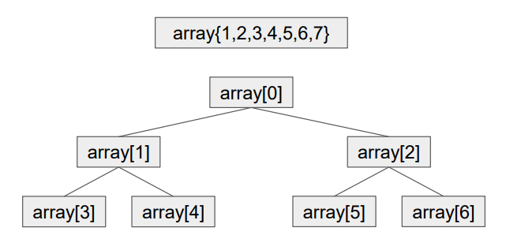

## Урок 2. Структуры данных. Массивы. Алгоритмы массивов

### Структуры данных
**Структурами данных** называют некоторый контейнер с данными, обладающий специфическим внутренним устройством (макетом) и логикой хранения. Различные макеты могут быть эффективны для некоторых операций и неэффективны для других.

Все современные языки программирования имеют из коробки работать с различными типами данных, которые можно применять по мере необходимости. При этом нельзя сказать, что без них совсем нельзя обойтись – под всеми этими структурами всегда лежат самые обычные числа и строки – но вот написание кода без их использования для сколько-нибудь сложного проекта становится непосильной задачей. Всегда стоит помнить, что для каждой задачи существуют свои наиболее подходящие инструменты для решения. Базово, вы можете написать систему любой сложности на C или Assembler, но затраченные ресурсы на создание и поддержку такой системы будут просто огромными в сравнении с системами, написанными на современных языках программирования и манипулирующими различными сложными структурами данных. Для разработчика очень важно понимать внутреннюю структуру различных структур данных для эффективного применения их в процессе решения поставленных задач. У всех структур данных есть как сильные, так и слабые стороны и это обязательно нужно учитывать, когда речь идет про выбор подходящего пути решения.

### Массив
**Массив** - это контейнер, хранящий данные идентифицируемые по индексу. К любому элементу массива всегда можно обратиться по его индексу и достать или заменить его.

Особенностью массива является то, что доступ к элементам по индексу осуществляется за константное время, т.е. имеет сложность O(1).

Сортировка пузырьком
```java
public class BubbleSort{
    public static void main(String[] args) {
        int[] array = {9, 5, 4, 8, 7, 3, 1, 2, 0, 6};
        int[] counter = {0};
        bubbleSort(array, counter);
        System.out.println(Arrays.toString(array));
        System.out.println("Количество итерации: " + counter[0]);
    }

    public static void bubbleSort(int[] array, int[] counter) {
        boolean finish = true;
        do {
            finish = true;
            System.out.println(Arrays.toString(array));
            for (int i = 0; i < array.length - 1; i++, counter[0]++) {
                if (array[i] > array[i + 1]) {
                    int tmp = array[i];
                    array[i] = array[i + 1];
                    array[i + 1] = tmp;
                    finish = false;
                }
            }
        } while (!finish);
    }
}
```
**Максимальная сложность** – количество шагов для обработки наиболее неблагоприятного состояния входных данных.

**Ожидаемая сложность** – это вариант, который будет релевантен для большей части возможных кейсов.

Для некоторых алгоритмов ожидаемая сложность будет совпадать с максимальной, в каких-то – нет. В приведенном выше алгоритме пузырьковой сортировки максимальной сложностью вычисления будет O(n2) и эта же сложность является ожидаемой для этого алгоритма – для данного алгоритма очень небольшое количество кейсов дает сложность ниже указанной, а значит в большинстве случаев она будет стремиться именно к максимальной.

Сортировка выбором
```java
public class ChangeSort {
    public static void main(String[] args) {
        int[] array = {9, 5, 4, 8, 7, 3, 1, 2, 0, 6};
        int[] counter = {0};
        changeSort(array, counter);
        System.out.println(Arrays.toString(array));
        System.out.println("Количество итерации: " + counter[0]);
    }

    public static void changeSort(int[] array, int[] counter) {
        for (int i = 0; i < array.length - 1; i++) {
            int minPosition = i;
            for (int j = i + 1; j < array.length; j++, counter[0]++) {
                if (array[j] < array[minPosition]) {
                    minPosition = j;
                }
            }
            if (i != minPosition) {
                int tmp = array[i];
                array[i] = array[minPosition];
                array[minPosition] = tmp;
            }
        }
    }
}
```

Сортировка вставками
```java
public class InsertSort {
    public static void main(String[] args) {
        int[] array = {9, 5, 4, 8, 7, 3, 1, 2, 0, 6};
        int[] counter = {0};
        insertSort(array, counter);
        System.out.println(Arrays.toString(array));
        System.out.println("Количество итерации: " + counter[0]);
    }

    public static void insertSort(int[] array, int[] counter) {
        for (int i = 0; i < array.length - 1; i++) {
            for (int j = i + 1; j < array.length; j++, counter[0]++) {
                if (array[i] > array[j]) {
                    int tmp = array[i];
                    array[i] = array[j];
                    array[j] = tmp;
                }
            }
        }
    }
}
```

Алгоритм простого поиска O(n)
```java
public class SimpleSearch {
    public static void main(String[] args) {
        int[] array = {9, 5, 4, 8, 7, 3, 1, 2, 0, 6};
        int[] counter = {0};
        System.out.println("Позиция в массиве: " + simpleSearch(array, 2, counter));
        System.out.println("Количество итерации: " + counter[0]);
    }

    public static int simpleSearch(int[] array, int value, int[] counter) {
        for (int i = 0; i < array.length; i++, counter[0]++) {
           if (array[i] == value) return i;
        }
        return -1;
    }
}
```
Как несложно понять, благодаря использованию цикла for, мы получаем классическую сложность обхода массива - O(n). Это неплохая сложность, но при работе с большими массивами и при регулярном поиске может стать проблемой.

**Бинарный поиск** - тип поискового алгоритма, который последовательно делит пополам заранее отсортированный массив данных, чтобы обнаружить нужный элемент. Другие его названия — двоичный поиск, метод половинного деления, дихотомия. Принцип работы алгоритма бинарного поиска. Основная последовательность действий алгоритма выглядит так: Сортируем массив данных. Делим его пополам и находим середину.

Алгоритм бинарного поиска O(log n)
```java
public class BinarySearch {
    public static void main(String[] args) {
        int[] array = {0, 1, 2, 3, 4, 5, 6, 7, 8, 9};
        int[] counter = {0};
        System.out.println("Позиция в массиве: " + binarySearch(array, 9, counter));
        System.out.println("Количество итерации: " + counter[0]);
    }

    public static int binarySearch(int[] array, int value, int[] counter) {
        return binarySearch(array, value, 0, array.length - 1, counter);
    }

    public static int binarySearch(int[] array, int value, int min, int max, int[] counter) {
        int midPoint;
        counter[0]++;
        if (max < min) return -1;
        else midPoint = (max - min) / 2 + min;
        if (array[midPoint] < value)
            return binarySearch(array, value, midPoint + 1, max, counter);
        else if (array[midPoint] > value)
            return binarySearch(array, value, min, midPoint - 1, counter);
        else return midPoint;
    }
}
```
Как мы видим, функция принимает в себя границы массива, в пределах которого необходимо осуществлять поиск. Таким образом, каждый рекурсивный шаг уменьшает диапазон, в котором необходимо произвести поиск. При этом сам алгоритм не меняется.

Это яркий пример логарифмической сложности алгоритма O(log n). Таким образом, один раз потратив время на сортировку данных мы можем во много раз сократить временные затраты на многократный поиск в дальнейшем.


### Быстрая сортировка
Разделяй и властвуй (от анг. divide and conquer) — парадигма разработки алгоритмов, заключающаяся в рекурсивном разбиении решаемой задачи на две или более подзадачи того же типа, но меньшего размера, и комбинировании их решений для получения ответа к исходной задаче; разбиения выполняются до тех пор, пока все подзадачи не окажутся элементарными.

**Пивот** (от анг. pivot - поворот) - Элемент, служащий точкой сравнения элементов и их “поворота”, в случае необходимости.

```java
public class FastSort {
    public static void main(String[] args) {
        int[] array = {9, 5, 4, 8, 7, 3, 1, 2, 0, 6};
        int[] counter = {0};
        fastSort(array, counter);
        System.out.println(Arrays.toString(array));
        System.out.println("Количество итерации: " + counter[0]);
    }

    public static void fastSort(int[] array, int[] counter) {
        fastSort(array, counter, 0, array.length - 1);
    }

    public static void fastSort(int[] array, int[] counter, int startPosition, int endPosition) {
        int leftPosition = startPosition;
        int rightPosition = endPosition;
        int pivot = array[(startPosition + endPosition) / 2];
        do {
            counter[0]++;
            while (array[leftPosition] < pivot) {
                leftPosition++;
            }
            while (array[rightPosition] > pivot) {
                rightPosition--;
            }
            if (leftPosition <= rightPosition) {
                if (leftPosition < rightPosition) {
                    int tmp = array[leftPosition];
                    array[leftPosition] = array[rightPosition];
                    array[rightPosition] = tmp;
                }
                leftPosition++;
                rightPosition--;
            }
        } while (leftPosition <= rightPosition);

        if (startPosition < rightPosition) {
            fastSort(array, counter, startPosition, rightPosition);
        }
        if (leftPosition < endPosition) {
            fastSort(array, counter, leftPosition, endPosition);
        }
    }
}
```
Если сравнивать данный алгоритм с теми, что были рассмотрены ранее, можно увидеть, что количество сравнений элементов друг с другом существенно снижено. Мы так же имеет два вложенных алгоритма. В лучшем из вариантов мы каждый раз будет делить массив ровно пополам (плюс-минус 1 элемент), что дает максимальную глубину рекурсии log n. И проводить сравнение элементов друг с другом в пределах получившихся массивов (O(n)), тем самым получим сложность O(n log n). В худшем – пивот всегда будет оказываться крайним элементом при разбиении коллекции (пивот является максимальным или минимальным значением рассматриваемого массива), а значит максимальная глубина рекурсии будет равна n-1, что даст сложность O(n2 ). При этом, эффективной сложностью данной сортировки принято считать именно O(n log n), т.к. шанс попадания пивота крайним элементом, особенно на большом объеме данных, очень невелик. Это легко проверить, запустив сортировку того же массива в 1 000 000 элементов, на котором экспериментировали с пузырьковой сортировкой. Процесс займет не больше нескольких секунд.

### Пирамидальная сортировка
Особенность данной сортировки в использовании дополнительной структуры данных называемой бинарной кучей (пирамидой). Бинарная куча представляет из себя древовидную структуру, когда у каждого объекта может быть до 2 детей. При этом строится из массива она предельно просто – первый элемент массива является корнем, 2 и 3 его детьми, 4 и 5 детьми элемента 2 и т.д. пока в массиве остаются элементы.

Благодаря такому подходу к составлению бинарной кучи она получает следующее свойство: если принять элемент с индексом i за родителя, то индексы его дочерних элементов будут 2 * i + 1 и 2 * i + 2.

Таким образом, несмотря на то, что сортировка использует для своего алгоритма бинарную кучу, в реальности строить никакую отдельную структуру данных не нужно, т.к. мы в любой момент можем определить детей для каждого из элементов и проводить их сравнение или обмен.

Общая идея сортировки пирамидой заключается в том, что сравнение элементов происходит не между всеми элементами массива, а только в пределах построенной пирамидальной структуры, т.е. родителя и его детей. Такая операция называется «просеиванием», когда интересующий нас узел кучи сравнивается со своими двумя детьми и меняется местами с тем, что больше родителя. Если оба ребенка больше родителя – обмен происходит с наибольшим из детей.

Дальше необходимо определить алгоритм, в каком порядке необходимо проводить операции просеивания. Для этого весь процесс пирамидальной сортировки делится на 2 этапа.

**Первый этап** – это подготовка кучи. Определяем правую часть кучи по формуле n/2-1, где n – длина массива. Начиная с указанного индекса, мы начинаем операции просеивания в цикле до тех пор, пока не придем к началу массива. В результате этой операции самый большой элемент нашего массива окажется в индексе 0, что является вершиной пирамиды.

**Второй этап** – начинается с того, что первый и последний элемент массива меняется местами, тем самым наибольший элемент оказывается в конце массива, а текущая вершина (индекс 0) начинает операцию просеивания по пирамиде с размером n-1, в результате чего снова наибольший элемент займет 0 индекс нашего массива. Меняем его местами с предпоследним элементом массива (последний мы уже определи) и повторяем операцию. Это происходит до тех пор, пока все элементы массива не займут свое место, а размер пирамиды для просеивания не уменьшится до 0.

[](./piramid.png)

```java
public class PyramidSort {
    public static void main(String[] args) {
        int[] array = {9, 5, 4, 8, 7, 3, 1, 2, 0, 6};
        int[] counter = {0};
        pyramidSort(array, counter);
        System.out.println(Arrays.toString(array));
        System.out.println("Количество итерации: " + counter[0]);
    }

    public static void pyramidSort(int[] array, int[] counter) {
        // построение кучи (перегруппируем массив)
        for (int i = array.length / 2 - 1; i >= 0; i--)
            pyramidSort(array, counter, array.length, i);
        // Один за другим извлекаем элементы из кучи
        for (int i = array.length - 1; i >= 0; i--) {
            // Перемещаем текущий корень в конец
            int temp = array[0];
            array[0] = array[i];
            array[i] = temp;
            counter[0]++;
            // Вызываем процедуру на уменьшенной куче
            pyramidSort(array, counter, i, 0);
        }
    }

    public static void pyramidSort(int[] array, int[] counter, int heapSize, int rootIndex) {
        counter[0]++;
        int largest = rootIndex; // Инициализируем набиольший элемент как корень
        int leftChild = 2 * rootIndex + 1; // левый = 2*rootIndex + 1
        int rightChild = 2 * rootIndex + 2; // правый = 2*rootIndex + 2

        // Если левый дочерний элемент больше корня
        if (leftChild < heapSize && array[leftChild] > array[largest])
            largest = leftChild;

        // Если правый дочерний элемент больше, чем самый большой элемент на данный момент
        if (rightChild < heapSize && array[rightChild] > array[largest])
            largest = rightChild;
        // Если самый большой элемент не корень
        if (largest!= rootIndex) {
            int tmp = array[rootIndex];
            array[rootIndex] = array[largest];
            array[largest] = tmp;

            // Рекурсивно преобразуем в двоичную кучу затронутое поддерево
            pyramidSort(array, counter, heapSize, largest);
        }
    }
}
```
В данном случае мы имеем обратную, в отличии от быстрой сортировки, зависимость на сложность алгоритма – внешний цикл содержит O(n) шагов, а вложенный работает по уже знакомому нам принципу O(log n), т.к. количество операций соответствует обходу вложенных элементов, что суммарно дает нам сложность O(n log n), как и у быстрой сортировки.

### Дополнительные материалы
- https://prog-cpp.ru/sort-pyramid/
- https://habr.com/ru/companies/otus/articles/460087/
- https://habr.com/ru/articles/415935/