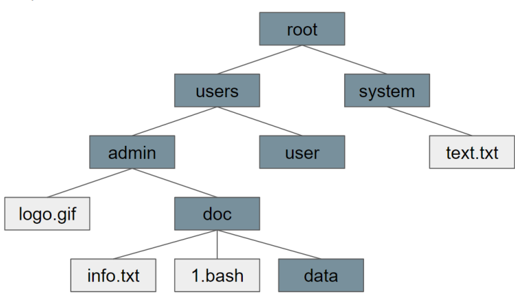
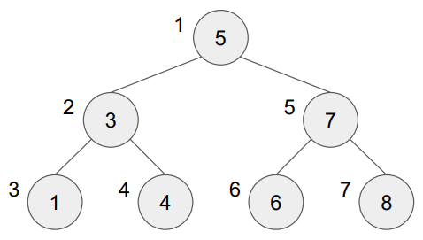
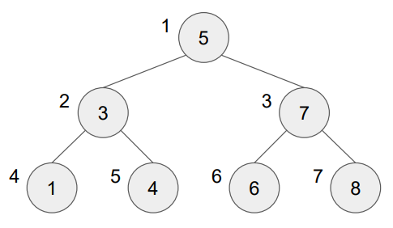

## Урок 4. Структуры данных дерево и хэш-таблица
План лекции:
- Дерево, внутреннее устройство.
- Алгоритмы обхода дерева.
- Бинарное дерево, сбалансированное дерево.
- хеш-таблица, внутреннее устройство.

### Дерево, внутреннее устройство
Дерево – это структура данных, эмулирующая древовидную структуру в виде набора связанных узлов. Дерево является частным случае графа, в котором отсутствуют циклические связи. Дерево состоит из узлов, связанных между собой ребрами по принципу родитель-ребенок.  
Один узел может содержать в себе любое количество детей, но у любого ребенка может быть только один родитель. Самый верхний узел, не имеющий родителя, называется корнем дерева, а узлы, не имеющие детей – листьями. С точки зрения реализации в языках программирования, дерево очень похоже на реализацию связного списка, за тем исключением, что каждый из узлов может ссылаться не на один, а на любое количество дочерних элементов.  
Использование древовидной структуры позволяет обрабатывать данные, требующие иерархического отношения друг к другу. Простой пример – дерево файлов в компьютере, где каждый узел с детьми – это папка, а каждый лист – файл или пустая папка.
```java
public class Tree {
    Node root;

    public boolean exist(int value) {
        if (root != null) {
            Node node = find(value);
            if (node != null) {
                return true;
            }
        }
        return false;
    }

    // обход в ширину
    public Node find(int value) {
        List<Node> line = new ArrayList<>();
        line.add(root);
        while (line.size() > 0) {
            List<Node> nextLine = new ArrayList<>();
            for (Node node : line) {
                if (node.value == value) {
                    return node;
                }
                nextLine.addAll(node.children);
            }
            line = nextLine;
        }
        return null;
    }

    public class Node {
        int value;
        List<Node> children;
    }
}
```
[](./dir_tree.png)

### Алгоритмы обхода дерева
В отличии от классических массивов и списков, обход дерева можно совершать различными способами, каждый из которых будет иметь свои особенности.

Обход в глубину

Самым простым с точки зрения обхода, является обход в глубину. Это рекурсивный подход к перебору всех значений в дереве, построенный на вызове всех доступных детей для каждого узла. Таким образом максимальная глубина рекурсии будет равна максимальной глубине дерева, а порядок будет идти сверху-вниз и слева-направо.
```java
// обход в глубину
public Node find(Node node, int value) {
    if (node.value == value) {
        return node;
    } else {
        for (Node child : node.children) {
            Node result = find(child, value);
            if (result != null) {
                return result;
            }
        }
    }
    return null;
}
```
[](./tree_deep.png)

Чаще всего используется именно обход в глубину, т.к. он прост в реализации и не требует слишком большого количества ресурсов на исполнение.

Обход в ширину

Обход в ширину предполагает, что мы не обрабатываем детей до тех пор, пока все родителя одного уровня не были обработаны. Давайте рассмотрим пример, при котором мы хотим получить все элементы дерева в виде списка.
```java
// обход в ширину
public Node find(int value) {
    List<Node> line = new ArrayList<>();
    line.add(root);
    while (line.size() > 0) {
        List<Node> nextLine = new ArrayList<>();
        for (Node node : line) {
            if (node.value == value) {
                return node;
            }
            nextLine.addAll(node.children);
        }
        line = nextLine;
    }
    return null;
}
```
[](./tree_width.png)

### Бинарное дерево

Бинарным деревом называют частный случай дерева, где все элементы обязательно строго уникальны, каждый родитель имеет не более 2 детей, при этом левый ребенок всегда меньше родителя, а правый – больше.  
Благодаря своим свойствам, бинарные деревья позволяют эффективно выстраивать поисковые алгоритмы. Находясь на любом из узлов мы всегда точно знаем куда именно нам нужно пойти – налево или направо – чтобы найти искомый элемент. Алгоритм обхода бинарного дерева происходит в глубину и очень напоминает алгоритм бинарного поиска.
```java
public class BinaryTree {
    private Node root;

    public boolean contains(int value) {
        final Node node = findNode(root, value);
        return node != null;
    }

    private Node findNode(Node node, int value) {
        if (node.value == value) {
            return node;
        } else {
            if (node.value > value) {
                if (node.leftChild != null) {
                    return findNode(node.leftChild, value);
                } else {
                    return null;
                }
            } else {
                if (node.rightChild != null) {
                    return findNode(node.rightChild, value);
                } else {
                    return null;
                }
            }
        }
    }

    private class Node {
        private int value;
        private Node leftChild;
        private Node rightChild;
    }
}
```

### Сбалансированное дерево
Сбалансированным деревом называют частный случай бинарного дерева, у которого выполняется следующее требование: для любого узла дерева высота его правого поддерева отличается от высоты левого поддерева не более чем на единицу.  
Таким образом, сбалансированное дерево дает нам идеальную структуру для бинарного поиска – корень такого дерева — это его центральный элемент – количество элементов справа и слева от него различается не более чем на единицу, что характерно для выбора стартовой позиции в бинарном поиске. Таким образом, сложность поиска по сбалансированному дереву составляет O(log n), чтодает очень высокую производительность.  
Для поддержания свойства сбалансированности в процессе операций добавления или удаления элементов такие деревья должны проводить операции балансировки, чтобы не допустить разбалансированности и ухудшения сложности поиска.  
Существуют различные типы сбалансированных деревьев – АВЛ-дерево, красно-черное дерево, 2-3 дерево и т.д. Каждое из которых имеет собственные алгоритмы балансировки. Так, например, для балансировки АВЛ-дерева каждая нода помимо информации о значении и детях, так же хранит показатель глубины, на основе которого проводится балансировка по специальному алгоритму. А у красно-черного дерева вместо показателя глубины используется показатель цвета – ноды могут быть либо черными, либо красными.  
Использование сбалансированных деревьев позволяет создать динамическую самоддерживаемую структуру, имеющую очень высокую скорость поиска элементов.

### Хеш-таблица
Хеш-таблицей называется структура данных, представляющая собой ассоциативный массив использующий хеш-функцию для выполнения операций добавления, удаления и поиска элементов. В свою очередь ассоциативным массивом называют структуру данных, которая хранит пары ключ – значение, где ключ каждой пары является уникальным в пределах всего массива данных.  
Важной особенностью хеш-таблиц является, при некотором разумном допущении, получить сложность каждой из перечисленных операций равной O(1). Благодаря этому свойству использование хеш-таблиц позволяет очень быстро и эффективно работать с большими массивами данных и не терять скорости доступа к ним по мере роста объема.  
Давайте разберем, каким образом достигается данное свойство. Начнем с простого примера ассоциативного массива. Возьмем обычный массив и будем складывать в него объекты, имеющие 2 поля – ключ и значение.  
`a:test; b:test; c:data; d:info`  
При этом мы помним основное требование ассоциативного массива – ключи всегда уникальны. Это значит, что, если мы захотим добавить еще какой-то элемент в наш массив, сначала стоит убедится, что объекта с таким ключом еще не существует, иначе объект добавлять будет нельзя. Для реализации подобной логики нам придется сделать обход всего массива, чтобы убедится, что ключ отсутствует. Подобный перебор дает сложность O(n), как мы разбирали на предыдущих лекциях.
```java
public static int findIndex(int value, int[] array) {
    for (int i = 0; i < array.length; i++) {
        if (array[i] == value) {
            return i;
        }
    }
    return -1;
}
```
Но сложность можно понизить до O(log n), если ключи в массиве будут упорядочены, тогда можно использовать бинарный поиск. Но это все равно не дает доступа O(1), как было озвучено ранее.  
Чтобы обращаться к ключу за O(1) нужно преобразовать ключ так, чтобы он всегда представлял из себя числовое значение. Тут как раз и пригодится хэш-функция.

хеш-функцией называется специальный алгоритм, позволяющий преобразовать входные данные произвольного размера и состава в битовую строку фиксированной длины.

Данный алгоритм является односторонним, что значит, что получить из результата функции изначальный вариант сообщения невозможно, но в тоже время один и тот же входящий набор данных всегда даст один и тот же результат вычисления. Из этого же следует, что один и тот же результат хеш-функции может быть получен при различных входных данных. Такая ситуация называется коллизией, и хорошая хеш-функция должна гарантировать минимальное количество коллизий в ходе использования.  
Так же хорошая хеш-функция должна давать равномерное распределение результатов, это значит, что при изменении 1 бита во входящем сообщении – результат должен отличаться для не менее 50% байт результирующего массива. Для использования в хеш-таблице мы можем подобрать функцию, которая будет преобразовывать наши ключи в массивы байт размером 8, тем самым легко превратим их в целочисленные типы данных, например, Integer. Таким образом, мы сможем преобразовать все наши ключи в числа, которые могут использоваться для адресации в массиве. Например, ключ a будет преобразовываться в число 1, а значит мы сможем найти элемент с таким ключом по индексу 1 в массиве.

Какие проблемы при этом будут получены?
- Адресное пространство в 8 байт — это не только положительные значения – Integer включает в себя значения от −2 147 483 648 до 2 147 483 647, а обратиться к индексу с отрицательным номером невозможно.
- Каждый раз выделять в адресном пространстве место под массив размером 2 147 483 647 очень расточительно с точки зрения эксплуатации. Скорее всего у вас не будет элементов хотя бы на одну сотую часть этой размерности, а значит адреса в памяти будут заняты впустую.
- Наличие коллизий не позволит однозначно занять 1 ячейку массива строго одним элементом. На один и тот же индекс может претендовать несколько элементов, чей хеш-код даст одно и тоже значение.

Все эти проблемы ставят крест на чистом использовании хеш-функции для прямой адресации в пределах массива, но сама идея верная, давайте немного расширим нашу структуру для решения вышеописанных сложностей.
1. Начнем с самой последней, т.к. решить ее важнее всего. Будем не просто хранить в ячейке с нужным индексом нужный элемент, а поместим в каждую ячейку другую структуру данных – односвязный список. Таким образом, даже если 2 ключа нашего массива дадут одинаковый результат хеш-функции мы сможем хранить за указанным индексом несколько элементов и произвести простой перебор значений. Не смотря на то, что перебор значений не имеет сложности O(1), давайте обратим внимание, что хорошо написанная хеш-функция должна иметь минимально возможное количество коллизий, а значит на фоне общего количества доступных индексов в массиве длиной связного списка можно пренебречь, т.к. он будет представлять из себя не более несколько объектов.
2. Теперь обратим внимание на ограничения адресного пространства и резервирование массивов излишней длины. Как только мы решили проблему с хранением нескольких элементов за одним индексом, мы можем попытаться сократить количество ячеек, увеличив таким образом количество элементов за одной из ячеек. Сделать это можно благодаря простейшей математической операции – вычислив остаток от деления на доступное адресное пространство. Например, мы хотим, чтобы наш массив состоял только из 8 ячеек, а результат хеш-функции будет равен 19. При делении 19 на 8 мы получим остаток 3, что полностью укладывается в размерность нашего массива, а значит мы можем положить объект в связный список в ячейке с индексом 3. Таким образом, если мы понимаем, что планируем оперировать несколькими сотнями объектов мы можем ограничиться массивом с размерностью 100 или даже меньше, т.к. хорошая хеш-функция гарантирует равномерное распределение результатов, а значит и за каждым из индексов будет лежать не более нескольких элементов.
3. И наконец проблема отрицательных значений легко решается, если использовать
значение по модулю, либо для числителя, либо для остатка от деления. 

Благодаря этим шагам мы получим алгоритм, который за гарантированное количество шагов определяет, в каком именно индексе массива следует искать элемент, независимо от размерности самого массива и объема данных который он хранит.
```java
public class HashTable<T, K> {
    private List<T, K>[] baskets = new List<>[8];

    public K get(T key) {
        int hashCode = key.hashCode();
        int basketIndex = Math.abs(hashCode) % baskets.length;
        return baskets[basketIndex].find(key);
    }

    private class List<T, K> {
        Node head;

        public K find(T key) {
            Node node = head;
            while (node != null) {
                if (node.entity.key.equals(key)) {
                    return node.entity.value;
                } else {
                    node = node.next;
                }
            }
            return null;
        }

        private class Node {
            Node next;
            Entity<T, K> entity;
        }
    }

    private class Entity<T, K> {
        T key;
        K value;
    }
}
```
Именно так и организуется классическая хеш–таблица. Элементы массива, которые хранят списки с парами ключ-значение называются basket – корзина. Если в нашей хеш-таблице массив длинной в 10 – наша хеш-таблица имеет 10 бакетов. Благодаря использованию хеш-функции мы всегда однозначно можем определить в каком из бакетов хранится искомая пара. Как было сказано ранее, хеш-таблица будет иметь сложность поиска, добавления, удаления объектов из структуры за O(1) при некотором разумном допущении. В данном случае это использование связного списка, где поиск будет иметь неконстантное значение O(n), но при достаточном количестве бакетов и хорошей хеш-функции размер данного списка будет очень небольшим, так что сложностью его перебора можно пренебречь. Также можно заменить связный список на сбалансированное дерево, где сложность поиска составляет O(log n), что позволит хранить большее количество элементов в одном бакете без потери производительности.

Так как мы редко заранее знаем объемы данных, для которых нам необходимо построить хеш-таблицу, для современных реализаций используется так же функция ребалансировки. Данная функция призвана уменьшить количество элементов в каждом из бакетов. Она увеличивает количество бакетов, а все значения перераспределяет согласно новому остатку от деления.

Таким образом, происходит равномерное распределение уже добавленных значений между новыми и старыми бакетами и уменьшение размера дерева или списка для обхода значений. Обычно функция ребалансировки включается автоматически при достижении определенных показателей, например, когда количество элементов является в N раз больше количества бакетов, что позволяет хранить в среднем N элементов в 1 бакете при полностью равномерном распределении значений. При этом N не обязательно должен быть больше единицы. Для некоторых реализаций он может быть меньше 1, что позволяет держать в том числе пустые бакеты, но избегать большинства коллизий и хранить в бакетах не более 1-2 элементов, что положительно скажется на производительности.

### Дополнительные материалы
https://habr.com/ru/post/555404/ - красно-черные деревья
https://habr.com/ru/post/150732/ - авл деревья
https://habr.com/ru/post/509220/ - хэш таблицы