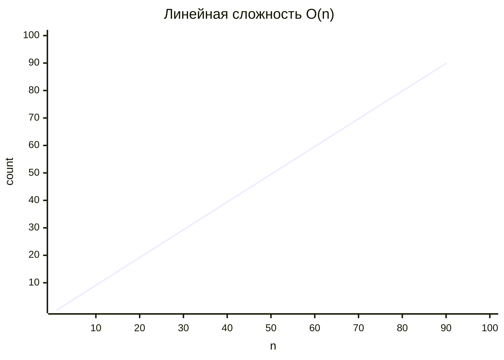
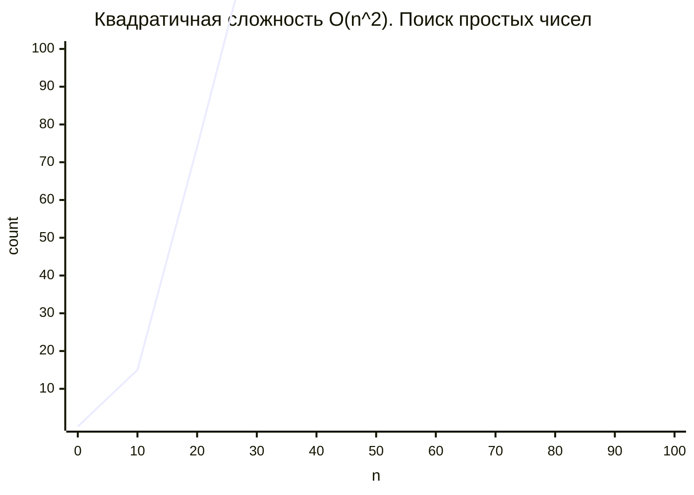
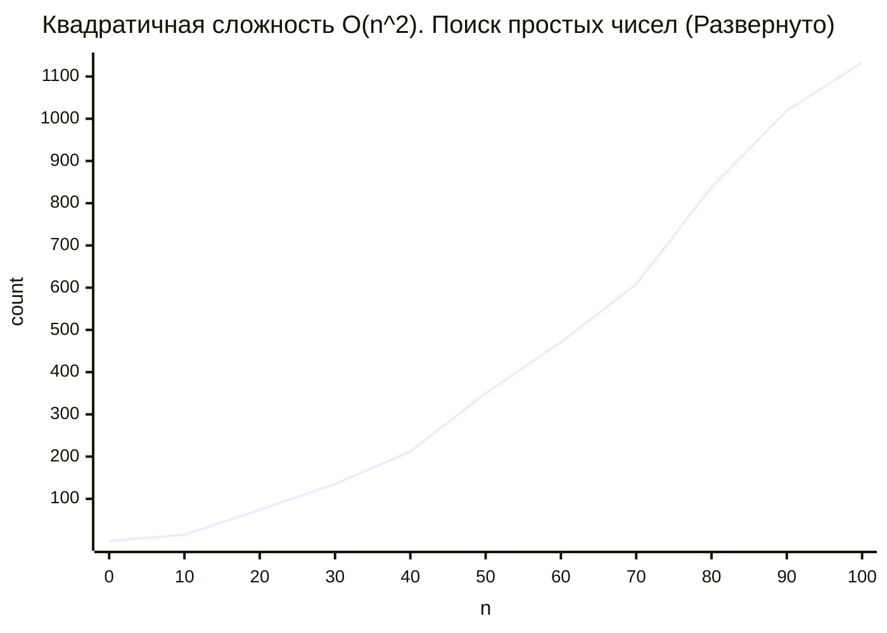
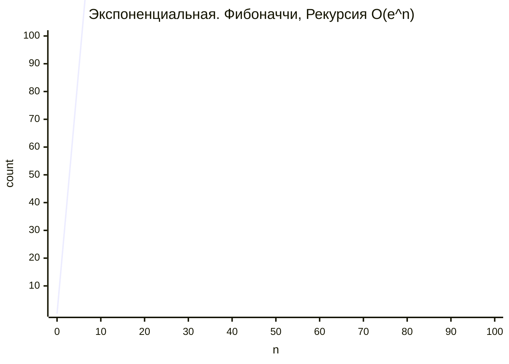
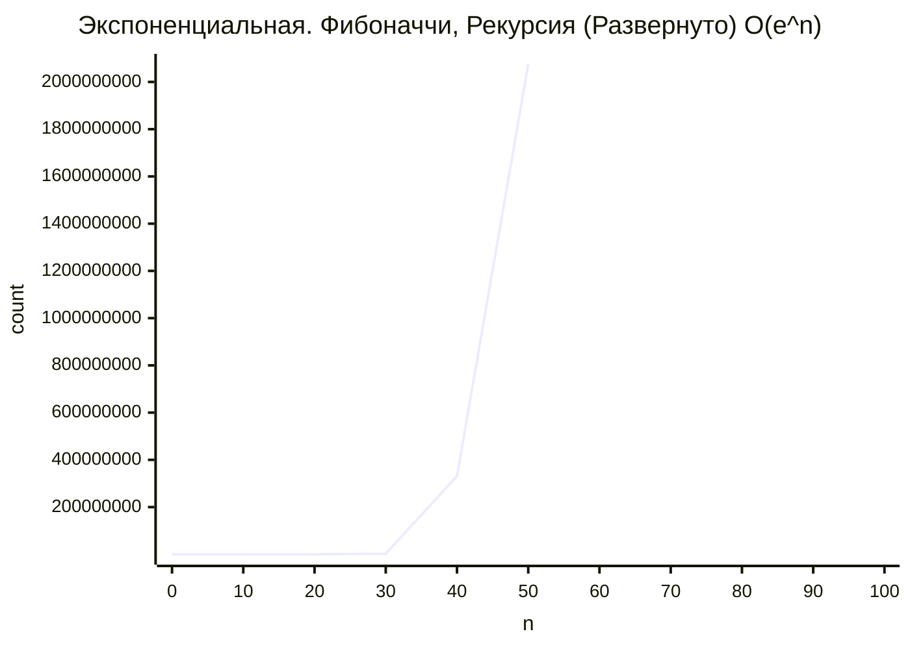
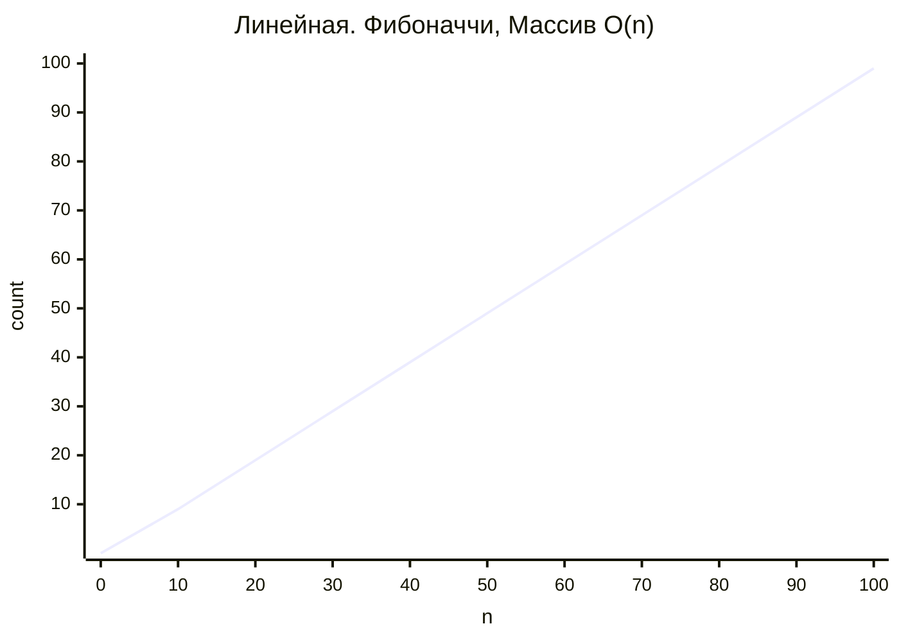
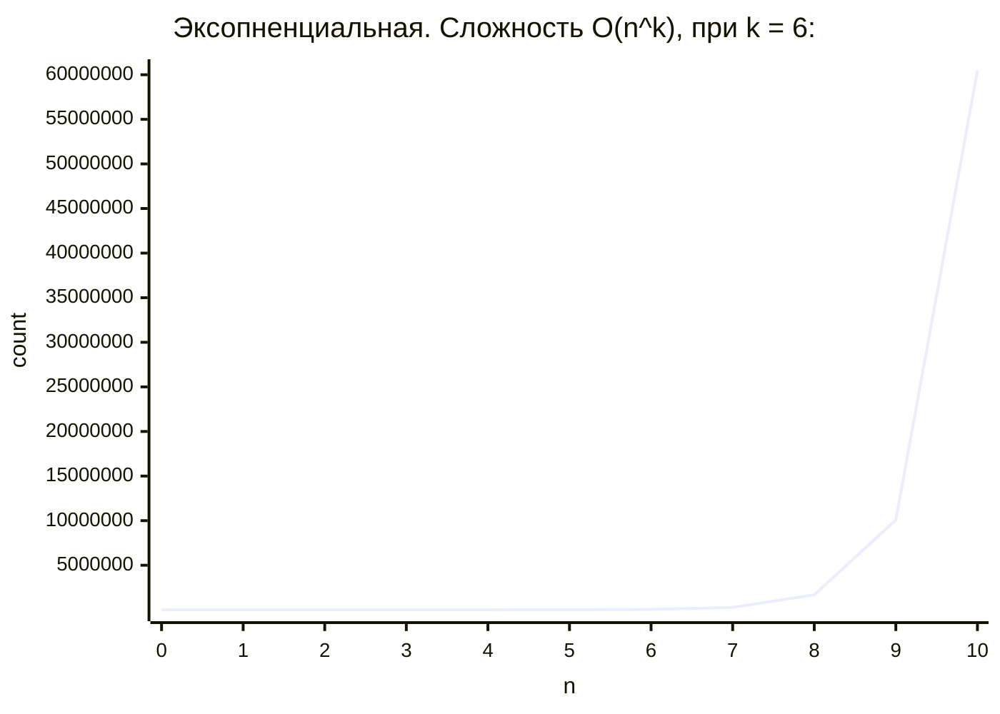

## Урок 1. Вводная лекция. Алгоритмы. Сложность алгоритмов

```mermaid
    xychart-beta
    title "Константная сложность O(1)"
    x-axis "n" [0, 10, 20, 30, 40, 50, 60, 70, 80, 90, 100]
    y-axis "count" 1 --> 100
    line [1, 1, 1, 1, 1, 1, 1, 1, 1, 1, 1]
```






Задание 4 (тайминг 15 минут)
1. Необходимо написать алгоритм поиска всех доступных комбинаций (посчитать количество) для количества кубиков K с количеством граней N.
2. У вас есть 2 варианта на выбор – количество кубиков может быть строго ограничено (4 кубика, например), либо их количество будет динамическим. Выбор за вами.
3. Если вы реализуете простой вариант, обращает внимание, что данное решение имеет сложность O(n4), но если количество кубиков сделать переменной, то она трансформируется в O(nk), что будет представлять собой экспоненциальную сложность. Для второго решения очевидно, что его сложность O(nk) с самого начала.
